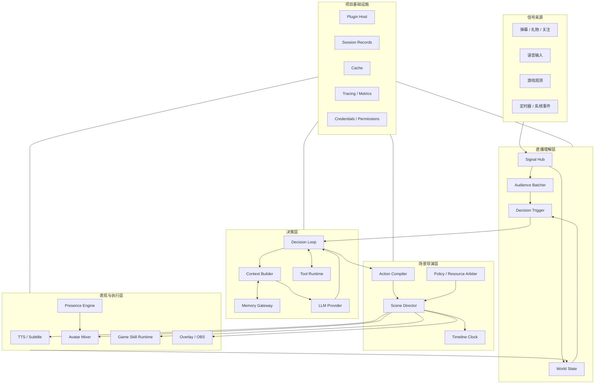
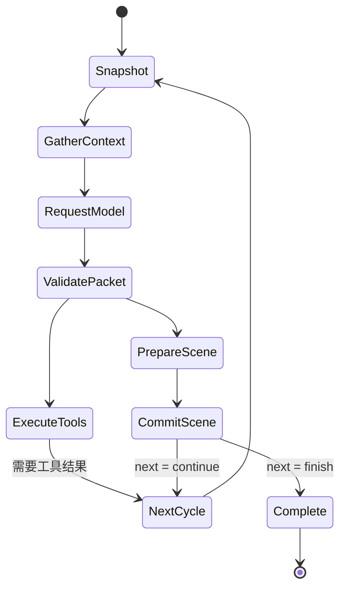

# Bellis Autonomous Live：自主游戏直播系统设计

> 文档状态：独立项目设计基线 v1
>
> 项目属性：从零建设的产品，不以现有代码结构为实现边界
>
> 核心目标：让 AI 主播能够听懂直播间、记住长期关系、自然表达、主动表现并操作游戏，同时在低等待下保持语音、字幕、Live2D 与游戏行为一致。

## 1. 项目定义

Bellis Autonomous Live 是一个完整的自主游戏直播系统。它既不是聊天机器人加一个 Live2D 页面，也不是把若干 AI 接口串起来的工作流，而是同时包含以下能力的实时产品：

- 读取并理解批量弹幕、礼物、关注、语音和平台事件。
- 观察游戏状态，规划游戏目标并通过受控技能操作游戏。
- 通过 LLM 持续决策，按需调用工具，并在工具执行期间自然回应观众。
- 通过 TTS、字幕、表情、动作、口型和直播画面共同完成一次表达。
- 在没有 LLM 指令时仍保持自然的 Live2D 主动行为。
- 连接内置或外部长期记忆，形成跨直播、跨会话的连续关系。
- 允许直播平台、模型、记忆、TTS、Avatar、游戏和 Overlay 以插件形式替换。

项目从直播体验反推技术结构。任何抽象只有在改善响应速度、动作一致性、扩展能力或运行可靠性时才进入核心设计。

## 2. 产品体验目标

### 2.1 四个关键场景

#### 场景 A：正常弹幕互动

观众连续发送多条相关弹幕，系统在短时间窗内聚合并识别主题。主播选择值得回答的内容，在开口的同一时刻改变表情、转向镜头并显示字幕；其余弹幕保留到后续批次，而不是阻塞当前回答。

#### 场景 B：边说边调用工具

观众询问需要搜索或读取游戏信息的问题。LLM 的本次请求可以同时返回一句短话和工具调用，例如“我看看现在的任务进度”。这句话的 TTS、字幕和 Live2D 思考动作立即准备，工具也并行执行。工具完成后，下一次 LLM 请求基于结果继续回答。

#### 场景 C：说话与游戏行动同步

主播说“我们现在冲进去”，语音到达相应词语时，Live2D 切换到兴奋动作，游戏技能开始执行，Overlay 显示行动目标。各输出由同一场景时间线控制，而不是各插件收到消息后自行开始。

#### 场景 D：没有 LLM 请求时仍然自然

主播在等待加载或暂时不说话时，仍会眨眼、呼吸、看向游戏、对礼物做轻量反应，偶尔执行符合当前情绪和场景的随机动作。这些动作由独立的角色表现系统产生，不需要持续调用 LLM。

### 2.2 第一阶段指标

| 指标 | 目标值 | 说明 |
| --- | ---: | --- |
| 普通弹幕进入可决策批次 P95 | ≤ 500 ms | 紧急事件不等待完整窗口 |
| 触发后首个视觉反馈 P95 | ≤ 500 ms | 表情、注视或状态反馈 |
| 模型请求到 TTS 首音频块 P95 | ≤ 900 ms | 取决于模型和音色 Provider |
| 同场景语音、字幕、口型起始偏差 | ≤ 50 ms | 使用同一单调时钟 |
| 游戏技能取消到释放输入 P99 | ≤ 100 ms | 安全硬指标 |
| 单插件故障影响范围 | 不超过该能力域 | 不能终止整场直播 |
| 长会话恢复 | 重启后恢复已提交状态 | 未提交动作不得重复执行 |

## 3. 设计原则

### 3.1 并行准备，统一生效

上下文、外部记忆、工具、TTS、字幕、动作资源和游戏技能尽可能并行准备；真正对观众或游戏产生效果时，由场景导演统一确定开始时间。

系统优化的是关键路径，而不是追求所有模块表面上的并发。存在数据依赖的工作仍需等待，不影响本次决策的工作必须退出关键路径。

### 3.2 每次模型请求都对应一次行动机会

一次 LLM 请求称为一个 `DecisionCycle`。每个 Cycle 必须返回一个 `ActionFrame`，但不强制每次都说话：

- 可以发言并调用工具。
- 可以只发言，不调用工具。
- 可以不发言，只做表情、动作、状态提示或游戏行为。
- 可以明确静默，维持当前场景。

这样既保证每次请求都能同步驱动角色，又避免为了协议生成没有意义的填充话术。

### 3.3 单一决策权，多路能力供应

一个 Cycle 只有一个最终决策包，避免两个并行 LLM 同时争夺角色和游戏控制权。记忆、检索、视觉分析、内容过滤、工具和媒体生成可以多路并行，它们作为供应者服务于同一个决策。

### 3.4 LLM 不进入帧级实时环

LLM 负责理解、取舍、规划和选择技能。游戏按键、Live2D 参数、口型和音频播放由本地确定性控制器执行。网络抖动或模型变慢时，角色仍然能自然表现，游戏输入也不会失控。

### 3.5 所有外部能力都经过明确边界

外部记忆、工具和插件不能任意篡改 Prompt、共享状态或直接操作输出设备。它们通过稳定协议贡献上下文、工具、意图或媒体，并接受权限、预算、超时和取消控制。

## 4. 总体架构



架构中心不是 LLM，而是 `Scene Director`。LLM 产出高层意图，Scene Director 将它编译成可准备、可同步、可取消的直播场景。Live2D 主动表现和游戏快循环能够独立运行，但它们的高优先级行为仍接受场景与资源仲裁。

## 5. 核心领域对象

项目使用少量稳定对象串联各能力：

```ts
interface Signal {
  id: string;
  kind: string;
  source: string;
  occurredAt: number;
  priority: number;
  payload: unknown;
}

interface DecisionInput {
  turnId: string;
  cycleId: string;
  signalWatermark: bigint;
  audienceBatch?: AudienceBatch;
  worldSnapshot: WorldSnapshot;
  contextBlocks: ContextBlock[];
}

interface DecisionPacket {
  schemaVersion: 1;
  cycleId: string;
  toolCalls: ToolCall[];
  action: ActionFrame;
  next: "finish" | "after_tools" | "continue";
}

interface ActionFrame {
  schemaVersion: 1;
  noOp?: true;
  speech?: SpeechIntent;
  avatar?: AvatarIntent[];
  game?: GameIntent[];
  overlay?: OverlayIntent[];
  sync: SyncPolicy;
}
```

`DecisionPacket` 不再保留顶层 `message` 或 `speech`。发言只有一个来源：`DecisionPacket.action.speech`。模型 Provider 的原始输出可以不同，但进入核心前必须规范化为上述形态，避免文本、TTS、字幕和动作读取到互相冲突的内容。收敛记录见 [ADR 0001](./adr/0001-canonical-core-and-wire-contracts.md)。

`ActionFrame` 是闭合的版本化形态：必须携带 `schemaVersion: 1`；至少包含一个行动或显式 `noOp: true`，不允许空帧；`avatar`/`game`/`overlay` 数组必须非空（1–32 个意图）；`noOp` 与任何实际行动互斥。

- `Signal`：尚未被决策消费的输入事实。
- `WorldSnapshot`：某一水位上的只读直播世界状态。
- `DecisionPacket`：一次模型请求的完整结果。
- `ActionFrame`：该请求对应的一次行动机会。
- `Scene`：ActionFrame 经校验和编译后的可执行计划。
- `Cue`：Scene 中具有时间锚点的最小输出单位。

领域对象采用版本化 Schema。插件可以扩展 payload，但不能改变基础的身份、时序、权限和取消字段。

## 6. 信号接入与弹幕批处理

### 6.1 Signal Hub

平台插件只负责把外部事件转换为标准 Signal，不直接唤醒模型。Signal Hub 完成：

- 来源鉴权与时间戳校正。
- 事件去重和平台断线后的游标恢复。
- 优先级、频道、用户和隐私域标记。
- 有界队列、过载采样和紧急事件旁路。
- 更新 World State，并把弹幕类事件送入 Audience Batcher。

### 6.2 Audience Batcher

弹幕批次采用自适应窗口，而不是固定每 N 条请求一次模型：

- 正常流量使用 200–500 ms 的短窗口。
- 高额礼物、管理员命令、连续点名和游戏危险事件可立即封窗。
- 流量激增时扩大聚合窗口，但限制最大 Token 和最大等待时间。
- 相同内容按语义聚类，同时保留人数和热度，避免去重后丢失群众信号。
- 同一用户的刷屏按策略降权，长期互动用户可由记忆提供关系权重。

```ts
interface AudienceBatch {
  id: string;
  watermarkFrom: bigint;
  watermarkTo: bigint;
  highlights: AudienceMessage[];
  topics: Array<{
    label: string;
    count: number;
    participants: number;
    examples: string[];
  }>;
  urgentSignals: Signal[];
  tokenEstimate: number;
}
```

Batcher 只整理事实，不代替 LLM 做角色决策。它可以使用廉价模型或 embedding 做聚类，但结果必须保留原始 Signal 游标以便审计。

### 6.3 忙碌期间的新输入

当 Decision Loop 正在工作时，新事件按三类进入收件箱：

| 模式 | 行为 | 示例 |
| --- | --- | --- |
| `interrupt` | 取消尚未提交的当前行动，尽快重新决策 | 管理员命令、游戏死亡风险 |
| `next_cycle` | 工具返回后的下一次模型请求一并读取 | 新的高价值弹幕 |
| `next_turn` | 当前 Turn 正常结束后启动新 Turn | 普通弹幕批次 |

已开始播放的语音或游戏技能不会被粗暴终止，而由 Scene Director 执行淡出、回中、松键等补偿动作。

## 7. Decision Loop

### 7.1 Turn 与 Cycle

- `Turn`：处理一个主触发及其工具往返的完整过程。
- `DecisionCycle`：一次 LLM 请求。

一个 Turn 的典型流程：

```text
触发 Turn
  -> 构建 Cycle 1 上下文
  -> LLM 返回“短句 + ToolCalls + ActionFrame”
  -> 短句表现与工具并行执行
  -> 工具结果进入 Cycle 2
  -> LLM 返回最终回答 + ActionFrame
  -> Turn 结束
```

### 7.2 每个 Cycle 的状态机



`PrepareScene` 与 `ExecuteTools` 在没有依赖冲突时并行。工具执行不需要等待一句话播完，一句话也不需要等待工具返回。

### 7.3 工具执行时的可选发言

模型协议将工具前发言设为 ActionFrame 中的普通 SpeechIntent：

```ts
interface SpeechIntent {
  text: string;
  purpose: "answer" | "tool_notice" | "aside" | "reaction";
  interruptible: boolean;
  emotion?: string;
}
```

Profile 控制生成策略：

```yaml
decisionLoop:
  toolSpeech: auto       # off | auto | always
  toolSpeechMaxChars: 32
  maxCyclesPerTurn: 8
  maxParallelTools: 8
```

- `off`：调用工具时保持静默，但仍产生 ActionFrame。
- `auto`：预计工具耗时较长或直播需要反馈时生成一句短话。
- `always`：通常每次工具 Cycle 都发言，安全策略可阻止。

工具前发言只能描述即将做什么，不能提前声称工具已经成功，也不能暴露内部工具名、密钥或未经确认的数据。

### 7.4 流式响应

模型流被增量解析为四类片段：文本、结构化工具调用、Avatar 意图和其他 Action 意图。

- 一句话达到稳定边界并通过内容策略后，可提前启动 TTS Prepare。
- 工具参数在 JSON 完整并验证后立即进入 Tool Scheduler。
- 所有准备均可提前开始，但只有完整 DecisionPacket 通过校验后才能 Commit。
- 模型断流时，未提交内容全部取消；已经播放的内容记录为 partial，并由下一 Cycle 自然衔接。

## 8. 面向低等待的并行执行

### 8.1 并行边界

系统按依赖关系而不是固定阶段决定并行度：

| 工作 | 是否可并行 | 是否阻塞模型请求 | 是否阻塞场景开始 |
| --- | --- | --- | --- |
| 弹幕聚类、游戏快照、Avatar 状态 | 是 | 仅等待统一 Deadline | 否 |
| 多外部记忆召回 | 是 | 最多等待上下文 Deadline | 否 |
| 稳定 Prompt 和工具目录缓存 | 是 | 命中立即返回 | 否 |
| 多个只读工具 | 是 | 仅阻塞依赖其结果的下一 Cycle | 否 |
| TTS 首块、字幕、主动作资源 | 是 | 否 | 只等待硬同步项 |
| 记忆写入、遥测、摘要 | 是 | 否 | 否 |
| 相互冲突的游戏动作 | 否 | 否 | 由资源仲裁串行 |

### 8.2 Cycle 开始时的快照屏障

Cycle 开始时先固定 `signalWatermark` 和 `worldVersion`。Audience、Game、Avatar、Memory 和配置 Provider 都基于这两个版本提供数据，防止模型同时看到“游戏已经结束”和“仍在战斗”的不同快照。

固定快照后立即 fan-out：

1. 读取热 World State。
2. 查询多个 Memory Context Provider。
3. 准备 Persona、规则和工具目录。
4. 读取当前 Turn 历史及 Token Budget。

Context Builder 使用一个总 Deadline，例如 150–250 ms。到期后用已返回结果开始模型请求；迟到结果缓存到下一 Cycle，不继续拖慢当前关键路径。

### 8.3 预取代替前台等待

对于高频数据，最有效的优化不是在 Cycle 内开更多 Promise，而是提前维护热投影：

- 新弹幕进入时异步预取相关用户记忆。
- 游戏状态变化时更新结构化 World State，而不是请求前临时 OCR 全屏。
- Persona、规则和工具 Schema 在插件变化时编译，不在每次请求时重建。
- 常用 TTS 音色和 Live2D 动作资源在开播前预热。
- 当前话题的外部记忆结果使用短 TTL 缓存并后台刷新。

### 8.4 Tool Scheduler

工具在注册时声明依赖和副作用：

```ts
interface ToolExecutionPolicy {
  mode: "parallel_read" | "exclusive" | "keyed" | "background";
  resource?: string;
  keyArgument?: string;
  timeoutMs: number;
  idempotent: boolean;
  cancellable: boolean;
}
```

- 多个 `parallel_read` 工具同时执行。
- `exclusive` 工具对同一资源加锁，如 OBS 场景或游戏输入。
- `keyed` 工具只在相同实体键上串行。
- `background` 工具不在当前 Cycle 的关键路径，例如普通记忆归档。

模型可以声明工具依赖，Scheduler 将调用编译为 DAG。默认等待真正被下一 Cycle 使用的结果，不为无关的日志、缓存刷新和异步写入停顿。

## 9. Scene Director：动作对齐中心

### 9.1 Scene 与 Cue

Action Compiler 将 ActionFrame 转为 Scene（字段命名与 `@bellis/contracts` 冻结形态一致：实体字段使用 `sceneId`/`cueId`，并携带 `schemaVersion`；`intent` 约束为 JSON 值）：

```ts
interface Scene {
  schemaVersion: 1;
  sceneId: string;
  cycleId: string;
  groups: SyncGroup[];
  deadlineMs: number;
  interruptPolicy: "finish" | "fade" | "immediate";
}

interface Cue {
  schemaVersion: 1;
  cueId: string;
  lane: "audio" | "subtitle" | "avatar" | "game" | "overlay";
  anchor: "scene_start" | "speech_start" | "speech_end" | string;
  offsetMs: number;
  intent: JsonValue;
}
```

常用锚点包括：

- `scene_start`
- `tool_start`
- `speech_start`
- `speech.word:<index>`
- `speech_end`
- `tool_end`

工具结束时间不可预知，因此工具前发言属于以 `tool_start` 为锚点的 Scene；工具结果回来后由下一 Cycle 产生新的 Scene。

### 9.2 Prepare、Barrier、Commit

所有产生外部效果的 Provider 实现三段协议：

```ts
interface SceneParticipant<TIntent> {
  prepare(intent: TIntent, signal: AbortSignal): Promise<PreparedCue>;
  commit(cue: PreparedCue, at: MonotonicTime): Promise<CueHandle>;
  cancel(handle: CueHandle, reason: string): Promise<void>;
}
```

1. **Prepare**：TTS 生成首块音频、字幕完成首句断句、Live2D 检查动作资源、游戏技能完成安全校验。所有项目并行。
2. **Barrier**：只等待当前 SyncGroup 的硬同步项目。软同步项目超时后可以缺席或稍后追上。
3. **Commit**：Scene Director 分配统一 `T0`，各 Lane 根据同一时钟开始。
4. **Cancel/Compensate**：中断时执行音频淡出、字幕清理、Avatar 回中、游戏松键和 Overlay 撤回。

### 9.3 同步等级

| 等级 | 适用内容 | 失败处理 |
| --- | --- | --- |
| `hard` | 语音首块、首句字幕、口型、必须同时开始的游戏技能 | 整组等待或整体降级 |
| `soft` | 表情、手势、Overlay 动画 | 超时可缺席或晚到 |
| `detached` | 遥测、记忆写入、预加载 | 不影响 Scene |

系统只等待首个可播放音频块和首屏字幕，不等待整段 TTS 生成完成。后续音频、字幕和口型流式进入已提交的 Timeline，从而兼顾低首延迟和同步。

### 9.4 主时钟

- 有音频时，以音频设备或浏览器 `AudioContext` 的单调时钟为主时钟。
- 无音频时，以 Runtime 单调时钟为主。
- 不使用可能被系统校时改变的墙上时间直接调度 Cue。
- 跨进程同步维护时钟偏移估计，消息携带 `timelineId`、`sequence`、`targetTime` 和 `deadline`。
- TTS 有音素/viseme 时直接驱动口型；没有时使用音量包络回退。

## 10. 语音与字幕系统

### 10.1 TTS Pipeline

TTS Provider 面向流式输出：

```ts
interface TtsProvider {
  synthesize(req: TtsRequest, signal: AbortSignal): AsyncIterable<AudioChunk>;
  capabilities(): TtsCapabilities;
}
```

Pipeline 负责：

- 文本规范化和安全过滤。
- 根据标点、语义和长度进行句级切分。
- 首句优先，后续句可有限并行合成。
- 控制音频队列上限，避免回复已经过时仍继续朗读。
- 输出音频块、字词时间、音素/viseme 与情绪元数据。
- 支持 steer 时取消未播放句并对当前句淡出。

后续句并行合成必须保留播放顺序。并发过高可能占满 Provider 限额并增加取消浪费，默认并行度建议为 2–3。

### 10.2 Subtitle Pipeline

字幕不是 TTS 完成后的附属文本，而是 Scene 的独立 Lane：

- 使用与 TTS 相同的规范化文本和句子 ID。
- 优先采用 TTS 字词时间；无时间信息时按音频时长估算。
- 支持主字幕、工具状态、弹幕引用和游戏提示不同样式。
- 字幕 Cue 可输出到 Web Overlay、OBS 浏览器源或 WebVTT。
- 取消时按 Scene ID 精确撤回，不清空其他仍有效字幕。

## 11. Live2D 角色表现

### 11.1 Presence Engine

Presence Engine 是长期运行的角色主动表现控制器，与 Decision Loop 解耦。它接收 World State 和当前角色状态，产生低优先级 AvatarIntent：

- 自动眨眼、呼吸和细微身体摆动。
- 看向游戏关注点、弹幕区域或镜头。
- 等待工具时进入思考或观察状态。
- 对礼物、胜负、伤害和加载完成做轻量反应。
- 在满足冷却、互斥和场景规则时执行随机动作。

主动行为不调用 LLM。需要语言、长期规划或角色价值判断的主动话题，才通过 Decision Trigger 唤醒 LLM。

### 11.2 受约束的随机行为

随机动作由行为调度器选择，而不是随机写 Live2D 参数：

```ts
interface ProactiveBehavior {
  id: string;
  weight: number;
  cooldownMs: number;
  requiredTags?: string[];
  forbiddenTags?: string[];
  channels: AvatarChannel[];
  maxDurationMs: number;
}
```

选择过程考虑：当前情绪、游戏阶段、是否正在说话、最近动作、模型资源、互斥通道和角色精力。随机种子与高层选择被记录，便于重现问题且避免动作重复。

### 11.3 Avatar Mixer

所有 Live2D 控制都进入 Mixer，不允许插件争抢底层参数：

| 层 | 内容 | 默认优先级 |
| --- | --- | ---: |
| Safety | Reset、异常恢复 | 100 |
| LipSync | 嘴形、下颌 | 90 |
| Directed | LLM/Scene 指定动作与表情 | 80 |
| Reactive | 礼物、游戏事件反应 | 60 |
| Proactive | 注视、随机动作、空闲动作 | 20 |
| Base | 呼吸、眨眼、物理 | 10 |

AvatarIntent 必须声明：

- 影响通道，如头部、眼睛、身体、嘴部或表情。
- 优先级、持续时间、淡入淡出。
- 是否可打断、是否独占、互斥标签。
- 语义动作名，而不是由 LLM 直接生成参数值。

Mixer 负责参数混合、动作抢占和自然恢复。Agent Scene 结束后，角色回到主动行为状态，而不是冻结在最后一个表情。

### 11.4 Live2D 插件边界

模型资源和渲染器由 Live2D 插件提供：

- `resolveEmotion(name)`
- `resolveMotion(name)`
- `prepareAvatarCue(intent)`
- `setLipSyncStream(visemes)`
- `getAvatarState()`

不同模型缺少某个动作时，插件按语义标签寻找替代或安全忽略。上层不依赖具体 motion group、文件名和 Cubism 参数编号。

## 12. 游戏系统

### 12.1 四层结构

```text
Game Sensor
  -> Game World Model
  -> Skill Planner
  -> Skill Executor / Safety Controller
  -> Game Adapter
```

- Sensor 读取原生 API、Mod、RCON、机器人库或 CV 结果。
- World Model 把高频观测投影为结构化状态。
- LLM 选择技能与目标，不生成逐帧输入。
- Skill Executor 以状态机或行为树在 20–60 Hz 快循环中执行。
- Safety Controller 处理失焦、卡键、超时、死亡和急停。

### 12.2 Game Capability

```ts
interface GameProvider {
  observe(query: ObservationQuery): Promise<GameSnapshot>;
  listSkills(): Promise<GameSkillDescriptor[]>;
  prepare(intent: GameIntent, signal: AbortSignal): Promise<PreparedSkill>;
  start(skill: PreparedSkill, at: MonotonicTime): Promise<SkillHandle>;
  cancel(handle: SkillHandle, reason: string): Promise<void>;
}
```

优先使用结构化接口：游戏 Mod/官方 API > RCON/专用机器人库 > CV + 键鼠回退。通用键鼠插件必须提供窗口焦点校验、输入租约、最大按键时长和独立急停。

### 12.3 与表达并行

游戏技能可以与 TTS 并行执行，但必须声明时间关系：

- `at_scene_start`：说话与游戏同时开始。
- `at_speech_word`：在某个词出现时启动。
- `after_speech`：说完再操作。
- `independent`：持续技能不等待表达。

Scene Director 只负责高层开始、抢占和结束；技能内部的帧级状态转换由 Game Runtime 自己完成。

## 13. 外部记忆系统

### 13.1 三个接入面

外部记忆 Provider 可以提供以下一个或多个接口：

```ts
interface ExternalMemoryProvider {
  id: string;

  provideContext?(
    request: MemoryContextRequest,
    signal: AbortSignal
  ): Promise<MemoryContextResult>;

  listTools?(): Promise<ToolDescriptor[]>;
  executeTool?(
    call: ToolCall,
    signal: AbortSignal
  ): Promise<ToolResult>;

  observe?(
    records: SessionRecord[],
    signal: AbortSignal
  ): Promise<void>;
}
```

1. **Context 接口**：在模型请求前自动贡献相关用户关系、历史事实和未完成事项。
2. **Tool 接口**：允许模型主动搜索、记住、纠正或忘记信息。
3. **Observe 接口**：异步接收会话记录，用于外部系统抽取和更新记忆。

前两个接口是用户要求的核心能力；Observe 用于避免每次记忆写入阻塞当前直播响应。

### 13.2 Context Block

Provider 不能直接插入或修改模型消息，只返回声明式内容：

```ts
interface ContextBlock {
  id: string;
  revision: string;
  contentHash: string;
  text: string;
  category: "viewer" | "relationship" | "fact" | "episode" | "task";
  priority: number;
  confidence: number;
  tokenEstimate: number;
  expiresAt?: number;
  privacyScope: string;
  sourceRefs: string[];
}
```

Memory Gateway 负责并行查询、身份隔离、Token 预算、去重、冲突检测和排序。最终被采用的 Context Block 必须写入本次 Cycle 记录，确保能够回答“模型当时究竟看到了什么”。

### 13.3 多 Provider 策略

- 用户画像、关系记忆、游戏知识和项目知识可以来自不同 Provider。
- 所有 Provider 共用一次前台 Deadline，慢 Provider 不逐个叠加等待。
- Provider 失败只损失其贡献，不影响其他记忆和模型请求。
- 同一事实冲突时保留来源、置信度和版本，不静默覆盖。
- 删除、纠正和隐私变更提升为高优先级失效事件，立即清除相关缓存。

### 13.4 外部协议

项目提供三种适配方式：

- 进程内插件：最低延迟，适合本地记忆实现。
- HTTP/gRPC：适合已有服务或独立扩缩容。
- MCP Adapter：把外部 MCP Tools/Resources 映射为 Memory Tool 与 Context Block。

MCP 只作为外部知识和工具边界，不承担音频流、Live2D 参数流或游戏帧级控制。

### 13.5 写入与遗忘

- Session Records 是当前直播的即时事实源。
- 普通记忆抽取、摘要、embedding 和长期写入由后台 Worker 完成。
- 用户明确说“记住”或“忘记”时使用显式 Tool，并向当前 Cycle 返回确认结果。
- 外部写入采用幂等键；重试不能产生重复记忆。
- 遗忘产生 tombstone 与 revision，防止旧缓存或其他 Provider 重新注入已删除内容。

## 14. 上下文与缓存

### 14.1 Context Builder

模型输入按稳定性排列：

```text
Stable Prefix
  - 角色设定
  - 安全与直播规则
  - 稳定工具 Schema
  - 输出协议

Append-only Conversation
  - 已确认的对话与工具结果

Dynamic Tail
  - 当前 Audience Batch
  - World Snapshot 摘要
  - 本 Cycle Memory Context Blocks
  - 中断或优先指令
```

动态记忆放在尾部，不每次改写 System Prompt 或旧历史，以保留模型 Provider 的精确前缀缓存命中。

### 14.2 Prompt Epoch

角色、规则、输出协议或工具 Schema 发生变化时生成新的 `promptEpoch`。同一 Epoch 内保证：

- 字节级稳定的 System 内容。
- 固定的工具顺序与规范化 JSON Schema。
- 不插入随机时间、随机 ID 或顺序不稳定的对象。
- 会话历史只追加，压缩时显式进入新 Epoch。

### 14.3 分层缓存

| 缓存 | Key 核心字段 | 失效条件 |
| --- | --- | --- |
| LLM Prefix/KV | provider + model + promptEpoch + exact prefix | Prefix 变化 |
| Context Assembly | signalWatermark + worldVersion + memory revisions + budget | 新事件或版本变化 |
| Memory Recall | identity scope + topic hash + provider revision | TTL、纠正、遗忘 |
| TTS | voice + normalized text + prosody + engine version | 音色或引擎变化 |
| Subtitle | text hash + locale + segmentation version | 文本或策略变化 |
| Game Perception | frame/state hash + detector version | 新状态或检测器升级 |
| Plugin Catalog | plugin lock hash + profile | 插件和配置变化 |

所有缓存都记录命中率、节省的毫秒/Token、陈旧命中和失效原因。身份与隐私域必须进入 Key，不能为了提高命中跨直播间复用私人记忆。

## 15. 插件系统

### 15.1 插件类别

- Signal：直播平台、语音、游戏传感器。
- Model：LLM、embedding、轻量分类器。
- Memory：内置或外部长期记忆。
- Tool：搜索、知识、直播控制和业务能力。
- Voice：TTS、音色、音频处理。
- Avatar：Live2D、其他 2D/3D 角色渲染器。
- Game：具体游戏的观测与技能。
- Output：字幕、Overlay、OBS、录制。
- Policy：权限、内容安全、资源仲裁。

### 15.2 插件契约

```yaml
id: avatar-live2d-cubism
version: 1.0.0
runtime: browser-worker
provides:
  - avatar.renderer
  - avatar.motion
  - avatar.lipsync
requires:
  - timeline.clock
permissions:
  - assets.read
  - websocket.connect
isolation: worker
configSchema: ./config.schema.json
```

插件必须显式声明：

- 能力和依赖。
- 配置 Schema 与默认值。
- 所需权限和凭据范围。
- 并发、超时、取消和健康检查能力。
- 运行位置：主进程、Worker、浏览器或外部服务。
- 注册资源的释放函数，确保禁用和热更新时不残留监听器、定时器和路由。

### 15.3 通信方式

系统不使用一个万能 EventBus 处理所有问题：

- 请求/响应能力使用类型化 Service Call。
- 高频状态使用可合并的 State Stream。
- 需要留痕的决策使用 Session Records。
- 对外行动使用 Timeline Cue。
- 取消、健康和生命周期使用 Control Channel。

明确通信语义可以避免把实时状态写爆日志，也避免关键取消信号和普通弹幕竞争。

### 15.4 Provider 选择

一个能力可以注册多个 Provider。Profile 决定默认 Provider、回退顺序和路由策略。例如：

- 中文与日文使用不同 TTS。
- 低延迟模型处理普通弹幕，高能力模型处理复杂规划。
- 主记忆服务失败时回退到 Session 内短期记忆。
- 结构化游戏接口不可用时切换为只解说模式，而不是自动启用高风险键鼠回退。

## 16. Session Records 与状态恢复

项目保留轻量的追加式 Session Records，但它服务于审计、恢复和调试，不要求所有高频数据都事件溯源。

必须记录：

- Audience Batch 与被消费的 Signal 水位。
- 每次 Cycle 最终采用的 Context Block。
- 模型请求元数据与 DecisionPacket。
- Tool 调用、结果、错误与幂等键。
- Scene Prepare/Commit/Cancel 与高层 Cue。
- 游戏技能开始、结束和安全中断。
- 外部记忆明确写入、纠正和遗忘。

不逐条记录：

- 每帧游戏画面。
- 每个 Live2D 参数值。
- 每个音频采样点。
- 可由高层 Intent、版本和随机种子重建的低层状态。

恢复时只重放已提交事实。未完成工具通过幂等策略确认状态；未提交 Scene 直接丢弃；游戏输入默认回到安全释放状态。

## 17. 背压、取消与故障隔离

### 17.1 有界队列

- Signal 队列有上限；普通弹幕可聚合，高优先级事件不能静默丢失。
- TTS 只缓存有限的未来句子，旧回复在 steer 后立即取消。
- Avatar State Stream 只保留最新可合并意图，不排队播放过期表情。
- 游戏输入必须有租约和最大持续时间，Executor 崩溃后自动释放。
- 每个外部 Provider 有独立并发限额、超时、熔断和 bulkhead。

### 17.2 结构化取消

Turn、Cycle、Tool Batch、Scene 和 Game Skill 形成父子取消域。高层取消会向下传播：

1. 停止模型流和未完成工具。
2. 释放已 Prepare 但未 Commit 的资源。
3. 淡出已播放语音并撤回对应字幕。
4. 中断可抢占 Avatar 动作并自然回到 Presence 状态。
5. 取消游戏技能并强制释放输入。
6. 记录真实取消原因，不伪装成正常完成。

### 17.3 降级方案

| 故障 | 降级行为 |
| --- | --- |
| 外部记忆超时 | 使用热缓存和本会话状态继续决策 |
| TTS 不可用 | 保留字幕、Avatar 和游戏行为 |
| Live2D 断线 | 继续语音、字幕和游戏；重连后恢复当前语义状态 |
| 游戏 Provider 失败 | 切换为解说模式，不声称动作已执行 |
| 模型 Provider 失败 | 快速回退或进入预设维持场景 |
| 平台断线 | 本地继续表现，按游标恢复事件并去重 |

## 18. 安全设计

- 模型密钥、平台 Token 和外部记忆凭据只存在 Credential Service，不发送到浏览器或 Session 文本。
- 弹幕、工具结果和外部记忆全部视为不可信输入，进行注入防护和权限过滤。
- 游戏、OBS、网络、文件和记忆写入分别授权，不能通过一个“万能工具”绕过审计。
- 高风险 Tool 必须支持确认、幂等键和操作结果校验。
- Live2D 浏览器端只接收渲染 Cue，不获得模型或平台凭据。
- 插件优先运行在 Worker 或独立进程；单插件崩溃不能带走主 Runtime。
- 游戏控制始终提供独立于 LLM 和主进程的急停通道。

## 19. 技术选型与工程布局

### 19.1 建议技术栈

- 主 Runtime：TypeScript/Node.js，负责 Loop、插件、调度、场景和 Web 协议。
- Studio 与 Overlay：React，包含 Live2D 渲染、配置、监控和直播页面。
- 本地记录：开发期 SQLite；多实例部署再评估 PostgreSQL。
- Python Worker：按需承载 CV、OCR、特定游戏生态和已有 AI 库。
- 跨进程协议：JSON Schema 起步，稳定后对高频链路使用 Protobuf/gRPC。
- Rust Sidecar：仅在性能数据证明音频时钟或输入抖动不达标时引入。

选择 TypeScript 是为了让 Runtime、插件协议、Live2D Web 客户端和 Overlay 共享类型，而不是为了追随某个参考项目。

### 19.2 目录建议

```text
apps/
  runtime/                 # 主进程与 API
  studio/                  # 配置、调试、Live2D 与 Overlay
packages/
  domain/                  # Signal、Cycle、Action、Scene 类型
  decision-loop/           # Turn/Cycle、收件箱、模型流解析
  context/                 # Context Builder、预算、Prompt Epoch
  scheduler/               # Tool DAG、资源锁、Deadline、取消
  scene-director/          # Scene、Cue、Timeline、时钟
  session-records/         # 记录、投影、恢复
  plugin-sdk/              # Manifest、能力接口、测试套件
  observability/           # Trace、Metrics、成本
plugins/
  platform-bilibili/
  model-openai-compatible/
  memory-local/
  memory-mcp/
  tts-*/
  avatar-live2d/
  game-*/
  output-obs/
workers/
  python/
docs/
  README.md
  architecture-plan.md
  technology-selection.md
  phase-1-reference.md
  phase-2-development-guide.md
  protocols/
  adr/
```

## 20. 交付计划

项目按能够直接体验的纵向切片推进，而不是先建设完整抽象层。

### Milestone 1：可说、可看、可打断

当前 Phase 2 只实现本 Milestone 的确定性演出骨架；范围边界和工作包见
[Phase 2 开发指南](./phase-2-development-guide.md)。真实 Signal Hub、LLM
Provider 与流式 TTS 在后续阶段接入。

- Signal Hub 与一个模拟弹幕输入。
- 单 Provider LLM Decision Loop。
- ActionFrame、Scene Director、流式 TTS、字幕和 Live2D 基础动作。
- Turn/Cycle 取消与可视化 Trace。

验收：一条弹幕能够触发同步语音、字幕和表情；新紧急输入能安全打断。

### Milestone 2：工具并行与每 Cycle 行动

- 结构化 DecisionPacket。
- 工具前可选短句。
- Tool DAG、并行只读工具、资源锁和超时。
- 工具结果驱动下一 Cycle。

验收：短句、TTS/字幕/Avatar 和工具同时开始；多个安全工具并行；失败工具不终止直播。

### Milestone 3：主动角色与直播平台

- Presence Engine、受约束随机行为和 Avatar Mixer。
- 正式 Bilibili 插件与 Audience Batcher。
- 礼物、关注、弹幕主题和工具等待状态的主动反应。

验收：没有模型请求时角色仍自然；Agent 动作能抢占主动动作并在结束后自然恢复。

### Milestone 4：外部记忆

- Context、Tool、Observe 三个 Memory 接口。
- 一个本地 Provider、一个 HTTP/gRPC Provider、一个 MCP Adapter。
- 并行召回、Token 预算、来源审计、写入和遗忘。
- Prompt Epoch 与缓存指标。

验收：外部 Provider 超时不拖住回答；工具搜索和自动注入均可用；模型可见记忆可追溯。

### Milestone 5：游戏纵向切片

- 选择一个具有结构化接口的游戏。
- World Model、技能状态机、Scene 时间锚点、安全租约和急停。
- 游戏行动与语音、字幕、Live2D 同步。

验收：LLM 只选择技能；快循环独立执行；取消后无残留按键；动作结果真实反馈到下一 Cycle。

### Milestone 6：插件产品化

- Plugin SDK、Profile、权限、隔离、热重载和健康检查。
- Studio 中的配置、时间线检查器、缓存与成本面板。
- 回放测试、故障注入和长时稳定性验证。

验收：替换 TTS/Memory/Game Provider 不修改核心；单插件崩溃可自动隔离和恢复。

## 21. 测试与观测

### 21.1 测试

- Schema 契约测试：Signal、DecisionPacket、Memory、Tool、Scene 和插件 Manifest。
- 虚拟时钟测试：音频、字幕、Avatar、游戏锚点和取消。
- 确定性重放：固定 Session Records、模型响应、随机种子和 Provider 桩。
- 并发性质测试：资源锁无死锁、取消后无悬挂、幂等操作不重复。
- 故障注入：模型断流、记忆超时、TTS 半途失败、Live2D 重连和游戏失焦。
- 弹幕洪峰测试：聚类质量、紧急事件延迟、队列上限和内存稳定性。
- 长时直播测试：缓存增长、资源泄漏、时钟漂移和插件重启。

### 21.2 Trace

统一传播：

```text
sessionId / turnId / cycleId / toolCallId / sceneId / cueId / skillId
```

重点指标：

- Cycle 上下文 fan-out 各 Provider 的耗时与超时。
- LLM TTFT、总耗时、输入/输出 Token 和 Prefix Cache 命中。
- Tool DAG 的并行度、关键路径和资源锁等待。
- TTS 首块、未来句队列和取消浪费音频时长。
- Scene Prepare 时间、Commit 偏差和各 Lane drift。
- Audience Batch 大小、积压、聚类压缩率和 interrupt 次数。
- Memory Block 采用率、冲突、过期和异步写入积压。
- Presence 动作重复率、抢占次数和 Avatar 通道冲突。
- Game Skill 成功率、取消延迟、输入租约超时和急停。

## 22. 参考来源与采纳边界

本项目按自身直播功能设计。`day0` 和 DeepSeek Harness 只用于验证少量已经证明有价值的思想，不决定项目名称、目录、运行时或模块划分。

### 22.1 从 day0 获取的经验

可参考：

- Bilibili 输入、TTS、WebSocket 和 Live2D 已经跑通的功能路径。
- Live2D 的 emotion、motion、parameter、expression、lip-sync 等实际控制需求。
- 事件优先级、采样和插件注册在直播场景中的必要性。
- 现有测试和配置可作为行为样例与回归数据。

不作为约束：

- 当前 Python 模块边界和启动流程。
- 串行 Agent Graph。
- 当前 EventBus、全局状态和前后端协议形态。
- 现有插件是否能够原样迁移。

复用代码必须经过新协议和测试验证；为了保持旧接口而损害本项目设计时，选择重写。

### 22.2 从 DeepSeek Harness 获取的经验

可参考：

- Agent Loop 只负责模型、工具和继续/结束判断，其他行为由能力模块提供。
- 工具调用在安全条件下并行。
- 模型可见内容应可审计，会话历史适合追加式记录。
- 插件通过明确能力接口注册，并能清理自身副作用。
- 动态上下文放在稳定历史之后有利于 Prefix Cache。
- 途中输入需要区分立即中断、下一 Cycle 和下一 Turn。

不照搬：

- Harness 的包结构、术语全集和通用 CLI 目标。
- 面向编码 Agent 的交互假设。
- 把所有能力都建模为同一种插件或事件分发方式。
- 与直播媒体时间线、Live2D 主动表现和游戏快循环无关的复杂度。

相关资料：

- [DeepSeek Harness](https://github.com/deepseek-ai/deepseek-harness)
- [DeepSeek Harness Architecture](https://github.com/deepseek-ai/deepseek-harness/blob/master/docs/architecture.md)
- [DeepSeek Harness Agent Loop](https://github.com/deepseek-ai/deepseek-harness/blob/master/packages/core/agent-loop/README.zh.md)
- [DeepSeek Context Caching](https://api-docs.deepseek.com/guides/kv_cache/)
- [Model Context Protocol Architecture](https://modelcontextprotocol.io/docs/learn/architecture)
- [Live2D Cubism MotionSync](https://docs.live2d.com/en/cubism-sdk-manual/use-on-scene-motion-sync-web/)
- [Live2D Cubism Expressions](https://docs.live2d.com/en/cubism-sdk-manual/expression/)
- [Web Audio currentTime](https://developer.mozilla.org/en-US/docs/Web/API/BaseAudioContext/currentTime)
- [WebVTT API](https://developer.mozilla.org/en-US/docs/Web/API/WebVTT_API)
- [obs-websocket](https://github.com/obsproject/obs-websocket)

## 23. 不可破坏的设计约束

1. 每次 LLM 请求恰好产生一个 ActionFrame，发言可选。
2. 工具与行动可以并行准备，但冲突副作用必须经过资源仲裁。
3. 对观众可感知的同步行为由 Scene Director 统一 Commit。
4. Live2D 主动行为不依赖 LLM，且永远不能覆盖更高优先级的口型、安全和明确动作。
5. 游戏快循环不等待 LLM；任何控制路径都能独立松键和急停。
6. 外部记忆通过 Context、Tool 和可选 Observe 接口接入，不能直接篡改模型消息。
7. 未被采用的外部上下文不能伪装成模型已知事实；被采用内容必须可追溯。
8. 只让决策关键路径等待；记忆写入、遥测、预计算和非关键媒体全部后台化。
9. 缓存不能跨身份或隐私域复用，也不能让已删除记忆重新出现。
10. 插件故障必须局部化，不能成为整场直播的隐式单点。
