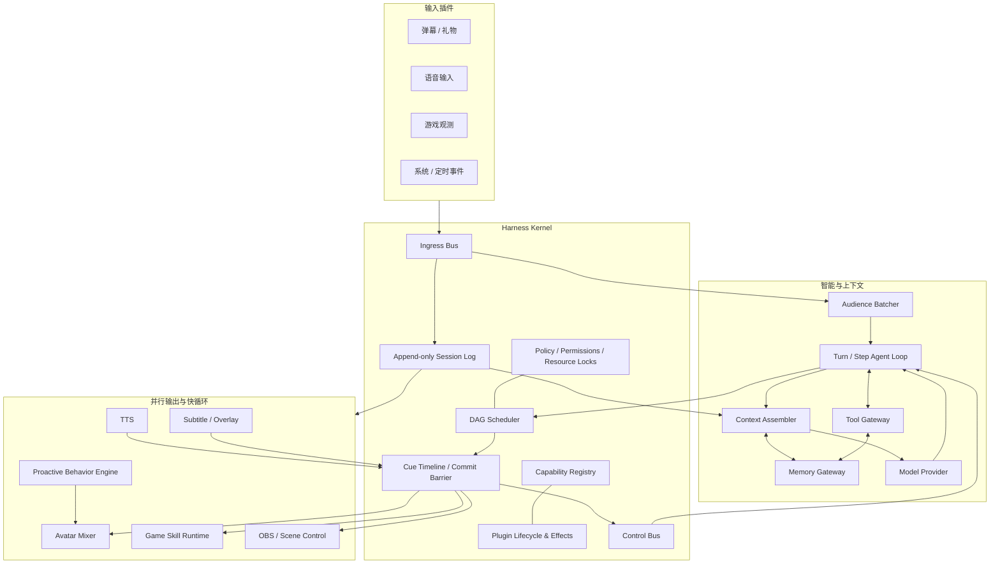
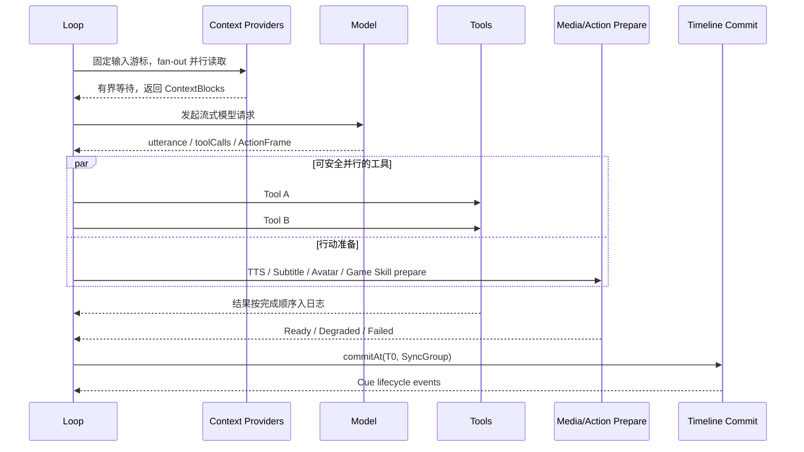

# Bellis Live Harness 架构计划

> 状态：Main 分支设计基线（v1）  
> 历史实现：`day0` 分支，固定于提交 `a43e63d`  
> 目标：重新构建一个面向游戏直播的插件化 Agent Runtime，在降低端到端等待的同时，保证语音、字幕、Live2D 和游戏动作对齐。

## 1. 结论先行

新框架不再把“LLM、工具、TTS、Live2D、字幕、游戏控制”串成一条长流水线，而采用以下结构：

1. **一个极小内核**：只管理插件生命周期、能力服务、事件日志、调度、权限、取消和可观测性。
2. **多速率循环**：弹幕接入、Agent Step、游戏实时控制、Live2D 主动行为、媒体时间线、记忆写入各自运行，不让最慢组件拖住全部系统。
3. **请求并行、行动对齐**：上下文读取、外部记忆、工具调用和媒体准备尽可能并行；对外产生效果前经过 `prepare -> commit` 屏障，在统一时间线上同步执行。
4. **Step 必有 ActionFrame**：每次 LLM 请求对应一个 Step，每个 Step 都产生一次可提交的行动帧；行动帧中的一句话是可选的，因而工具执行时可边说“我先看一下”边调用工具，也可以只做表情、姿态或状态提示。
5. **记忆是能力，不是 Prompt 补丁**：外部记忆系统同时可提供 `ToolProvider` 与 `ContextProvider`；所有注入内容都经统一 Context Assembler 预算、去重、审计并写入 Session Log。
6. **Live2D 具有自主性**：Agent 只提交高层意图。独立的 Behavior Engine 负责眨眼、呼吸、注视、空闲动作和受规则约束的随机动作，再由 Avatar Mixer 与 Agent 动作、口型和物理效果混合。
7. **LLM 负责策略，不负责每帧控制**：游戏插件暴露观测、技能和受限动作；20–60 Hz 的快循环由确定性控制器执行，LLM 在事件触发或 0.5–2 Hz 的慢循环中规划。

核心公式是：

> **并行 Prepare + 有界等待 + 原子 Commit + 可取消 Timeline**

## 2. 目标、边界与验收指标

### 2.1 功能目标

- 直播输入：弹幕、礼物、关注、语音、游戏状态、系统事件统一接入。
- 弹幕批处理：按时间窗、优先级、用户去重和语义聚类生成 Audience Batch。
- LLM Loop：支持多 Step、并行工具、途中插入事件、可选的工具前发言和每 Step 行动帧。
- 长期记忆：内置实现可替换；支持外部进程、HTTP/gRPC 或 MCP 适配器。
- 输出同步：TTS、字幕、Live2D、Overlay、OBS 和游戏动作在同一 Cue Timeline 上执行。
- 主动表现：即使 Agent Loop 暂时没有请求，Live2D 仍保持自然的主动行为。
- 插件化：输入、模型、记忆、工具、TTS、Avatar、游戏和 Overlay 均可独立替换。
- 可重放：任意模型可见信息、工具结果和高层行动都可由 Session Log 追踪。

### 2.2 非目标

- 不让 LLM 直接发送逐帧按键、鼠标或 Live2D 参数流。
- 不允许插件绕过权限、时间线和资源锁直接执行高风险副作用。
- 不追求所有外部系统的强一致分布式事务；跨进程失败采用幂等、补偿和降级。
- 不把未经筛选的完整弹幕、全部历史或外部记忆直接塞入上下文。

### 2.3 首版 SLO

| 指标 | 目标 | 降级策略 |
| --- | ---: | --- |
| 弹幕进入批次 P95 | ≤ 500 ms | 高优先级事件立即封窗 |
| Step 前置上下文 P95 | ≤ 250 ms | 超时 Provider 本 Step 跳过 |
| 首个可见反馈 P95 | ≤ 800 ms | 先提交表情/状态，再接语音 |
| TTS 首音频块 P95 | ≤ 600 ms | 流式 TTS、句级切分与预热 |
| 同一 SyncGroup 音频/字幕/口型偏差 | ≤ 50 ms | 以音频时钟为主时钟重采样 |
| 工具失败隔离 | 单插件失败不终止 Runtime | 熔断、超时、重试或替代 Provider |
| Loop 可恢复性 | 进程重启后从最后提交事件恢复 | Append-only Session Log + 投影 |

指标是工程目标，不是硬编码常量；不同模型和直播平台可由 Profile 覆盖。

## 3. 总体架构



### 3.1 四类通道必须分离

| 通道 | 语义 | 是否持久化 | 典型内容 |
| --- | --- | --- | --- |
| Ingress Bus | 高吞吐、允许采样和背压 | 默认否 | 原始弹幕、游戏帧摘要、音量事件 |
| Session Log | 模型可见与可重放的事实源 | 是 | Batch、ContextPatch、模型响应、工具结果、ActionFrame |
| Control Bus | 控制循环与插件生命周期 | 按需 | cancel、steer、followup、健康状态、配置切换 |
| Cue Bus | 有时间戳的对外效果 | 高层 Cue 持久化 | 语音、字幕、动作、表情、游戏技能、OBS Cue |

不能用一个 EventBus 同时承担四种语义。否则持久事件会被采样、实时事件会撑爆日志、取消信号会和普通消息竞争。

### 3.2 Session Log 是单一事实源

所有会影响模型判断或对外行动的高层信息必须被具体化为事件：

- `AudienceBatchCreated`
- `ContextPatchMaterialized`
- `ModelStepStarted` / `ModelStepCompleted`
- `ToolCallRequested` / `ToolCallCompleted`
- `ActionFrameProposed` / `ActionFrameCommitted`
- `CuePrepared` / `CueStarted` / `CueCancelled` / `CueCompleted`
- `MemoryWriteScheduled` / `MemoryWriteCompleted`
- `PluginHealthChanged`

低层 Live2D 参数和每帧游戏输入不逐条写日志。日志记录高层 Intent、随机种子、控制器版本和结果摘要，即可确定性重放或分析。

## 4. 多循环模型

Runtime 内至少存在六个相互协作的循环：

| 循环 | 触发/频率 | 职责 | 不应承担 |
| --- | --- | --- | --- |
| Ingress/Batch Loop | 事件驱动，100–500 ms 窗 | 接入、排序、聚类、批次快照 | 调模型、播音频 |
| Agent Turn/Step Loop | 事件驱动，约 0.5–2 Hz | 推理、工具选择、产出 ActionFrame | 每帧控制 |
| Game Fast Loop | 20–60 Hz | 执行技能、读状态、保护输入 | 自由文本推理 |
| Avatar Behavior Loop | 2–10 Hz，高层动作按秒 | 空闲/随机/反应行为 | 覆盖口型或关键剧情动作 |
| Timeline Loop | 音频时钟或单调时钟 | 同步 Cue、取消、抢占、补偿 | 生成内容 |
| Memory Worker Loop | 异步、低优先级 | 摘要、归档、去重、长期写入 | 阻塞当前 Step |

每个循环通过带版本的快照和高层事件交互，不共享可随意修改的全局字典。

## 5. Agent Loop：Turn、Step 与同步行动

### 5.1 术语

- **Turn**：由一个 Audience Batch、系统事件或 followup 唤醒的一轮处理，可包含多个 Step。
- **Step**：一次模型请求，以及该响应触发的工具和 ActionFrame。
- **ActionFrame**：一次 Step 对观众、Avatar、游戏或 Overlay 的高层行动提案。
- **CueSheet**：ActionFrame 经解析、策略校验和媒体准备后形成的可执行时间线。

### 5.2 Step 输出协议

每次模型请求必须返回一个结构化 `StepOutput`。`action` 必须存在，但其中的 `utterance` 可为空：

```ts
interface StepOutput {
  assistantMessage: string;          // 写入会话；可以很短
  toolCalls: ToolCall[];              // 0..N
  action: ActionFrame;                // 每 Step 恰好一个
  continuation: "stop" | "after_tools" | "followup";
}

interface ActionFrame {
  utterance?: {
    text: string;
    mode: "say" | "aside" | "tool_announcement";
    interruptible: boolean;
  };
  avatar?: AvatarIntent[];
  subtitle?: SubtitleIntent;
  game?: GameIntent[];
  overlay?: OverlayIntent[];
  syncPolicy: "hard" | "soft" | "independent";
  deadlineMs?: number;
}
```

由此得到统一行为：

1. 模型决定调用工具，并输出一句“我看一下背包”。
2. 句子一旦完整且通过策略校验，TTS 准备与工具调用并行开始。
3. Live2D 的思考表情、字幕和首个音频块进入同一 `SyncGroup`。
4. 工具完成后写入 Session Log，Loop 发起下一个 Step 总结或继续行动。

如果不适合说话，`utterance` 留空，ActionFrame 仍可提交点头、思考表情、状态徽标或无操作心跳。不要为了满足协议强制生成无意义的填充话术。

### 5.3 工具前发言策略

Profile 可配置：

```yaml
agentLoop:
  toolAnnouncement: auto  # off | auto | always
  maxParallelToolCalls: 8
  maxStepsPerTurn: 8
  stepDeadlineMs: 15000
```

- `off`：工具 Step 不生成可听发言。
- `auto`：预计耗时超过阈值、内容适合直播反馈时生成一句短话。
- `always`：除安全或连贯性策略阻止外，每个工具 Step 均发言。

发言不得泄漏隐藏工具名、凭据、内部错误或尚未确认的工具结果。

### 5.4 Inbox 语义

吸收 DeepSeek Harness 的 Loop 设计，将途中输入分成三种明确语义：

- `followup`：当前 Turn 结束后立即开启下一 Turn。
- `steer`：取消或收束当前未提交 Step，在下一 Step 注入高优先级指令。
- `inject`：不主动唤醒，只在下一次自然 Step 中加入信息。

弹幕批次默认使用 `followup`；高额礼物、管理员命令和游戏危险状态可使用 `steer`；普通状态刷新使用 `inject`。

## 6. 并行请求与行动对齐

### 6.1 关键原则

并行化的对象是“准备工作”，而不是无约束的外部副作用。一次 Step 分四阶段：



### 6.2 Step 前置 fan-out

在固定 `inputCursor` 后，下列任务并行启动：

- Audience Batch 摘要与高优先级原文选择。
- 游戏状态、直播场景和 Avatar 当前状态快照。
- 多个外部记忆 Provider 的 `contributeContext`。
- Persona、规则、Tool Catalog、权限与 Token Budget 投影。
- Prompt/Tool Schema 缓存读取。

Context Coordinator 使用总 Deadline，而不是依次给每个 Provider 完整超时。到期后用已完成结果组装上下文；慢 Provider 的结果可进入下一 Step，不阻塞当前请求。

### 6.3 工具 DAG 与资源锁

工具声明副作用和资源：

```ts
type ToolConcurrency =
  | { kind: "parallel_read" }
  | { kind: "exclusive"; resource: string }
  | { kind: "keyed"; resource: string; keyFromArgs: string }
  | { kind: "realtime"; resource: string; preemptible: boolean };
```

- `parallel_read`：天气、百科、只读记忆搜索可并行。
- `exclusive`：OBS 切场景、存档、支付类副作用按资源串行。
- `keyed`：不同用户或不同存档键可并行，同键串行。
- `realtime`：游戏控制和 Avatar 独占动作可抢占，但必须经过 Timeline。

Tool Scheduler 根据显式依赖构建 DAG，支持 `all`、`any`、`quorum` 或 `background` 等待策略。只有模型后续推理必需的工具位于关键路径；日志归档、记忆写入、遥测不应阻塞下一 Step。

### 6.4 两阶段 Action Commit

所有输出适配器实现：

```ts
interface CueParticipant<T> {
  prepare(intent: T, scope: CancellationScope): Promise<PreparedCue>;
  commit(cue: PreparedCue, at: MonotonicTime): Promise<CueHandle>;
  cancel(handle: CueHandle, reason: string): Promise<void>;
}
```

1. **Prepare**：TTS 生成首块音频、字幕分句、Live2D 解析动作、游戏技能校验、OBS 场景预载；各项并行。
2. **Barrier**：等待硬同步项 Ready；软同步项超过 Deadline 后降级；失败项按策略移除或取消整组。
3. **Commit**：Timeline 分配统一 `T0`，所有参与者按相同主时钟启动。
4. **Compensate/Cancel**：steer、异常或新高优先级事件触发淡出、动作回中、松键和字幕撤回。

同步等级：

- `hard`：语音、字幕、口型；任一关键项失败则整体降级或取消。
- `soft`：表情、手势、Overlay；允许小幅延迟或缺席。
- `independent`：记忆写入、遥测、非关键视觉装饰。

### 6.5 主时钟与锚点

- 有语音时使用音频设备/浏览器 `AudioContext.currentTime` 对应的单调时钟作为主时钟。
- 无语音时使用 Runtime 单调时钟；禁止使用可被 NTP 调整的墙上时间做 Cue 调度。
- 字幕锚定句、词或音素时间；口型优先使用 TTS 音素/viseme，无法取得时回退到音量包络。
- 跨进程消息携带 `timelineId`、`syncGroupId`、`sequence`、`deadline` 与时钟偏移估计。

## 7. 弹幕批量读取

`AudienceBatcher` 不是简单收集 N 秒文本，而是自适应窗口：

1. 普通流量使用 250–500 ms 窗口。
2. 高价值事件、管理员指令或游戏紧急事件立即封窗。
3. 高流量时延长聚合但限制最大 Token，并按用户和语义去重。
4. 当前 Turn 忙时持续收集；批次根据优先级进入 `followup/steer/inject` Inbox。
5. 保留原始事件游标，模型只看到经过选择的摘要与少量代表性原文。

建议批次结构：

```ts
interface AudienceBatch {
  id: string;
  cursorFrom: bigint;
  cursorTo: bigint;
  openedAt: number;
  closedAt: number;
  highlights: AudienceEvent[];
  clusters: Array<{ topic: string; count: number; examples: string[] }>;
  priority: number;
  suggestedInboxMode: "followup" | "steer" | "inject";
}
```

重复弹幕计数本身也是信号，不应只做文本去重后丢弃热度。

## 8. 外部记忆系统

### 8.1 双接口能力模型

外部记忆系统通过一个 Provider 同时或分别提供两类能力：

```ts
interface MemoryProvider {
  id: string;
  contributeContext?(req: ContextRequest, signal: AbortSignal):
    Promise<ContextContribution>;
  listTools?(): Promise<ToolDescriptor[]>;
  executeTool?(call: ToolCall, signal: AbortSignal): Promise<ToolResult>;
  observe?(events: SessionEvent[]): Promise<void>; // 异步写入/学习
  health(): Promise<ProviderHealth>;
}
```

- **ContextProvider**：每个 Step 前自动召回可能相关的长期信息。
- **ToolProvider**：向模型暴露 `memory_search`、`memory_remember`、`memory_forget`、`memory_correct` 等显式工具。

二者不可互相替代：自动上下文保证关键记忆能被看到，工具接口允许模型在需要时主动深挖、纠错和写入。

### 8.2 ContextContribution 协议

外部 Provider 不能直接修改 System Prompt 或历史消息，只能返回带来源和预算元数据的块：

```ts
interface ContextBlock {
  id: string;
  revision: string;
  contentHash: string;
  text: string;
  priority: number;
  tokenEstimate: number;
  ttlMs?: number;
  placement: "facts" | "relationships" | "recent_context" | "constraints";
  privacy: "public" | "stream_private" | "secret";
  source: { provider: string; recordIds: string[] };
  confidence?: number;
}
```

Context Assembler 负责：

- 并行查询多个 Provider，统一 Deadline 和取消。
- 身份域、直播域和权限过滤，防止跨主播或跨频道泄漏。
- 基于 `id/revision/contentHash` 去重和冲突检测。
- 按优先级、相关性、新鲜度和 Token Budget 排序。
- 把最终采用的内容具体化为 `ContextPatchMaterialized` 事件。
- 标明来源；低置信或冲突内容不得当成强约束。

### 8.3 接入方式

优先提供三种适配器：

1. `memory-native`：进程内 TypeScript 插件，低延迟。
2. `memory-rpc`：HTTP/gRPC 外部服务，适合自建向量库或现有记忆服务。
3. `memory-mcp-adapter`：把 MCP Tools/Resources 映射到 ToolProvider/ContextProvider，适合通用外部生态。

MCP 适合外部能力边界，不用于 TTS、Live2D 参数流或游戏逐帧控制。

### 8.4 写入策略

- 当前 Step 只同步写入 Session Log。
- 记忆抽取、摘要、向量化和外部写入进入 Memory Worker。
- 用户明确要求“记住/纠正/忘记”时，显式工具可等待确认结果。
- 普通观察采用 at-least-once 投递，Provider 必须支持幂等键。
- 删除和纠正保留 tombstone/版本，避免缓存让旧记忆复活。

## 9. Live2D 主动行为与动作混合

### 9.1 独立 Behavior Engine

Live2D 不完全受 Agent Loop 控制。Behavior Engine 在无模型请求时仍运行：

- 生理层：眨眼、呼吸、细微摇摆。
- 注意层：看向弹幕、游戏焦点、鼠标或镜头。
- 情绪层：根据当前 mood 缓慢回落或维持。
- 空闲层：带冷却和上下文约束的随机动作。
- 反应层：礼物、胜负、伤害、等待工具等确定性触发动作。

随机行为必须使用可记录的种子、权重、冷却和互斥标签，避免连续重复、剧情冲突和不可重放。

### 9.2 Avatar Mixer

不要让各插件直接写 Live2D 参数。所有意图进入 Mixer：

| 层 | 示例 | 默认优先级 | 混合方式 |
| --- | --- | ---: | --- |
| Safety/Reset | 回中、停止异常动作 | 100 | 强制覆盖 |
| Lip Sync | viseme、嘴形 | 90 | 只占口部参数 |
| Agent Dramatic | 明确动作、表情 | 80 | 可抢占主动动作 |
| Reactive | 礼物、受伤、胜利 | 60 | 按标签互斥 |
| Proactive Idle | 随机动作、注视 | 20 | 仅在资源空闲时 |
| Physics/Base | 呼吸、头发、物理 | 10 | 加法或 SDK 物理混合 |

每个 Intent 声明 `channels`、`priority`、`blendIn/out`、`ttl`、`interruptible` 和 `exclusiveTags`。Agent 的动作不是硬编码参数，而是 `emotion=happy`、`motion=wave`、`gaze=game_focus` 等语义意图，由模型适配插件映射到具体资源。

### 9.3 主动动作与日志

每次眨眼不写 Session Log。记录：

- Behavior policy/version 与随机种子。
- 高层主动动作的开始、抢占和结束。
- Agent 或外部事件导致的可见反应。
- 低层参数只进入采样遥测，用于调试而非会话重放。

## 10. 游戏控制

统一游戏接口：

```ts
interface GameCapability {
  observe(query: ObservationQuery): Promise<GameSnapshot>;
  listSkills(): Promise<GameSkillDescriptor[]>;
  prepareSkill(intent: GameIntent, signal: AbortSignal): Promise<PreparedGameSkill>;
  commitSkill(skill: PreparedGameSkill, at: MonotonicTime): Promise<GameSkillHandle>;
  cancelSkill(handle: GameSkillHandle, reason: string): Promise<void>;
}
```

游戏插件按适配程度分层：

1. **原生协议层**：RCON、游戏 Mod、官方 API，优先级最高。
2. **结构化机器人层**：例如游戏专用 Bot/客户端库。
3. **视觉与输入层**：截图/OCR/CV + 键鼠，仅作为通用回退，必须有焦点保护和急停。

LLM 选择“搜索资源、跟随队友、打开背包”这类技能；Skill Runtime 把技能编译为状态机或行为树，在快循环中执行。任意停止、切窗口、失焦和安全事件必须保证释放按键。

## 11. 插件模型

### 11.1 Capability Seam

参考 DeepSeek Harness/Cordis，将每种可替换能力拆成：

- Service Definition：接口、事件和错误语义。
- Provider：能力实现。
- Consumer：只依赖接口，不直接 import 具体实现。

核心服务建议：

```text
ctx.sessions     ctx.events       ctx.control
ctx.agentLoop    ctx.models       ctx.context
ctx.tools        ctx.memory       ctx.timeline
ctx.tts          ctx.avatar       ctx.game
ctx.overlay      ctx.credentials  ctx.telemetry
```

### 11.2 Manifest

```yaml
id: live2d-cubism-web
version: 1.0.0
runtime: browser
provides: [avatar.renderer, avatar.motion, avatar.lipsync]
requires: [timeline.clock, assets.store]
permissions: [assets.read, websocket.connect]
isolation: worker
hotReload: true
configSchema: ./config.schema.json
```

插件必须显式声明依赖、权限、隔离级别、资源和配置 Schema。注册事件监听、定时器、路由和服务覆盖时返回 disposable effect，卸载或热更新时可逆清理。

### 11.3 Profile 与 Bundle

- **Plugin**：单一能力。
- **Bundle**：一组可复用插件，例如 `live2d-standard`、`bilibili-input`。
- **Profile**：一次部署选择的完整组合，例如 `local-cubism-qwen-factorio`。

依赖解析在启动时失败得足够早，不应等直播中第一次调用才发现 Provider 缺失。

## 12. 缓存设计

### 12.1 模型 Prefix Cache

缓存命中的关键不是只加一个 Redis，而是保持请求前缀稳定：

```text
[固定 System / Persona / Safety / Tool Schemas]  <- 长期稳定
[Append-only Session History]                    <- 只追加
[本 Step ContextPatch / Audience Batch]          <- 动态尾部
```

- Persona、规则和 Tool Schema 使用 `promptEpoch` 版本；没有变化就保持字节级稳定。
- 工具顺序和 JSON Schema 规范化，禁止每次请求随机排序。
- 外部记忆不插回旧历史或动态 System Prompt，而在末尾生成 ContextPatch。
- 相同 ContextBlock 用 `id + revision + contentHash` 表示；没有变化不重复展开。
- 历史压缩生成新的 Epoch，并明确统计由此造成的冷启动成本。

### 12.2 分层缓存

| 缓存 | Key | 失效条件 |
| --- | --- | --- |
| Provider KV/Prefix | model + promptEpoch + exactPrefix | System、工具 Schema 或历史变化 |
| Context Assembly | inputCursor + providerRevisions + budgetPolicy | 新事件、记忆版本、权限变化 |
| Memory Retrieval | actor + queryHash + providerRevision | TTL、纠正、删除、身份域变化 |
| TTS | voice + normalizedText + prosody + modelVersion | 音色或模型变化 |
| Subtitle segmentation | textHash + locale + policy | 文本或断句策略变化 |
| Game perception | frameHash + detectorVersion | 新帧或检测器升级 |
| Plugin discovery | lockfileHash + profile | 插件或 Profile 变化 |

缓存必须记录 hit/miss、节省 Token/毫秒、陈旧命中和失效原因。隐私域是 Key 的组成部分，不能跨主播共享含身份信息的缓存。

## 13. 背压、取消与失败隔离

### 13.1 背压

- Ingress 有界队列；普通弹幕可聚合或采样，高优先级事件不可静默丢弃。
- 每个 Provider 有并发限额、超时、熔断和 bulkhead。
- TTS 采用有界句队列，新的 steer 可取消尚未播放的旧句。
- Game/Avatar 只保留最新可合并的状态 Intent，不能堆积过期参数。

### 13.2 结构化取消

Turn、Step、ToolBatch、SyncGroup 和 Skill 均拥有父子 `CancellationScope`。父作用域取消时：

1. 停止未完成模型流和工具请求。
2. 已 prepare 未 commit 的 Cue 直接释放。
3. 已 commit 的语音淡出、字幕撤回、Avatar 回中、游戏松键。
4. 写入明确的取消原因，不伪装成正常完成。

### 13.3 降级路径

- 外部记忆不可用：使用 Session 内短期记忆，不阻塞说话。
- TTS 不可用：保留字幕和 Avatar 非口型动作。
- Live2D 不可用：继续 TTS/字幕/游戏；客户端重连后从当前高层状态恢复。
- 游戏插件不可用：Agent 进入解说模式，不生成虚假的已执行结果。
- 模型流中断：取消未提交动作；已播放内容标记 partial，并允许下一 Turn 自然修正。

## 14. 安全边界

- 凭据只在服务端 Credential Service 中解析，不进入前端配置广播、Session Log 或模型上下文。
- 游戏控制、OBS、文件、网络和外部记忆分别授权。
- 所有副作用工具声明幂等键和审计字段；高风险操作支持人工确认。
- 弹幕和外部记忆都是不可信输入，必须防 Prompt Injection 与工具参数越权。
- 浏览器 Live2D 客户端只能收到渲染所需的 Cue，不拥有模型或平台密钥。
- 插件优先运行于 Worker/子进程；崩溃和内存泄漏不能带走整个 Runtime。

## 15. 推荐代码布局

新实现建议在 monorepo 中与 `day0` 兼容层并存：

```text
apps/
  runtime/                 # TypeScript：内核、Agent Loop、插件宿主
  studio/                  # React：配置、监控、Overlay、Live2D 页面
packages/
  kernel/                  # capability、effects、events、lifecycle
  session/                 # append-only log、projection、replay
  agent-loop/              # Turn/Step/inbox/action protocol
  context/                 # Context Assembler、预算、缓存
  scheduler/               # DAG、资源锁、deadline、cancellation
  timeline/                # CueSheet、时钟、prepare/commit
  plugin-sdk/              # manifest、测试工具、类型定义
  protocols/               # 跨进程 schema
plugins/
  input-bilibili/
  memory-native/
  memory-mcp/
  model-openai-compatible/
  tts-*/
  avatar-live2d/
  game-*/
  obs-websocket/
workers/
  python/                  # CV、特定 AI/游戏生态适配
crates/
  realtime-sidecar/        # 后期：低抖动输入/音频/时钟，不作为首版前置条件
compat/
  bellis-day0/             # 旧事件、Live2D 命令和配置迁移适配
docs/
  architecture-plan.md
  protocols/
  adr/
```

主 Runtime 推荐 TypeScript，便于与 Web、Live2D、OBS 和插件生态共享协议；Python 保留为 CV、模型和旧插件 Worker。Rust 只在性能剖析证明 Node 侧时钟或输入抖动不达标后引入，避免首版过早复杂化。

## 16. 从 day0 迁移

### Phase 0：冻结与测量

- `day0` 保持当前 Python 实现，作为行为基线和回归参照。
- 记录现有事件类型、WebSocket 消息、Live2D 命令和配置样例。
- 建立端到端延迟、失败率、缓存和队列深度基线。

验收：能从固定提交启动基线；关键协议有样例和回放数据。

### Phase 1：内核与 Session Log

- 实现 Capability Registry、Plugin Lifecycle、typed events、reversible effects。
- 建立 Append-only Session Log、projection、replay 与四类通道。
- 定义跨进程协议和 Plugin Manifest。

验收：插件可装卸；重启后可恢复会话；未知事件版本可安全拒绝或迁移。

### Phase 2：Agent Loop 与 Context/Memory

- 实现 Turn/Step、Inbox、结构化 StepOutput 和预算/Deadline。
- 实现 Context Assembler、Tool Gateway、Memory 双接口。
- 接入一个 OpenAI-compatible Model Provider、一个本地 Memory 和一个外部适配器。

验收：多记忆 Provider 并行；超时不阻塞；模型看到的上下文可审计；Prefix Cache 指标可见。

### Phase 3：Timeline、TTS、字幕和 Live2D

- 实现 CueSheet、单调时钟、Prepare/Barrier/Commit、取消与补偿。
- 接入流式 TTS、字幕分句、viseme/音量口型。
- 实现 Avatar Mixer 与独立 Behavior Engine。

验收：工具执行时可选发言；语音/字幕/口型 P95 偏差 ≤ 50 ms；Agent 动作可抢占随机动作且自然恢复。

### Phase 4：弹幕与游戏插件

- 实现 Audience Batcher 和 Bilibili 输入插件。
- 实现 GameCapability、技能状态机、焦点保护和急停。
- 先选一个具有结构化接口的游戏完成纵向切片。

验收：高流量批次可控；LLM 不参与逐帧输入；取消后不会残留按键。

### Phase 5：生产化

- 插件隔离、权限、熔断、Profile/Bundle、热更新和 Studio 调试面板。
- 建立回放测试、故障注入、延迟火焰图和成本仪表盘。
- 根据剖析结果决定是否引入 Rust Realtime Sidecar。

验收：单插件崩溃不终止直播；会话可回放；关键 SLO 和成本均有告警。

## 17. 测试策略

- **协议测试**：Event、StepOutput、Tool、Memory、Cue Schema 的向前/向后兼容。
- **确定性重放**：固定 Session Log、模型响应桩、随机种子和时钟，比较 ActionFrame/CueSheet。
- **虚拟时钟测试**：验证字幕、音频、Live2D 抢占、暂停和恢复。
- **并发性质测试**：资源锁不死锁；取消后无悬挂任务；同幂等键最多一次生效。
- **故障注入**：记忆超时、模型断流、TTS 半途失败、WebSocket 重连、游戏失焦。
- **负载测试**：弹幕洪峰、多 Provider、长会话和 TTS 队列背压。
- **E2E 录制测试**：保存音频波形、字幕 Cue 和 Avatar 高层状态，计算同步偏差。

## 18. 观测指标

每个 Turn/Step 统一传播 `traceId/turnId/stepId/actionFrameId/syncGroupId`。至少记录：

- 前置上下文各 Provider 延迟、超时和采用 Token。
- 模型 TTFT、总耗时、输入/输出/缓存命中 Token。
- Tool DAG 关键路径、并发度、等待资源锁时间。
- TTS 首块、缓冲深度、取消浪费时长。
- Cue prepare/commit 偏差、音频/字幕/口型 drift。
- Audience Batch 大小、去重率、积压和 steer 次数。
- Memory 召回命中、冲突、陈旧缓存与异步写入积压。
- Avatar 主动动作频率、抢占次数和重复率。
- 游戏技能成功率、取消延迟与安全急停次数。

优化应以“关键路径时间”而非单模块平均耗时为依据。

## 19. 关键 ADR

正式开发前应把以下决定固化为 Architecture Decision Records：

1. Session Log 的存储与事件版本策略。
2. TypeScript Runtime 与 Python Worker 的 IPC 协议。
3. Timeline 主时钟、浏览器时钟同步与音频托管位置。
4. StepOutput 的模型约束方式：原生工具调用、JSON Schema 或双通道流。
5. 外部 Memory Provider 的信任边界与隐私域。
6. Tool 副作用分类、资源锁和幂等语义。
7. 首个游戏插件与安全控制边界。
8. `day0` 兼容期和最终下线条件。

## 20. 参考设计

- [DeepSeek Harness](https://github.com/deepseek-ai/deepseek-harness)：插件化 Harness、Agent Loop 与 Session 设计参考。
- [DeepSeek Harness Architecture](https://github.com/deepseek-ai/deepseek-harness/blob/master/docs/architecture.md)：Capability Seam、插件树和事件化架构。
- [DeepSeek Harness Agent Loop](https://github.com/deepseek-ai/deepseek-harness/blob/master/packages/core/agent-loop/README.zh.md)：Step、并行工具、followup/steer/inject 与缓存约束。
- [DeepSeek Context Caching](https://api-docs.deepseek.com/guides/kv_cache/)：精确前缀缓存行为。
- [Model Context Protocol Architecture](https://modelcontextprotocol.io/docs/learn/architecture)：外部工具与上下文适配边界。
- [Live2D Cubism MotionSync](https://docs.live2d.com/en/cubism-sdk-manual/use-on-scene-motion-sync-web/)：音频与动作同步。
- [Live2D Cubism Expressions](https://docs.live2d.com/en/cubism-sdk-manual/expression/)：表情混合与参数设计。
- [Web Audio currentTime](https://developer.mozilla.org/en-US/docs/Web/API/BaseAudioContext/currentTime)：浏览器音频主时钟。
- [WebVTT API](https://developer.mozilla.org/en-US/docs/Web/API/WebVTT_API)：字幕 Cue 模型。
- [obs-websocket](https://github.com/obsproject/obs-websocket)：OBS 场景与直播控制适配。
- [AIRI](https://github.com/SEKAI-OS/AIRI)：Web/桌面虚拟角色与游戏专用适配参考。
- [MemGPT](https://arxiv.org/abs/2310.08560) 与 [Generative Agents](https://arxiv.org/abs/2304.03442)：分层记忆、反思与长期行为参考。

## 21. 最终设计约束

实现阶段必须持续满足以下不变量：

1. **模型可见即入日志**：没有不可审计的隐藏 Prompt 注入。
2. **副作用先准备后提交**：不能为了省几十毫秒破坏动作对齐和可取消性。
3. **每 Step 一个 ActionFrame**：一句话可选，行动语义不可缺失。
4. **实时循环不等待 LLM**：Avatar 和游戏具备独立、确定性、可抢占的控制器。
5. **外部记忆只能贡献能力**：Provider 不能绕过预算、权限和 Session Log 修改会话。
6. **只让关键路径等待**：非关键工具、记忆写入、遥测和预计算均后台化。
7. **插件失败局部化**：任何单一 Provider 都不能成为整个直播 Runtime 的隐式单点。
8. **所有外部动作可取消或补偿**：尤其是语音、Live2D 独占动作和游戏输入。

