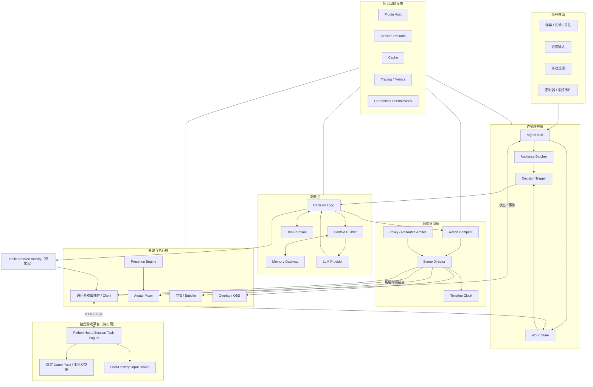
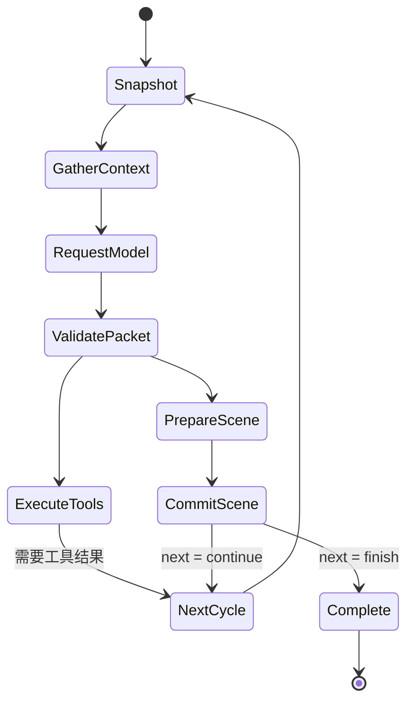

# Bellis Autonomous Live：自主游戏直播系统设计

> 2026-09-06 架构审查修订：任务所有权、工具恢复事实、调用列表范围、场景终态、Seq 分段预留及 Provider 接缝以 [ADR 0007](../adr/0007-task-ownership-and-runtime-scope.md) 为准。

> 文档状态：独立项目设计基线 v1
>
> 项目属性：从零建设的产品，不以现有代码结构为实现边界
>
> 核心目标：让 AI 主播能够听懂直播间、记住长期关系、自然表达、主动表现并操作游戏，同时在低等待下保持语音、字幕、Live2D 与游戏行为一致。

> 2026-09-07 游戏规划修订：[ADR 0048](../adr/0048-external-game-runtime-and-session-activity.md) 采用独立游戏平台、Session Activity、HTTP/SSE 和桌面级输入权威；[Phase 5–8 路线图](../plans/README.md) 替代旧后续排期。新边界均待实现与验收。

## 1. 项目定义

Bellis Autonomous Live 是一个完整的自主游戏直播系统。它既不是聊天机器人加一个 Live2D 页面，也不是把若干 AI 接口串起来的工作流，而是同时包含以下能力的实时产品：

- 读取并理解批量弹幕、礼物、关注、语音和平台事件。
- 观察游戏状态，规划游戏目标并通过受控技能操作游戏。
- 通过 LLM 持续决策，按需调用工具，并在工具执行期间自然回应观众。
- 通过 TTS、字幕、表情、动作、口型和直播画面共同完成一次表达。
- 在没有 LLM 指令时仍保持自然的 Live2D 主动行为。
- 连接内置或外部长期记忆，形成跨直播、跨会话的连续关系。
- 允许直播平台、模型、记忆、TTS、Avatar、游戏和 Overlay 以插件形式替换。

项目从直播体验反推技术结构。任何抽象只有在改善响应速度、动作一致性、扩展能力或运行可靠性时才进入核心设计。

## 2. 产品体验目标

### 2.1 四个关键场景

#### 场景 A：正常弹幕互动

观众连续发送多条相关弹幕，系统在短时间窗内聚合并识别主题。主播选择值得回答的内容，在开口的同一时刻改变表情、转向镜头并显示字幕；其余弹幕保留到后续批次，而不是阻塞当前回答。

#### 场景 B：边说边调用工具

观众询问需要搜索或读取游戏信息的问题。LLM 的本次请求可以同时返回一句短话和工具调用，例如“我看看现在的任务进度”。这句话的 TTS、字幕和 Live2D 思考动作立即准备，工具也并行执行。工具完成后，下一次 LLM 请求基于结果继续回答。

#### 场景 C：说话与游戏行动同步

主播说“我们现在冲进去”，语音到达相应词语时，Live2D 切换到兴奋动作，游戏技能开始执行，Overlay 显示行动目标。各输出由同一场景时间线控制，而不是各插件收到消息后自行开始。

#### 场景 D：没有 LLM 请求时仍然自然

主播在等待加载或暂时不说话时，仍会眨眼、呼吸、看向游戏、对礼物做轻量反应，偶尔执行符合当前情绪和场景的随机动作。这些动作由独立的角色表现系统产生，不需要持续调用 LLM。

### 2.2 第一阶段指标

| 指标 | 目标值 | 说明 |
| --- | ---: | --- |
| 普通弹幕进入可决策批次 P95 | ≤ 500 ms | 紧急事件不等待完整窗口 |
| 触发后首个视觉反馈 P95 | ≤ 500 ms | 表情、注视或状态反馈 |
| 模型请求到 TTS 首音频块 P95 | ≤ 900 ms | 取决于模型和音色 Provider |
| 同场景语音、字幕、口型起始偏差 | ≤ 50 ms | 使用同一单调时钟 |
| 游戏技能取消到释放输入 P99 | ≤ 100 ms | 安全硬指标 |
| 单插件故障影响范围 | 不超过该能力域 | 不能终止整场直播 |
| 长会话恢复 | 重启后恢复已提交状态 | 未提交动作不得重复执行 |

## 3. 设计原则

### 3.1 并行准备，统一生效

上下文、外部记忆、工具、TTS、字幕和动作资源尽可能并行准备；直播表现由场景导演统一提交。游戏候选经独立 Runtime 核验，可接受约定的高层时间锚点；游戏任务、检查点与真实输入的执行权不归 Bellis Scene。

系统优化的是关键路径，而不是追求所有模块表面上的并发。存在数据依赖的工作仍需等待，不影响本次决策的工作必须退出关键路径。

### 3.2 每次模型请求都对应一次行动机会

一次 LLM 请求称为一个 `DecisionCycle`。每个 Cycle 必须返回一个 `ActionFrame`，但不强制每次都说话：

- 可以发言并调用工具。
- 可以只发言，不调用工具。
- 可以不发言，只做表情、动作、状态提示或游戏行为。
- 可以明确静默，维持当前场景。

这样既保证每次请求都能同步驱动角色，又避免为了协议生成没有意义的填充话术。

### 3.3 单一决策权，多路能力供应

Bellis 一个 Cycle 只有一个最终决策包，避免并行模型争夺同一次直播行动；游戏侧异步规划只能提交候选，不能获得独立于 Runtime 的执行权。记忆、检索、视觉分析、内容过滤、工具和媒体生成可以多路并行，它们作为供应者服务于同一个决策。

### 3.4 LLM 不进入帧级实时环

LLM 负责理解、取舍、规划和选择技能。游戏按键、Live2D 参数、口型和音频播放由本地确定性控制器执行。网络抖动或模型变慢时，角色仍然能自然表现，游戏输入也不会失控。

### 3.5 所有外部能力都经过明确边界

外部记忆、工具和插件不能任意篡改 Prompt、共享状态或直接操作输出设备。它们通过稳定协议贡献上下文、工具、意图或媒体，并接受权限、预算、超时和取消控制。

## 4. 总体架构



Bellis 的直播表达由 `Scene Director` 组织为可准备、可同步、可取消的场景；长期游戏由 Session Activity 绑定独立 Runtime。游戏 Runtime 负责任务图与执行合法性，主机/桌面 Broker 负责物理输入，不能让两个项目重复维护同一任务图。Live2D 帧循环与游戏快循环都不等待普通 LLM 回复。

## 5. 核心领域对象

项目使用少量稳定对象串联各能力：

```ts
interface Signal {
  id: string;
  kind: string;
  source: string;
  occurredAt: number;
  priority: number;
  payload: unknown;
}

interface DecisionInput {
  turnId: string;
  cycleId: string;
  signalWatermark: bigint;
  audienceBatch?: AudienceBatch;
  worldSnapshot: WorldSnapshot;
  contextBlocks: ContextBlock[];
}

interface DecisionPacket {
  schemaVersion: 1;
  cycleId: string;
  toolCalls: ToolCall[];
  action: ActionFrame;
  next: "finish" | "after_tools" | "continue";
}

interface ActionFrame {
  schemaVersion: 1;
  noOp?: true;
  speech?: SpeechIntent;
  avatar?: AvatarIntent[];
  game?: GameIntent[];
  overlay?: OverlayIntent[];
  sync: SyncPolicy;
}
```

`DecisionPacket` 不再保留顶层 `message` 或 `speech`。发言只有一个来源：`DecisionPacket.action.speech`。模型 Provider 的原始输出可以不同，但进入核心前必须规范化为上述形态，避免文本、TTS、字幕和动作读取到互相冲突的内容。收敛记录见 [ADR 0001](../adr/0001-canonical-core-and-wire-contracts.md)。

`ActionFrame` 是闭合的版本化形态：必须携带 `schemaVersion: 1`；至少包含一个行动或显式 `noOp: true`，不允许空帧；`avatar`/`game`/`overlay` 数组必须非空（1–32 个意图）；`noOp` 与任何实际行动互斥。

- `Signal`：尚未被决策消费的输入事实。
- `WorldSnapshot`：某一水位上的只读直播世界状态。
- `DecisionPacket`：一次模型请求的完整结果。
- `ActionFrame`：该请求对应的一次行动机会。
- `Scene`：ActionFrame 经校验和编译后的可执行计划。
- `Cue`：Scene 中具有时间锚点的最小输出单位。
- `Session Activity`（Phase 5 待定义）：Bellis Session 拥有的长期外部活动绑定，独立于单次 Turn/Scene；游戏任务与尝试保留在游戏 Runtime，不复制进宿主调用列表。

领域对象采用版本化 Schema。插件可以扩展 payload，但不能改变基础的身份、时序、权限和取消字段。

## 6. 信号接入与弹幕批处理

### 6.1 Signal Hub

平台插件只负责把外部事件转换为标准 Signal，不直接唤醒模型。Signal Hub 完成：

- 来源鉴权与时间戳校正。
- 事件去重和平台断线后的游标恢复。
- 优先级、频道、用户和隐私域标记。
- 有界队列、过载采样和紧急事件旁路。
- 更新 World State，并把弹幕类事件送入 Audience Batcher。

### 6.2 Audience Batcher

弹幕批次采用自适应窗口，而不是固定每 N 条请求一次模型：

- 正常流量使用 200–500 ms 的短窗口。
- 高额礼物、管理员命令、连续点名和游戏危险事件可立即封窗。
- 流量激增时扩大聚合窗口，但限制最大 Token 和最大等待时间。
- 相同内容按语义聚类，同时保留人数和热度，避免去重后丢失群众信号。
- 同一用户的刷屏按策略降权，长期互动用户可由记忆提供关系权重。

```ts
interface AudienceBatch {
  id: string;
  watermarkFrom: bigint;
  watermarkTo: bigint;
  highlights: AudienceMessage[];
  topics: Array<{
    label: string;
    count: number;
    participants: number;
    examples: string[];
  }>;
  urgentSignals: Signal[];
  tokenEstimate: number;
}
```

Batcher 只整理事实，不代替 LLM 做角色决策。它可以使用廉价模型或 embedding 做聚类，但结果必须保留原始 Signal 游标以便审计。

### 6.3 忙碌期间的新输入

当 Decision Loop 正在工作时，新事件按三类进入收件箱：

| 模式 | 行为 | 示例 |
| --- | --- | --- |
| `interrupt` | 取消尚未提交的当前行动，尽快重新决策 | 管理员命令、游戏死亡风险 |
| `next_cycle` | 工具返回后的下一次模型请求一并读取 | 新的高价值弹幕 |
| `next_turn` | 当前 Turn 正常结束后启动新 Turn | 普通弹幕批次 |

已开始播放的直播场景由 Scene Director 执行淡出、回中等补偿。游戏停止由 Activity 策略向 Runtime 发出受授权操作，再由本地 Broker 清理输入；普通聊天 Turn 取消不自动终止长期游戏活动，紧急撤权/停止的传播在活动契约中冻结。

## 7. Decision Loop

### 7.1 Turn 与 Cycle

- `Turn`：处理一个主触发及其工具往返的完整过程。
- `DecisionCycle`：一次 LLM 请求。

一个 Turn 的典型流程：

```text
触发 Turn
  -> 构建 Cycle 1 上下文
  -> LLM 返回“短句 + ToolCalls + ActionFrame”
  -> 短句表现与工具并行执行
  -> 工具结果进入 Cycle 2
  -> LLM 返回最终回答 + ActionFrame
  -> Turn 结束
```

### 7.2 每个 Cycle 的状态机



`PrepareScene` 与 `ExecuteTools` 在没有依赖冲突时并行。工具执行不需要等待一句话播完，一句话也不需要等待工具返回。

### 7.3 工具执行时的可选发言

模型协议将工具前发言设为 ActionFrame 中的普通 SpeechIntent：

```ts
interface SpeechIntent {
  text: string;
  purpose: "answer" | "tool_notice" | "aside" | "reaction";
  interruptible: boolean;
  emotion?: string;
}
```

Profile 控制生成策略：

```yaml
decisionLoop:
  toolSpeech: auto       # off | auto | always
  toolSpeechMaxChars: 32
  maxCyclesPerTurn: 8
  maxParallelTools: 8
```

- `off`：调用工具时保持静默，但仍产生 ActionFrame。
- `auto`：预计工具耗时较长或直播需要反馈时生成一句短话。
- `always`：通常每次工具 Cycle 都发言，安全策略可阻止。

工具前发言只能描述即将做什么，不能提前声称工具已经成功，也不能暴露内部工具名、密钥或未经确认的数据。

### 7.4 流式响应

模型流被增量解析为四类片段：文本、结构化工具调用、Avatar 意图和其他 Action 意图。

- 一句话达到稳定边界并通过内容策略后，可提前启动 TTS Prepare。
- 工具参数在 JSON 完整并验证后可编译无依赖调用计划；当前所有 Tool 均在完整包校验和 durable Cycle adoption 成功后启动，不允许流式阶段执行可变工具。
- 所有准备均可提前开始，但只有完整 DecisionPacket 通过校验后才能 Commit。
- 模型在 final/adoption 前断流时，未提交准备全部取消，此时不会已有本 Cycle 的播放。已提交 Scene 的后续媒体中断另按播放确认处理，不能把计划文本当作已生效输出。

## 8. 面向低等待的并行执行

### 8.1 并行边界

系统按依赖关系而不是固定阶段决定并行度：

| 工作 | 是否可并行 | 是否阻塞模型请求 | 是否阻塞场景开始 |
| --- | --- | --- | --- |
| 弹幕聚类、游戏快照、Avatar 状态 | 是 | 仅等待统一 Deadline | 否 |
| 多外部记忆召回 | 是 | 最多等待上下文 Deadline | 否 |
| 稳定 Prompt 和工具目录缓存 | 是 | 命中立即返回 | 否 |
| 多个只读工具 | 是 | 仅阻塞依赖其结果的下一 Cycle | 否 |
| TTS 首块、字幕、主动作资源 | 是 | 否 | 只等待硬同步项 |
| 记忆写入、遥测、摘要 | 是 | 否 | 否 |
| 相互冲突的游戏动作 | 否 | 否 | 由资源仲裁串行 |

### 8.2 Cycle 开始时的快照屏障

Cycle 开始时先固定 `signalWatermark` 和 `worldVersion`。Audience、Game、Avatar、Memory 和配置 Provider 都基于这两个版本提供数据，防止模型同时看到“游戏已经结束”和“仍在战斗”的不同快照。

固定快照后立即 fan-out：

1. 读取热 World State。
2. 查询 Memory Context Provider；首条纵向链路只接一个，多 Provider fan-out 后续按需启用。
3. 准备 Persona、规则和工具目录。
4. 读取当前 Turn 历史及 Token Budget。

Context Builder 使用一个总 Deadline，例如 150–250 ms。到期后用已返回结果开始模型请求；迟到结果缓存到下一 Cycle，不继续拖慢当前关键路径。

### 8.3 预取代替前台等待

对于高频数据，最有效的优化不是在 Cycle 内开更多 Promise，而是提前维护热投影：

- 新弹幕进入时异步预取相关用户记忆。
- 游戏状态变化时更新结构化 World State，而不是请求前临时 OCR 全屏。
- Persona、规则和工具 Schema 在插件变化时编译，不在每次请求时重建。
- 常用 TTS 音色和 Live2D 动作资源在开播前预热。
- 当前话题的外部记忆结果使用短 TTL 缓存并后台刷新。

### 8.4 Tool Scheduler

工具在注册时声明依赖和副作用：

```ts
interface ToolExecutionPolicy {
  mode: "parallel_read" | "exclusive" | "keyed" | "background";
  resource?: string;
  keyArgument?: string;
  timeoutMs: number;
  idempotent: boolean;
  cancellable: boolean;
}
```

- 多个 `parallel_read` 工具同时执行。
- `exclusive` 工具对同一资源加锁，如 OBS 场景或游戏输入。
- `keyed` 工具只在相同实体键上串行。
- `background` 工具不在当前 Cycle 的关键路径，例如普通记忆归档。

当前模型只能输出无显式依赖的调用列表；Scheduler 保留并发、资源锁和取消，非空或非法 dependsOn 明确拒绝。需要前一步结果时进入下一 Cycle。前台结束后，后台调度仍由 Tool Runtime 持有直至全部结算。通用 DAG 待真实场景验证后另行设计。

## 9. Scene Director：动作对齐中心

### 9.1 Scene 与 Cue

Action Compiler 将 ActionFrame 转为 Scene（字段命名与 `@bellis/contracts` 冻结形态一致：实体字段使用 `sceneId`/`cueId`，并携带 `schemaVersion`；`intent` 约束为 JSON 值）：

```ts
interface Scene {
  schemaVersion: 1;
  sceneId: string;
  cycleId: string;
  groups: SyncGroup[];
  deadlineMs: number;
  interruptPolicy: "finish" | "fade" | "immediate";
}

interface Cue {
  schemaVersion: 1;
  cueId: string;
  lane: "audio" | "subtitle" | "avatar" | "game" | "overlay";
  anchor: "scene_start" | "speech_start" | "speech_end" | string;
  offsetMs: number;
  intent: JsonValue;
}
```

常用锚点包括：

- `scene_start`
- `tool_start`
- `speech_start`
- `speech.word:<index>`
- `speech_end`
- `tool_end`

工具结束时间不可预知，因此工具前发言属于以 `tool_start` 为锚点的 Scene；工具结果回来后由下一 Cycle 产生新的 Scene。

### 9.2 Prepare、Barrier、Commit

参与 Bellis Scene 的表现 Provider 遵守准备、提交和取消边界；以下为场景端口示意，不是外部游戏 Runtime 的全部任务协议：

```ts
interface SceneParticipant<TIntent> {
  prepare(intent: TIntent, signal: AbortSignal): Promise<PreparedCue>;
  commit(cue: PreparedCue, at: MonotonicTime): Promise<CueHandle>;
  cancel(handle: CueHandle, reason: string): Promise<void>;
}
```

1. **Prepare**：TTS、字幕、Live2D 等表现资源并行准备；涉及游戏时间锚点时，由薄插件请求独立 Runtime 核验候选与授权，不提前执行。
2. **Barrier**：只等待当前 SyncGroup 的硬同步项目。Stage 按 softTimeoutMs 中止超时的软同步准备并报告缺席，不允许迟到结果重建本场景。Runtime 只验证整包准备结果。
3. **Commit**：Scene Director 分配直播表现的 `T0`，各 Lane 按校准时钟执行；外部游戏 Runtime 自行核验并应用约定的操作/锚点，不由 Scene 代写任务状态。
4. **Cancel/Compensate**：场景中断执行音频淡出、字幕清理、Avatar 回中和 Overlay 撤回；相关游戏操作按 Activity/操作取消范围提交给 Runtime，Broker 负责输入清理，普通场景终止不误杀长期游戏任务。

### 9.3 同步等级

| 等级 | 适用内容 | 失败处理 |
| --- | --- | --- |
| `hard` | 语音首块、首句字幕、口型、必须同时开始的游戏技能 | 整组等待或整体降级 |
| `soft` | 表情、手势、Overlay 动画 | 有界准备，超时缺席；丢弃也结算 |
| `detached`（规划保留） | 遥测、记忆写入、预加载 | 当前由宿主后台任务承担，不扩展 Scene 执行协议 |

目标是等待首个可播放音频块和首屏字幕即可提交，后续内容流式进入 Timeline。当前演出链已通过 TTS Port 逐帧拉取，但仍在模型 final 后、Stage media ready 后开始生成；首块预缓冲 Gate 和 final 前推测准备尚未实现。不得据此宣称达到首音频性能目标。

### 9.4 主时钟

- 有音频时，以音频设备或浏览器 `AudioContext` 的单调时钟为主时钟。
- 无音频时，以 Runtime 单调时钟为主。
- 不使用可能被系统校时改变的墙上时间直接调度 Cue。
- 跨进程同步维护时钟偏移估计，消息携带 `timelineId`、`sequence`、`targetTime` 和 `deadline`。
- TTS 有音素/viseme 时直接驱动口型；没有时使用音量包络回退。

## 10. 语音与字幕系统

### 10.1 TTS Pipeline

当前实现的最小 Port 是 `apps/runtime/src/application/performance/speech-provider.ts` 中的 `SpeechProvider.stream(SpeechIntent, AbortSignal)`，每次产出一个固定格式的 PCM 帧。以下 TtsProvider 能力协商、词级时间和 viseme 是后续目标，不是另一套已实现接口：

```ts
interface TtsProvider {
  synthesize(req: TtsRequest, signal: AbortSignal): AsyncIterable<AudioChunk>;
  capabilities(): TtsCapabilities;
}
```

Pipeline 负责：

- 文本规范化和安全过滤。
- 根据标点、语义和长度进行句级切分。
- 首句优先，后续句可有限并行合成。
- 控制音频队列上限，避免回复已经过时仍继续朗读。
- 输出音频块、字词时间、音素/viseme 与情绪元数据。
- 支持 steer 时取消未播放句并对当前句淡出。

后续句并行合成必须保留播放顺序。并发过高可能占满 Provider 限额并增加取消浪费，默认并行度建议为 2–3。

### 10.2 Subtitle Pipeline

字幕不是 TTS 完成后的附属文本，而是 Scene 的独立 Lane：

- 使用与 TTS 相同的规范化文本和句子 ID。
- 优先采用 TTS 字词时间；无时间信息时按音频时长估算。
- 支持主字幕、工具状态、弹幕引用和游戏提示不同样式。
- 字幕 Cue 可输出到 Web Overlay、OBS 浏览器源或 WebVTT。
- 取消时按 Scene ID 精确撤回，不清空其他仍有效字幕。

## 11. Live2D 角色表现

### 11.1 Presence Engine

Presence Engine 是长期运行的角色主动表现控制器，与 Decision Loop 解耦。它接收 World State 和当前角色状态，产生低优先级 AvatarIntent：

- 自动眨眼、呼吸和细微身体摆动。
- 看向游戏关注点、弹幕区域或镜头。
- 等待工具时进入思考或观察状态。
- 对礼物、胜负、伤害和加载完成做轻量反应。
- 在满足冷却、互斥和场景规则时执行随机动作。

主动行为不调用 LLM。需要语言、长期规划或角色价值判断的主动话题，才通过 Decision Trigger 唤醒 LLM。

### 11.2 受约束的随机行为

随机动作由行为调度器选择，而不是随机写 Live2D 参数：

```ts
interface ProactiveBehavior {
  id: string;
  weight: number;
  cooldownMs: number;
  requiredTags?: string[];
  forbiddenTags?: string[];
  channels: AvatarChannel[];
  maxDurationMs: number;
}
```

选择过程考虑：当前情绪、游戏阶段、是否正在说话、最近动作、模型资源、互斥通道和角色精力。随机种子与高层选择被记录，便于重现问题且避免动作重复。

### 11.3 Avatar Mixer

所有 Live2D 控制都进入 Mixer，不允许插件争抢底层参数：

| 层 | 内容 | 默认优先级 |
| --- | --- | ---: |
| Safety | Reset、异常恢复 | 100 |
| LipSync | 嘴形、下颌 | 90 |
| Directed | LLM/Scene 指定动作与表情 | 80 |
| Reactive | 礼物、游戏事件反应 | 60 |
| Proactive | 注视、随机动作、空闲动作 | 20 |
| Base | 呼吸、眨眼、物理 | 10 |

AvatarIntent 必须声明：

- 影响通道，如头部、眼睛、身体、嘴部或表情。
- 优先级、持续时间、淡入淡出。
- 是否可打断、是否独占、互斥标签。
- 语义动作名，而不是由 LLM 直接生成参数值。

Mixer 负责参数混合、动作抢占和自然恢复。Agent Scene 结束后，角色回到主动行为状态，而不是冻结在最后一个表情。

### 11.4 Live2D 插件边界

模型资源和渲染器由 Live2D 插件提供：

- `resolveEmotion(name)`
- `resolveMotion(name)`
- `prepareAvatarCue(intent)`
- `setLipSyncStream(visemes)`
- `getAvatarState()`

不同模型缺少某个动作时，插件按语义标签寻找替代或安全忽略。上层不依赖具体 motion group、文件名和 Cubism 参数编号。

## 12. 独立游戏 Runtime 与多游戏接入

### 12.1 所有权与仓库

Bellis 保留人格、直播 Decision Loop/Scene、Plugin SDK、GameProvider/Session Activity、可信连接和统一记忆写入。独立游戏平台仓库拥有 Python Runtime/Core/Host、领域任务图、候选计划、控制器、恢复、Adapter SDK、Game Pack、Windows 平台和原生 Input Broker；Iris 保持既有独立服务。仓库、发布包、进程和机器分别按维护、兼容、隔离与资源需求决策。

游戏平台内提供一个 TS Game Client 和一个 Bellis 薄插件。新增游戏是新增 Game Pack、资源索引和测试，不复制 Runtime 或宿主插件。只有薄插件依赖 Bellis SDK；游戏 Core 不 import 原神，游戏包不读 Core 私有队列、Broker 令牌或其他游戏的状态。

### 12.2 快慢闭环与公共接口

```text
Bellis Session Activity / 独立 CLI（一个控制 owner）
  → Game Client：HTTP 命令/查询 + 游标 SSE
    → Runtime Host：身份、Session 与桌面资源
      → Session Task Engine：任务图、尝试与检查点
        → Game Pack Controller：感知、技能和结果确认
          → 本机 Broker：输入租约与独立看门狗
```

Agent 异步规划，Runtime 在版本、授权和检查点上验证候选；有依赖的任务顺序执行，兼容的观察/计算可并行，战斗不等待普通 LLM。能力通过当前绑定 Session 发现，分别表达 installed、compatible、enabled、currently_available；不支持的能力拒绝而不是空实现。

Bellis 宿主契约、Game Client 线协议、Game Adapter 接口分别维护。游戏公共 Python 模型生成 OpenAPI/JSON Schema/TS 类型，薄插件显式映射到 Bellis；稳定 operation_id、accepted/applied/completed、事件快照水位、去重与 cursor_expired 在 Phase 5 冻结。此处不新增手写 GameProvider 方法签名或宣称现有 `GameIntent` 已支持这些协议。

### 12.3 输入、时间锚点与会话切换

原神首版采用 Windows 画面与键鼠路径；不假定存在适用官方 API。其他游戏以后通过平台/动作端口扩展。物理输入必须经过 host/desktop/foreground-input 父级独占，以下才是 Session 和根控制器资源。多个 Runtime 必须共享同一 Broker 权威或已验证的平台独占机制；首版同桌面仅一个可控会话。

本地 Arm、租约、最大持续时间、焦点检查、撤权、看门狗与急停属于真实输入前置。Bellis 网络失联的有限运行策略与 Broker 本地心跳分别定义；不能将网络继续执行许可等同于永久输入授权。

现有 GameIntent 的 `at_scene_start`、`at_speech_word`、`after_speech`、`independent` 是高层时间关系。外部 Runtime 是否支持及怎样核验这些关系需经过契约 Gate；Scene 不逐帧控制设备，也不能将 accepted/输入提交当成游戏效果完成。普通 Turn 结束不结束 Activity，操作员停止/撤权有独立明确语义。

换游戏必须暂停/结束旧活动，确认输入释放并撤销旧绑定，再选择新窗口/profile、建立新 Session、获取能力和重新 Arm。清理失败拒绝交接；旧事件、路线和候选不污染新会话。任务图局部更新在检查点进行，代码/模型升级在受控停用后进行。

### 12.4 部署与宿主接入

首版 Windows 同机、独立进程 attach；插件经 HTTP/OpenAPI 与 SSE 连接操作员已启动的 Runtime。跨机以后使用配对加密的同一协议，只传有限语义数据，捕获、快循环和 Broker 靠近游戏。managed 是后续启动方式，不改变服务协议，也不允许模型生成任意 Shell/SSH 命令。

集成模式由 Bellis 统一语音、确认阅读和 Iris 写入；独立 CLI 可使用同一个 Runtime，但一会话仅一个上层控制 owner，不发生双重播报或双写。运行数据和记忆来源带 game/profile/session/entity 命名空间，不共享数据库文件。

实现顺序、版本组合与真机 Gate 见 [Phase 5–8 路线图](../plans/README.md) 和 [ADR 0048](../adr/0048-external-game-runtime-and-session-activity.md)。

## 13. 外部记忆系统

### 13.1 三个接入面

外部记忆 Provider 可以提供以下一个或多个接口：

具体 Port 以 [`@bellis/contracts/memory`](../../packages/contracts/src/memory/index.ts) 为准；本节只说明能力边界，不定义另一份可实现接口。当前契约与 Iris Provider 为原型；宿主 Memory Gateway 和 Memory Tools 仍属 Phase 4 交付目标，见 [Phase 4 指南](../plans/phase-4/README.md)。

1. **Context 接口**：在模型请求前自动贡献相关用户关系、历史事实和未完成事项。
2. **Tool 接口**：允许模型主动搜索、记住、纠正或忘记信息。
3. **Observe 接口**：异步接收会话记录，用于外部系统抽取和更新记忆。

前两个接口是用户要求的核心能力；Observe 用于避免每次记忆写入阻塞当前直播响应。
`start`/`stop` 让 Provider 持有连接、后台刷新与有界本地队列；`reportUsage`
回传本 Cycle 的 returned / hostSelected / modelVisible 三个集合，走 Observe
Outbox 异步投递，不进入回复关键路径。

Provider 只允许依赖 `@bellis/contracts` 的 `memory` 子路径，
不得依赖 runtime、persistence、transport 或 scene-runtime。注册由配置驱动
（`MemoryProviderRegistry`），这是一条窄插件缝而非完整 Plugin SDK——
热更新、沙箱隔离、Marketplace 与第三方 UI 仍不在范围内。

第一方 Provider 住在仓内的 `providers/` 下（如 `providers/memory-iris/`），
与仓库外实现受完全相同的依赖与 Conformance 约束；它们是插件，不是核心包，
因此不放在 `packages/`。

### 13.2 Context Block

Provider 不能直接插入或修改模型消息，只返回声明式内容：

```ts
interface ContextBlock {
  id: string;
  revision: string;                 // 十进制字符串，只做相等与单调判定
  contentHash: string;              // Provider 来源摘要，验证方案见 ADR 0008
  text: string;
  category: "viewer" | "relationship" | "fact" | "episode" | "task";
  providerCategory?: string;        // Provider 原始分类，保留来源语义
  placement: "working" | "memory";  // 预算池归属
  priority: number;
  confidence?: number;              // Provider 只有相关性排序时不得伪造
  tokenEstimate: number;
  expiresAt?: number;
  privacyScope: string;             // 宿主可信 identity/privacy domain
  privacyLabels?: readonly string[];         // Provider 声明的隐私标签
  conflictHint?: "conflicts" | "redundant";  // 冲突分组的输入，不是结论
  sourceRefs: readonly string[];    // 可逆 URN：<provider>:<type>:<id>@<rev>
}
```

Memory Gateway 负责并行查询、身份隔离、Token 预算、去重、冲突检测和排序。最终被采用的 Context Block 必须写入本次 Cycle 记录，确保能够回答“模型当时究竟看到了什么”。

字段裁决见 [ADR 0005](../adr/0005-memory-provider-seam-and-persona-ownership.md) 决策 2：
`contentHash` 是来源存证而非规范化摘要；[ADR 0008](../adr/0008-iris-phase4-integration.md)
进一步区分结构化来源 hash、原文 `textHash` 和去重 `normalizedHash`，按 Provider 声明方案记录验证状态，不能一律以 SHA-256(text) 复核。`category`
保持闭枚举且未知值 fail closed；`privacyScope` 始终由宿主拥有，Provider 标签
只能进入 `privacyLabels`。

### 13.3 多 Provider 策略

- 用户画像、关系记忆、游戏知识和项目知识可以来自不同 Provider。
- 所有 Provider 共用一次前台 Deadline，慢 Provider 不逐个叠加等待。
- Provider 失败只损失其贡献，不影响其他记忆和模型请求。
- 同一事实冲突时保留来源、置信度和版本，不静默覆盖。
- 删除、纠正和隐私变更提升为高优先级失效事件，立即清除相关缓存。

### 13.4 外部协议

项目提供三种适配方式：

- 进程内插件：最低延迟，适合本地记忆实现。
- HTTP/gRPC：适合已有服务或独立扩缩容。
- MCP Adapter：把外部 MCP Tools/Resources 映射为 Memory Tool 与 Context Block。

MCP 只作为外部知识和工具边界，不承担音频流、Live2D 参数流或游戏帧级控制。

### 13.5 写入与遗忘

- Session Records 是当前直播的即时事实源。
- 普通记忆抽取、摘要、embedding 和长期写入由后台 Worker 完成。
- 用户明确说“记住”或“忘记”时使用显式 Tool，并向当前 Cycle 返回确认结果。
- 外部写入采用幂等键；重试不能产生重复记忆。
- 遗忘产生 tombstone 与 revision，防止旧缓存或其他 Provider 重新注入已删除内容。

### 13.6 人格记忆归属

人格（Persona）的**事实源在外部记忆系统**，Bellis 拥有人格的表达与安全边界。
完整裁决见 [ADR 0005](../adr/0005-memory-provider-seam-and-persona-ownership.md) 决策 3。

| 层 | 归属 |
| --- | --- |
| 安全与直播规则、输出协议、稳定 Tool Schema | Bellis Runtime，不可被外部覆盖 |
| 人格身份、性格、叙事 | 外部记忆系统 |
| 人格瞬时状态（随时间衰减回 baseline） | 外部记忆系统 |
| 演化策略、提案、评审、发布、回滚与历史 | 外部记忆系统 |
| 人格渲染为 Stable Prefix 文本 | Bellis |
| 取不到人格时能否开播 | Bellis |

人格通过独立于 Memory Gateway 的 `PersonaSource` Port 进入，返回**结构化数据
而非 Prompt 文本**：

```ts
interface PersonaSource {
  readonly id: string;
  start?(ctx: PersonaSourceContext): Promise<void>;
  stop?(): Promise<void>;
  current(agentId: string, signal: AbortSignal): Promise<PersonaSnapshot>;
  subscribe?(onInvalidated: (e: PersonaInvalidation) => void): Disposable;
}

interface PersonaSnapshot {
  agentId: string;
  revision: string;
  contentHash: string;
  policyMode: "locked" | "manual" | "bounded_auto";
  core: PersonaFields;
  traits: PersonaFields;
  narrative: PersonaFields;
  state: { fields: PersonaFields; baseline: PersonaFields; expiresAt: number } | null;
  effectiveFrom: number;
  fetchedAt: number;
  origin: "live" | "verified-cache" | "static-fallback";
}
```

四条约束：

- **结构化而非文本**：Bellis 用自己的确定性模板渲染，外部系统无法注入指令，
  Prompt 单一所有权不外包。
- **两条时间轴**：发布版本进 Stable Prefix 并触发新 `promptEpoch`；瞬时状态进
  Dynamic Tail 的可信块，**不影响 `promptEpoch`**，以免情绪变化击穿前缀缓存。
- **预取而非前台等待**：按 §8.3，人格在 `start()` 与失效通知时编译，Cycle 内
  零网络等待；换入发生在 Cycle 边界之外，进行中的 Cycle 保持其快照人格。
- **Persona 不得提权**：渲染器丢弃任何试图声明工具权限、改写输出协议或放宽
  安全规则的字段并告警。

Runtime 配置中的 `staticPersona` 是离线兜底，不是事实源。启动时取不到人格、
无已验证缓存且无静态兜底，宿主进入 not ready 而非使用未知人格；发布版本被
撤销（`revoked`）时立即 fail closed。


## 14. 上下文与缓存

### 14.1 Context Builder

模型输入按稳定性排列：

```text
Stable Prefix
  - 安全与直播规则      ← Runtime 拥有，Persona 永不覆盖
  - Persona Slot        ← 由 PersonaSource 渲染（§13.6）
  - 稳定工具 Schema
  - 输出协议

Append-only Conversation
  - 已确认的对话与工具结果

Dynamic Tail
  - 当前 Audience Batch
  - World Snapshot 摘要
  - Persona 瞬时状态（trusted，不影响 promptEpoch）
  - 本 Cycle Memory Context Blocks
  - 中断或优先指令
```

动态记忆放在尾部，不每次改写 System Prompt 或旧历史，以保留模型 Provider 的精确前缀缓存命中。
人格的**瞬时状态**同样属于动态部分，进入 Dynamic Tail 的可信块；只有人格的
**发布版本**进入 Stable Prefix。

安全与直播规则排在 Persona 之前：人格成为外部可变数据后，不能再排在宿主
安全边界之上，否则等价于允许外部记忆隐式提权。

### 14.2 Prompt Epoch

角色、规则、输出协议或工具 Schema 发生变化时生成新的 `promptEpoch`。人格侧参与
计算的输入是 `(agentId, personaRevision, personaContentHash, rendererVersion)`
四元组；人格瞬时状态**不参与**。同一 Epoch 内保证：

- 字节级稳定的 System 内容。
- 固定的工具顺序与规范化 JSON Schema。
- 不插入随机时间、随机 ID 或顺序不稳定的对象。
- 会话历史只追加，压缩时显式进入新 Epoch。

### 14.3 分层缓存

| 缓存 | Key 核心字段 | 失效条件 |
| --- | --- | --- |
| LLM Prefix/KV | provider + model + promptEpoch + exact prefix | Prefix 变化 |
| Context Assembly | signalWatermark + worldVersion + memory revisions + budget | 新事件或版本变化 |
| Memory Recall | identity scope + topic hash + provider revision | TTL、纠正、遗忘 |
| TTS | voice + normalized text + prosody + engine version | 音色或引擎变化 |
| Subtitle | text hash + locale + segmentation version | 文本或策略变化 |
| Game Perception | frame/state hash + detector version | 新状态或检测器升级 |
| Plugin Catalog | plugin lock hash + profile | 插件和配置变化 |

所有缓存都记录命中率、节省的毫秒/Token、陈旧命中和失效原因。身份与隐私域必须进入 Key，不能为了提高命中跨直播间复用私人记忆。

## 15. 插件系统

### 15.1 插件类别

- Signal：直播平台、语音、游戏传感器。
- Model：LLM、embedding、轻量分类器。
- Memory：内置或外部长期记忆。
- Tool：搜索、知识、直播控制和业务能力。
- Voice：TTS、音色、音频处理。
- Avatar：Live2D、其他 2D/3D 角色渲染器。
- Game：通用外部游戏连接与 Activity 映射；具体游戏能力由游戏平台 Game Pack 提供。
- Output：字幕、Overlay、OBS、录制。
- Policy：权限、内容安全、资源仲裁。

### 15.2 插件契约

```yaml
id: avatar-live2d-cubism
version: 1.0.0
runtime: browser-worker
provides:
  - avatar.renderer
  - avatar.motion
  - avatar.lipsync
requires:
  - timeline.clock
permissions:
  - assets.read
  - websocket.connect
isolation: worker
configSchema: ./config.schema.json
```

插件必须显式声明：

- 能力和依赖。
- 配置 Schema 与默认值。
- 所需权限和凭据范围。
- 并发、超时、取消和健康检查能力。
- 运行位置：主进程、Worker、浏览器或外部服务。
- 注册资源的释放函数，确保禁用和热更新时不残留监听器、定时器和路由。

### 15.3 通信方式

系统不使用一个万能 EventBus 处理所有问题：

- 请求/响应能力使用类型化 Service Call。
- 高频状态使用可合并的 State Stream。
- 需要留痕的决策使用 Session Records。
- 直播表现使用 Timeline Cue；长期游戏通过 Activity 与受授权的语义操作协调。
- 取消、健康和生命周期使用 Control Channel。

明确通信语义可以避免把实时状态写爆日志，也避免关键取消信号和普通弹幕竞争。

### 15.4 Provider 选择

一个能力可以注册多个 Provider。Profile 决定默认 Provider、回退顺序和路由策略。例如：

- 中文与日文使用不同 TTS。
- 低延迟模型处理普通弹幕，高能力模型处理复杂规划。
- 主记忆服务失败时回退到 Session 内短期记忆。
- 绑定游戏的已验收捕获/动作后端不可用时转只读/解说，不自动切换为未授权或未验收的输入后端。

## 16. Session Records 与状态恢复

项目保留轻量的追加式 Session Records，但它服务于审计、恢复和调试，不要求所有高频数据都事件溯源。

必须记录：

- Audience Batch 与被消费的 Signal 水位。
- 每次 Cycle 最终采用的 Context Block。
- 模型请求元数据与 DecisionPacket。
- Tool 调用、结果、错误与幂等键。
- Scene Prepare/Commit/Cancel 与高层 Cue。
- 外部 Activity 绑定、操作回执和安全中断；完整任务图/尝试由游戏 Runtime 保存。
- 外部记忆明确写入、纠正和遗忘。

不逐条记录：

- 每帧游戏画面。
- 每个 Live2D 参数值。
- 每个音频采样点。
- 可由高层 Intent、版本和随机种子重建的低层状态。

恢复时只重放已提交事实。未完成工具通过幂等策略确认状态；未提交 Scene 直接丢弃；游戏输入默认回到安全释放状态。

## 17. 背压、取消与故障隔离

### 17.1 有界队列

- Signal 队列有上限；普通弹幕可聚合，高优先级事件不能静默丢失。
- TTS 只缓存有限的未来句子，旧回复在 steer 后立即取消。
- Avatar State Stream 只保留最新可合并意图，不排队播放过期表情。
- 游戏输入必须有租约和最大持续时间，Executor 崩溃后自动释放。
- 每个外部 Provider 有独立并发限额、超时、熔断和 bulkhead。

### 17.2 结构化取消

Turn、Cycle、Tool Batch、Scene 和 Game Skill 形成父子取消域。高层取消会向下传播：

1. 停止模型流和未完成工具。
2. 释放已 Prepare 但未 Commit 的资源。
3. 淡出已播放语音并撤回对应字幕。
4. 中断可抢占 Avatar 动作并自然回到 Presence 状态。
5. 按取消范围停止对应外部游戏操作/Activity；普通 Turn 取消不误停长期活动，安全撤权经 Runtime/Broker 清理输入。
6. 记录真实取消原因，不伪装成正常完成。

### 17.3 降级方案

| 故障 | 降级行为 |
| --- | --- |
| 外部记忆超时 | 使用热缓存和本会话状态继续决策 |
| TTS 不可用 | 保留字幕、Avatar 和游戏行为 |
| Live2D 断线 | 继续语音、字幕和游戏；重连后恢复当前语义状态 |
| 游戏 Provider 失败 | 切换为解说模式，不声称动作已执行 |
| 模型 Provider 失败 | 快速回退或进入预设维持场景 |
| 平台断线 | 本地继续表现，按游标恢复事件并去重 |

## 18. 安全设计

- 模型密钥、平台 Token 和外部记忆凭据只存在 Credential Service，不发送到浏览器或 Session 文本。
- 弹幕、工具结果和外部记忆全部视为不可信输入，进行注入防护和权限过滤。
- 游戏、OBS、网络、文件和记忆写入分别授权，不能通过一个“万能工具”绕过审计。
- 高风险 Tool 必须支持确认、幂等键和操作结果校验。
- Live2D 浏览器端只接收渲染 Cue，不获得模型或平台凭据。
- 插件优先运行在 Worker 或独立进程；单插件崩溃不能带走主 Runtime。
- 游戏控制始终提供独立于 LLM 和主进程的急停通道。

## 19. 技术选型与工程布局

### 19.1 工程决策入口

具体技术栈与目标目录统一维护在 [技术选型基线](./technology.md)，当前能力与命令见 [构建与验收状态](../guides/build-and-validation.md)。

- Bellis Runtime 使用 Node.js/TypeScript；Studio/Stage 使用浏览器，演出端与操作台分离；独立游戏 Runtime 使用 Python。
- 状态使用 SQLite；不预设分布式部署或 PostgreSQL 迁移。
- 游戏真实输入由独立游戏平台的桌面级 Broker、租约、本地心跳和 Arm 管理；Bellis 仅通过公开 SDK/服务连接，不能新增未管理的输入出口。
- Bellis 与游戏平台经 HTTP/OpenAPI + 游标 SSE 连接；游戏平台内 Broker/Worker 走受认证的本机 IPC，具体编码由契约 Gate 冻结。
- 包名采用 contracts、decision-loop、tool-runtime、scene-runtime、persistence；Phase 4 先在宿主内实现记忆纵向模块，context-builder、memory-runtime、persona-runtime、avatar-runtime 只作为后续职责拆分候选，不预先建四个包。
- 仓内独立 Memory Provider 置于 providers/；第三方插件产品化另有阶段，不与核心 workspace 包混淆。

## 20. 交付计划

以下 Milestone 表达产品目标，不是已完成清单。工程以 [双线路线图](../plans/README.md) 安排；直播和游戏平台分别验证，经 J5–J8 联合 Gate 交付。当前完成事实见 [能力状态](../reference/current-status.md)。

### Milestone 1：可说、可看、可打断

Phase 2 已完成本 Milestone 的确定性演出骨架；完成事实见
[Phase 2 完成态参考](../reference/phase-2.md)。Phase 3 已接入模拟 Signal
Pipeline、单 Provider Decision Loop 与 Tool Runtime；完成事实见
[Phase 3 完成态参考](../reference/phase-3.md)。真实流式 TTS Provider 仍留在
后续能力切片。

- Signal Hub 与一个模拟弹幕输入。
- 单 Provider LLM Decision Loop。
- ActionFrame、Scene Director、流式 TTS、字幕和 Live2D 基础动作。
- Turn/Cycle 取消与可视化 Trace。

验收：一条弹幕能够触发同步语音、字幕和表情；新紧急输入能安全打断。

### Milestone 2：工具并行与每 Cycle 行动

- 结构化 DecisionPacket。
- 工具前可选短句。
- 无依赖工具调用列表、并行只读工具、资源锁和超时。
- 工具结果驱动下一 Cycle。

验收：短句、TTS/字幕/Avatar 和工具同时开始；多个安全工具并行；失败工具不终止直播。

### Milestone 3：主动角色与直播平台

本 Milestone 尚未完整交付。Presence/Mixer 的原技术要求保留在 Phase 4 分册，执行安排由 [直播线](../plans/live/README.md) 承接：L5 真实角色与首个平台，L6 稳定性，L7 完整策略。

- Presence Engine、受约束随机行为和 Avatar Mixer。
- 正式 Bilibili 插件与 Audience Batcher。
- 礼物、关注、弹幕主题和工具等待状态的主动反应。

验收：没有模型请求时角色仍自然；Agent 动作能抢占主动动作并在结束后自然恢复。

### Milestone 4：外部记忆

Phase 4A 先经公共 SDK/HTTP 接入独立 Iris Core，连接 PersonaSource、MemoryProvider、Usage 与实际输出确认后的 Observe Outbox，再完成工具、更新失效和真实服务恢复验收。以下多 Provider、MCP 与主动表现仍属未完成范围，按 Phase 4B 承接表在 L5–L7 交付；缓存必须先证明删除/隐私失效可靠。接入不依赖 Iris Phase 11 恢复或 Core 内部存储访问，见 [ADR 0008](../adr/0008-iris-phase4-integration.md)。

- Context、Tool、Observe 三个 Memory 接口。
- 一个本地 Provider、一个 HTTP/gRPC Provider、一个 MCP Adapter。
- 并行召回、Token 预算、来源审计、写入和遗忘。
- Prompt Epoch 与缓存指标。

验收：外部 Provider 超时不拖住回答；工具搜索和自动注入均可用；模型可见记忆可追溯。

### Milestone 5：游戏纵向能力（工程 Phase 5–7）

- Phase 5 先交付 Bellis 公共 SDK、GameProvider/Session Activity 与独立游戏平台的 FakeGame/Client/薄插件，使用实际包产物联调。
- Phase 6 在 Windows 单 Host/单前台会话交付原神 Game Pack：先无 LLM 战斗，再剧情、导航、GUI、固定任务链与检查点局部更新。
- Phase 7 用第二款真实游戏及跨机连接验证通用能力、包隔离、会话切换和主机级资源边界。

验收：Agent 提候选，Runtime 决定执行合法性；快循环独立；同桌面至多一个输入 owner；取消/失联按已授权策略安全处理，真实结果进入后续活动/决策，集成模式不双重播报或写记忆。

### Milestone 6：插件与应用产品化（最小 SDK 前移 Phase 5，完整交付 Phase 8）

- Phase 5 提前建立可发布的最小公共 Plugin SDK 与 Activity 生命周期，作为跨仓集成前置。
- L5 先交付最小 Studio 与真实直播基础，L6 增加运维/Trace，L7 增加诊断/回放与成本观察；L8 完善产品界面和独立应用安装。
- attach 先交付，Windows/OBS 基础在 L5、联合负载在 J6/J7 验证；managed、签名组合、升级回滚和包/模型受控更新在 Phase 8 完成。
- Game Pack 可在同仓独立发布，是否迁往独立 Git 仓库按维护、权限与许可需求决定，不强制拆库。

验收：无相邻源码/开发工具仍可安装；替换合规 Game Pack 不修改 Bellis 核心；故障隔离与受控恢复、升级失败回滚有真实证据。阶段编号和 Gate 以 [Phase 5–8 路线图](../plans/README.md) 为准，不从 Milestone 名称推定功能已交付。

## 21. 测试与观测

### 21.1 测试

- Schema 契约测试：Signal、DecisionPacket、Memory、Tool、Scene 和插件 Manifest。
- 虚拟时钟测试：音频、字幕、Avatar、游戏锚点和取消。
- 确定性重放：固定 Session Records、模型响应、随机种子和 Provider 桩。
- 并发性质测试：资源锁无死锁、取消后无悬挂、幂等操作不重复。
- 故障注入：模型断流、记忆超时、TTS 半途失败、Live2D 重连和游戏失焦。
- 弹幕洪峰测试：聚类质量、紧急事件延迟、队列上限和内存稳定性。
- 长时直播测试：缓存增长、资源泄漏、时钟漂移和插件重启。

### 21.2 Trace

统一传播：

```text
sessionId / turnId / cycleId / toolCallId / sceneId / cueId / skillId
```

重点指标：

- Cycle 上下文 fan-out 各 Provider 的耗时与超时。
- LLM TTFT、总耗时、输入/输出 Token 和 Prefix Cache 命中。
- 工具调用列表的并行度、资源锁等待、后台结算与关键状态写入失败。
- TTS 首块、未来句队列和取消浪费音频时长。
- Scene Prepare 时间、Commit 偏差和各 Lane drift。
- Audience Batch 大小、积压、聚类压缩率和 interrupt 次数。
- Memory Block 采用率、冲突、过期和异步写入积压。
- Presence 动作重复率、抢占次数和 Avatar 通道冲突。
- Game Skill 成功率、取消延迟、输入租约超时和急停。

## 22. 参考来源与采纳边界

本项目按自身直播功能设计。`day0` 和 DeepSeek Harness 只用于验证少量已经证明有价值的思想，不决定项目名称、目录、运行时或模块划分。

### 22.1 从 day0 获取的经验

可参考：

- Bilibili 输入、TTS、WebSocket 和 Live2D 已经跑通的功能路径。
- Live2D 的 emotion、motion、parameter、expression、lip-sync 等实际控制需求。
- 事件优先级、采样和插件注册在直播场景中的必要性。
- 现有测试和配置可作为行为样例与回归数据。

不作为约束：

- 当前 Python 模块边界和启动流程。
- 串行 Agent Graph。
- 当前 EventBus、全局状态和前后端协议形态。
- 现有插件是否能够原样迁移。

复用代码必须经过新协议和测试验证；为了保持旧接口而损害本项目设计时，选择重写。

### 22.2 从 DeepSeek Harness 获取的经验

可参考：

- Agent Loop 只负责模型、工具和继续/结束判断，其他行为由能力模块提供。
- 工具调用在安全条件下并行。
- 模型可见内容应可审计，会话历史适合追加式记录。
- 插件通过明确能力接口注册，并能清理自身副作用。
- 动态上下文放在稳定历史之后有利于 Prefix Cache。
- 途中输入需要区分立即中断、下一 Cycle 和下一 Turn。

不照搬：

- Harness 的包结构、术语全集和通用 CLI 目标。
- 面向编码 Agent 的交互假设。
- 把所有能力都建模为同一种插件或事件分发方式。
- 与直播媒体时间线、Live2D 主动表现和游戏快循环无关的复杂度。

相关资料：

- [DeepSeek Harness](https://github.com/deepseek-ai/deepseek-harness)
- [DeepSeek Harness Architecture](https://github.com/deepseek-ai/deepseek-harness/blob/master/docs/architecture.md)
- [DeepSeek Harness Agent Loop](https://github.com/deepseek-ai/deepseek-harness/blob/master/packages/core/agent-loop/README.zh.md)
- [DeepSeek Context Caching](https://api-docs.deepseek.com/guides/kv_cache/)
- [Model Context Protocol Architecture](https://modelcontextprotocol.io/docs/learn/architecture)
- [Live2D Cubism MotionSync](https://docs.live2d.com/en/cubism-sdk-manual/use-on-scene-motion-sync-web/)
- [Live2D Cubism Expressions](https://docs.live2d.com/en/cubism-sdk-manual/expression/)
- [Web Audio currentTime](https://developer.mozilla.org/en-US/docs/Web/API/BaseAudioContext/currentTime)
- [WebVTT API](https://developer.mozilla.org/en-US/docs/Web/API/WebVTT_API)
- [obs-websocket](https://github.com/obsproject/obs-websocket)

## 23. 不可破坏的设计约束

1. 每次 LLM 请求恰好产生一个 ActionFrame，发言可选。
2. 工具与行动可以并行准备，但冲突副作用必须经过资源仲裁。
3. Bellis 直播表现由 Scene Director 统一 Commit；外部游戏任务由 Runtime 核验/提交，高层时间锚点不能绕过授权。
4. Live2D 主动行为不依赖 LLM，且永远不能覆盖更高优先级的口型、安全和明确动作。
5. 游戏快循环不等待 LLM；任何控制路径都能独立松键和急停。
6. 外部记忆通过 Context、Tool 和可选 Observe 接口接入，不能直接篡改模型消息。
7. 未被采用的外部上下文不能伪装成模型已知事实；被采用内容必须可追溯。
8. 只让决策关键路径等待；记忆写入、遥测、预计算和非关键媒体全部后台化。
9. 缓存不能跨身份或隐私域复用，也不能让已删除记忆重新出现。
10. 插件故障必须局部化，不能成为整场直播的隐式单点。

## 24. 当前执行与交付约束

Bellis Turn 的 Trigger Mailbox 是唯一等待队列，Loop 接受任务时同步取得所有权；所有后台工作在 close 前取消并结算。工具开始/结束使用可等待的恢复事实 Port。Scene 终态禁止出边，durable 与发送完成后的迟到继续执行必须被拒绝。Control 的磁盘 Seq 是分段预留上界，不是业务完成水位。Demo 工具、TTS 与有界验收记录器由入口显式装配。真实 Provider 延迟与物理播放指标需独立验收。
