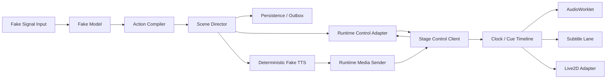
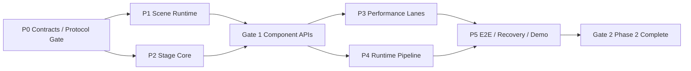

# Bellis Phase 2 开发指南：演出纵向链路

> 历史实施计划，保留原目标与章节编号；当前完成事实见 [Phase 2 参考](../../reference/phase-2.md)，下一步见 [双线路线图](../../plans/README.md)。

> 2026-09-06 架构审查修订：任务所有权、工具恢复事实、调用列表范围、场景终态、Seq 分段预留及 Provider 接缝以 [ADR 0007](../../adr/0007-task-ownership-and-runtime-scope.md) 为准。 本文保留历史决策/实施过程；与新决策冲突的描述不再作为当前实现要求。

> 文档状态：历史实施计划（实现事实见 [Phase 2 完成态参考](../../reference/phase-2.md)，现行命令见 [构建与验收状态](../../guides/build-and-validation.md)）
> 阶段状态：完成\
> 上游基线：[Phase 1 完成态参考](../../reference/phase-1.md)\
> 后续实施：[Phase 3 开发指南](../phase-3/development-guide.md)
> 上位设计：[系统架构设计](../../architecture/overview.md) · [技术选型基线](../../architecture/technology.md)\
> 决策约束：[ADR 0001](../../adr/0001-canonical-core-and-wire-contracts.md) · [ADR 0002](../../adr/0002-node-26-baseline.md) · [ADR 0003](../../adr/0003-phase-2-scene-wire-and-browser-boundary.md)

## 0. 如何使用本文

本文保留阶段二的原始工作包和设计依据。以下是历史实施顺序，不是当前待执行任务；现行行为以完成态参考和稳定协议为准：

1. 先完成 Gate 0 基线检查和 P0 Contracts/协议冻结，解决跨 Runtime/Stage 的契约缺口；
2. P1 Scene Runtime 与 P2 Stage Core 从同一 Gate Commit 并行；
3. 在公开边界复核后实施 P3 演出 Lane 与 P4 Runtime 应用链路；
4. 最后由 P5 统一完成浏览器 E2E、故障验证和 Phase 2 Demo。

规划中的目录、协议名和命令是本阶段的交付目标；只有经过 Gate、实现和测试后，才成为稳定接口。任何与本文不同的跨包或 Wire 决策必须先写 ADR/变更说明。

## 1. 阶段定义

Phase 2 对应 [技术选型基线 §20](../../architecture/technology.md) 的“演出纵向链路”：用 Fake Signal 和 Fake Model 产生 ActionFrame，打通 Action Compiler、Scene Director、Stage、AudioWorklet、字幕与 Live2D Adapter，并验证同步和取消。

它只完成 [系统架构设计 §20 Milestone 1](../../architecture/overview.md) 的确定性演出骨架，不宣称完成 Milestone 1 全部产品能力。真实单 Provider LLM、正式 Signal Hub、流式 TTS Provider 和平台弹幕接入属于 Phase 3 或后续纵向切片。

### 1.1 阶段目标

Phase 2 结束时，一条本地 Fake Signal 必须在无公网、无真实模型、无商业模型资源的条件下完成：

```text
Fake Signal
  → Fake Model / 固定 DecisionPacket
  → ActionFrameSchema 校验
  → Action Compiler 生成 Scene + Cue
  → Scene Director 并行 Prepare
  → Stage / Audio / Subtitle / Avatar Ready Barrier
  → 数据库原子 Commit
  → 未来单调时刻 Commit
  → 音频、字幕、Avatar 同步启动
  → 完成、取消或明确降级
  → Session Records / Trace / Metrics 可审计
```

同时必须证明：紧急 Fake Signal 能安全打断准备中、已调度或播放中的 Scene；Runtime 或 Stage 断线不会让未提交动作执行，也不会在重连后盲目重复已经产生过的外部效果。

### 1.2 完成指标

| 指标 | Phase 2 验收目标 | 说明 |
| --- | --- | --- |
| Audio/Subtitle/Avatar 硬同步 Lane 起始偏差 | ≤ 50 ms | 以同一 Scene 的实际开始回执计算；虚拟时钟测试要求精确顺序，真实 Chromium E2E 使用 50 ms 容差 |
| 取消指令到所有可中断 Lane 停止 | P99 ≤ 100 ms | 包括 Worklet 清空、字幕撤下、Avatar 释放；用确定性测试和浏览器压力测试验证 |
| Commit 前副作用 | 0 | Prepare 可以分配/缓冲资源，但不能播放、显示或触发动作 |
| 同一 `sceneId/cueId` 重试的重复执行 | 0 | 断线和幂等重试必须保持逻辑一次 |
| Control 心跳/取消被媒体压力阻塞 | 0 次 | 持续发送有界 PCM 时仍能处理 Control 高优先级消息 |
| 资源上限 | 全部显式且可测 | Scene、Cue、音频缓冲、字幕段、Avatar 命令、等待者均不得无界增长 |
| 关闭残留 | 0 | 无悬挂 Worker、AudioContext、Worklet、Socket、Timer、RAF 或临时文件 |

Fake Model/TTS 不用于证明真实 Provider 延迟，因此不把“模型请求到首音频 P95 ≤ 900 ms”列为 Phase 2 完成指标；本阶段只记录内部 Prepare/Commit 开销，为 Phase 3 建立基线。

## 2. 明确范围

### 2.1 本阶段实现

- Fake Signal 输入和可重放的 Fake Model/DecisionPacket Fixture；
- 纯函数 Action Compiler；
- Scene Director、同步组 Barrier、Deadline、降级、取消和关闭；
- Runtime 到 Stage 的版本化 Prepare/Ready/Commit/Cancel 协议；
- 浏览器 Stage Shell、本地认证、Control/Media 双连接和时钟校准；
- 确定性 Fake TTS PCM 流、AudioWorklet 播放与有界缓冲；
- 从同一 `SpeechIntent` 生成的字幕时间线；
- Live2D Adapter Port、确定性测试 Adapter，以及可加载已授权 Cubism 资源的浏览器 Adapter 边界；
- Scene 生命周期记录、Trace、Metrics、重连对账和 Phase 2 Snapshot；
- 单元、性质、集成、浏览器和跨进程故障测试；
- `pnpm demo:phase2`。

### 2.2 本阶段不实现

- 真实 LLM/AI SDK Provider、流式模型解析和多 Cycle Tool Loop；
- 真实 TTS Provider、声音克隆、编码器选择或公网语音服务；
- Bilibili/其他平台插件、Audience Batcher 和正式 Signal Hub；
- Tool Runtime、Memory Provider、MCP、Presence Engine 或 Avatar Mixer；
- 游戏输入、Rust Sidecar、OBS 产品化 Overlay 或完整 Studio；
- 插件市场、第三方 UI、Launcher、签名更新和安装包；
- 把 Phase 1 Media WS 改为 WebRTC/WebTransport；
- 为了 Demo 在 Route Handler 中直接编排 Scene，或让 Stage 自行决定业务动作。

## 3. 设计不变量

1. **单一发言来源**：Fake Model 只返回 `DecisionPacket.action.speech`；Fake TTS、字幕和口型都读取同一个 `SpeechIntent`。
2. **编译纯净**：Action Compiler 不访问网络、数据库、Socket、浏览器或墙钟。相同输入、能力快照和 ID 源得到相同结果。
3. **准备不生效**：Prepare 只能验证和缓冲资源。音频播放、字幕显示、Avatar 动作等对用户可见副作用只能在持久化 Commit 成功且到达 `commitAtRuntimeUs` 后开始。
4. **单调时间只用于当前进程**：`commitAtRuntimeUs`、Cue target time 和 Deadline 使用 `bigint` 单调微秒；它们不跨重启持久化为可继续执行的绝对时间。
5. **恢复事实与重新执行分离**：恢复可以说明 Scene 已提交或执行结果不确定，但不得自动重放音频/动作。只有新的显式调度才能产生新副作用。
6. **Runtime 拥有决策权**：Stage 报告能力、Ready 和实际执行结果，不改写 Scene、不补造 Cue、不自行降级硬同步组。
7. **硬同步整组处理**：Hard Lane 未 Ready 时整组等待、明确降级或取消，不能静默缺一个 Lane 仍声称同步成功。
8. **有界与可取消**：每个队列、缓冲、Barrier、异步任务和浏览器循环都有容量、Deadline、Abort 和释放路径。
9. **协议先行**：跨进程/浏览器对象必须来自 `@bellis/contracts`；不得使用 `as` 把未验证 JSON 伪装为类型。
10. **测试与生产同路径**：Fake Adapter 只替换外部能力，不绕开真实 Compiler、Director、Control/Media、Persistence 和 Stage Timeline。

## 4. 目标架构与依赖方向



建议新增目录：

```text
apps/
  runtime/
    src/application/phase-2/
    src/routes/dev-input/          # 仅显式开发/测试装配；生产默认关闭
  stage/
    src/bootstrap/
    src/control/
    src/media/
    src/timeline/
    src/lanes/audio/
    src/lanes/subtitle/
    src/lanes/avatar/
    test/
packages/
  scene-runtime/
    src/compiler/
    src/director/
    src/barrier/
    src/timeline/
    src/index.ts
    test/
scripts/
  phase-2-demo.mjs
```

若 Stage 的可复用浏览器逻辑增长明显，可在 P2 Gate 后提取 `packages/stage-runtime`；不要在开工时提前创建空包。

依赖方向：

```text
contracts
  ↑
observability ← scene-runtime
  ↑                  ↑
transport/persistence│
  ↑                  │
runtime application ─┘

contracts + browser-safe transport client
  ↑
stage
```

约束：

- `scene-runtime` 不依赖 Fastify、WebSocket、SQLite、React 或浏览器 API；
- Stage 不依赖 Persistence，也不读取 Runtime 私有模块；
- Runtime 只通过 `scene-runtime` 包根装配 Compiler/Director；
- `@bellis/testkit` 只出现在 devDependencies；
- 浏览器代码不得把 Node-only 模块打进 Bundle。

## 5. P0：Contracts 与协议冻结

P0 不实现业务链路，先冻结后续工作共同依赖的 Wire 和聚合对象。

### 5.1 必须解决的现有缺口

1. `SceneSchema` 与 `CueSchema` 独立存在，但没有一个跨 Runtime/Stage、可整体校验和持久化的编译结果。
2. 现有 Control 类型只有 `scene.prepared/committed/cancelled` 结果通知，没有真实 Stage 的 Prepare/Ready/Commit/Cancel 命令与回执。
3. 现有 `media.stream.open` 面向 client → server；Phase 2 的音频主要是 Runtime → Stage，必须定义反向 Stream 声明/Ready/关闭语义。
4. `Phase1SessionSnapshotSchema.activeScene` 永远为 `null`，不能承载 Phase 2 对账。
5. `@bellis/transport` 以服务端核心为主，并包含 Node 专用实现；Stage 需要浏览器单调时钟、客户端握手/ACK/Replay 和 Offset Estimator 的安全入口。
6. `commitScene` 当前持久化 `Scene`，没有完整 Cue Plan 和执行状态；Phase 2 必须定义是新增聚合 Payload、兼容扩展还是新 Repository 操作。

### 5.2 推荐契约

名称可在 Gate 评审中调整，但能力不能缺失：

```ts
interface ScenePlan {
  schemaVersion: 1;
  scene: Scene;
  cues: Cue[];
}

type SceneExecutionState =
  | "preparing"
  | "ready"
  | "scheduled"
  | "running"
  | "completed"
  | "cancelled"
  | "failed"
  | "uncertain";

interface StageCapabilities {
  schemaVersion: 1;
  audio: { contentTypes: string[]; maxBufferedUs: string };
  subtitle: { supported: boolean };
  avatar: { adapter: string; motions: string[]; expressions: string[] };
}
```

建议新增而不复用含义冲突的 Control 消息：

| 类型 | 方向 | 目的 |
| --- | --- | --- |
| `stage.capabilities` | stage → runtime | 握手后声明本连接可执行的 Lane 与限制 |
| `scene.prepare` | runtime → stage | 传递 `ScenePlan`、资源描述和 Prepare Deadline，不允许生效 |
| `scene.ready` | stage → runtime | 报告逐 Lane/Cue Ready、不可用原因和准备完成时刻 |
| `scene.commit` | runtime → stage | 传递当前连接代际内的 `commitAtRuntimeUs` |
| `scene.started` | stage → runtime | 报告各 Lane 实际起始时刻，用于偏差指标 |
| `scene.finished` | stage → runtime | 报告逐 Lane 完成/失败结果 |
| `scene.cancel` | runtime → stage | 取消 preparing/scheduled/running Scene |
| `scene.cancel.ack` | stage → runtime | 报告各 Lane 已停止并释放 |
| `media.stream.announce` | runtime → stage | 声明即将发送的 Runtime → Stage Stream |
| `media.stream.ready` | stage → runtime | 确认有界缓冲已建立，允许发送帧 |

Phase 1 的 `scene.prepared/committed/cancelled` 保留为对普通订阅客户端发布的事实通知，不赋予新的命令语义。

### 5.3 时间字段

- Wire 上继续使用非负十进制字符串；核心/Stage 调度层转为 `bigint` 微秒；
- `scene.prepare` 使用 Deadline，不携带立即生效时间；
- `scene.commit.commitAtRuntimeUs` 是 Runtime 当前进程单调时钟域；Stage 通过 Offset Estimator 转成本地目标时刻；
- 每个 `scene.started` Lane 回传 Stage 本地单调时刻和对应的 Runtime 估算时刻；
- 重连后旧 Offset 估计清空，旧 `commitAtRuntimeUs` 失效，不能跨连接代际沿用。

### 5.4 媒体格式基线

Phase 2 默认只要求一种可测试音频格式：48 kHz、mono、signed 16-bit little-endian PCM。建议 `contentType` 固定为一个明确字符串，并在 P0 协议文档中冻结；每帧使用连续 `sequence`、`targetTimeUs`、`durationUs`、`sceneId` 和 `cueId`。

Fake TTS 使用确定性波形，建议 20 ms 一帧。它验证调度、背压、取消和播放，不评价音质。任何压缩编码、重采样矩阵或真实 Provider 专用格式留到独立 ADR。

### 5.5 Snapshot 与持久化

- 新增版本化 Phase 2 Snapshot/联合入口，不改变 `Phase1SessionSnapshotSchema` 的固定语义；
- Snapshot 至少包含最后提交 Scene、活动 Scene 的逻辑状态、结果是否确定、Stage 是否需要重新 Prepare；
- Media Stream 仍不恢复，重连必须重新声明；
- 单调 Commit 时间不持久化为重启后可执行时间；
- ScenePlan、生命周期 Record 和幂等摘要必须足以审计“准备了什么、提交了什么、是否真正开始、为何取消/失败”。

### 5.6 浏览器边界

P0 必须做一次 Browser Bundle Spike：

- 确认哪些 Transport 能力可直接复用；
- 若包根包含 Node-only 依赖，新增明确的 browser export 或客户端包，不复制 Offset/Envelope 算法；
- Stage 单调时钟基于 `performance.now()` 转微秒；
- 禁止浏览器 Bundle 出现 `node:*`、DB、Pino Node transport 或测试工具。

### 5.7 P0 交付

- 新增/修改 Schema、类型和双 dialect 生成物；
- 每个消息方向、成功/失败 Fixture、未知可选字段和版本不兼容测试；
- Control/Binary Media 协议扩展草案；
- ScenePlan 持久化策略和 Migration 兼容说明；
- Browser Bundle Spike 结果；
- 如改变冻结边界，提交 ADR 0003。

P0 验收：

```bash
pnpm contracts:check
pnpm --filter @bellis/contracts typecheck
pnpm --filter @bellis/contracts test
pnpm check
```

## 6. P1：Action Compiler 与 Scene Director

### 6.1 Action Compiler

输入至少包含：经 `ActionFrameSchema` 校验的 ActionFrame、`cycleId`、Stage 能力快照、确定性 ID 源和编译策略。输出为：

```ts
type CompileResult =
  | { kind: "noop" }
  | { kind: "scene"; plan: ScenePlan }
  | { kind: "rejected"; issues: CompileIssue[] };
```

要求：

- `noOp: true` 不伪造空 Scene；
- Speech 同时生成 audio/subtitle Cue，并保持对同一个 SpeechIntent 的引用语义；
- Avatar Intent 只生成语义 motion/expression Cue，不产生帧级参数；
- 不支持的能力在编译期返回稳定 Issue，是否降级由策略决定；
- Cue ID、Group ID 和排序确定性；
- Anchor 必须解析为闭合语法，如 `scene_start`、`speech_start`、`speech.word:<n>`；
- Anchor 引用不存在、Lane 重复冲突、Hard Lane 不可满足、Cue 超上限时拒绝；
- 编译结果再次通过 `ScenePlanSchema`，不依赖 TypeScript 静态类型代替运行期校验。

### 6.2 Scene Director 状态机

```text
created
  → preparing
  → ready
  → committing
  → scheduled
  → running
  → completed

任意允许状态
  → cancelling → cancelled
  → failed

进程/Stage 失联且结果无法证明
  → uncertain
```

要求：

- 每个 Scene 一个根 AbortController，Lane 派生子 Signal；
- Stage 并行启动 Lane 准备并拥有超时/中止，返回有界整包 ready；Runtime Barrier 按 Sync Group 验证结果；
- Hard：全 Ready 才能提交，失败时整组降级或取消；
- Soft：Stage 按 `min(scene.deadlineMs, plan.softTimeoutMs ?? 500)` 限时准备；超时报告 unavailable，不允许迟到准备复活；
- Detached：当前 Compiler 不产出 detached Cue；遥测和记忆写入交给宿主后台任务；
- Commit 前先选择足够未来的 `commitAtRuntimeUs`，再完成数据库原子提交，最后发送 `scene.commit`；
- 如果数据库提交失败，Stage 只收到取消/释放，不得收到 Commit；
- 如果数据库成功但 Commit 消息结果不确定，状态记为 `uncertain`，不得自动重复外部效果；
- 同一 Scene 的状态转换串行化，迟到 Ready/Finished、数据库完成和发送完成均不得复活终态；
- 执行等待缺省 120s 后走取消；无确认时标记 uncertain，不以超时推导效果完成；
- Shutdown 先停止接收新 Scene，再取消/排空，最后关闭 Adapter。

### 6.3 Port 边界

Scene Director 至少依赖抽象 Port：

```ts
interface StagePort {
  prepare(plan: ScenePlan, deadlineUs: bigint, signal: AbortSignal): Promise<StageReady>;
  commit(sceneId: string, commitAtRuntimeUs: bigint, signal: AbortSignal): Promise<void>;
  cancel(sceneId: string, reason: string, signal: AbortSignal): Promise<CancelResult>;
}

interface SceneRepositoryPort {
  commit(input: DurableSceneCommit, signal: AbortSignal): Promise<DurableCommitResult>;
  appendLifecycle(record: SceneLifecycleRecord, signal: AbortSignal): Promise<void>;
}
```

实际命名可调整，但不能注入 Fastify/WebSocket/SQLite 具体对象。Clock、Logger、Metrics 和 ID 源都显式注入。

### 6.4 P1 测试

- 每种 ActionFrame 变体到 ScenePlan 的黄金测试；
- 相同输入重放结果一致的性质测试；
- Cue/Group 上限、Anchor、能力缺失、Hard/Soft/Detached 组合；
- Ready、Deadline、取消和关闭的全部状态转换；
- Commit 失败时零副作用；Commit 回执丢失时进入 `uncertain`；
- 迟到回执、重复回执、乱序回执和旧连接代际回执；
- VirtualClock 下无真实业务时长 sleep；
- 包根导出与依赖边界扫描。

## 7. P2：Stage Core、连接与 Timeline

P2 建立可启动但尚不要求完整演出效果的 Stage：

- Vite + React Stage Shell；
- `/stage/:profile` 路由、启动状态、错误面板和 Audio Arm 入口；
- 使用 Phase 1 本地 Session 的 Control/Media 双连接；
- Client Hello、ACK、Replay Gap/Snapshot、心跳和重连；
- 至少 3 个合格时钟样本后进入 `clock_ready`，重连后重新校准；
- Stage Capabilities 上报；
- Scene Prepare/Commit/Cancel 客户端状态机；
- Cue Timeline 和 Lane Adapter 注册表；
- 所有 Listener、Timer、RAF、Socket 和缓存的统一 `close()`。

### 7.1 Stage 状态

```text
booting → auth_ready → control_ready → clock_ready → performance_ready
                                              ↘ degraded
任意状态 → reconnecting → clock_ready
任意状态 → closing → closed
```

浏览器自动播放限制是正式前置条件：没有用户手势成功 `AudioContext.resume()` 时，Stage 不得宣告 Audio Lane Ready。UI 必须清楚显示“等待启用音频”，E2E 通过真实点击完成 Arm。

### 7.2 Timeline

- Runtime Commit 时间通过当前连接的 Offset Estimate 映射为 Stage 本地时刻；
- Audio 使用 AudioWorklet 的 sample frame 作为播放真相源；
- Subtitle/Avatar 以同一目标时刻调度，不能各自读取 `Date.now()`；
- 主线程长任务后不得补播已经超过容忍窗口的非关键视觉 Cue；
- 每个 Lane 报告 planned/actual start，用于计算 drift；
- Commit 到达过晚时返回稳定 `late_commit`，由 Runtime 决定取消或降级，Stage 不自行猜测。

### 7.3 重连

- 重连清空 Clock Estimate、连接级 Stream 和未 Commit 的准备缓存；
- 已收到 Commit 但执行结果不确定的 Scene 只上报 `uncertain`，不自动重播；
- Snapshot 与本地状态对账后才能接受新 Scene；
- 旧连接 generation 的 Commit/Cancel/Media Frame 全部拒绝。

## 8. P3：Audio、Subtitle 与 Live2D Lane

### 8.1 Fake TTS 与 Media Sender

- 服务依赖 `SpeechProvider.stream(SpeechIntent, AbortSignal)`；开发入口显式注入 Fake Provider，发送器按消费节奏拉取，避免整句连续 PCM 分配；
- 缓冲版 synthesizeSpeech 为已有调用方兼容保留；真实商业 TTS 与 final 前准备是后续能力；
- 波形、分块、时长和 Timing 对相同输入确定；
- 按 Frame Sequence 发送，使用 `targetTimeUs/durationUs`；Sequence 只
  计数到达传输层的帧（限制丢弃/传输拒绝不消耗序号——缺号会被
  Registry 判 sequence_violation 关闭整个 Stream）；
- 发送队列按帧数、字节数和最大未来音频时长三重限制（帧数/字节以
  「已发送未播放」账目执行：播放时刻过去即出账；超过追赶预算的迟到
  帧丢弃重同步并计入 `droppedByLimit`）；未来音频预算跟随
  stage.capabilities.audio.maxBufferedUs 动态更新；
- Stream 生命周期：帧流完成或 Scene 终态即发送 media.stream.closed
  （either-direction）释放 Stage Registry 并发槽位；closed 边界窗口的
  Deadline 使用 Runtime 映射域，1s 驻留期限使用 Stage 本地单调域；
  Stage Client 维持真实到期 Timer（收帧懒扫描仅作兜底），静默连接也会
  清理 frameId/Sequence 水位与待补发关闭状态；
- Control Cancel 优先于 Media 发送，取消后不再产生新帧；
- 不把 PCM、全文或敏感输入写入日志。

### 8.2 AudioWorklet

soft Cue 被 Timeline 迟到丢弃时必须进入 Lane 的结束聚合。scene.started 来自 Worklet 首个有样本的渲染块确认，DOM Lane 在应用后确认；Runtime 汇总各条 Lane 回执后计算偏差。设备物理发声延迟未计入此指标。

- Worklet 内维护有界 PCM 帧块队列；**容量按当前未播占用执行**
  （= maxBufferedUs）——已消费的帧块立即释放，长音频（> maxBufferedUs）
  边播边补不会被截断；下溢输出静音并计数，不复用旧样本（EOS 后耗尽的
  静音是预期尾态，不计下越）；Worklet 放完全部样本时上报 `ended`
  （每 Scene 至多一次）——这是音频 Lane 的**真实完成信号**：
  `start()` 的 Promise 在 ended 回报时兑现（零帧流在 EOS 即完成；ended
  缺失时以「start + 已缓冲时长 + 宽限」为兜底截止，保证 scene.finished
  有界）。closed 到达先进入 closing（100ms 尾帧宽限窗，期间跨连接尾帧
  继续入账），宽限期过后才向 Worklet 转发 EOS 并拒绝后续追加；
- Commit 前即使数据已到达也保持静音；
- Commit 通过 Scene/Cue generation 原子切换播放；
- Cancel 对已生效 Scene 在预算内单调淡出至零并立即释放，对未生效的
  Prepare 缓冲直接释放；主线程与 Worklet 都保留连接代际内的 Cancel
  墓碑，拒绝跨 Control/Media 通道乱序到达的尾帧与迟到 switch，不能
  重建已停止 Scene，也不能影响其他 Scene；
- Worklet 与主线程消息协议版本化，拒绝未知版本和超限 Buffer；
- 单元逻辑可在普通测试环境验证，真实 AudioWorklet 用 Chromium Smoke 验证；
- 若使用 SharedArrayBuffer，必须同时配置并测试 COOP/COEP；Phase 2 不强制采用。

### 8.3 Subtitle Lane

- 文本直接来自同一 SpeechIntent；
- 时间标记优先使用 Fake TTS 产出的句/词边界，不另做文本生成；
- Commit 前不可见，Cancel 后在预算内撤下；
- `start()` 的 Promise 在字幕**真实撤下**时兑现：撤下时刻 = 生效目标
  时刻（Commit 映射锚点）+ 发言总时长（media.stream.closed 边界推导：
  (finalSequence+1) × 20ms，发送侧丢帧不消耗 sequence，故该值即送达
  时长）——**预缓冲提前量不占用 Commit 后的可见时间**（Prepare 期间
  不得产生用户副作用）；时长不可得时保守立即撤下；可见性上限兜底
  保证有界；closed 先于首帧到达时由媒体客户端在首帧验收后补发；
- DOM 内容使用文本节点，禁止把模型文本作为 HTML；
- 处理长文本换行、空白、Emoji、CJK 和 Reduced Motion；
- 字幕实际显示时刻进入 Scene Trace，不记录不必要的全文；
- 可见区间（显示 → 撤下）作为诊断事实保留，供 E2E 断言「实际可见一段时间」。

### 8.4 Live2D Adapter

定义浏览器侧稳定 Port：

```ts
interface AvatarLaneAdapter {
  capabilities(): AvatarCapabilities;
  prepare(cues: readonly Cue[], signal: AbortSignal): Promise<AvatarReady>;
  commit(sceneId: string, atStageUs: bigint): Promise<void>;
  cancel(sceneId: string, fadeMs: number): Promise<void>;
  close(): Promise<void>;
}
```

要求：

- CI 使用 Recording/Fake Adapter 验证命令、顺序、资源释放和 drift；
- 浏览器 Cubism Adapter 只接收语义 motion/expression/channel，不接收 LLM 帧级参数；
- 模型、动作和表达资源在 Prepare 验证，Commit 才生效；
- 动作呈现窗口由意图 `durationMs` 声明（Compiler 透传到 cue intent）：
  `start()` 的 Promise 在窗口结束时兑现（徽标/动作回 idle）——
  scene.finished 不因「start 已发出」而立即上报；
- 未授权 SDK/模型资源不进入仓库；本地手工 Smoke 使用明确配置的已授权资源；
- Phase 2 只建立 Adapter 和基础动作，不实现 Presence Engine/Avatar Mixer；
- 口型若由 PCM RMS/viseme 驱动，属于 Audio 派生 Lane，必须跟随同一 Scene generation 取消。

## 9. P4：Runtime Fake 应用链路与持久化

### 9.1 Fake Signal / Fake Model

- 提供进程内 Application Port 和 Demo Fixture，不默认暴露生产 Fault Route；
- 如提供开发输入 HTTP Route，必须由显式 `development/test` 配置开启、只接受本地认证并从生产构建默认路径关闭；
- Fake Model 返回经 Schema 验证的固定 DecisionPacket，可配置正常、静默、无效、超时和取消场景；
- 固定 Fixture 携带 `sessionId/turnId/cycleId/sceneId/traceId`，支持确定性重放。

### 9.2 Runtime 编排

新增应用服务串联：

```text
validate Signal
  → create/continue Trace
  → Fake Model DecisionPacket
  → Action Compiler
  → Director Prepare
  → durable commitScene/records/outbox
  → Stage Commit
  → collect Started/Finished
```

不要扩展 `FakeSceneCommitService`：它是 Phase 1 协议夹具。Phase 2 创建命名明确的新服务，并在 Phase 2 Demo 稳定后决定 Phase 1 夹具是否继续保留。

### 9.3 持久化与恢复

至少记录：

- Fake Signal accepted；
- DecisionPacket validated/rejected；
- ScenePlan compiled；
- Scene prepare outcome；
- durable committed；
- Stage started/finished/cancelled/failed/uncertain；
- 取消原因和降级策略结果。

所有 Record 使用版本化 Payload Schema。`commitScene` 事务必须保存完整可审计计划或其规范化引用、Watermark、幂等结果和 Outbox。结果回执可以追加，但不能改写历史记录。

Crash Window：

1. Prepare 后、数据库 Commit 前崩溃：Stage 不执行，恢复后释放准备资源；
2. 数据库 Commit 后、Stage Commit 前崩溃：记录为 committed/uncertain，不自动播放；
3. Stage 已开始、Runtime 收到 started 前崩溃：恢复为 uncertain，通过新连接对账，不自动重播；
4. Cancel 发送后、Ack 前断线：保持 cancelling/uncertain，Stage 本地连接关闭必须触发安全释放。

## 10. P5：集成、浏览器 E2E 与 Demo

### 10.1 测试层次

- **Schema/协议**：Zod、双 JSON Schema dialect、方向白名单和文档 Fixture；
- **纯逻辑**：Compiler、Barrier、Director、Timeline、Ring Buffer、字幕分段、Avatar Adapter；
- **性质测试**：确定性编译、状态机终态不复活、有界缓冲、取消幂等、时钟映射；
- **Node 集成**：Runtime + Control/Media + DB Worker + Fake Stage Port；
- **浏览器集成**：真实 Chromium + Stage + WebSocket + AudioContext/Worklet；
- **跨进程恢复**：Runtime/Stage 断线和上述四个 Crash Window；
- **压力测试**：Media 连续发送、主线程长任务、重复/乱序回执、慢 Stage 和关闭竞态。

确定性逻辑测试使用 `VirtualClock`。浏览器真实 API 无法完全虚拟化的部分使用短时、有明确容差的 Smoke，不能把长业务等待塞进常规测试。

### 10.2 Phase 2 Demo 与故障验证（完成态分工）

Phase 2 验收由三个互补命令承担（全部自动、无公网、失败非零退出、
成功/失败均清理临时资源）：

- `pnpm demo:phase2`——协议级纵向链路（真实 Runtime 子进程 + 真实
  Control/Media WebSocket + 真实 DB Worker；协议客户端扮演 Stage）：
  握手/时钟校准、announce → ready → 真实 PCM 帧流（BELL v1 解析、
  sequence 严格连续、20ms 等差、RMS > 0、预缓冲达标才宣告 audio
  ready）、durable Commit、三 Lane 回执、紧急打断（取消时延 +
  停流）、Crash 后同目录重启不重复执行、全链路 Trace 连续性
  （Signal 提交根 == Control 线上 announce/prepare/commit/cancel ==
  Media 帧头 == DB Record 四类证据 + 真实 sessionId）；
- `pnpm demo:phase2:crash`——四个关键 Crash Window 定向覆盖 +
  同进程断连的 Snapshot v2（uncertain + requiresReprepare）：
  W1 Prepare 后/DB Commit 前（未落库、无重放、v1）、W2 DB Commit 后/
  Stage Commit 前（durable 落库、commit 不外泄、不补发；重启返回
  v2 uncertain 对账视图）、W3 Stage 已收到 Commit/started 前（无重放；
  v2 uncertain）、W4 Cancel 已入队/Ack 前（崩溃前必须真实观察到
  cancel；至多重放一次）；
- `pnpm test:browser`——真实 Chromium E2E（真实用户手势 Arm、真实
  AudioContext/AudioWorklet、Vite dev 源路径）：认证 → 时钟校准 →
  预缓冲 ≥6 帧 → 三 Lane 到点生效 → 浏览器级偏差 ≤50ms（实测
  ~3ms）→ 真实完成信号（运行时长 ≈ 语音时长、字幕实际可见区间、
  Commit 后音频能量 AnalyserNode RMS 采样）→ MutationObserver 打断
  时延（预算 100ms，实测 ~2ms）→ 打断后停流；teardown 严格化
  （Runtime 优雅关闭超时/非零退出码、Vite 退不出均判失败）。

`pnpm demo:phase2` 成功输出至少包含：

```text
protocolVersion=1
stageHandshake=ok(control+media)
clockCalibration=ok
actionFrame=validated
mediaAnnounce=ok
mediaPrebuffer=ok
scenePlan=compiled
prepareBarrier=ready(audio=prebuffered6)
sceneCommit=durable
sceneOutcome=completed(audio+subtitle+avatar)
hardLaneSkewMs=<number <= 50>(protocol)
mediaFrames=<N>(sequence=strict,pacing=20ms,rms>0)
interruptLatencyMs=<number <= 100>
mediaStopOnCancel=ok
traceContinuity=ok
recoveryDuplicateEffects=0
watermarkRestored=ok
shutdownClean=ok
```

`pnpm test:browser` 成功输出至少包含：

```text
audioWorklet=started(frames=<N>)
subtitle=visible(textNodes,releasedOnFinish)
avatarAdapter=started(commands=<N>)
hardLaneSkewMs=<number <= 50>(browser)
underruns=<number <= 8>
presentation=real(runMs≈语音时长, visibleMs≈语音时长, loudSamples≥20)
interruptLatencyMs=<number <= 100 + 观测余量>(browser)
streamMarathon=ok(scenes=9+, opened>=11, rejected=0)
```

### 10.3 阶段完成命令

以下是 Phase 2 的复验命令。CI 通过 `pnpm check` 与 `pnpm test:acceptance` 执行构建、基础检查及 Phase 1–3 阶段回归；一次本地通过不代替双平台 CI 结果：

```bash
pnpm install --frozen-lockfile
pnpm --filter @bellis/stage exec playwright install chromium  # 首次运行/浏览器版本更新时
pnpm check          # typecheck + lint + format + 全部单测/集成/性质测试
pnpm build
pnpm contracts:check
pnpm test:browser   # 真实 Chromium E2E
pnpm demo:phase1    # Phase 1 行为回归（必须持续通过）
pnpm demo:phase2    # 协议级纵向链路 + 真实媒体帧流
pnpm demo:phase2:crash  # 四个 Crash Window + Snapshot v2
```

Phase 1 Demo 必须继续通过，证明兼容扩展没有破坏基础协议和恢复语义。

## 11. 工作包、依赖与文件所有权



| 工作包 | 主要修改范围 | 只读/依赖边界 |
| --- | --- | --- |
| P0 | `packages/contracts/**`、协议文档、必要 ADR、Browser Spike | 不实现 Director/Stage 业务 |
| P1 | `packages/scene-runtime/**` | 只依赖包根 Contracts/Observability，不修改 Runtime/Stage |
| P2 | `apps/stage/**` 的 bootstrap/control/media/timeline 骨架、根前端配置 | 不修改 Scene Runtime/Persistence |
| P3 | Stage audio/subtitle/avatar Lane、必要的授权资源装配说明 | 不改变 P1 状态机；与 P2 顺序交接 |
| P4 | `apps/runtime/**` Phase 2 application、必要 Persistence 扩展 | 不把领域逻辑写进 Route/WS Handler |
| P5 | `scripts/demos/phase-2-demo.mjs`、E2E/恢复 Harness、CI 与根脚本 | 只通过各包公开入口集成 |

并行任务必须从同一 Gate Commit 开始。跨所有权变更先报告当前接口、阻塞原因、最小变更、兼容影响和验证方式。

## 12. Gate 清单

### 12.1 Gate 0：Phase 1 基线

- 工作树状态已确认，未覆盖用户未提交修改；
- `pnpm install --frozen-lockfile
pnpm --filter @bellis/stage exec playwright install chromium  # 首次运行/浏览器版本更新时`、`pnpm check`、`pnpm build`、`pnpm demo:phase1` 通过；
- Node/Package Manager 与 ADR 0002 一致；
- Phase 1 稳定协议和公开入口已阅读。

### 12.2 Gate 1：Contracts 与组件 API

- ScenePlan、Stage Capabilities、Scene 生命周期消息与 Snapshot 已版本化；
- Runtime → Stage Media Stream 方向和资源限制无歧义；
- 浏览器 Bundle 无 Node-only 泄漏；
- Compiler 为纯函数，Director/Stage 只通过 Port 交互；
- 所有队列、Barrier、媒体缓冲和连接都有上限/Abort/Close；
- P1/P2 包级测试通过，公开 API 足够，未暴露 Socket/Timer/可变集合。

### 12.3 Gate 2：Phase 2 完成

- Fake Signal 到三条演出 Lane 的真实纵向路径通过；
- Commit 前零副作用、Hard Lane 偏差、取消延迟满足指标；
- 四个 Crash Window 的结果与文档一致；
- Phase 2 Snapshot/重连不自动重复副作用；
- 日志 Redaction Canary、低基数 Metrics 和 Trace Continuity 通过；
- `pnpm check`、`build`、`test:browser`、Phase 1/2 Demo 全部通过；
- 浏览器、Runtime、Worker、Socket、AudioContext、Worklet、Timer 和临时目录干净关闭；
- 稳定协议文档已经从“规划”更新为“实现事实”，Phase 2 完成态参考可由本文压缩生成。

## 13. Metrics 与 Trace（完成态）

Phase 2 指标定义（不重命名 Phase 1 指标）。Runtime 侧五项已注册于
`@bellis/observability` 指标目录并由 Director/PerformanceService 发射；
`bellis_stage_*` 为 Stage 侧指标，Phase 2 以浏览器 E2E 证据行
（underruns/skew/interruptLatency）承载，Stage 指标上报通道属后续阶段：

- `bellis_scene_prepare_duration_ms{result}`（已注册/已发射）；
- `bellis_scene_barrier_wait_ms{level,result}`（已注册/已发射）；
- `bellis_scene_start_skew_ms{lane}`（已注册/已发射）；
- `bellis_scene_cancel_latency_ms{lane,result}`（已注册；取消链路时延
  现由 Demo/E2E 证据行验证，Lane 维度发射随 Stage 回执细化接入）；
- `bellis_stage_clock_rtt_us{result}`（Stage 侧，后续阶段）；
- `bellis_stage_clock_offset_jitter_us`（Stage 侧，后续阶段）；
- `bellis_stage_audio_buffer_us`（Stage 侧；E2E 以 bufferedFrames 断言）；
- `bellis_stage_audio_underrun_total`（Stage 侧；E2E 以 underruns 断言）；
- `bellis_stage_reconnect_total{reason}`（Stage 侧，后续阶段）；
- `bellis_scene_execution_total{result}`（已注册/已发射）。

允许的 Label 必须是闭合集合；禁止 `sessionId/turnId/cycleId/sceneId/cueId/traceId` 作为 Label。这些身份只进入 Trace/结构化日志字段。

统一 Trace 字段：

```text
sessionId / turnId / cycleId / sceneId / cueId / streamId / traceId
```

关键 Span：Fake Model、Compile、Prepare fan-out、Barrier、DB Commit、Control Commit、每个 Lane Start/Finish/Cancel、Recovery Reconcile。

## 14. 安全与失败策略

- Runtime/Stage 继续只监听/访问 loopback，并执行 Host、Origin、Cookie/Session 校验；
- 开发输入与 Fault Hook 默认关闭，生产装配不可达；
- 模型文本以纯文本渲染，不进入 `innerHTML`；
- Live2D/音频资源路径经过 Profile 白名单和大小限制，不允许任意远程 URL；
- Control 错误只返回稳定机器码与安全文案；
- 日志不记录 Cookie、Token、PCM、完整 Prompt/Decision 文本或本地敏感路径；
- Stage 失联、Audio 未 Arm、Clock 未校准、Hard Lane 未 Ready、Commit 过晚时默认安全取消；
- 取消/关闭失败不得阻塞安全释放，最终进入 failed/uncertain 并记录证据。

## 15. 拒绝合入条件

出现以下任一情况不得合入：

- 为 Stage 复制 Contracts、Offset 算法或服务端协议类型；
- 使用 `Date.now()`、浮点毫秒或 JSON `number` 决定 Cue 顺序和同步；
- Commit 前播放音频、显示字幕或触发 Avatar；
- 把 Scene Director 写进 Fastify Route、WebSocket 回调或 React Component；
- Stage 自行补造 Cue、改变 Hard Group 或决定业务降级；
- 使用无界 PCM/消息/回执/字幕/动作队列；
- AudioWorklet 未 Arm 却报告 Ready；
- 重连后沿用旧时钟偏移、旧 Stream 或自动重播 uncertain Scene；
- 用真实公网 Provider、真实直播平台或未授权 Live2D 资源作为 CI 前置；
- 只用 Mock 验证协议，未经过真实 WebSocket、DB Worker 和 Chromium；
- 用长时间真实 sleep 代替 VirtualClock/确定性状态测试；
- 新增协议未更新双 dialect Schema、Fixture、协议文档和兼容说明；
- Phase 2 通过但 `pnpm demo:phase1` 回归失败。

## 16. 统一交付格式

每个工作包交付时报告：

```text
任务：Phase 2 / P?
状态：完成 / 部分完成 / 阻塞

基线：
- 起始 Commit
- Gate 检查结果

实现：
- 完成的能力与状态机
- 资源上限、Deadline、Abort 和关闭语义

公开接口：
- 新增/修改的包根导出、Schema、协议和命令
- 兼容性说明与 ADR

验证：
- 命令与结果
- 同步、取消、故障/恢复或浏览器证据

风险与后续：
- 已知限制
- 下一工作包必须处理的事项

Git：
- 分支、Commit、修改范围
```

部分完成必须列出剩余项和可复现阻塞条件。占位实现、跳过测试、空成功脚本或扩大 TODO 不算交付。
