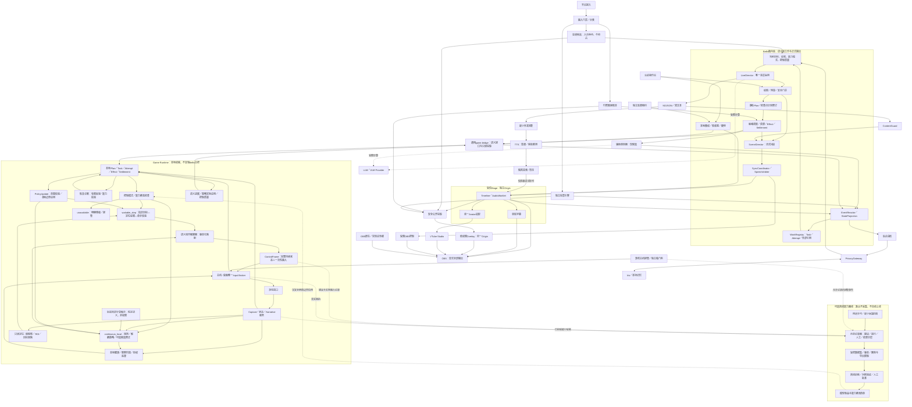

## 3. 总体架构

> 冻结的后续阶段设计，不参与生成与校验；现行部分见 [docs/spec/03-architecture.md](../../spec/03-architecture.md)。

### 3.4 领域控制器内部职责

| 职责 | 作用 | 边界 |
|---|---|---|
| PolicyBackend | 在已授权目标下选择短动作；按后端声明复用语义编码、更新视觉状态，必要时对未提交连续候选做有界修正 | 没有自由目标采用、对观众播报、Iris直写或签发输入许可的权力 |
| SemanticActionInterpreter | 将明确的SemanticAction及适用证据编译为受限ControlFrame；检查profile／单位和组合冲突 | 不隐藏定位、候选编辑、重新规划或恢复决策 |
| InputBroker | 校验owner、上下文、时效、去重，提交／清理输入并提供真实已提交前缀 | 不执行模型自由决策；接纳或提交不等于游戏成功 |
| 只读定位适配器 | 基于指定目标和根截图选择区域、定位、回映坐标，产生GroundingResult | 不修改投票赢家、不驱动设备、不签发affordance |
| 恢复诊断职责 | 从既有Goal／Journal／证据形成ReflectionRecord与RecoveryProposal | 不自建权威记忆、不直接回滚世界，不阻塞安全停止 |

持续把目标保持在中央属于闭环控制器；镜头转动一个有限增量才属于动作解释器。界面控制器内部用VLM选择下一步，不等于另开高层Agent：其目标、动作集合、风险范围、费用和退出条件均已经受主控/运行时限制。具体协议见D05系列决定（第2.2节）。

### 3.8 逻辑拓扑

#### 组件关系图

图中Game Runtime内部的Controller/PolicyUpdate状态由游戏侧权威维护，Bellis只接外部引用、语义事件和状态投影。离线数据路线没有输入授权、正式发言或Iris直接写入权；图中虚线不表示默认开启采集。模型制品箭头只表示批准后的部署，不表示在线自动改权重。

### 3.9 插件清单与能力归属

#### 控制相关能力的归属

| 扩展 | 归属 | Bellis插件暴露内容 |
|---|---|---|
| ControlCapability与模式选择 | Game Runtime＋ControllerManifest；宿主保留通用Schema和质量门槛 | get_control_capabilities、模式/覆盖/不可用原因 |
| 细动作解释与ControlFrame合成 | Game Pack／控制器内部受信模块 | action_schema/profile版本及语义摘要，不暴露无限键鼠 |
| 本地快策略与局部预测 | Controller的可选PolicyBackend | 后端版本、时延范围、适用条件和验证报告 |
| PolicyPatch | 游戏侧校验与应用，Bellis主控采用提议 | propose_policy_patch、get_policy_update、cancel_policy_update、五种终态事件 |
| 控制健康与输入续租 | 游戏侧监督器＋Broker | control_quality／degraded／takeover_required投影 |
| 控制指标与示范记录 | 游戏Recorder与独立离线工具 | 经过权限过滤的报告/引用，不广播原始逐帧数据 |

上述不是六个独立的Bellis自治插件。一个通用game.bridge足够连接不同Game Pack；包、进程与算法可以分开演进，公开语义不能随实现私有字段漂移。

### 3.11 局部计算职责的部署与权威边界

定位器、编码缓存、候选编辑和恢复诊断优先作为现有Worker、PolicyBackend或RecoveryCoordinator的内部模块实现，不因名称新增进程。图中的GR与诊断之间传递只读依据和候选，不是两个互相等待资源的执行owner。

| 所属边界 | 保存／计算的内容 | 对外可见方式 |
|---|---|---|
| Game Runtime | 根视觉证据、DerivedView、GroundingResult、执行前缀、候选及修正决策 | Bridge按权限返回引用与语义摘要；高频内部轨迹不唤醒主控 |
| 当前计算Worker | ComputeArtifact及其精确依赖、容量和过期策略 | 可丢弃的局部缓存；命中和失效只作有界遥测 |
| Task/Recovery职责 | 失败诊断、可用反思项、恢复提议和已执行恢复的证据 | 既有Task结果、artifact.available和登记的恢复结果事件 |
| Bellis Host | 目标采用、任务/结果/结算、公开表达与外部投影 | 不复制游戏本地控制循环或第二个输入账本 |

高分辨率定位只在必要页面调用；稳定语义按变更重新编码；连续控制依时限选择简单或学习后端；恢复审查在停滞／失败／显式请求时运行。不存在“每次点击先串行跑四篇论文”的默认路径。
