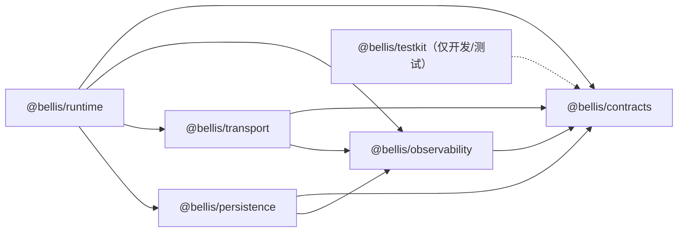
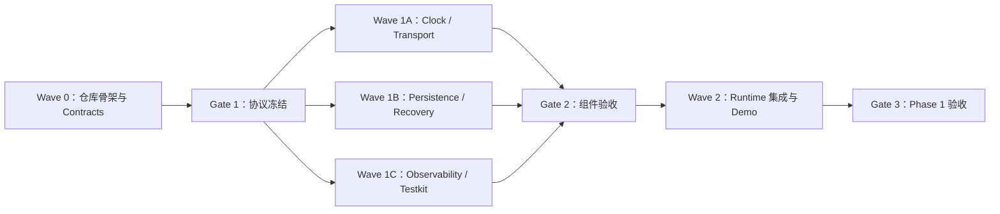

# Bellis Autonomous Live：第一阶段构建指导

> 文档状态：可执行实施基线 v1
>
> 阶段名称：Phase 1 — 基础协议
>
> 目标读者：负责实现、集成、测试和评审的开发 Agent
>
> 关联文档：[系统架构设计](./architecture-plan.md) · [技术选型基线](./technology-selection.md)
>
> 本阶段结束条件：基础协议、时间、传输、持久化和恢复底座全部可运行，并通过本文定义的验收门槛。

P0 / Gate 1 之后的独立 Agent 执行文档见 [Phase 1 剩余开发任务索引](./phase-1/README.md)。

## 0. 如何使用本文

本文不是新的架构设计，而是把已冻结的架构和技术选型转换成可直接执行的工程任务。

执行优先级如下：

1. `architecture-plan.md` 第 23 节的不可破坏约束。
2. `technology-selection.md` 第 21 节的立项冻结项。
3. 本文的阶段范围、接口约定、任务边界和验收标准。
4. Agent 在具体代码层面的局部实现选择。

如果实现过程中发现前三项互相冲突，立即停止扩展实现，创建 ADR 草案并交给项目负责人决策。Agent 不得用“先做出来再说”的方式暗中改变协议、技术栈或能力所有权。

每个执行 Agent 开工前必须至少阅读：

- `architecture-plan.md`：第 3、4、5、9、16、17、21、23 节。
- `technology-selection.md`：第 3、4、5、9.3、10、15、16、17、20、21 节。
- `adr/0001-canonical-core-and-wire-contracts.md`：完整阅读。
- 本文全部内容。

## 1. 阶段定义

### 1.1 本文中的“第一阶段”

本文的第一阶段特指 `technology-selection.md` 第 20 节的“阶段一：基础协议”，不是完整的产品体验 Milestone 1。

本阶段要建立一个真实可运行的本地 Runtime 底座，使下一阶段可以直接接入 Fake Signal、Fake Model、Stage、TTS、字幕和 Live2D，而不再返工基础协议。

阶段结束时应能证明以下链路：

```text
测试客户端
  → 本地 Runtime / REST
  → Control WebSocket 建连、握手、时钟同步和有序消息
  → Binary Media WebSocket 传递带元数据的测试二进制帧
  → 将模拟 Scene Commit、Signal Watermark 和 Outbox 原子写入 SQLite
  → Runtime 重启
  → 恢复已提交事实，不恢复未提交副作用
  → Trace ID 串联日志、协议消息和 Session Record
```

### 1.2 阶段目标

本阶段必须完成：

- 建立 pnpm Monorepo、Node.js 26（ADR 0002）、TypeScript 7.x、ESM 和严格类型基线。
- 建立唯一的版本化协议源 `packages/contracts`。
- 固定 JSON、WebSocket 和持久化边界上的 ID、时间、序号、版本与错误格式。
- 实现 Runtime 单调时钟、浏览器可用的时钟同步协议和确定性 Virtual Clock。
- 实现 Fastify Runtime 边缘、Control WebSocket 和 Binary Media WebSocket。
- 实现 SQLite DB Worker、版本化 Migration、Session Records 和 Outbox。
- 实现 Scene Commit、Signal Watermark 与 Outbox 的原子提交方法。
- 实现最小 Trace 上下文传播、结构化日志和关键阶段指标钩子。
- 建立单元、协议、集成、恢复和故障测试。
- 提供一个无需真实外部 Provider 的 Phase 1 演示命令。

### 1.3 明确不在本阶段实现

以下能力不得进入第一阶段关键路径：

- 真实 LLM Provider、Prompt、Decision Loop 和模型流解析。
- 真实弹幕平台和 Audience Batcher。
- Tool DAG、Memory Provider 或 MCP Adapter。
- TTS 合成、AudioWorklet 播放和真实音频编码。
- Live2D SDK、Avatar Mixer 和 Presence Engine。
- Game Sidecar、键鼠输入或游戏技能。
- Studio、Stage、Overlay 的正式 UI。
- Launcher、系统密钥存储、更新和安装包。
- 第三方插件安装、签名和热重载。

允许使用 Fake 数据和测试客户端验证未来协议，但不得为尚未进入本阶段的能力构建半成品业务框架。

### 1.4 排期口径

Phase 1 是后续阶段共同依赖的协议与恢复底座，范围包含三个 Gate 和真实 Crash Window 验证，不按“一个普通冲刺”承诺。排期应分别估算 P0、并行的 P1/P2/P3、P4 集成以及 Gate 修复缓冲；任一 Gate 未通过时不得用压缩验证范围换取名义进度。

## 2. 阶段完成定义

只有同时满足以下条件，Phase 1 才能标记为完成：

1. 从全新克隆执行 `pnpm install --frozen-lockfile`、`pnpm check` 和 `pnpm build` 全部成功。
2. Runtime 只监听 `127.0.0.1:17890`，健康检查、就绪检查和版本接口可用。
3. Control WebSocket 完成版本协商、身份校验、序号、ACK、心跳和时钟同步。
4. Binary Media WebSocket 只接受合法二进制帧，非法 Header、超限 Payload 和未知 Stream 会被明确拒绝。
5. 任何传输边界输入都先经过 Schema 校验，Route Handler 内没有领域逻辑。
6. Runtime 调度只使用单调时钟；Virtual Clock 测试不依赖真实等待。
7. 所有 SQLite 操作均在 DB Worker 中执行，Runtime 主事件循环不导入或调用 `node:sqlite`。
8. `scene_committed`、Signal Watermark 和 Outbox 在同一数据库事务中写入。
9. 重复提交相同幂等键不会创建第二个 Scene、记录或 Outbox 副作用。
10. Runtime 被强制终止再启动后，只恢复已提交事实；过期 Outbox Lease 能重新领取。
11. `traceId / sessionId / turnId / cycleId / sceneId / cueId / toolRunId` 的已存在部分能贯穿协议、日志和记录。
12. Windows 11 与开发平台的 CI 均通过，不依赖真实模型、TTS、Live2D 或外部网络。
13. 所有本阶段协议都有文档、Schema、兼容性测试和至少一个失败示例。
14. 工作区没有密钥、测试数据库、运行日志、构建产物或用户本地文件被误提交。

## 3. 冻结工程决策

### 3.1 不允许 Agent 自行替换

| 领域 | 冻结选择 | 本阶段约束 |
| --- | --- | --- |
| Runtime | Node.js 26，最低 26.5（ADR 0002） | `engines.node` 固定 `>=26.5 <27`，`.node-version` 与 CI 固定 26.5.0 |
| 语言 | TypeScript 7.x、ESM | 全部业务包使用 `type: module` |
| Monorepo | pnpm Workspace | 只维护一个根 lockfile |
| Lint / Format | Oxlint + Oxfmt | P0 固定版本并完成 Windows/macOS 兼容验证 |
| API | Fastify 5.10.x | Handler 只做边界工作 |
| Schema | Zod 4 | 类型由 Schema 推导，不复制手写接口 |
| 外部 JSON Schema | 2020-12 + Draft 7 | 两种 target 独立生成、测试和漂移检查 |
| 本地通信 | REST + WebSocket | 本阶段不引入 WebRTC/WebTransport |
| 数据库 | SQLite WAL + `node:sqlite` | 只能由 DB Worker 使用 |
| 日志与追踪 | Pino + OpenTelemetry | 本阶段至少完成上下文传播和本地导出接口 |
| 测试 | Vitest + fast-check | 协议和不变量必须自动验证 |

如确实需要新增一个未冻结的普通工程依赖，Agent 必须在任务交付说明中写明：用途、替代方案、包体/运行时影响和是否进入公开协议。新增框架、Runtime、数据库或 Agent Loop 所有者必须先写 ADR，不能直接安装。

### 3.2 代码质量基线

- 开启 `strict`、`noUncheckedIndexedAccess`、`exactOptionalPropertyTypes`、`noImplicitOverride` 和 `useUnknownInCatchVariables`。
- 禁止以 `any` 穿过模块边界；边界数据初始类型一律为 `unknown`。
- 禁止用非空断言掩盖协议解析问题。
- 公共导出必须从包根 `index.ts` 暴露，禁止跨包读取其他包的 `src` 私有路径。
- 生产代码不得使用测试专用全局状态或真实墙上时间模拟单调调度。
- 错误必须保留 `cause`，日志不能包含密钥、Cookie、完整授权头或未经处理的用户隐私数据。
- 所有超时和后台任务必须可取消或有明确生命周期拥有者。

## 4. 目标目录与依赖方向

第一阶段只创建当前需要的目录，不用提前生成所有未来插件的空壳。

```text
apps/
  runtime/
    src/
      application/        # 用例编排，不包含 Fastify 细节
      bootstrap/          # 配置、依赖装配和生命周期
      routes/             # REST 边界
      websocket/          # Control/Media 连接适配
      index.ts
    test/

packages/
  contracts/
    src/
      common/
      signal/
      decision/
      scene/
      session/
      transport/
      errors/
      index.ts
    generated/
      json-schema-2020-12/
      json-schema-draft-07/
    test/

  observability/
    src/
      trace-context.ts
      logger.ts
      metrics.ts
      index.ts
    test/

  transport/
    src/
      clock/
      control/
      media/
      backpressure/
      index.ts
    test/

  persistence/
    src/
      client/
      worker/
      migrations/
      repositories/
      outbox/
      index.ts
    test/

  testkit/
    src/
      virtual-clock.ts
      ids.ts
      temp-store.ts
      index.ts

docs/
  protocols/
    control-websocket.md
    binary-media-websocket.md
    persistence-and-recovery.md
  adr/

scripts/
  check-generated-contracts.mjs
  verify-runtime-baseline.mjs
  phase-1-demo.mjs
```

内部依赖必须保持单向：



禁止出现以下依赖：

- `contracts` 依赖任何其他项目包。
- `persistence` 依赖 `runtime` 或 `transport`。
- `transport` 直接访问数据库。
- Runtime Route Handler 直接执行 SQL。
- 任意包反向导入 `apps/runtime`。
- 生产包依赖 `testkit`。

## 5. Monorepo 初始化规范

### 5.1 根配置

根目录至少包含：

- `package.json`
- `pnpm-workspace.yaml`
- `pnpm-lock.yaml`
- `tsconfig.base.json`
- `tsconfig.json`，使用 Project References
- 统一 lint 与 format 配置
- `.editorconfig`
- `.gitignore`
- CI 配置

根脚本统一为：

```json
{
  "scripts": {
    "build": "pnpm -r --if-present build",
    "typecheck": "pnpm -r --if-present typecheck",
    "lint": "pnpm -r --if-present lint",
    "format:check": "pnpm -r --if-present format:check",
    "test": "pnpm -r --if-present test",
    "test:integration": "pnpm -r --if-present test:integration",
    "contracts:check": "node scripts/check-generated-contracts.mjs",
    "runtime:check": "node scripts/verify-runtime-baseline.mjs",
    "check": "pnpm runtime:check && pnpm typecheck && pnpm lint && pnpm format:check && pnpm contracts:check && pnpm test && pnpm test:integration",
    "demo:phase1": "node scripts/phase-1-demo.mjs"
  }
}
```

Lint/format 固定使用 Oxlint + Oxfmt。TypeScript 7 已正式发布，但本文修订时 `typescript-eslint` 官方支持范围仍是 `>=4.8.4 <6.1.0`，因此 Phase 1 不使用它，也不通过关闭版本警告强行兼容。

P0 必须完成工具链 Spike 并给出明确结论：

- 固定 TypeScript、Oxlint、Oxfmt 的完整版本。
- `tsc -b` 仍是类型检查和 declaration emit 的唯一真相源。
- Oxlint 先启用稳定的 correctness/suspicious 规则；选定的 type-aware 规则只有在 `oxlint-tsgolint` 与当前 TS 7 配置在 Windows/macOS 都通过后才启用。
- 不启用 Oxlint 仍属实验性的完整 `--type-check` 来替代 `tsc -b`。
- `lint`、`format:check` 和 `typecheck` 在两平台输出一致且不会隐式修改文件。
- 结果记录在 Gate 1 交付说明；任一工具无法解析项目 TS 7 代码或配置时，P0 阻塞并提交 ADR，不得静默降级 TypeScript、跳过 lint 或换回未受支持的 parser。

### 5.2 包规范

- 包名使用 `@bellis/*`。
- 所有包声明 `type: module`。
- 使用 `exports` 明确公开入口。
- 包间依赖使用 `workspace:*`。
- 生产构建输出到各包 `dist/`，源码和构建产物不混放。
- 后端使用 `tsc -b`，不做单文件 Bundle。
- 测试文件不进入生产 `dist`。
- `packageManager` 固定创建仓库时实际使用的 pnpm 完整版本。

### 5.3 CI 最小矩阵

CI 至少覆盖：

- Windows 11 / 固定 Node.js 26 补丁版本：正式支持门槛。
- macOS / 同一 Node.js 26 补丁版本：当前开发门槛。

验证基线为 Node.js 26.5.0（[ADR 0002](./adr/0002-node-26-baseline.md)），最低不得低于 26.5.0；仓库版本文件（`.node-version`）、CI 和发布清单必须使用同一个完整版本。CI 使用 frozen lockfile，不访问真实外部服务。测试产生的数据库和日志必须写入临时目录并在 Job 结束时清理。

`verify-runtime-baseline.mjs` 必须通过短生命周期 Worker 导入和操作 `node:sqlite`，不能在主线程绕过 DB Worker 原则；脚本同时捕获 Worker `stderr`、输出 Node/SQLite 版本，并对两平台行为做相同断言。

## 6. Contracts：唯一协议源

### 6.1 总体规则

`packages/contracts` 中的 Zod Schema 是 TypeScript 领域类型、REST、WebSocket 和持久化 Payload 的唯一真相来源。

本节是跨模块协议的实现基线。`architecture-plan.md` 和 `technology-selection.md` 中的 `DecisionPacket` 与 Envelope 示例已同步为本节形态；后续若仍发现示例差异，以 Contracts 和 ADR 0001 为准，并立即回写上游文档，不能以“示例不算协议”为由长期保留漂移。

每个公开 Schema 必须具备：

- 显式 `schemaVersion`。
- 成功样例和失败样例。
- `safeParse` 边界测试。
- JSON Schema 2020-12 与 Draft 7 两套生成物。
- 明确的向后兼容规则。

不得维护“Zod Schema + 手写 interface + 另一份 JSON Schema”三份来源。TypeScript 类型使用 `z.infer` 推导。生成器必须从同一 Zod Schema 分别输出 `json-schema-2020-12/` 和 `json-schema-draft-07/`：前者供 OpenAPI 3.1 和对外契约，后者供 Fastify/Ajv 运行期验证以及后续 LLM Tool。两套生成物作为可审查产物提交，由 `contracts:check` 分别防止漂移，并用同一组合法/非法 Fixture 验证语义一致。

### 6.2 ID、数字与时间

第一阶段统一规则：

| 字段类型 | 内部表示 | JSON/WS 表示 | 说明 |
| --- | --- | --- | --- |
| 实体 ID | `string` | `string` | 使用 UUID，不从时间推断顺序 |
| `traceId` | `string` | 32 位小写十六进制 | 对齐 W3C Trace Context |
| `spanId` | `string` | 16 位小写十六进制 | 可选传播，不替代业务 ID |
| 墙上事实时间 | `number` | JSON number | Unix epoch milliseconds，用于事件发生时间、审计和展示 |
| 单调时间 | `bigint` | 十进制字符串 | 字段后缀 `Us`，单位微秒 |
| 序号/水位 | `bigint` | 十进制字符串 | 禁止用 JSON number 避免精度丢失 |
| 持久化提交时间 | `number` | SQLite INTEGER | Unix epoch milliseconds，字段后缀 `AtMs`，不决定恢复顺序 |
| 持久化截止时间 | `number` | SQLite INTEGER | 仅用于必须跨重启的 Outbox 调度，由 DB Worker 按 §9.4 规则比较 |

`bigint` 不直接进入 `JSON.stringify`。Contracts 提供单一的编码/解码 Helper，把非负十进制字符串转换为内部 `bigint`，并拒绝负数、小数、指数、前导符号和超限输入。

Runtime 内：

- 调度时间来自 `process.hrtime.bigint()` 转换后的微秒值。
- `Date.now()` 用于 `occurredAt`、日志日期和用户展示；唯一调度例外是 DB Worker 为跨重启 Outbox 时间建立启动 epoch 锚点，具体限制见 §9.4。
- 禁止比较不同进程的原始单调时间；必须先经过时钟偏移映射。
- `state.db` 不保存用于恢复判断的单调时间。若 `telemetry.db` 为调试保留单调采样，必须同时保存 `runtimeInstanceId` 并标记为“仅诊断，禁止跨实例比较”。

### 6.3 第一阶段必须落地的 Schema

至少定义并导出：

```ts
TraceContextSchema
ErrorEnvelopeSchema
SignalSchema
AudienceBatchSchema
SpeechIntentSchema
AvatarIntentSchema
GameIntentSchema
OverlayIntentSchema
SyncPolicySchema
ActionFrameSchema
ToolCallSchema
DecisionPacketSchema
SceneSchema
CueSchema
SessionRecordSchema
ControlEnvelopeSchema
ServerControlEnvelopeSchema
ClientControlEnvelopeSchema
ControlPayloadSchema
Phase1SessionSnapshotSchema
MediaFrameHeaderSchema
OutboxMessageSchema
```

本阶段不实现这些对象对应的完整业务，但先固定跨模块必需的身份、版本、追踪、时序、幂等和取消字段。

Gate 1 还必须由 `@bellis/contracts` 导出不包含实现的 `MonotonicClock` 接口，由 `@bellis/testkit` 交付可直接使用的最小 `VirtualClock`，并由 `@bellis/observability` 空壳导出最小 Logger/Metrics Port 与 No-op 实现。这样 P1、P2、P3 可以从同一 Commit 开始：P1/P2 直接把 `@bellis/testkit` 作为 devDependency 使用，P3 在保持公开 Port 和 VirtualClock 行为不变的前提下补充其他测试与观测能力。Port 只描述能力，不得反向引入 Transport、Persistence 或 Runtime。

### 6.4 DecisionPacket 的单一发言来源

现有设计示例中存在顶层 `message/speech` 与 `ActionFrame.speech` 两种展示方式。第一阶段必须消除双写：

```ts
interface DecisionPacket {
  schemaVersion: 1;
  cycleId: string;
  toolCalls: ToolCall[];
  action: ActionFrame;
  next: "finish" | "after_tools" | "continue";
}
```

发言只存在于 `DecisionPacket.action.speech`。未来 Model Adapter 可以接受 Provider 的不同输出形态，但进入核心前必须规范化为这一种结构。

这保证：

- 每个有效 DecisionPacket 恰好有一个 ActionFrame。
- 静默行动不需要伪造文本。
- TTS、字幕和口型读取同一个 SpeechIntent。
- 不会发生顶层文本与 ActionFrame 文本不一致。

该收敛决定连同 Wire Envelope 的十进制字符串、嵌套 Trace、`messageId/type` 设计已记录在 `docs/adr/0001-canonical-core-and-wire-contracts.md`。ADR 列出了三个文档旧示例与最终形态的差异，并说明这些变更是在不改变既有不变量的前提下消除歧义和 JSON 不可序列化问题。

### 6.5 Envelope 与错误

Control WebSocket 的 Wire Envelope 固定为：

```ts
interface ControlEnvelopeBase<T> {
  version: 1;
  type: string;
  messageId: string;
  sessionId: string;
  trace: {
    traceId: string;
    spanId?: string;
  };
  sentAtUs: string;
  deadlineUs?: string;
  payload: T;
}

interface ServerControlEnvelope<T> extends ControlEnvelopeBase<T> {
  direction: "server";
  seq: string;
}

interface ClientControlEnvelope<T> extends ControlEnvelopeBase<T> {
  direction: "client";
  ack?: string;
  idempotencyKey?: string;
}

type ControlEnvelope<T> =
  | ServerControlEnvelope<T>
  | ClientControlEnvelope<T>;
```

`direction` 是 Schema 判别字段。服务端 Envelope 必须有 `seq` 且不能带客户端幂等字段；客户端 Envelope 不产生 `seq`，可以累计确认 `ack`，状态变更请求必须提供 `idempotencyKey`。禁止通过填充 `seq: "0"` 把两种方向伪装成同一种结构。

错误使用稳定机器码，不让客户端解析错误文案：

```ts
interface ErrorEnvelope {
  code:
    | "invalid_message"
    | "unsupported_version"
    | "unauthorized"
    | "deadline_exceeded"
    | "backpressure"
    | "not_ready"
    | "internal_error";
  message: string;
  retryable: boolean;
  details?: unknown;
  traceId: string;
}
```

`details` 只能包含安全、结构化和可序列化的信息，不返回堆栈、SQL、密钥或本地绝对路径。

### 6.6 兼容性策略

- Envelope 主版本不兼容时拒绝连接，不进行猜测性降级。
- 同一主版本新增可选字段属于兼容变更。
- 删除字段、改变语义、缩窄枚举或改变时间单位属于破坏性变更。
- 未识别的消息 `type` 返回 `invalid_message`，不能导致 Runtime 崩溃。
- 未识别的可选 Payload 字段由 Schema 策略明确处理，不能在不同消息上随机使用 `strip` 与 `passthrough`。
- 所有协议变更先修改 Schema、样例和兼容性测试，再修改消费者。

## 7. 时钟与确定性调度

### 7.1 Clock 接口

生产时钟和测试时钟实现同一最小接口：

```ts
interface MonotonicClock {
  nowUs(): bigint;
  sleepUntil(targetUs: bigint, signal?: AbortSignal): Promise<void>;
}
```

实现：

- `SystemMonotonicClock`：基于 Node 单调时钟。
- `VirtualClock`：由 P0 在 Gate 1 交付，测试手动推进，不调用真实 `setTimeout` 等待业务时长；P1、P2、P3 从并行开发第一天即可使用。

`sleepUntil` 必须支持：目标已过立即完成、Abort、多个等待者按目标顺序释放、推进大步时一次释放所有到期任务。

### 7.2 时钟同步协议

Control WebSocket 提供 `clock.ping` / `clock.pong`：

```text
Client 记录 c0
  → clock.ping(c0)
Runtime 收到时记录 r1，发出时记录 r2
  → clock.pong(c0, r1, r2)
Client 收到时记录 c3
```

客户端据此估算 RTT 和 Runtime 到本地单调时钟的 Offset。第一阶段只负责协议、采样和异常值过滤，不实现正式媒体调度。

测试必须覆盖：

- 单调时间不倒退。
- 高延迟样本不会覆盖更优样本。
- 客户端重连后重新校准。
- 墙上时间变化不影响单调调度。
- `deadlineUs` 到期的消息不会产生后续副作用。

## 8. Runtime 与传输协议

### 8.1 Runtime 边缘

Fastify 只承担：

- Host、Origin、Session 和 Schema 校验。
- REST/WS 协议转换。
- 调用 Application Service。
- 响应序列化和错误映射。

第一阶段 REST 接口：

| 方法 | 路径 | 用途 |
| --- | --- | --- |
| `GET` | `/api/v1/health/live` | 进程存活，不检查下游 |
| `GET` | `/api/v1/health/ready` | Migration、DB Worker、协议注册完成后才为 ready |
| `GET` | `/api/v1/version` | 应用版本、协议版本、构建信息 |
| `POST` | `/api/v1/auth/exchange` | 开发/未来 Launcher 的一次性启动 Token 换本地 Session Cookie |
| `GET` | `/api/v1/openapi.json` | OpenAPI 3.1 文档 |

本阶段不需要 Studio 页面。测试客户端先调用 `auth/exchange` 获得 HttpOnly、SameSite=Strict Cookie，再建立 WebSocket。启动 Token 在测试中由 Fixture 注入；开发运行时生成短期单次 Token。Token 和 Cookie 不写入日志、Session Records 或 URL 查询参数。

Runtime 默认：

- 只绑定 `127.0.0.1:17890`。
- 拒绝非允许列表的 `Host` 和 `Origin`。
- 不自动退回 `0.0.0.0`。
- 端口占用时明确退出，不随机开放局域网端口。
- 收到关闭信号时先停止接收新连接，再取消后台任务、停止 Outbox、关闭 DB Worker。

### 8.2 Control WebSocket

路径：`/ws/v1/control`

连接生命周期：

```text
HTTP Upgrade + Session 校验
  → server.hello
  → client.hello（声明协议版本、客户端类型、最后 ACK）
  → active
  → heartbeat / clock sync / typed messages
  → draining
  → closed
```

第一阶段支持的消息类型：

```text
server.hello
client.hello
server.ready
heartbeat.ping
heartbeat.pong
clock.ping
clock.pong
session.snapshot
scene.prepared
scene.committed
scene.cancelled
media.stream.open
media.stream.closed
error
```

其中 Scene 消息只用于协议与持久化集成测试，不执行真实 TTS、Avatar 或游戏动作。

序号与 ACK 规则：

- 每个逻辑 Session 的服务端消息序号严格递增。
- ACK 表示客户端已经处理的最大连续序号，不表示仅仅收到。
- 服务端保留有界重放窗口；重连携带最后 ACK。
- 超出重放窗口时发送完整 `session.snapshot`，不补发不完整历史。
- `messageId` 用于去重，`seq` 用于排序，两者不能互相替代。
- 重复收到同一个 `messageId` 不得再次产生持久化副作用。

客户端到服务端方向不建立第二套累计 ACK/重放日志：

- 单次 WebSocket 连接内依赖协议自身的可靠、有序传输。
- 每条客户端业务消息仍必须携带 `messageId`；连接内短期去重由 Transport 处理。
- 会改变持久状态的请求还必须携带业务 `idempotencyKey`，由持久化层跨连接、跨重启去重。
- 断线时尚未收到业务结果的消息状态是“不确定”，客户端先重连并读取 Snapshot，再用相同 `idempotencyKey` 重试允许重试的命令。
- 心跳、时钟采样等瞬时消息不重放；非幂等且没有幂等键的命令不得自动重试。
- `ack` 字段只表示客户端对服务端序号的累计确认，服务端不为客户端消息发明对称序号。

Phase 1 的 `session.snapshot` 固定包含：

```ts
interface Phase1SessionSnapshot {
  schemaVersion: 1;
  reason: "initial" | "replay_gap" | "requested";
  sessionId: string;
  sessionStatus: "starting" | "ready" | "draining";
  latestServerSeq: string;
  signalWatermarks: Array<{ source: string; watermark: string }>;
  lastCommittedScene?: {
    sceneId: string;
    cycleId: string;
    status: "committed";
    committedAtMs: number;
  };
  activeScene: null;
  openMediaStreams: [];
  runtimeVersion: string;
  generatedAtMs: number;
}
```

Phase 1 尚不执行真实 Scene，因此 `activeScene` 恒为 `null`。Media Stream 属于连接级资源，重连后必须重新打开，所以 Snapshot 不声称恢复旧 Stream。Outbox 是 Runtime 内部状态，不暴露给普通客户端。后续阶段扩展 Snapshot 只能新增版本化可选字段或提升 Schema 版本。

### 8.3 背压策略

每个 Control 连接有有界发送队列，默认门槛必须配置化并至少覆盖“消息数”和“总字节数”。初始建议值：512 条或 8 MiB，任一达到即进入背压。

优先级从高到低：

1. 安全、取消、Scene Commit 和协议错误。
2. 音频/媒体控制和 Session 状态。
3. World Snapshot 增量。
4. 调试 Trace 和可丢弃遥测。

发生背压时：

- 先合并或丢弃低优先级可替代消息。
- 记录丢弃类别和数量，不记录完整敏感 Payload。
- 高优先级消息不能静默丢失；无法排队时关闭该慢连接并标明 `backpressure`。
- 一个慢客户端不能阻塞其他客户端或 Runtime 主循环。

### 8.4 Binary Media WebSocket

路径：`/ws/v1/media`

Media 连接复用已建立的本地 Session 身份。Stream 必须先通过 Control 消息 `media.stream.open` 注册，再接收二进制帧。

二进制格式固定为：

```text
4 bytes  magic = ASCII "BELL"
1 byte   protocol version = 1
1 byte   media kind
2 bytes  flags, unsigned little-endian
4 bytes  JSON header length, unsigned little-endian
N bytes  UTF-8 JSON header
M bytes  binary payload
```

JSON Header 至少包含：

```ts
interface MediaFrameHeader {
  schemaVersion: 1;
  streamId: string;
  frameId: string;
  sessionId: string;
  sceneId?: string;
  cueId?: string;
  sequence: string;
  targetTimeUs?: string;
  durationUs?: string;
  contentType: string;
  traceId: string;
}
```

第一阶段只使用随机测试字节验证传输，不声称这些字节是可播放音频。限制必须配置化，默认单帧 Payload 不超过 1 MiB、Header 不超过 16 KiB。Parser 必须在分配大型 Buffer 前验证长度，拒绝：

- Magic 或版本错误。
- Header 长度越界、非法 UTF-8 或非法 JSON。
- Header Schema 不合法。
- 未注册 Stream、错误 Session 或乱序重复帧。
- 超过 Payload 上限的帧。
- 已过 Deadline 且不可再使用的帧。

Control 与 Media 使用不同队列，测试必须证明大 Media 流不会阻塞取消和心跳消息。

## 9. 持久化、Session Records 与 Outbox

### 9.1 DB Worker 边界

`node:sqlite` 只能在 `packages/persistence/src/worker` 内导入。Runtime 通过类型化 Worker RPC 使用持久化能力：

`node:sqlite` 在 Node.js 24.15.0 起的官方状态为 Stability 1.2（Release Candidate）；Node 26 基线（ADR 0002）内嵌 SQLite 3.53.3，Worker 导入、WAL、事务、BigInt 读取、强制终止与重开均由 `pnpm runtime:check` 实测验证。Phase 1 通过 Adapter + Worker 隔离其 API 变化风险。

- 不支持 Node 24.0–24.14 作为开发或 CI 基线。
- 不设置 `NODE_NO_WARNINGS`，也不全局关闭 `ExperimentalWarning`。
- CI 捕获 Worker `stderr`；固定版本若出现新的 SQLite 实验警告或平台差异，测试失败并要求评估。
- Windows/macOS 都要验证 Worker 导入、WAL、事务、BigInt 读取、强制终止和数据库重开，并记录 Node 与内嵌 SQLite 版本。

```ts
interface PersistenceClient {
  migrate(signal?: AbortSignal): Promise<void>;
  appendRecord(input: AppendRecordInput): Promise<SessionRecord>;
  commitScene(input: CommitSceneInput): Promise<CommitSceneResult>;
  readRecoveryState(sessionId: string): Promise<RecoveryState>;
  claimOutbox(input: ClaimOutboxInput): Promise<OutboxItem[]>;
  completeOutbox(input: CompleteOutboxInput): Promise<void>;
  retryOutbox(input: RetryOutboxInput): Promise<void>;
  close(): Promise<void>;
}
```

Worker RPC 必须包含 `requestId`、操作名、Deadline、TraceContext 和 Payload Schema。主线程不得向 Worker 发送任意 SQL 字符串；只允许调用版本化操作。

测试要静态检查除 Worker 目录外没有 `node:sqlite` 导入，并用事件循环延迟测试证明批量写入不会同步阻塞 Runtime。

P2 必须在 Persistence 公开装配接口中预留可选的受控检查点观察器，生产默认使用 No-op：

```ts
interface PersistenceCheckpointObserver {
  reached(
    checkpoint:
      | "before_scene_transaction_commit"
      | "after_scene_transaction_commit_before_outbox_dispatch"
      | "after_outbox_publish_before_mark_delivered",
    context: { traceId: string; sceneId?: string; outboxId?: string },
    signal: AbortSignal,
  ): Promise<void>;
}
```

测试适配器通过测试父进程继承的私有 IPC 通道报告“已到达”并等待释放；Harness 收到通知后可以精确终止子进程。生产入口永远不注册测试适配器，HTTP/WS 不暴露 Fault Route，也不通过普通环境变量开启远程检查点。这样 P4 能构建 Demo，而不必侵入式修改事务代码。

### 9.2 数据库文件

使用两个数据库：

- `state.db`：配置、提交事实、Session Records、Signal Watermark 和 Outbox；`synchronous=FULL`。
- `telemetry.db`：本地 Trace/Metrics 索引；`synchronous=NORMAL`，允许容量清理。

两个数据库均配置：

```sql
PRAGMA journal_mode = WAL;
PRAGMA foreign_keys = ON;
PRAGMA busy_timeout = 3000;
```

数据库目录由 Runtime 配置显式传入。测试必须使用独立临时目录；不允许默认把数据库写入仓库。

### 9.3 Migration 规则

- Migration 是有序、只前进的版本化 SQL 文件。
- 每次 Migration 在事务中执行并记录 checksum。
- 已应用版本的 checksum 变化必须拒绝启动，不能静默重跑。
- 同一数据库重复执行 `migrate` 是幂等的。
- Migration 失败时 `ready` 保持 false，Runtime 不接受业务连接。
- 本阶段不引入 ORM，也不在启动时自动改写旧 Migration。

### 9.4 state.db 最小表

第一阶段至少建立：

```text
schema_migrations
sessions
session_records
signal_watermarks
scenes
outbox
idempotency_keys
```

关键字段：

- `session_records`：`record_id`、`session_id`、`record_type`、`aggregate_id`、`aggregate_seq`、`trace_id`、`occurred_at_ms`、`schema_version`、`payload_json`。
- `signal_watermarks`：`session_id`、`source`、`watermark`、`updated_at_ms`，其中 Watermark 按无损方式保存。
- `scenes`：`scene_id`、`cycle_id`、`status`、`committed_at_ms`、`schema_version`、`payload_json`、`idempotency_key`。
- `outbox`：`outbox_id`、`topic`、`partition_key`、`payload_json`、`status`、`attempts`、`available_at_ms`、`lease_until_ms`、`lease_owner_instance_id`、`last_error_code`、`created_at_ms`。
- `idempotency_keys`：作用域、Key、请求摘要、结果引用和过期策略。

所有 JSON Payload 写入前必须通过对应版本 Schema。查询端读到未知版本时返回明确兼容性错误，不能盲目强转为当前类型。

`committed_at_ms` 是 Unix epoch milliseconds，只用于持久化审计和展示；恢复顺序以追加记录序号和事务事实为准，不按墙上时间推断。Scene 真正执行的 `commitAtRuntimeUs` 只存在于当前 Runtime/Timeline 的单调时钟域，不写入 `state.db`。如调试确需保留该值，只能写入 `telemetry.db`，同时带 `runtimeInstanceId`，且禁止跨实例比较或参与恢复决策。

Outbox 的 `available_at_ms` 与 `lease_until_ms` 必须跨重启存在，因此采用墙上时间是有意识的妥协。所有 Lease 比较只在 DB Worker 内完成：Worker 启动时记录 `bootEpochMs` 和 `bootMonotonicUs`，运行期间用 `bootEpochMs + monotonicDelta` 计算不受 NTP 跳变影响的 `leaseNowMs`；重启后，属于旧 `lease_owner_instance_id` 的 `in_flight` 项直接回到可领取状态。系统选择“可能重复、依靠幂等去重”，不选择因墙钟回拨而无限卡住交付。

### 9.5 原子 Scene Commit

`commitScene` 是第一阶段最重要的持久化用例：

```text
BEGIN IMMEDIATE
  → 校验 Session 与幂等键
  → 插入 scene_committed Session Record
  → 插入/更新 scenes
  → 按 source 更新 Signal Watermark
  → 插入需要分发的 Outbox 项
  → 写入幂等结果引用
COMMIT
```

必须满足：

- 任一步骤失败，全部回滚。
- 同一幂等键和同一请求摘要重复提交，返回第一次结果。
- 同一幂等键但请求摘要不同，返回冲突错误。
- Signal Watermark 只能前进，不能倒退。
- Outbox 只有在数据库 Commit 后才可被 Dispatcher 领取。
- Runtime 不在事务提交前向 WebSocket 发布 `scene.committed`。

### 9.6 Outbox 与恢复

Outbox 提供至少一次交付，不承诺恰好一次；消费者通过 `outboxId` 或业务幂等键去重。

Dispatcher：

- 按批次领取到期的 `pending` 项并设置短 Lease。
- 成功后标记 `delivered`。
- 可重试错误使用带抖动的指数退避。
- 不可重试错误进入 `dead`，记录安全错误码。
- Runtime 退出时停止领取新任务，允许当前小批次在 Grace Period 内结束。
- 同一 Worker 生命周期内，Lease 到期由单调投影的 `leaseNowMs` 判断。
- Runtime 崩溃后，旧 Runtime Instance 持有的 `in_flight` Lease 无需等待墙上截止时间，启动恢复时直接回到可领取状态。

恢复测试必须模拟：

1. 事务提交前进程终止：Scene、Watermark 和 Outbox 均不存在。
2. 事务提交后、Outbox 发布前终止：重启后能重新发布。
3. 发布成功但完成标记前终止：允许重复投递，消费者不得重复产生副作用。
4. 相同 Commit 请求重放：数据库中只有一个逻辑 Scene Commit。

## 10. 可观测性基线

### 10.1 Trace 上下文

所有边界都传播统一 TraceContext：

```text
traceId
spanId
sessionId?
turnId?
cycleId?
sceneId?
cueId?
toolRunId?
```

HTTP 优先接受合法 W3C `traceparent`；非法值被忽略并创建新 Trace，不直接透传。WebSocket、Worker RPC、Session Record 和 Outbox 显式携带 TraceContext。

### 10.2 结构化日志

Pino 日志至少包含：

- 时间、级别、服务名、版本和事件名。
- 当前存在的 Trace/Session/Cycle/Scene 标识。
- 稳定错误码、是否可重试和耗时。
- 对队列、重连、Migration、Commit 和恢复有意义的计数。

禁止把完整 Signal Payload、Cookie、启动 Token、授权头、数据库文件内容和错误堆栈直接返回给客户端。开发日志可以保留本地堆栈，但必须经过字段级 Redaction。

### 10.3 第一阶段指标

至少预留并测试以下指标：

```text
bellis_ws_connections
bellis_ws_queue_messages
bellis_ws_queue_bytes
bellis_ws_dropped_messages_total
bellis_clock_rtt_us
bellis_clock_offset_us
bellis_db_operation_duration_ms
bellis_db_worker_queue_depth
bellis_outbox_pending
bellis_outbox_delivery_total
bellis_scene_commit_total
bellis_scene_commit_duration_ms
```

本阶段只需提供本地内存聚合和可选 OTLP Exporter 接口，不要求部署外部 Collector。

## 11. 测试要求

### 11.1 单元测试

- 所有公开 Schema 的合法、非法和边界样例。
- Decimal String 与 `bigint` 的无损转换。
- Media Frame 编码、增量解析和长度检查。
- 有界队列的合并、淘汰和高优先级保护。
- Virtual Clock 的推进、并发等待和取消。
- TraceContext 的生成、解析和 Redaction。
- Migration 排序和 checksum。
- Outbox 状态转换和退避计算。

### 11.2 性质测试

使用 fast-check 验证：

- 任意合法 Envelope 编码再解码保持等价。
- 任意大序号和水位在 JSON 往返后无精度损失。
- 任意分片方式输入 Media Parser 得到相同结果或稳定拒绝。
- Watermark 永不倒退。
- 同一幂等输入执行任意次数只得到一个逻辑提交。
- Virtual Clock 无论怎样推进都不让任务在目标时间前完成。

### 11.3 集成测试

- Runtime 启动、Migration、ready 和优雅关闭。
- 启动 Token 只能成功交换一次。
- Host/Origin/Session 不合法时拒绝连接。
- Control WS 完成 Hello、ACK、心跳、时钟同步和重连。
- 客户端状态变更消息在断线不确定状态下使用相同幂等键重试，瞬时消息不重放。
- Replay Window 缺口返回本文定义的 Phase 1 `session.snapshot`，Media Stream 要求重新打开。
- Media WS 的 Stream 注册、合法帧、非法帧和大小限制。
- Media 压力下 Control 的心跳和取消仍能及时处理。
- Scene Commit 事务成功、回滚、幂等和冲突。
- Outbox 领取、Lease 过期、重试、Dead Letter 和恢复。
- DB Worker 写入时 Runtime 事件循环仍可响应健康检查。

### 11.4 故障与恢复测试

测试进程必须通过 P2 注入的 `PersistenceCheckpointObserver` 和私有父子进程 IPC，在受控检查点终止 Runtime/DB Worker，再用同一临时数据目录启动。禁止只 Mock Repository 来声称完成恢复验证，也禁止为了测试增加生产 HTTP/WS 调试接口。

至少覆盖：

- Migration 中断。
- Worker 崩溃。
- SQLite busy/locked 超时。
- Commit 前终止。
- Commit 后发布前终止。
- Outbox Lease 期间终止。
- WebSocket 在 ACK 前断线。
- 客户端重连时已超出 Replay Window。

## 12. Agent 并行实施方案

### 12.1 并行原则

并行开发必须以协议和文件所有权为边界，不能让多个 Agent 同时“顺便”改同一个核心文件。

推荐最多四个并发执行槽：一个集成负责人和三个任务 Agent。采用三波推进：



不要把 Wave 1 人为串行化。Gate 1 合入后，三个任务包同时启动；它们只依赖公开 Contracts，不互相读取未合入的内部实现。

### 12.2 分支和工作区策略

推荐：

- 集成分支：`codex/phase1-foundation`
- 任务分支：`codex/phase1-transport`、`codex/phase1-persistence`、`codex/phase1-observability`
- 每个任务使用独立 worktree；从 Gate 1 的同一 Commit 创建。
- 每个任务提交小而完整的 Commit，由集成负责人按依赖顺序合入。

如果执行环境中的多个 Agent 共享同一工作树，则不要并发执行 Git 操作。由集成负责人统一提交；任务 Agent 只改文件所有权表中分配给自己的路径。

### 12.3 文件所有权

文件所有权按 Wave 生效：P0 在 Wave 0 负责创建包骨架，Gate 1 通过后将非冻结空壳移交给 Wave 1 对应任务。`packages/testkit/src/virtual-clock.ts` 和 `packages/testkit/test/virtual-clock.test.ts` 是例外，P3 只能使用，不能修改。`packages/testkit/src/index.ts` 在 Gate 1 后可由 P3 追加新导出，但不得删除、重命名或改变既有 VirtualClock 导出。

| 任务 | 本任务允许修改路径 | 可读但不可修改 |
| --- | --- | --- |
| P0 骨架与 Contracts | 根工程配置、`packages/contracts/**`、`packages/testkit` 的包配置、公开入口、`src/virtual-clock.ts`、`test/virtual-clock.test.ts`；其他包只允许创建 `package.json` 与公开 Port 空壳 | 现有设计文档与已接受的 ADR 0001 |
| P1 Clock/Transport | `packages/transport/**`、两份 WS 协议文档 | contracts、observability 公开入口 |
| P2 Persistence | `packages/persistence/**`、持久化协议文档 | contracts、observability 公开入口 |
| P3 Observability/Testkit | `packages/observability/**`、`packages/testkit/**`，但排除 `src/virtual-clock.ts` 和 `test/virtual-clock.test.ts`；`src/index.ts` 只追加导出 | contracts、transport 公开入口、Gate 1 VirtualClock 实现与契约测试 |
| P4 Runtime 集成 | `apps/runtime/**`、Demo 脚本、CI 集成文件 | 所有包公开入口 |

任何任务需要修改冻结文件或本任务未获准修改的路径时，先提交接口变更请求：说明当前契约、阻塞点、最小改动和兼容影响。不得直接跨区修补。

## 13. 可直接交给 Agent 的工作包

### 13.1 P0：仓库骨架与协议冻结

**前置条件**：无。

**交付内容**：

- 初始化 Monorepo、Node/TypeScript/ESM/CI 基线。
- 创建 contracts 包和全部第一阶段 Schema。
- 创建 JSON Schema 2020-12 / Draft 7 双目标生成、语义等价测试与独立漂移检查。
- 按已接受的 ADR 0001 实现 DecisionPacket 与 Wire Envelope Contracts，并验证三个文档不存在示例漂移。
- 冻结 `MonotonicClock` 与最小 Logger/Metrics Port。
- 在 `@bellis/testkit` 交付经过测试的最小 `VirtualClock`，从 `packages/testkit/src/index.ts` 公开 re-export，并在 `package.json.exports` 暴露包根入口，使 P1/P2 可以通过 `@bellis/testkit` 导入而无需等待 P3。
- 建立所有包的最小 package 边界和 No-op 实现，使后续任务可从同一 Commit 独立开始。
- 固定 TypeScript 7、Oxlint、Oxfmt 和 Node 24 完整版本，完成 Windows/macOS 工具链与 `node:sqlite` Smoke 验证并记录结论。

**禁止项**：不实现 WebSocket、SQLite、Runtime 业务或未来 Provider。

**验收命令**：

```bash
pnpm install
pnpm contracts:check
pnpm --filter @bellis/contracts typecheck
pnpm --filter @bellis/contracts test
pnpm --filter @bellis/testkit typecheck
pnpm --filter @bellis/testkit test
pnpm runtime:check
pnpm lint
pnpm format:check
```

**交付说明必须包含**：公开导出列表、生成物策略、所有协议歧义、后续 Agent 应依赖的 Gate 1 Commit。

可复制任务提示：

```text
实现 docs/phase-1-build-guide.md 的 P0。先阅读该文档第 0–6、12 节、ADR 0001 以及关联设计文档指定章节。只修改 P0 文件所有权范围。以 Zod 4 作为唯一协议源，完成 Monorepo、严格 TypeScript/ESM，并按 ADR 0001 生成 2020-12/Draft 7 双目标 Contracts；同时冻结 MonotonicClock、Logger/Metrics Port，交付最小可用 VirtualClock 及契约测试，通过 src/index.ts re-export 并在 package.json.exports 暴露 @bellis/testkit 包根入口，然后为后续包建立可编译的 No-op 空壳。固定 Node 24、TypeScript 7、Oxlint、Oxfmt 完整版本，在 Windows/macOS 验证工具链和 node:sqlite Smoke。不要实现传输、数据库或业务 Provider。完成后运行 P0 验收命令，报告公开导出、版本兼容结论、测试结果、未决协议问题和 Gate 1 Commit。
```

### 13.2 P1：Clock、Control WS 与 Binary Media WS

独立执行文档：[P1 Transport](./phase-1/p1-transport.md)。

**前置条件**：Gate 1 已冻结并合入。

**交付内容**：

- `SystemMonotonicClock` 与 Clock 同步算法。
- Control Envelope 编解码、连接状态、序号、ACK、Replay Window、心跳和背压。
- Media Frame 编解码、增量 Parser、Stream Registry 和大小限制。
- 客户端→服务端的 `messageId + idempotencyKey` 语义，以及服务端→客户端的 Seq/ACK/Replay 语义。
- 本文规定的 Phase 1 `session.snapshot` Schema 和 Replay Gap 行为。
- `control-websocket.md` 与 `binary-media-websocket.md`。
- 单元、性质和传输集成测试使用的服务适配接口。

**禁止项**：不实现 Stage、音频播放、Live2D、数据库或 Fastify Route 业务。

**验收重点**：

- 乱序、重复、未知消息和超限帧稳定失败。
- Media 压力不饿死 Control 高优先级消息。
- 所有等待都可 Abort，测试不使用长时间 sleep。

**验收命令**：

```bash
pnpm --filter @bellis/transport typecheck
pnpm --filter @bellis/transport test
pnpm --filter @bellis/transport test:integration
```

可复制任务提示：

```text
基于 Gate 1 Commit 实现 docs/phase-1-build-guide.md 的 P1。只修改 transport 包和两份 WS 协议文档。严格依赖 @bellis/contracts，不复制协议类型。使用 Gate 1 VirtualClock，完成 Clock、Control 状态与队列、服务端 Seq/ACK/Replay、客户端 messageId/idempotency 语义、Phase 1 Snapshot、时钟同步、Media Frame Parser 和 Stream Registry；不接入真实媒体或业务。使用 Vitest/fast-check 覆盖边界、分片、乱序、Abort 和背压。完成后报告公开 API、性能/大小限制、测试结果和集成注意事项。
```

### 13.3 P2：SQLite Worker、Session Records、事务与恢复

独立执行文档：[P2 Persistence](./phase-1/p2-persistence.md)。

**前置条件**：Gate 1 已冻结并合入。

**交付内容**：

- DB Worker 与类型化 RPC Client。
- `state.db`、`telemetry.db` 初始化和 Migration。
- Session Record Repository。
- 原子 `commitScene`。
- Outbox Dispatcher 的持久化状态机、Lease、重试和恢复。
- `PersistenceCheckpointObserver`、生产 No-op 和私有 IPC 测试适配点。
- 真实进程/Worker 终止恢复测试。
- `persistence-and-recovery.md`。

**禁止项**：不引入 ORM、Redis、消息中间件；不让任意 SQL 穿过 Worker RPC；不实现真实 Scene 执行端。

**验收重点**：

- 主线程没有 `node:sqlite` 导入。
- 事务回滚、Watermark 单调、幂等冲突正确。
- Crash Window 全覆盖。
- 数据库永不写进仓库目录的默认位置。

**验收命令**：

```bash
pnpm --filter @bellis/persistence typecheck
pnpm --filter @bellis/persistence test
pnpm --filter @bellis/persistence test:integration
```

可复制任务提示：

```text
基于 Gate 1 Commit 实现 docs/phase-1-build-guide.md 的 P2。只修改 persistence 包和持久化协议文档。使用 node:sqlite，但只能在 DB Worker 内导入；主线程通过版本化 RPC 操作。实现 Migration checksum、两个数据库、Session Records、原子 commitScene、Outbox Lease/重试/恢复，并预留 PersistenceCheckpointObserver 和私有 IPC 测试适配点。使用 Gate 1 VirtualClock、临时目录和真实 Worker/进程中断验证 Crash Window，不用纯 Mock 替代恢复测试。完成后报告 Node/SQLite 版本、Schema、事务边界、恢复证据、测试结果和已知限制。
```

### 13.4 P3：Observability 与 Testkit

独立执行文档：[P3 Observability/Testkit](./phase-1/p3-observability-testkit.md)。

**前置条件**：Gate 1 已冻结并合入。

**交付内容**：

- TraceContext 创建、解析、传播和 Redaction。
- Pino Logger Factory 与稳定日志字段。
- 第一阶段 Metrics 接口和内存实现。
- 在不改变 Gate 1 VirtualClock 契约的前提下，补充确定性 ID、临时数据目录和协议 Fixture 等 Testkit。
- 为 P1/P2/P4 提供不依赖真实时间和网络服务的测试能力。

**禁止项**：不建立外部观测基础设施，不把 Testkit 依赖带入生产包。

**验收重点**：

- 固定种子下测试结果可重放。
- 日志 Redaction 测试包含 Token、Cookie 和授权头。
- Gate 1 VirtualClock 的既有测试继续通过，新增 Testkit 不引入真实业务等待。
- Metrics 高基数字段受到限制。

**验收命令**：

```bash
pnpm --filter @bellis/observability typecheck
pnpm --filter @bellis/observability test
pnpm --filter @bellis/testkit typecheck
pnpm --filter @bellis/testkit test
```

可复制任务提示：

```text
基于 Gate 1 Commit 实现 docs/phase-1-build-guide.md 的 P3。只修改 observability 和 testkit，并保持 P0 已冻结的 Port 与 VirtualClock 行为兼容。实现 W3C 兼容 TraceContext、Pino 字段与脱敏、Phase 1 Metrics 接口和其余确定性测试工具。生产包不能依赖 testkit；不部署 Collector。完成后运行包级验收命令，报告公开 API、Redaction 覆盖、确定性保证和 P1/P2/P4 的使用示例。
```

### 13.5 P4：Runtime 集成、故障验证与 Demo

独立执行文档：[P4 Runtime Integration](./phase-1/p4-runtime-integration.md)。

**前置条件**：P1、P2、P3 通过 Gate 2 并已合入。

**交付内容**：

- Fastify Runtime Bootstrap、REST、Auth Exchange、Control/Media WS 适配。
- Migration、ready、关闭顺序和 Worker 生命周期编排。
- 模拟 Scene Prepare/Commit 的 Application Service，仅用于协议验证。
- WS 发布与数据库事务顺序集成。
- Phase 1 Demo 和全部跨包集成/恢复测试。
- Windows/macOS CI 最终编排。

**禁止项**：不把领域逻辑写进 Route Handler；不新增真实 LLM/TTS/Live2D/Game；不绕过公开包入口读取内部实现。

**验收重点**：

- 先 Commit 数据库，再发布 `scene.committed`。
- Startup Token 单次有效，Runtime 只绑定 loopback。
- 关闭和崩溃路径都不会遗留无法恢复的 Outbox 状态。
- `demo:phase1` 从全新临时目录完成一次提交、重启和恢复证明。

可复制任务提示：

```text
基于 Gate 2 集成分支实现 docs/phase-1-build-guide.md 的 P4。只通过各包公开入口组装 Fastify Runtime。实现 loopback 安全基线、REST、一次性本地 Auth、Control/Media WS、Migration/ready、优雅关闭，以及仅用于基础协议验证的 Fake Scene Commit。完成跨包故障与恢复测试和 demo:phase1，不接入任何真实 Provider。最后运行 pnpm check、pnpm build、pnpm demo:phase1，报告完整结果、启动方式、恢复证据和 Phase 2 接口清单。
```

## 14. Gate 与评审清单

### 14.1 Gate 1：协议冻结

集成负责人确认：

- Contracts 无内部项目依赖。
- Wire 中没有裸 `bigint`。
- 所有跨边界时间都标明单位与时钟域。
- DecisionPacket 只有一个发言来源。
- ADR 0001 同时记录 DecisionPacket 与 Envelope 的上游示例收敛。
- Client→Server 与 Server→Client 的可靠性语义明确且不对称。
- Phase 1 `session.snapshot` 内容已经冻结。
- Error Code、版本策略和未知字段策略明确。
- JSON Schema 2020-12 与 Draft 7 生成结果分别稳定，Fixture 语义一致。
- Gate 1 VirtualClock 可被 P1/P2 直接作为 devDependency 使用。
- Node/TypeScript/Oxlint/Oxfmt 固定版本已在 Windows/macOS 验证并记录。
- 后续三条并行任务不需要修改 Contracts 才能开始主体开发。

若 Gate 1 后确需改协议，必须先更新 Schema、文档和兼容性测试，再通知所有任务 Agent 同步同一 Commit。

### 14.2 Gate 2：组件验收

三个并行任务分别通过包级测试后，集成负责人检查：

- 公开 API 是否足够且没有暴露内部状态。
- 是否存在循环依赖或 Testkit 泄漏到生产依赖。
- Clock、Trace 和 Abort 是否在三条链路采用相同语义。
- Worker、WS 和后台任务是否都有关闭方法。
- 是否有真实时间 sleep、无限队列或无 Deadline 的操作。
- P2 是否已提供生产 No-op、测试私有 IPC 的受控检查点注入，而没有公开 Debug Route。
- 是否擅自进入 Phase 2 业务范围。

### 14.3 Gate 3：Phase 1 验收

最终评审按以下顺序运行：

```bash
pnpm install --frozen-lockfile
pnpm check
pnpm build
pnpm demo:phase1
```

随后人工核查：

- Runtime 监听地址和认证行为。
- OpenAPI 与实际响应一致。
- Control/Media 协议文档与实现一致。
- 临时数据目录中的 Scene、Watermark、Record 和 Outbox 结果。
- 重启后的恢复日志与 Trace 串联。
- Git 状态中没有临时数据库、日志、密钥和生成漂移。

## 15. Phase 1 Demo 规范

`pnpm demo:phase1` 必须自动完成并打印简洁结果：

1. 创建临时 Runtime 数据目录。
2. 启动 Runtime 并等待 `ready`。
3. 使用一次性 Token 换取本地 Session。
4. 连接 Control WS，完成 Hello 和一次时钟同步。
5. 注册测试 Media Stream，发送并确认一个合法二进制测试帧。
6. 提交一个包含模拟 Speech/Avatar Cue 的 Scene 和 Signal Watermark。
7. 收到数据库 Commit 后发布的 `scene.committed`。
8. 通过仅测试装配可用的 `PersistenceCheckpointObserver` 和私有父子进程 IPC，在 Outbox 完成前的受控检查点终止 Runtime。
9. 使用同一数据目录重启 Runtime。
10. 确认 Scene 和 Watermark 已恢复，Outbox 重新交付且未产生第二个逻辑 Commit。
11. 输出同一个 `traceId` 下的关键事件摘要。
12. 正常关闭并清理临时目录。

Demo 成功输出至少包含：

```text
protocolVersion=1
controlHandshake=ok
clockSync=ok
mediaFrame=accepted
sceneCommit=durable
watermark=restored
outboxRecovery=ok
idempotency=ok
traceContinuity=ok
```

Demo 不允许访问公网，也不需要真实音频、模型或 Live2D 资源。

## 16. 常见错误与拒绝合入条件

出现以下任一情况，任务不得合入：

- 用 `number` 承载微秒时间、序号或可能超过安全整数的 Watermark。
- 在主线程直接调用同步 SQLite API。
- WebSocket 收到消息后未经 Schema 校验就进入 Application Service。
- Route Handler 中写事务、Outbox 或 Scene 状态机。
- 在事务提交前发布 `scene.committed`。
- 用无界数组保存 WS 消息、Media Frame 或 Outbox 重试。
- 用长时间真实 `sleep` 测试时钟和重试。
- 通过共享可变全局变量传播 Trace、Session 或请求状态。
- 错误响应泄露 Stack、SQL、本地路径、Cookie 或 Token。
- 在 contracts 之外复制一套协议类型。
- 为方便测试引入真实外部 API 或依赖公网。
- 提前接入 LangChain、Electron、ORM、Redis 或其他已明确不采用的方案。
- 修改现有架构或选型文档来迁就实现，而没有 ADR 和负责人确认。

## 17. Agent 交付格式

每个任务 Agent 完成后必须按以下格式交付，不能只说“已完成”：

```text
任务：P?
状态：完成 / 部分完成 / 阻塞

实现：
- 具体完成的能力

公开接口：
- 新增或变更的包导出、协议和命令

验证：
- 执行过的命令及结果
- 关键失败/恢复用例证据

设计偏差：
- 无；或列出与文档不同之处、原因和 ADR

风险与后续：
- 已知限制
- 下一任务必须知道的集成事项

Git：
- 分支
- Commit
- 修改范围
```

如果任务未完成，必须指出剩余项和可复现阻塞条件，不得用占位实现、跳过测试或扩大 `TODO` 来伪装完成。

## 18. 第一阶段交付清单

最终仓库应具备：

- [x] 可复现的 Monorepo 与 lockfile。
- [x] `@bellis/contracts` 及生成的 JSON Schema 2020-12 / Draft 7。
- [x] ADR 0001：Canonical Core and Wire Contracts。
- [x] `@bellis/transport` 的 Clock、Control 和 Media 协议实现。
- [x] `@bellis/persistence` 的 DB Worker、Migration、Records、事务和 Outbox。
- [x] `@bellis/observability` 的 Trace、日志和指标基线。
- [x] `@bellis/testkit` 的 Virtual Clock 与确定性测试设施。
- [x] `@bellis/runtime` 的本地安全边缘和生命周期编排。
- [x] 三份基础协议文档。
- [x] Windows/macOS CI。
- [x] 单元、性质、集成和真实恢复测试。
- [x] `pnpm demo:phase1`。
- [x] Phase 2 可直接依赖的公开接口清单。

以上清单已随 Phase 1 关闭（2026-08-22）逐项核验：P1/P2/P3 通过 Gate 2，
P4 最终 Commit `be8bec0` 通过 Gate 3（经 `92f2619` → `f41cadb` →
`6d5f164` → `d793d37` → `fa53c93` 五轮重开评审修复后复验；验证记录见
[任务索引 §8.1](./phase-1/README.md)）；Phase 2 公开接口清单落在
[任务索引 §10](./phase-1/README.md)。

## 19. 向第二阶段移交的边界

Phase 1 结束后，第二阶段只能通过以下稳定入口继续建设：

- Contracts：构造 Fake Signal、ActionFrame、Scene 和 Cue。
- Clock/Transport：让 Stage 参与 Prepare/Ready/Commit 和统一 Timeline。
- Persistence：记录 Scene Commit、Session Record 和恢复水位。
- Observability：串联 Fake Model、TTS、字幕和 Avatar 的 Trace。
- Runtime Application Service：接入 Action Compiler 和 Scene Director，不把业务下沉到 Route Handler。

第二阶段开始前应先创建新的实施指南，细化 Fake Signal/Fake Model、Action Compiler、Scene Director、Stage、AudioWorklet、字幕、Live2D Adapter 和同步偏差测试。本阶段不为这些模块提前确定内部实现，但已经把它们所依赖的协议、时间、传输、提交和恢复语义冻结下来。

## 20. 外部事实核验基线

以下官方资料用于 P0 核验，不以二手文章或记忆判断工具状态：

- [Node.js SQLite 文档](https://nodejs.org/docs/latest/api/sqlite.html)：`DatabaseSync` API 同步，因此放入 Worker；Node 26 内嵌 SQLite 3.53.3。
- [TypeScript 官方站点](https://www.typescriptlang.org/)：TypeScript 7.0 已正式可用。
- [typescript-eslint 依赖版本](https://typescript-eslint.io/users/dependency-versions/)：本文修订时官方支持范围仍为 `>=4.8.4 <6.1.0`。
- [Oxlint](https://oxc.rs/docs/guide/usage/linter.html) 与 [Type-Aware Linting](https://oxc.rs/docs/guide/usage/linter/type-aware.html)：基于 TypeScript 7 原生工具链；type-aware 规则需 P0 验证，完整 type-check 不替代 `tsc -b`。
- [Oxfmt](https://oxc.rs/docs/guide/usage/formatter)：原生支持 TypeScript/TSX，并提供只检查不写入的格式命令。

版本状态会变化。P0 应记录核验日期、固定版本、官方支持范围和双平台实测结果；后续升级通过独立依赖 PR 与 CI，不在业务任务中顺手漂移。
