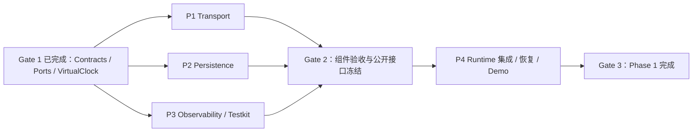

# Bellis Phase 1 剩余开发任务索引

> 文档状态：可执行任务索引 v1
> 基线：`origin/main@daa07e09560d2a4ac8100e0f9142b3e7777a97c9`
> 适用范围：Phase 1 的 P1、P2、P3、P4
> 上位规范：[Phase 1 构建指导](../phase-1-build-guide.md) · [ADR 0001](../adr/0001-canonical-core-and-wire-contracts.md) · [ADR 0002](../adr/0002-node-26-baseline.md)

## 1. 当前状态

Phase 1 已完成（2026-08-22 关闭）。P0 / Gate 1 已合入；P1、P2、P3 已通过
Gate 2 合入；P4（Runtime 集成、故障验证与 Demo）已交付并完成七轮评审修复
（第一轮 11 项：跨重启 Seq 恢复、发送顺序与关闭鲁棒性等，`e81d1aa`；
第二轮 11 项：恢复水位对账、Token 原子消费、Session 轮换/过期/容量、
连接代际广播与 Demo 退出卫生，`592d577`；第三轮 4 项：导出状态事务式消费、
TTL 主动关闭活跃连接、Token 重试的持久化身份稳定、OpenAPI 标准 Bearer
Scheme，`92f2619`；第四轮（Gate 3 重开）4 项 + 2 项规范债务：Error 文本
内容级脱敏、awaitSent 先泵后等、关闭顺序对齐 P4 §6.2、Scene Commit 失败
指标补记、服务端 Envelope seq ≥ 1、握手顺序文档限定，`f41cadb`；第五轮
（重开复审）2 项：自由文本脱敏改三级规则（头形态整段到行尾 + 裸 scheme
整段 + 键值匹配复用规范化敏感名称集合，六项 canary 探针全清）与关闭
顺序回归测试取样修复，`6d5f164`；第六轮（重开三审）2 项：敏感键值统一
整段到行尾并支持键名转义关闭引号（转义 JSON 与多词值探针全清）、名称
间隔收窄为不跨行，`d793d37`；第七轮（重开四审）2 项：名称字符间填充
对齐字段级「移除全部非字母数字」规范化（`author.ization`/`api.key`
变体全清）、名称到分隔符的填充按字符类吸收任意深度转义反斜杠（嵌套
JSON.stringify 任意层，懒惰锚定首个分隔符使捕获组绝不含值），`fa53c93`）。
最终 P4 Commit 为 `fa53c93`（分支 `phase1`），Gate 3 人工核查已通过
（验证记录见第 8.1 节）。当前仓库已经具备：

- pnpm Monorepo、Node.js 26.5、TypeScript 7、ESM 与双平台 CI 基线。
- `@bellis/contracts`、双 dialect JSON Schema、ADR 0001。
- `MonotonicClock`、可用的 `VirtualClock`（P1 交付 Transport 核心）。
- SQLite DB Worker、原子 commitScene、Outbox 与恢复（P2 交付）。
- Trace/Pino/Redaction/内存 Metrics 与确定性 Testkit（P3 交付）。
- `apps/runtime` Fastify 边缘、Control/Media WS 适配、Fake Scene Commit、
  崩溃恢复与 `pnpm demo:phase1`（P4 交付）。

| 任务 | 状态 | 详细文档 |
| --- | --- | --- |
| P1 | 已交付（Gate 2 通过） | [P1 Transport](./p1-transport.md) |
| P2 | 已交付（Gate 2 通过） | [P2 Persistence](./p2-persistence.md) |
| P3 | 已交付（Gate 2 通过） | [P3 Observability/Testkit](./p3-observability-testkit.md) |
| P4 | 已交付（Gate 3 通过） | [P4 Runtime Integration](./p4-runtime-integration.md) |

## 2. 执行顺序



P1、P2、P3 应从同一个 Gate 1 Commit 并行开发。P4 不得提前在 Runtime 内复制临时 Transport、Persistence 或 Observability 实现来“先跑起来”。

## 3. 分支与工作区

推荐分支：

```text
codex/phase1-transport
codex/phase1-persistence
codex/phase1-observability
codex/phase1-runtime-integration
```

推荐规则：

1. P1、P2、P3 都从 Gate 1 基线创建独立 worktree。
2. 三个任务只修改各自文档中的文件所有权范围。
3. 三个组件通过包级验收后，由集成负责人合入同一集成分支。
4. 合入后先完成 Gate 2 接口审查，再创建 P4 分支。
5. 多个 Agent 如果共享一个工作树，不得并发执行 Git 操作；提交、合并和依赖安装由集成负责人统一执行。

## 4. 开工前共同检查

每个 Agent 开工前必须执行：

```bash
git status --short --branch
git rev-parse HEAD
pnpm install --frozen-lockfile
pnpm contracts:check
pnpm typecheck
pnpm lint
pnpm format:check
```

预期：上述命令通过；`pnpm demo:phase1` 在 P4 合入前仍应失败。若基础检查失败，先报告基线问题，不得在任务包内顺手修改 Contracts 或根工具链。

版本口径以 ADR 0002 为准：Node.js `26.5.0`，`engines.node` 为 `>=26.5 <27`。旧提示中出现的 Node 24 已被 ADR 0002 替代。

## 5. Gate 1.1：公开接口充分性检查

P0 冻结的是最小 Port，不保证已经覆盖所有实现细节。P1、P2、P3 在写主体代码前，必须先提交一份公开 API 清单给集成负责人审查。

当前已知需要重点核对的缺口：

- `PersistenceClient` 需要支持创建或确认 Session，否则 `commitScene` 无法可靠校验 Session。
- `CommitSceneInput` 目前只有 Scene/Cycle ID，没有完整 Scene Payload；P2 必须明确持久化 Payload 的来源和 Schema。
- `RecoveryState.latestServerSeq` 已存在，但 Port 尚未定义服务端序号的持久化推进方法。
- P4 需要 Transport 暴露与 Fastify 无关的连接、Replay、队列和 Media 适配接口，不能导入 Transport 私有文件。
- P4 需要 P3 提供稳定的 Trace、Logger 和 Metrics 工厂，不能在 Runtime 内复制实现。

处理规则：

1. 包内新增公开方法允许由包负责人提出，但必须说明 P4 用例、输入输出、错误和关闭语义。
2. 对已有方法的破坏性修改必须先写接口变更说明并经集成负责人接受。
3. 修改 `@bellis/contracts` 必须同时修改 Zod、双 dialect 生成物、Fixture、ADR/协议文档，并通知全部并行任务同步同一 Commit。
4. 不允许用 `any`、任意 SQL、通用事件总线或暴露内部状态来绕过接口设计。

Gate 1.1 只冻结公开边界，不要求三个任务串行等待彼此的内部实现。

## 6. 文件所有权

| 任务 | 可修改 | 只读 |
| --- | --- | --- |
| P1 | `packages/transport/**`、`docs/protocols/control-websocket.md`、`docs/protocols/binary-media-websocket.md` | contracts、observability、testkit |
| P2 | `packages/persistence/**`、`docs/protocols/persistence-and-recovery.md` | contracts、observability、testkit |
| P3 | `packages/observability/**`、`packages/testkit/**`，但不得改变 `VirtualClock` 的既有行为 | contracts、transport/persistence 的公开入口 |
| P4 | `apps/runtime/**`、`scripts/phase-1-demo.mjs`、跨包 E2E/故障 Harness、必要的根脚本与 CI 集成 | 所有包公开入口 |

跨范围修改必须先报告：当前接口、阻塞原因、最小变更、兼容影响和验证方式。

## 7. Gate 2 组件验收

P1、P2、P3 合入前分别通过自身文档的验收命令。全部合入后，集成负责人检查：

- 生产依赖中没有 `@bellis/testkit`。
- `contracts` 没有新增内部项目依赖，也没有复制 Schema。
- 所有后台任务、Worker、连接和 Dispatcher 都有关闭方法并支持 Abort/Deadline。
- Transport 与 Persistence 使用相同的 `MonotonicClock`、TraceContext 和错误传播约定。
- 没有无界队列、真实业务时长 sleep、任意 SQL、生产 Fault Route 或敏感日志。
- P2 的受控检查点只能通过测试装配和私有 IPC 使用。
- P4 能只依赖包根公开导出完成装配。

建议 Gate 2 命令：

```bash
pnpm --filter @bellis/transport typecheck
pnpm --filter @bellis/transport test
pnpm --filter @bellis/transport test:integration
pnpm --filter @bellis/persistence typecheck
pnpm --filter @bellis/persistence test
pnpm --filter @bellis/persistence test:integration
pnpm --filter @bellis/observability typecheck
pnpm --filter @bellis/observability test
pnpm --filter @bellis/testkit typecheck
pnpm --filter @bellis/testkit test
pnpm check
pnpm build
```

## 8. Gate 3 Phase 1 验收

P4 合入后，从全新依赖状态运行：

```bash
pnpm install --frozen-lockfile
pnpm check
pnpm build
pnpm demo:phase1
```

`demo:phase1` 必须打印：

```text
protocolVersion=1
controlHandshake=ok
clockSync=ok
mediaFrame=accepted
sceneCommit=durable
watermark=restored
outboxRecovery=ok
idempotency=ok
traceContinuity=ok
```

同时人工确认 Runtime 只绑定 loopback、OpenAPI 与实现一致、数据库只出现在临时目录、崩溃恢复证据真实、工作树没有数据库/日志/密钥/生成漂移。

### 8.1 Gate 3 结果（2026-08-22）

P4 最终 Commit：`fa53c93`（分支 `phase1`）。Gate 3 经四轮重开评审：
首轮 `92f2619` 后重开（4 项主要问题 + 2 项规范债务，修复于 `f41cadb`）；
`f41cadb` 复审再发现 2 项——自由文本脱敏存在头形态值只换单词、scheme
枚举不覆盖未知形态、键值名称未复用规范化敏感名称集合三个结构缺口
（六项 canary 探针泄露），以及关闭顺序回归测试取样过早冻结（未观察
完整排空窗口）——修复于 `6d5f164`；`6d5f164` 三审又发现 2 项——转义
JSON 键（`"{\"authorization\":\"CANARY\"}"` 形态）与未加引号的多词
敏感值（`credentials=alice CANARY` 形态）仍会泄露，以及名称模式
`[\s_-]` 跨行拼接与设计注释不符——修复于 `d793d37`；`d793d37` 四审
又发现 2 项——自由文本名称规范化未与字段级「移除全部非字母数字」
规则对齐（`author.ization`/`auth/orization`/`api.key` 变体泄露），
以及键名关闭引号的转义匹配只支持单层反斜杠（嵌套 JSON.stringify
两层后为 3 个反斜杠，任意深度泄露）——修复于 `fa53c93`（名称字符间
与名称到分隔符的填充统一为「任意非字母数字、非换行、任意长度」，
懒惰锚定首个分隔符使捕获组绝不含值内容；实现期间由性质测试捕获并
修复贪婪回溯把纯标点值保留进捕获组的变种）并复验。验证记录：

- 全仓库 692 项测试通过（单元/性质 531 项 + 集成 161 项；其中 Runtime
  单元 66 项、集成 88 项，Observability 90 项含历轮全部 Pino canary
  探针、三种换行形态的跨行负例、字段级规范化生成名称与嵌套
  JSON.stringify 深度 0–3 性质测试及纯标点值锚定回归）；
- `pnpm check` 通过（含 contracts:check 双 dialect 生成物一致）；
- `pnpm build` 通过；
- `pnpm demo:phase1` 九项证据全部通过（protocolVersion / controlHandshake /
  clockSync / mediaFrame / sceneCommit / watermark / outboxRecovery /
  idempotency / traceContinuity），连续两遍干净退出；
- 工作树干净（无数据库、日志、密钥或生成漂移残留）。

Phase 1 就此关闭。第二阶段移交入口见第 10 节与
[构建指导 §19](../phase-1-build-guide.md)。

## 9. Agent 统一交付格式

每个 Agent 必须按以下格式交付：

```text
任务：P1 / P2 / P3 / P4
状态：完成 / 部分完成 / 阻塞

基线：
- 起始 Commit
- 是否通过开工前检查

实现：
- 已完成能力

公开接口：
- 新增/变更导出
- 兼容性说明

验证：
- 命令和结果
- 关键失败、恢复或性质测试证据

设计偏差：
- 无；或 ADR/变更说明

风险与后续：
- 已知限制
- P4/下一任务的集成事项

Git：
- 分支
- Commit
- 修改范围
```

部分完成时必须列出剩余项和可复现阻塞条件。占位实现、跳过测试或只报告“已完成”不算交付。

## 10. Phase 2 移交清单

Phase 2（演出纵向链路，见 [技术选型 §20](../technology-selection.md)、
[架构设计 §20 Milestone 1](../architecture-plan.md) 与
[构建指导 §19](../phase-1-build-guide.md)）只能通过以下 Phase 1 冻结入口
继续建设：

- **Contracts**（`@bellis/contracts`）：`SignalSchema`、`ActionFrameSchema`、
  `DecisionPacketSchema`、`SceneSchema`、`CueSchema`、`SyncPolicySchema`、
  `SessionRecordSchema` 等第一阶段 Schema 与 2020-12 / Draft 7 双 dialect
  生成物。Fake Signal、ActionFrame、Scene、Cue 直接用这些入口构造。
- **Transport**（`@bellis/transport`）：`SystemMonotonicClock`、
  `ClockOffsetEstimator`（时钟同步采样与偏移估计）、`ControlSession`
  （`exportLogicalState` / resume、`ReplayWindow`、`BoundedSendQueue`、
  `ControlEffect`）、`MediaFrameParser`、`MediaStreamRegistry`、
  `encodeMediaFrame` / `decodeControlMessage` 等编解码入口。
- **Persistence**（`@bellis/persistence`）：`createPersistenceClient`
  （migrate / ensureSession / appendRecord / commitScene / advanceServerSeq /
  readRecoveryState / listRecords / claimOutbox / completeOutbox /
  retryOutbox）、`createOutboxDispatcher`、`PersistenceError` 与稳定错误码、
  `PersistenceCheckpointObserver`（仅测试装配）。
- **Observability**（`@bellis/observability`）：`createTraceContext` /
  `parseTraceparent` / `formatTraceparent` / `createTraceContextManager`、
  `createPinoLogger` 与字段级 Redaction、`createInMemoryMetrics` 与
  `PHASE_1_METRIC_DEFINITIONS`。
- **Runtime**（`@bellis/runtime`）：`startRuntime` / `RuntimeHandle` /
  `parseRuntimeConfig`；Application Service 位于
  `apps/runtime/src/application/**`（`FakeSceneCommitService`、
  `buildSessionSnapshot`、`createRecordingOutboxPublisher`），Phase 2 的
  Action Compiler 与 Scene Director 在该层接入，不下沉到 Route Handler。
- **固定限制**：Phase 1 `session.snapshot` 的 `activeScene` 恒为 `null`、
  `openMediaStreams` 恒为空；Media Stream 重连后必须重新注册，不恢复。
- **仍需新增/版本化**（未在 Phase 1 预实现）：Scene Prepare/Ready/Commit
  扩展消息、Stage 连接与真实 TTS / 字幕 / Live2D 协议——按 Contracts/ADR
  变更流程先改 Schema、双 dialect 生成物与协议文档，再改消费者。
