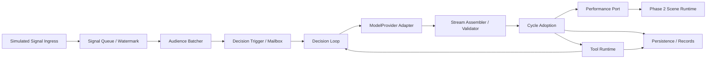
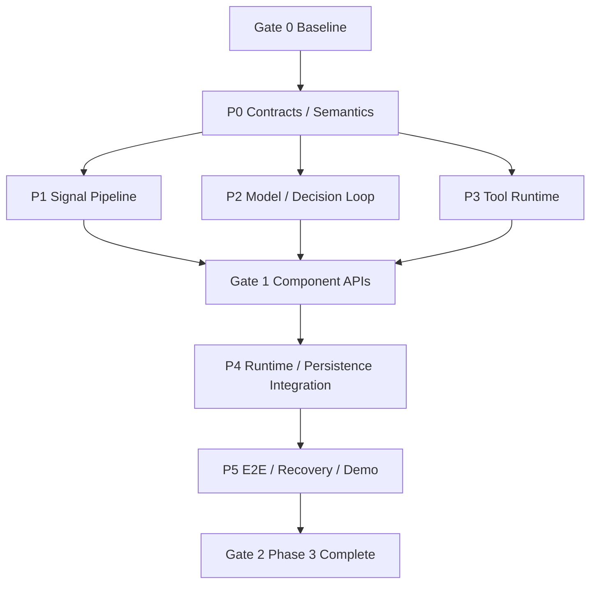

# Bellis Phase 3 开发指南：Decision Loop

> 2026-09-06 架构审查修订：任务所有权、工具恢复事实、调用列表范围、场景终态、Seq 分段预留及 Provider 接缝以 [ADR 0007](./adr/0007-task-ownership-and-runtime-scope.md) 为准。 本文保留历史决策/实施过程；与新决策冲突的描述不再作为当前实现要求。

> 文档状态：历史实施计划（当前事实见 [Phase 3 完成态参考](./phase-3-reference.md)）
> 阶段状态：核心已交付；原定 Gate 2 的子任务 P99 性能验收尚未完成，见 [构建与验收状态](./build-and-validation.md)
> 起始基线：`f77d6e0`（`main`，Phase 2 已合并）
> 上游基线：[Phase 2 完成态参考](./phase-2-reference.md)
> 完成态参考：[Phase 3 完成态参考](./phase-3-reference.md)
> 上位设计：[系统架构设计](./architecture-plan.md) · [技术选型基线](./technology-selection.md)
> 既有约束：[ADR 0001](./adr/0001-canonical-core-and-wire-contracts.md) · [ADR 0002](./adr/0002-node-26-baseline.md) · [ADR 0003](./adr/0003-phase-2-scene-wire-and-browser-boundary.md)

## 0. 如何使用本文

本文保留阶段三的原始工作包与验收目标，不表示所有目标均已证明。以下为历史实施顺序；当前事实及剩余验收以完成态参考为准：

1. Gate 0 复验 Phase 2，并在 P0 冻结 Cycle、模型流、Tool 调用列表 和持久化语义；
2. P1 Signal Pipeline、P2 Model/Decision Loop、P3 Tool Runtime 从同一 Gate Commit 开始；
3. Gate 1 复核三个核心包的公开边界后，由 P4 接入 Runtime 与 Phase 2 演出链路；
4. P5 完成恢复、压力测试、真实浏览器纵向验证和 `pnpm demo:phase3`；
5. Gate 2 通过后，将实现事实写入稳定文档，并压缩生成 Phase 3 完成态参考。

本文中的目录、接口名、Migration 和命令是阶段交付目标，不是已经存在的稳定接口。任何改变既有 Wire、持久化恢复或 Phase 2 Scene 语义的决定，必须先经过 P0 Gate 并记录 ADR 或兼容说明。

## 1. 阶段定义

Phase 3 对应 [技术选型基线 §20](./technology-selection.md) 的“阶段三：Decision Loop”，并覆盖 [系统架构设计 §20](./architecture-plan.md) 中 Milestone 1 的决策侧剩余能力与 Milestone 2 的工具循环：

- 接收模拟直播输入，形成有水位、可审计的 Audience Batch；
- 由 Decision Trigger 启动 Turn，并由单一 Decision Loop 拥有最终决策权；
- 通过 `ModelProvider` 消费流式模型事件，规范化为唯一的 `DecisionPacket`；
- 将本 Cycle 的 Action 与 Tool 调用列表 并行交给既有演出链路和 Tool Runtime；
- 把工具结果带入下一 Cycle，直到 `finish`、取消、预算耗尽或确定性降级；
- 在重启、断流、超时和重复输入下保持水位、幂等与副作用边界可证明。

Phase 3 不替换 Scene Director。它在 Phase 2 已完成的 Action Compiler、Scene Director、Stage 和三条演出 Lane 前增加真实决策循环。

### 1.1 阶段目标

Phase 3 结束时，一组本地模拟弹幕必须完成以下链路：

```text
Simulated Audience Signals
  → Signal Ingress / durable watermark
  → Adaptive Audience Batcher
  → Decision Trigger / Turn mailbox
  → Cycle snapshot + bounded request assembly
  → ModelProvider stream
  → exactly one validated DecisionPacket + ActionFrame
  → durable Cycle adoption
  ├─→ Phase 2 Performance Port → Scene Director → Stage
  └─→ Tool Runtime → parallel calls / locks / timeout / cache
        → Tool Results → next Cycle
  → final ActionFrame → Scene Director → Stage
  → Session Records / Trace / Metrics / recovery evidence
```

验收场景必须同时证明：Cycle 1 的工具提示语和两个无依赖只读工具发生真实时间重叠；工具结果进入 Cycle 2 后产生最终回答；紧急 Signal 可以中断模型流、未完成工具和可中断 Scene；非法或断流的模型输出只产生一个确定性安全帧，不触发格式修复请求风暴。

### 1.2 完成指标

| 指标 | Phase 3 验收目标 | 说明 |
| --- | ---: | --- |
| 普通 Signal 进入可决策 Batch P95 | ≤ 500 ms | 使用 200–500 ms 自适应窗口；虚拟时钟精确验证边界 |
| 紧急 Signal 到 Trigger 入队 P99 | ≤ 50 ms | 不等待普通窗口；不包含外部模型延迟 |
| 每个模型请求的最终 DecisionPacket | 恰好 1 个 | 合法包或确定性安全包，禁止重复 final |
| 每个最终 DecisionPacket 的 ActionFrame | 恰好 1 个 | 继续遵守 ADR 0001 的单一发言来源 |
| Tool 调用列表 无依赖节点并行 | 100% 可证明 | 虚拟时钟与集成 Trace 同时证明真实重叠 |
| Cycle/Tool/Scene 取消传播 | P99 ≤ 100 ms | 从 interrupt 接收到可中断子任务停止 |
| 未通过最终校验前的外部副作用 | 0 | 可提前 Prepare；Scene Commit 和可变 Tool 必须等待 Cycle adoption |
| 重启后非幂等 Tool 自动重放 | 0 | `uncertain` 结果只能显式对账或新调用 |
| 有界资源 | 全部显式且可测 | Signal、Batch、Mailbox、模型片段、Tool 调用列表、结果和缓存均有上限 |
| Phase 1/2 回归 | 0 个失败 | 既有 Demo、协议、浏览器与恢复语义保持兼容 |

外部 Provider 的网络 TTFT 和总时延只记录、不作为离线 CI 硬 Gate。Phase 3 的确定性验收使用脚本化 ModelProvider 和本地 OpenAI-compatible 测试服务器；真实账号 Smoke 必须显式启用且不能成为合并前置。

## 2. 明确范围

### 2.1 本阶段实现

- 有界 Signal Ingress、单调水位、去重和最小热 World Snapshot；
- 确定性自适应 Audience Batcher、紧急旁路和 Decision Trigger；
- Turn/Cycle 状态机、三类忙碌输入模式、预算和父子取消域；
- 自有 `ModelProvider` Port、脚本化 Provider、OpenAI-compatible Adapter 和流式规范化；
- 一次请求一个 ActionFrame、非法输出的确定性安全帧和单 Provider 降级；
- Tool Registry、调用列表校验、并行执行、资源锁、权限、Deadline、取消和有界结果；
- Tool L0/L1 缓存以及需要跨重启保留的 L2 SQLite 缓存；
- Decision Cycle、Audience Batch、Tool Run、结果和 Signal 水位的版本化记录；
- 从 Phase 2 Fake 应用服务中抽出可复用的演出提交 Port，同时保留 Phase 2 Demo 兼容入口；
- `pnpm demo:phase3`、模型 Adapter 本地契约测试、恢复/故障 Harness 和新增指标。

### 2.2 本阶段不实现

- Bilibili 或其他正式直播平台插件；模拟输入仍通过显式开发/测试入口；
- 多 Memory Provider、完整 Context Contribution Pipeline、MCP 或长期记忆写入；
- Presence Engine、Avatar Mixer、正式 Cubism 资源或资源仲裁产品化；
- 真实公网 TTS、声音克隆、音素 Provider 或新的媒体编码；Phase 3 继续使用 Phase 2 的确定性 PCM 路径验证决策并行；
- 多模型自动路由、成本路由、模型竞速或第三方 Agent Runtime；
- Studio 权限确认 UI；Phase 3 提供确认 Port 和静态授权策略，无交互装配时确认型工具必须拒绝；
- Plugin SDK、第三方进程隔离和 Marketplace；首个 Model Adapter 作为一方 Runtime Adapter，不提前宣称插件 ABI 已冻结；
- 游戏输入、OBS 产品化 Overlay、外部网络 Tool 或任意文件系统万能工具；
- 自动恢复中断的模型流、自动重播已提交 Scene 或自动重试结果不确定的非幂等 Tool。

## 3. 不可破坏的不变量

1. **单一 Loop 所有权**：一个 Session 同一时刻最多有一个拥有提交权的 Turn；Provider、Tool 和 Context 都只是能力供应者。
2. **一请求一行动**：每个模型请求最终采用且只采用一个 `DecisionPacket`，其中恰好有一个 `ActionFrame`；发言只来自 `action.speech`。
3. **先规范化再进入核心**：Provider 私有 delta、推理字段和工具格式不能绕过 Adapter 进入 Decision Loop。
4. **采用前不生效**：流式解析可启动可取消 Prepare，但最终包校验和 Cycle adoption 成功前，不得 Scene Commit，也不得执行可变 Tool。
5. **Action 与 Tool 并行**：Cycle adoption 后，Scene 路径和无依赖 Tool 路径并行，不等待提示语播放完成才调用 Tool。
6. **工具结果只进后续 Cycle**：同一 Cycle 不用尚未完成的 Tool Result 回写正在生成的模型流。
7. **水位单调且可审计**：Batch 必须保留原始 Signal 范围；消费水位只在 Cycle 被持久化采用后前进，失败请求不得吞掉输入。
8. **无 Scene 也能提交 Cycle**：`noOp` 或仅 Tool 的 ActionFrame 不依赖 Scene Commit 才能消费水位。
9. **非幂等不自动重放**：重启时无法证明结果的 Tool Run 标记 `uncertain`，不根据模型重试或 Outbox 重投推断成功。
10. **高优先级不静默丢失**：普通输入可聚合、降权或显式拒绝；紧急输入必须进入保留容量或产生可观测的过载失败。
11. **取消结构化传播**：Turn → Cycle → Model/Prepare/Tool/Scene 形成父子取消域，所有子任务有 Abort、Deadline 和释放路径。
12. **测试与生产同路径**：脚本化 Provider 和 Fake Tool 只替换外部能力，不绕过 Batcher、Loop、Scheduler、Persistence 或 Scene Director。

## 4. 目标架构与依赖方向



建议新增目录：

```text
packages/
  decision-loop/
    src/signals/
    src/batcher/
    src/trigger/
    src/model/
    src/loop/
    src/index.ts
    test/
  tool-runtime/
    src/registry/
    src/dag/
    src/scheduler/
    src/permissions/
    src/cache/
    src/index.ts
    test/
apps/
  runtime/
    src/application/phase-3/
    src/application/performance/   # 从 Phase 2 抽出的稳定演出提交边界
    src/providers/model/
scripts/
  phase-3-demo.mjs
  phase-3-demo-child.mjs
```

依赖方向：

```text
contracts ← decision-loop
contracts ← tool-runtime → observability
                  ↑
decision-loop ────┘
      ↑
runtime application → persistence
      ↓
performance port → scene-runtime / transport / stage
```

约束：

- `decision-loop` 不依赖 Fastify、WebSocket、SQLite、Stage 或具体 Model SDK；
- `tool-runtime` 不依赖 Decision Loop 状态机、Scene Runtime 或 Runtime Route；
- Provider Adapter 只实现模型传输与规范化，不拥有 Cycle、重试或 Tool 调度；
- Runtime Route 只做鉴权、边界校验和应用服务调用，不直接推进 Turn；
- Phase 3 不从 `apps/runtime/src/application/phase-2/**` 导入私有实现；先抽取公开演出提交边界，再保留 Phase 2 兼容装配；
- `@bellis/testkit` 继续只出现在 devDependencies。

## 5. Gate 0：基线与契约缺口

### 5.1 开工前复验

从阶段起始 Commit 执行：

```bash
pnpm install --frozen-lockfile
pnpm --filter @bellis/stage exec playwright install chromium  # 首次运行/浏览器版本更新时
pnpm runtime:check
pnpm contracts:check
pnpm check
pnpm build
pnpm demo:phase1
pnpm demo:phase2
pnpm demo:phase2:crash
pnpm test:browser
```

任何失败必须先区分环境、既有缺陷和 Phase 3 回归。不得在红色基线上新增 Loop 或 Tool Runtime。

### 5.2 P0 必须冻结的语义

1. Signal 入库序号、水位与 `Signal.id` 的关系，以及 Batch 的闭区间/开区间定义；
2. 普通、紧急和过载输入的有界队列策略；
3. Turn/Cycle 身份、状态、预算和 `interrupt` / `next_cycle` / `next_turn` 收件箱语义；
4. `ModelProvider`、`ModelRequest`、`ModelStreamEvent` 与最终包规范化边界；
5. 流式稳定片段允许启动哪些 Prepare，以及失配、断流和取消时如何回收；
6. Tool 定义、调用依赖、结果、权限、执行策略、缓存策略和错误的版本化形态；
7. `next=finish/after_tools/continue` 与 Tool 调用列表 的一致性规则；
8. Cycle adoption、Signal 水位、Session Record、Tool Run 和 Scene Commit 的事务边界；
9. `noOp`、仅 Avatar、仅 Tool 或 Scene 编译拒绝时如何推进水位；
10. 崩溃后模型请求、幂等 Tool、非幂等 Tool 和未提交 Prepare 的恢复判定。

### 5.3 现有契约的复用与缺口

必须复用且不复制：

- `SignalSchema`、`AudienceBatchSchema`；
- `DecisionPacketSchema`、`ActionFrameSchema`、`ToolCallSchema`；
- Trace/UUID/十进制水位、JSON-safe 值与 Session Record；
- Phase 2 ScenePlan、StageCapabilities 和 Scene Execution 协议。

P0 需要评审但不预设一定放入 `@bellis/contracts` 的新增形态：

- `DecisionInput` / Cycle Snapshot；
- Ingested Signal 与持久化水位；
- Tool Definition、Execution Policy、Dependency、Result 和 Run State；
- Model Stream 的 Provider Port 事件；
- Phase 3 Audit Payload 和恢复投影。

只有跨包、持久化、插件或 Wire 需要共享的对象进入 `@bellis/contracts`。纯 Loop 内部状态留在 `decision-loop`，避免把 Provider delta 误冻成公共协议。

### 5.4 Cycle adoption 原子性

Phase 2 的 Scene Commit 可以随事务推进 Signal 水位，但 Phase 3 存在 `noOp`、仅 Tool 和 Scene 编译拒绝等无 Scene 路径。P0 必须提供独立的 Cycle adoption 原子操作，至少写入：

- 最终采用的 `cycleId` 与 DecisionPacket 摘要；
- 本 Cycle 使用的 Batch/Signal 水位；
- Turn/Cycle 状态和 Trace 身份；
- 将要执行的 Tool Run 身份与幂等信息；
- 必要的 Outbox/审计记录。

采用前允许模型流解析、TTS/动作资源 Prepare 和纯内存调用列表编译；采用失败必须取消全部 Prepare，不推进水位、不执行可变 Tool、不提交 Scene。采用成功后，Scene Commit 和 Tool 执行可并行，各自记录真实结果。

### 5.5 P0 交付

- Schema、类型、双 dialect 生成物及三方 Fixture 等价测试；
- Decision Loop / ModelProvider / Tool Runtime 公开 Port 草案；
- Cycle adoption 与 Migration 兼容说明；
- 恢复矩阵和取消树；
- 若改变冻结边界，新增 ADR 0004；
- 本地 OpenAI-compatible Adapter Spike，确认 SDK/API、Abort、流式 Tool 参数和错误映射后再锁依赖版本。

P0 Gate：

```bash
pnpm contracts:check
pnpm --filter @bellis/contracts typecheck
pnpm --filter @bellis/contracts test
pnpm check
```

## 6. P1：Signal Pipeline 与 Decision Trigger

### 6.1 Signal Ingress

- 所有输入先经过 `SignalSchema` 和来源策略，不允许 Route 直接触发模型；
- 入库时分配 Session 内单调水位，`Signal.id` 用于来源去重，水位用于顺序与恢复；
- 普通队列、紧急保留容量和拒绝计数全部显式配置；
- 重复来源事件返回幂等结果，不生成第二个水位；
- 墙钟只记录事件事实，窗口和 Deadline 使用单调时钟；
- 开发输入 Route 继续默认关闭，并使用既有本地 Session/Origin/Host 防护。

### 6.2 Audience Batcher

- 正常窗口可在 200–500 ms 内自适应调整；
- 达到消息数、Token、字节或 Deadline 上限即封窗；
- 紧急 Signal 立即封窗或旁路，不等待普通窗口；
- Phase 3 使用确定性文本归一化/分组，不引入 embedding 或第二个模型；
- 聚类保留参与人数、示例、原始 `signalId` 与水位范围；
- 同一用户刷屏只影响权重，不能删除审计事实；
- Batch 输出再次通过 `AudienceBatchSchema`，所有集合均有上限。

### 6.3 Decision Trigger 与 Mailbox

```text
idle + normal batch     → start Turn
busy + interrupt       → cancel active Turn children → enqueue urgent Turn
busy + next_cycle      → merge into next Cycle snapshot
busy + next_turn       → bounded FIFO / coalescing queue
```

- 分类由确定性策略完成，不调用主模型；
- interrupt 不能绕过 Scene Director 直接终止 Lane；
- Mailbox 满时按优先级合并或显式拒绝，不无限积压旧弹幕；
- Session 关闭时取消窗口、触发器和所有等待者；
- 虚拟时钟性质测试覆盖窗口边界、乱序事实时间、重复输入和洪峰。

## 7. P2：ModelProvider 与 Decision Loop

### 7.1 ModelProvider Port

核心只依赖异步事件流和 Abort：

```ts
interface ModelProvider {
  streamDecision(request: ModelRequest, signal: AbortSignal): AsyncIterable<ModelStreamEvent>;
}
```

Port 必须表达开始、稳定内容片段、工具参数片段、用量、Provider 错误和唯一终止事件，但不泄漏具体 SDK 对象。OpenAI-compatible Adapter 位于 Runtime Provider 层；脚本化 Provider 与本地 HTTP Provider 走同一规范化测试套件。

Provider 自己不得：

- 启动下一 Cycle；
- 执行 Tool；
- 提交 Scene；
- 修改 Signal 水位；
- 在失败时偷偷发起第二次模型请求。

### 7.2 流式组装与最终校验

- 每个请求只有一个 Stream Assembler；
- Tool 参数必须在完整 JSON、名称存在和 Schema 校验后才成为候选调用；
- 稳定 Speech 片段可启动可取消 Prepare，但不能显示、播放或写成最终 Decision；
- 收到完整终止事件后组装规范 `DecisionPacket`，再次通过运行期 Schema 和交叉规则；
- 重复 final、final 后 delta、未知必需事件、超限深度/字节或 CycleId 不匹配均使 Provider 结果失败；
- Provider 私有 reasoning、cache metadata 和 raw body 只进入有界/脱敏遥测，不进入 Prompt 或规范包。

### 7.3 Turn/Cycle 状态机

```text
Turn: queued → running → finishing → completed
                    ├─→ cancelling → cancelled
                    └─→ failed/degraded

Cycle: snapshot → requesting → validating → adopting
       → dispatching(action || tools) → awaiting_next → completed
```

- 默认 `maxCyclesPerTurn=8`、`maxParallelTools=8`；
- `after_tools` 必须至少有一个前台 Tool，结果进入下一 Cycle；
- `continue` 消耗 Cycle 预算但不伪造 Tool Result；
- `finish` 不等待 detached/background Tool；
- 达到预算、Deadline 或重复空转阈值时产生确定性安全帧并结束 Turn；
- 后续 Cycle 固定新的 Signal Watermark/World Version，不修改已经采用的历史快照。

### 7.4 确定性降级

模型超时、断流、非法包或内容策略拒绝时不进行格式修复请求。Loop 通过本地策略产生一个合法安全包：

- 默认 `noOp: true`；或
- 能力允许时使用预注册的轻量思考/抱歉动作，不包含未经模型确认的事实；
- `next=finish`，除非策略明确选择可用的备用 Provider（Phase 3 默认无自动多 Provider 路由）。

降级包与原 Provider 错误都记录在同一 Cycle Trace 中，且只采用一次。

## 8. P3：Tool Runtime

### 8.1 Registry 与定义

每个 Tool 注册时至少声明：

- 稳定名称、版本和 JSON Schema Draft 7 输入；
- 输出字节/Token 上限和敏感字段策略；
- `parallel_read` / `exclusive` / `keyed` / `background` 执行模式；
- 资源名或键参数、Timeout、可取消性和并发上限；
- `pure` / `idempotent` / `non_idempotent` 语义；
- 所需 Capability、是否需要确认、缓存 TTL 与 revision 组成。

同名冲突、非法 Schema、无界 Timeout 或声明矛盾必须在注册期失败，不等模型调用后才猜测。

### 8.2 独立调用列表编译（ADR 0007 修订）

- `toolRunId` 在 Cycle 内唯一，每包最多 8 个调用；
- 非空或非法 `dependsOn` 返回 `dependencies_unsupported`，需要前一步结果时进入下一 Cycle；
- 校验工具存在性与 keyed resource；参数 Schema 在规范化和执行入口检查；
- 保持输入、错误与 Trace 顺序确定，不维护通用拓扑层、深度和环检测；
- `compileDag`/`executeDag` 保留源码兼容名称，不能据此推导通用 DAG 能力。

### 8.3 调度、锁与取消

- 无依赖 `parallel_read` 节点并行；
- `exclusive` 对同一 resource 串行；
- `keyed` 只在相同归一化键上串行；
- 锁等待受 Deadline/Abort 控制，取消后立即从队列移除；
- Runtime 总并发、每 Provider 并发和每资源等待队列都有独立上限；
- Tool 返回后先做 JSON-safe、大小、Schema 和敏感字段处理，再进入下一 Cycle；
- background 任务不阻塞下一 Cycle；前台结果返回后 Runtime 继续调度，父取消与 close 结算全部已接受任务。

### 8.4 权限与副作用

- 模型选择 Tool 不等于获得权限；每次运行重新检查 Session/Profile Capability；
- `confirm` 型工具在没有 Confirmation Port 装配时 fail closed；
- 可变或非幂等 Tool 只在 Cycle adoption 成功后执行；
- 只读 Tool 即使未来允许流式早启，也必须完成参数/权限校验并有独立取消；Phase 3 初始实现默认统一在 adoption 后启动；
- 高风险调用必须有 `idempotencyKey`，结果校验失败不能声称成功；
- 弹幕、模型参数和 Tool Result 全部视为不可信数据，不得拼成系统指令或日志字段名。

### 8.5 缓存与结果预算

- L0：单 Cycle Map 去重；
- L1：Runtime 有界 LRU，仅缓存 pure/idempotent Tool；
- L2：SQLite TTL 缓存，键包含 Tool/Provider/版本/归一化输入/配置 revision；
- 命中缓存仍生成 Tool Run 审计事实，并标记来源；
- 过期、revision 不符或权限收紧立即失效；
- 超限结果以结构化 truncation 标记进入模型，原始大结果不写 Session Record。

## 9. P4：Runtime 纵向装配与持久化

### 9.1 抽出演出提交边界

`Phase2PerformanceService` 当前同时持有 Fake Signal/Fake Model 与演出编排职责。Phase 3 不能继续扩展它。P4 应抽出一个接收“已采用 DecisionPacket”的稳定应用 Port，复用：

- Action Compiler 和 StageCapabilities；
- Fake TTS/媒体发送器（Phase 3 阶段仍为确定性 Provider）；
- Scene Director、持久化 Scene 和 Stage Control/Media；
- Started/Finished/Cancel 回执与 Scene 指标。

Phase 2 的 `submit(Fake Signal + Fixture)` 入口保留为兼容包装，既有 Demo 和测试不得改走旁路。

### 9.2 Phase 3 Host

Runtime 装配：

```text
authenticated dev signal input
  → Signal Repository / Batcher / Trigger
  → DecisionLoopHost
  → ModelProvider + ToolRuntime + PerformancePort
  → Stage Host / Persistence / Observability
```

- Session 归属继续沿用 Phase 2 的 Stage 绑定规则；
- 一 Session 一 Loop 所有者，关闭顺序从 Ingress 向子任务传播后再关闭 DB/Socket；
- Provider API Key 只由 Credential Port 提供，不进入浏览器、Prompt 记录或错误响应；
- 生产默认不开放模拟输入；显式 Phase 3 开发配置才启用。
- 工具注册由入口注入，Host 缺省目录为空；详细 evidence 缺省关闭，启用后按固定容量淘汰。

Trigger Mailbox 是唯一等待队列。Loop 同步登记接受的 Turn，取消中的 Turn 释放前不接受新 Turn；连续 urgent 在 Mailbox 合并等待。

### 9.3 持久化与恢复

恢复事实与审计分开：Tool started 落库成功后才调用工具，finished 落库成功后才返回结算结果。关键写入失败必须传播，不能由尽力审计回调吞掉；结束写失败保留 running 供恢复标记 uncertain。

至少记录：

- Signal accepted/rejected/deduplicated；
- Audience Batch 与水位；
- Turn/Cycle started、最终采用包摘要、降级和终态；
- 模型 Provider、TTFT、总耗时、Token/缓存元数据（不记录密钥和原始敏感 body）；
- Tool 调用列表、每个 Tool Run 的状态、缓存、错误、幂等键摘要和有界结果摘要；
- Cycle adoption、Scene 关联与取消原因。

重启规则：

- 未 adoption 的 Cycle 不推进水位，未提交 Prepare 全部丢弃；
- 已 adoption 的 Cycle 不重新请求模型，不自动重播 Scene；
- pure/idempotent Tool 只有在策略和稳定幂等键允许时才能显式恢复；
- non-idempotent Tool 的 `running` 状态恢复为 `uncertain`，绝不自动重试；
- 未消费 Signal 从持久化水位重建 Batch；旧普通窗口不恢复单调 Deadline，而是在新进程按恢复策略重新封窗；
- 未知 Phase 3 payloadVersion fail closed，不按已知状态推进水位或重放副作用。

## 10. P5：测试、Demo 与阶段收口

### 10.1 测试矩阵

- **Schema/契约**：新对象双 dialect、成功/失败 Fixture、版本不兼容；
- **单元**：Batcher、Trigger、Stream Assembler、Cycle 状态机、调用列表、锁、权限、缓存；
- **性质**：水位单调、至多一个 final、调用列表调度无死锁、取消后无等待者、缓存键稳定；
- **集成**：本地 OpenAI-compatible Server、真实 DB Worker、Phase 2 Performance Port、Control/Media WS；
- **浏览器**：真实 Chromium Stage 中 Cycle 1 提示语、Tool overlap、Cycle 2 最终回答；
- **恢复**：adoption 前后、Tool 启动前后、结果落库前后、Scene Commit 前后；
- **压力**：弹幕洪峰、模型碎片洪峰、Tool 慢/挂/大结果、Mailbox 满、Session 关闭竞态；
- **安全**：Prompt 注入样本、越权 Tool、确认缺失、密钥/Authorization/Tool 敏感结果 Redaction Canary。

确定性逻辑使用 `VirtualClock`。外部 SDK 契约通过本地 HTTP 流服务器验证，不依赖公网或真实账号。

### 10.2 Phase 3 Demo

`pnpm demo:phase3` 必须自动启动真实 Runtime 子进程、DB Worker、Control/Media WebSocket 和协议 Stage 客户端，执行：

1. 多条相关模拟弹幕聚合为一个 Batch；
2. Cycle 1 的脚本化模型流返回 `tool_notice` Speech、Avatar 和两个独立只读 Tool；
3. Scene Prepare/Commit 与两个 Tool Run 在 Trace 中发生重叠；
4. Tool Results 进入 Cycle 2，产生最终 Speech/Avatar；
5. 重复 Signal 不生成新水位或第二个 Turn；
6. 紧急 Signal 中断一个慢模型/慢 Tool/可中断 Scene；
7. 非法模型流产生唯一安全包；
8. 关闭后无 Worker、Socket、Timer、锁、等待者或临时文件残留。

成功输出至少包含稳定证据行：

```text
phase3-demo: ok
batchLatencyMs=<number <= 500>
cyclePackets=requested=2 adopted=2 duplicateFinal=0
toolDag=ok(parallel=2,cacheHit>=1,permissionDenied>=1)
actionToolOverlapMs=<number > 0>
turnSettleLatencyMs=<number <= 2100>  # 当前 Demo 的端到端收尾；不是子任务 P99
watermark=ok(deduplicated=1,monotonic=true)
recovery=ok(nonIdempotentReplay=0)
```

浏览器 E2E 另证明真实 Stage 的两次 Scene 和取消路径；它不复测 Provider 网络质量。

### 10.3 阶段完成命令

以下命令在 Phase 3 完成时必须存在并通过：

```bash
pnpm install --frozen-lockfile
pnpm --filter @bellis/stage exec playwright install chromium  # 首次运行/浏览器版本更新时
pnpm check
pnpm build
pnpm contracts:check
pnpm test:browser
pnpm demo:phase1
pnpm demo:phase2
pnpm demo:phase2:crash
pnpm demo:phase3
```

可选真实 Provider Smoke 单独命名并由环境变量显式启用；缺少凭据时应 skip，而不是让 `pnpm check` 失败。

## 11. 工作包依赖与所有权



| 工作包 | 主要修改范围 | 禁止越界 |
| --- | --- | --- |
| P0 | `packages/contracts/**`、必要 ADR、Migration/Port 设计 | 不实现 Route 或业务循环 |
| P1 | `packages/decision-loop/src/{signals,batcher,trigger}/**` | 不调用模型或 Scene Director |
| P2 | `packages/decision-loop/src/{model,loop}/**`、Runtime Model Adapter | 不实现 Tool 锁和 DB SQL |
| P3 | `packages/tool-runtime/**` | 不拥有 Turn/Cycle，不提交 Scene |
| P4 | `apps/runtime/**`、`packages/persistence/**`、必要 Observability | 不把领域逻辑写入 Route/WS Handler |
| P5 | `scripts/demos/phase-3-*`、E2E/恢复 Harness、CI/根脚本 | 只通过包根和公开 Runtime 入口集成 |

并行工作必须从同一 P0 Gate Commit 开始。跨所有权变更先说明接口、兼容影响、最小变更和验证方式。

## 12. Gate 清单

### 12.1 Gate 0：Contracts 与恢复语义

- Phase 2 全量基线通过；
- Signal 水位、Batch 边界和 Cycle adoption 无歧义；
- Model Stream 私有事件与规范 DecisionPacket 边界明确；
- Tool 调用列表、权限、缓存、幂等和结果预算明确；
- `noOp` Cycle 可原子推进水位；
- 崩溃矩阵明确哪些状态可重试、不可重试或 uncertain；
- 新 Schema 已生成双 dialect 并通过等价 Fixture。

### 12.2 Gate 1：核心组件公开边界

- Signal Pipeline、Decision Loop、Tool Runtime 都只通过包根公开 Port 交互；
- 所有队列、流片段、调用列表、锁、结果和缓存均有容量/Deadline/Abort/Close；
- 每请求至多一个 final、每 final 恰好一个 ActionFrame 的性质测试通过；
- 调用列表并行、资源串行、权限 fail-closed 和取消无泄漏；
- Provider Adapter 不拥有循环和副作用；
- Phase 2 演出抽取方案可以保持现有 Demo 原路径兼容。

### 12.3 Gate 2：Phase 3 完成

- 模拟 Audience 到两 Cycle 演出的真实纵向路径通过；
- Action 与 Tool 并行证据、Tool Result 下一 Cycle 证据完整；
- 紧急输入取消模型、Tool、Prepare/Scene 满足延迟指标；
- 重复 Signal、水位恢复和非幂等 Tool 不重放通过故障测试；
- 本地 OpenAI-compatible Adapter、DB Worker、WS 和 Chromium 都经过真实边界；
- Redaction Canary、低基数 Metrics 和 Trace Continuity 通过；
- Phase 1/2 Demo 与协议回归全部通过；
- 文档从规划更新为实现事实，并新增 Phase 3 完成态参考。

## 13. Metrics 与 Trace

保留 Phase 1/2 指标名称，新增候选目录：

- `bellis_signal_ingress_total{result,priority_class}`；
- `bellis_audience_batch_latency_ms{trigger}`；
- `bellis_decision_turns_total{result}`；
- `bellis_decision_cycles_total{result}`；
- `bellis_model_ttft_ms{provider,result}`；
- `bellis_model_request_duration_ms{provider,result}`；
- `bellis_model_stream_bytes_total{provider}`；
- `bellis_tool_runs_total{tool,result,cache}`；
- `bellis_tool_duration_ms{tool,result}`；
- `bellis_tool_lock_wait_ms{mode,result}`；
- `bellis_decision_interrupt_latency_ms{child,result}`。

标签必须来自有界目录。`signalId`、`turnId`、`cycleId`、`toolRunId`、用户 ID、错误正文和 Tool 参数只进入 Trace/结构化日志字段，不进入 Metric label。

Trace 关系：

```text
sessionId / traceId
  → audienceBatchId
  → turnId
  → cycleId / modelRequestId
  ├─→ sceneId / cueId
  └─→ toolRunId / dependency toolRunId
```

所有跨异步边界必须显式传播 TraceContext。Provider 原始内容、弹幕全文和 Tool Result 默认不写普通日志。

## 14. 故障与恢复矩阵

| 故障点 | 水位 | Model | Tool | Scene | 恢复行为 |
| --- | --- | --- | --- | --- | --- |
| Batch 后、请求前崩溃 | 未消费 | 未开始 | 未开始 | 未开始 | 重建 Batch |
| 模型流中断 | 未消费 | failed | 未开始 | Prepare 取消 | 新 Turn 可重新决策 |
| 最终包校验后、adoption 前崩溃 | 未消费 | 未采用 | 未开始 | Prepare 丢弃 | 不视为已决策 |
| adoption 后、Tool/Scene 前崩溃 | 已消费 | 已采用 | planned | 未提交 | 不重问模型；按记录对账 |
| 幂等 Tool 运行中崩溃 | 已消费 | 已采用 | running | 独立判定 | 仅按策略显式恢复 |
| 非幂等 Tool 运行中崩溃 | 已消费 | 已采用 | uncertain | 独立判定 | 绝不自动重试 |
| Scene Commit 后崩溃 | 已消费 | 已采用 | 独立判定 | Phase 2 规则 | 不自动重播 |
| Tool Result 后、Cycle 2 前崩溃 | 已消费 | Cycle 1 已采用 | result durable | Scene 独立 | 可用已落库结果启动新 Cycle，需新 cycleId |

恢复逻辑必须基于版本化持久化事实，不根据日志顺序、进程内 Map 或 Provider 猜测。

## 15. 风险与禁止捷径

- 不把 AI SDK 或某个 Provider SDK 的事件类型直接导出为核心契约；
- 不让 Route、WebSocket Handler 或 Tool 回调递归调用自身推进 Loop；
- 不以“流式”名义在最终包校验前播放语音或执行可变 Tool；
- 不把 Tool Result 拼进 system prompt；它必须是标明来源和预算的不可信数据块；
- 不把普通 Promise race 当取消；失败分支必须真正 Abort 并释放锁/等待者；
- 不用 `Promise.all` 执行含资源冲突的 Tool；先校验调用列表并取得资源锁；
- 不缓存完整模型决策；Tool 缓存必须包含版本与 Context revision；
- 不用模型二次“修 JSON”掩盖 Adapter/Schema 错误；
- 不在 Phase 3 顺带建设 Memory、Presence、平台插件或游戏输入；
- 不以真实公网账号、商业 Provider 配额或未授权资源作为 CI 前置；
- 不删除或改写 Phase 1/2 Demo 来让新架构看似通过。

## 16. 阶段交付格式

每个工作包交付时报告：

```text
任务：Phase 3 / P?
状态：完成 / 部分完成 / 阻塞

基线：
- 起始 Commit
- Gate 检查结果

改动：
- 文件/包
- 公开接口
- 迁移/协议/兼容影响

不变量：
- 本包证明了什么
- 哪些由后续包证明

验证：
- 执行命令
- 关键证据

风险：
- 已知限制
- 后续交接
```

Phase 3 完成后删除临时分支、文件所有权和执行提示，只保留完成态参考、稳定协议、测试和必要 ADR。
