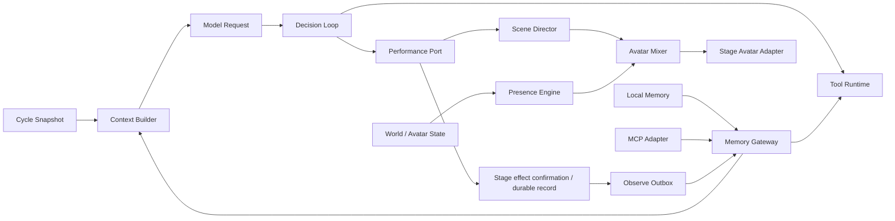
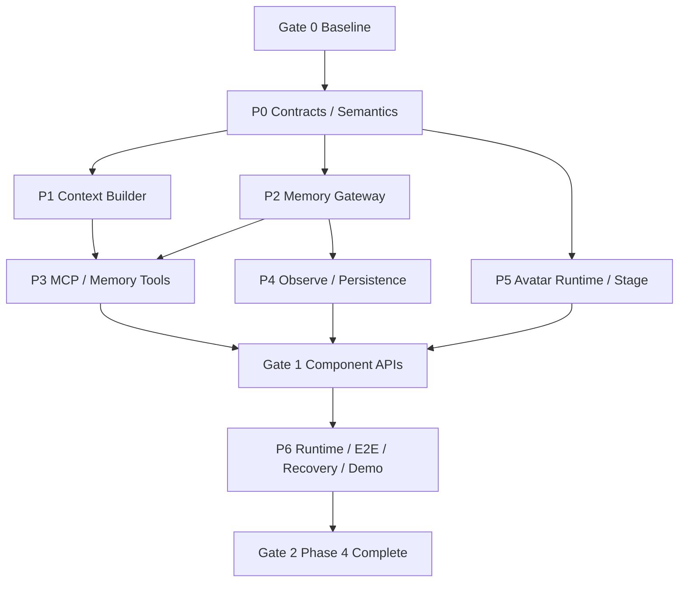

# Bellis Phase 4 构建指南：记忆与主动表现

> 文档状态：待实施（Phase 4 构建基线）
> 阶段状态：未开始
> 起始基线：`e3fc7b4`（`origin/main`，Phase 3 已合并）
> 上游基线：[Phase 3 完成态参考](./phase-3-reference.md)
> 上位设计：[系统架构设计](./architecture-plan.md) · [技术选型基线](./technology-selection.md)
> 既有约束：[ADR 0001](./adr/0001-canonical-core-and-wire-contracts.md) · [ADR 0002](./adr/0002-node-26-baseline.md) · [ADR 0003](./adr/0003-phase-2-scene-wire-and-browser-boundary.md) · [ADR 0004](./adr/0004-phase-3-decision-boundaries.md)

## 0. 如何使用本文

本文把技术路线中的“阶段四：记忆和主动表现”拆成可开发、可验收的纵向工作包。实施顺序为：

1. Gate 0 复验 Phase 3，并在 P0 冻结 Context、Memory、Observe、Avatar 仲裁与持久化语义；
2. P1 Context Builder、P2 Memory Gateway 与 P5 Avatar Runtime 从同一 Gate Commit 开始，P3/P4 分别接入 MCP/Memory Tool 与 Observe 持久化；
3. Gate 1 复核各核心包（含 P2 负责的 Persona Runtime）的公开边界后，由 P6 完成 Runtime 纵向装配；
4. P6 同时完成故障恢复、隐私失效、真实浏览器纵向验证和 `pnpm demo:phase4`；
5. Gate 2 通过后，把实现事实写入稳定协议，并生成 Phase 4 完成态参考。

本文中的目录、接口名、Migration、指标和命令是阶段交付目标，不是已经存在的稳定接口。仓库已有 memory 契约及 Iris 独立 Provider 原型，但宿主 Context/Memory/Persona/Avatar 纵向链路尚未交付；原型不构成 P0 或阶段 Gate 已通过的证据。本文受 [ADR 0006](./adr/0006-documentation-and-delivery-boundaries.md) 的输出确认、ACK、容量与更新语义约束。任何改变既有 `DecisionPacket`、Cycle adoption、Scene Commit、Control WebSocket 或恢复语义的决定，必须先经过 P0 Gate，并记录 ADR 或兼容说明。

## 1. 阶段定义

Phase 4 对应 [技术选型基线 §20](./technology-selection.md) 的“阶段四：记忆和主动表现”，覆盖 [系统架构设计 §20](./architecture-plan.md) 中 Milestone 3 的主动角色核心和 Milestone 4 的外部记忆：

- 在每个 Cycle 的快照屏障内并行构建 Base、World、Audience、Tool Result 与 Memory Context；
- 由单一 Context Builder 执行来源标记、隐私过滤、冲突保留、排序、去重和 Token 预算；
- 通过稳定 `MemoryProvider` Port 接入本地 Provider 和 MCP v2 Adapter；
- 将记忆工具注册到既有 Tool Runtime，继续服从权限、DAG、Deadline、取消和幂等约束；
- 在已提交事实之后通过 Outbox 异步 Observe，不把记忆写入放进直播响应关键路径；
- 通过 Avatar Mixer、Presence Engine 和资源仲裁，让角色在没有模型请求时仍自然表现；
- 让 Directed Scene 动作可靠抢占低优先级主动动作，并在结束或取消后自然恢复。

Phase 4 不替换 Decision Loop、Tool Runtime 或 Scene Director。Context 和 Memory 是能力供应者；Presence 是低优先级本地控制器；模型请求仍只有一个最终 `DecisionPacket`，所有 Directed Avatar 行为仍通过既有 Scene 路径生效。

### 1.1 阶段目标

Phase 4 结束时，本地确定性演示必须完成以下双纵向链路：

```text
Simulated Audience / World / previous Tool Results
  → Cycle snapshot barrier
  ├─→ Base + Conversation + Audience + World contributions
  ├─→ Local Memory Provider
  └─→ MCP Memory Adapter（本地协议测试服务）
  → Context Builder（privacy / provenance / conflict / dedupe / budget）
  → adopted Context Manifest + promptEpoch
  → ModelProvider → DecisionPacket
  → Tool Runtime（memory_search / remember / correct / forget）
  → Scene Director → Directed Avatar Cue

Committed Session Facts
  → Memory Observe Outbox
  → idempotent Provider observe
  → revision / tombstone / cache invalidation

Idle / reactive World State
  → Presence Engine（deterministic seed / cooldown / bounded scheduler）
  → Avatar Mixer / Resource Arbiter
  ← Directed Scene / LipSync / Safety priorities
  → Stage Avatar Adapter
```

验收场景必须同时证明：多个 Memory Provider 在共享 Deadline 内真实并行；一个超时 Provider 不拖住模型请求；模型可见的每个 Memory Block 可追溯到来源和 revision；显式遗忘产生 tombstone 并立即阻止旧缓存回注；Idle Presence 不发起模型请求；Directed Scene 抢占冲突通道后，Presence 在 Scene 完成或取消时恢复，且不出现动作跳变、定时器泄漏或过期行为补播。

### 1.2 完成指标

| 指标                              | Phase 4 验收目标 | 说明                                                                 |
| --------------------------------- | ---------------: | -------------------------------------------------------------------- |
| Context 构建本地路径 P95          |          ≤ 50 ms | 不含外部 Provider；固定 Fixture 与虚拟时钟验证                       |
| Memory 前台共享 Deadline          |           250 ms | 默认 200 ms，可配置 150–250 ms；不是每 Provider 依次等待             |
| 单 Memory Provider 超时的额外阻塞 |  ≤ 共享 Deadline | 其他贡献和模型请求继续，不串行叠加                                   |
| 模型可见 Memory Block 可追溯率    |             100% | `providerId`、`blockId`、revision、hash、privacy scope 均有审计      |
| 超预算模型输入                    |                0 | 预算前估算、组装后复核；确定性裁剪并记录原因                         |
| 显式遗忘后旧值重新注入            |                0 | tombstone/revision 优先于 L1/L2/Provider 旧结果                      |
| Observe 重试产生重复写入          |                0 | 至少一次 Outbox + Provider 业务幂等键                                |
| Idle Presence 模型请求数          |                0 | 主动眨眼、呼吸、注视和随机动作不唤醒 LLM                             |
| Directed 抢占冲突通道             |             100% | Safety/LipSync/Directed 优先级不可被 Presence 覆盖                   |
| Avatar 仲裁取消与释放 P99         |         ≤ 100 ms | 从 Scene/Session 取消到通道租约释放                                  |
| 有界资源                          |   全部显式且可测 | Block、Provider、Prompt、Observe、行为、通道、Timer 与状态流均有上限 |
| Phase 1/2/3 回归                  |         0 个失败 | 既有 Demo、浏览器、协议和恢复语义保持兼容                            |

真实外部 MCP/Memory 服务的公网时延只记录，不作为离线 CI 硬 Gate。Phase 4 使用本地 Provider、脚本化慢/错 Provider 和本地 MCP 测试进程完成确定性验收。

## 2. 明确范围

### 2.1 本阶段实现

- `ContextContribution` / `ContextBlock` / `ContextManifest`、`promptEpoch` 和 Memory Query/Observe 的版本化契约；
- 有界 Context Contribution Pipeline、确定性排序/去重/冲突保留、隐私域检查和 Token 预算；
- Stable Prefix、Append-only Conversation 与 Dynamic Tail 的稳定组装边界；
- Memory Gateway、一个确定性本地 Memory Provider、Provider 独立 bulkhead/Deadline/Abort/健康状态；
- Memory Context 的 L1/L2 缓存、revision/etag/TTL 失效和 tombstone 防回注；
- MCP v2 Adapter 的 stdio 与 Streamable HTTP 边界，至少完成一个本地协议纵向测试；
- Memory Tool 到既有 Tool Runtime 的注册适配，包括 search、remember、correct、forget 的权限和幂等策略；
- Scene/Cycle 已提交事实到 Memory Observe Outbox 的版本化投影、重试、死信与对账；
- `packages/avatar-runtime` 中的纯确定性 Avatar Mixer、Presence Engine、行为目录、通道租约和资源仲裁；
- Stage 侧主动表现状态流、Directed Cue 抢占/恢复、Recording/DOM Adapter 测试路径；
- Provider 插件缝：`@bellis/contracts` 的 `memory` 子路径导出、配置驱动的
  `MemoryProviderRegistry`、`@bellis/testkit` 的 Provider Conformance Harness；
- `PersonaSource` Port、人格确定性渲染器、Persona Slot 与启动期人格就绪门禁；
- Cycle adoption 事务内的 `memory.usage.v1` Outbox 投影与 Provider fan-out；
- `pnpm demo:phase4`、浏览器专项用例、恢复/隐私 Harness 和新增指标。

### 2.2 本阶段不实现

- 正式 Bilibili 或其他直播平台插件；Phase 4 继续使用已鉴权的模拟 Signal；
- `providers/memory-iris/` 的实现不属于 P1–P6 的验收范围；本阶段只需保证 Conformance
  Harness 与 `memory` 子路径足以承载它，其自身进度由 Iris 阶段 11 跟踪；
- 完整 Plugin SDK、Marketplace、第三方 UI、插件热更新或不可信插件通用隔离；
- 云端托管记忆产品、embedding 服务选型、向量数据库或跨设备同步；本地 Provider 可以使用确定性文本索引验证边界；
- 允许 Memory Provider 直接编辑 system prompt、旧对话、World State、DecisionPacket 或共享可变状态；
- 多模型路由、模型竞速、自动人格改写或基于记忆的隐式权限提升；本阶段**只消费**
  外部记忆系统已发布的人格，不注册任何人格写工具，不实现提案生成、评审 UI
  或自动发布（[ADR 0005](./adr/0005-memory-provider-seam-and-persona-ownership.md) 决策 3.6）；
- 正式 Cubism SDK/模型资产打包；CI 继续使用 Recording/DOM Adapter，授权资源只做显式手工 Smoke；
- TTS viseme 产品化、逐帧 Cubism 参数协议或通过 Runtime 发送每帧 Avatar 参数；
- 游戏输入、Rust Sidecar、OBS 产品化 Overlay 或 Studio 完整记忆管理 UI；
- 跨 Provider 自动合并身份；未经可信映射的相同用户名必须保持隔离；
- 在未确认 Provider 支持前承诺物理删除；不支持时必须返回明确状态并保留本地 tombstone。

## 3. 不可破坏的不变量

1. **单一 Context 所有权**：只有 Context Builder 决定模型最终看到哪些 Block；Provider 只能贡献候选内容。
2. **快照不可变**：一个模型请求采用的 Context Manifest 在该 Cycle 内不可修改；晚到结果只进入缓存或后续 Cycle。
3. **来源不可丢失**：所有外部内容必须携带 Provider、revision、hash、privacy scope 和 source refs；裁剪后仍可审计。
4. **不可信边界**：Memory、Audience 和 Tool Result 永远作为带来源的数据块进入 Dynamic Tail，不能成为 system 指令。人格是被显式授信的独立通道，但排在安全与直播规则之后，且不得声明工具权限、改写输出协议或放宽安全规则。
5. **共享前台 Deadline**：Provider fan-out 并行且共用总预算；慢 Provider 不能串行放大关键路径。
6. **身份与隐私隔离**：缓存、查询、记录与遗忘都包含可信 identity scope 和 privacy domain；禁止跨 Session/Profile/Viewer 泄漏。
7. **遗忘优先**：纠正、遗忘和隐私收紧的 revision/tombstone 优先于任何旧缓存、迟到响应和重试消息。
8. **Observe 不阻塞演出**：只有已提交事实进入 Observe Outbox；Provider 写入失败不得回滚 Cycle 或 Scene。
9. **副作用继续受控**：Memory Tool 继续经过 Tool Runtime 的权限、确认、幂等、资源锁、结果预算和审计。
10. **Presence 不拥有决策**：Presence 不调用模型、不生成 Speech、不提交 Directed Scene，也不能修改 Signal 水位。
11. **语义意图而非帧参数**：模型、Memory 和 Runtime 只传递语义 `AvatarIntent`/状态；帧级混合只在 Stage Adapter 内完成。
12. **确定性仲裁**：相同 Clock、World Snapshot、行为目录、Seed 和输入事件必须产生相同高层选择与抢占结果。
13. **高优先级绝不被覆盖**：Safety > LipSync > Directed > Reactive > Proactive > Base；低层不得写入未持有的通道。
14. **取消即释放**：Scene/Session 取消必须停止过期行为、释放租约和 Timer；恢复后不得补播已过期动作。
15. **测试与生产同路径**：Fake Provider/Clock/Adapter 只替换外部边界，不绕过 Builder、Gateway、Outbox、Mixer 或 Scene/Stage 协议。

## 4. 目标架构与依赖方向



建议新增目录：

```text
packages/
  context-builder/
    src/budget/
    src/assembly/
    src/privacy/
    src/cache/
    test/
  memory-runtime/
    src/gateway/
    src/registry/
    src/providers/local/
    src/adapters/mcp/
    src/observe/
    src/usage/
    test/
  persona-runtime/
    src/source/
    src/renderer/
    src/readiness/
    test/
  avatar-runtime/
    src/mixer/
    src/presence/
    src/behaviors/
    src/resources/
    test/
providers/                 # 独立插件过渡目录，不属于根 workspace
  memory-iris/              # 已有原型，目录名以当前代码为准
apps/
  runtime/src/application/phase-4/
  stage/src/avatar/
scripts/
  phase-4-demo.mjs
  phase-4-demo-child.mjs
```

依赖方向：

```text
contracts ← context-builder
contracts ← memory-runtime → tool-runtime
contracts ← avatar-runtime
       ↑           ↑
decision-loop ─────┘
       ↑
runtime application → persistence / observability
       ↓
performance port → scene-runtime / transport → stage → avatar-runtime
```

约束：

- `context-builder` 不依赖 Model SDK、Fastify、SQLite、MCP SDK、Stage 或具体 Provider；
- `memory-runtime` 不拥有 Turn/Cycle，不提交 Scene，不直接写 Prompt；
- `avatar-runtime` 的仲裁核心不依赖 React、DOM、Cubism SDK、WebSocket 或 Node Runtime；
- MCP Adapter 只做协议映射和能力收窄，不成为 Tool Runtime 或 Context Builder 的替代；
- Runtime Route 只做鉴权、边界校验和应用服务调用，不直接查询 Provider 或修改记忆；
- Directed Avatar Cue 继续走 Phase 2 Scene/Stage 协议；Presence 只通过受限低优先级入口进入 Mixer；
- `@bellis/testkit` 继续只出现在 devDependencies。
- `providers/*` 下的 Provider 与仓库外实现受同一约束：只依赖 `@bellis/contracts` 的
  `memory` 子路径，经 `MemoryProviderRegistry` 配置注册，必须通过 Conformance Harness；
  过渡期不入 workspace，本仓库 CI 保持离线可跑（[ADR 0005](./adr/0005-memory-provider-seam-and-persona-ownership.md) 决策 6）。

## 5. Gate 0：基线与语义冻结

### 5.1 开工前复验

从阶段起始 Commit 执行：

```bash
pnpm install --frozen-lockfile
pnpm --filter @bellis/stage exec playwright install chromium  # 首次运行/浏览器版本更新时
pnpm runtime:check
pnpm contracts:check
pnpm check
pnpm build
pnpm demo:phase1
pnpm demo:phase2
pnpm demo:phase2:crash
pnpm demo:phase3
pnpm test:browser
```

Phase 3 子任务 P99 验收缺口见 [构建与验收状态](./build-and-validation.md)，必须单独记录，不能将命令通过等同原计划所有 Gate 完成。任何失败必须先区分环境、既有缺陷和 Phase 4 回归。不得在红色基线上新增 Memory 或 Presence 路径。

### 5.2 P0 必须冻结的语义

1. Context Contribution、Block、Manifest、来源引用和裁剪原因的版本化形态；
2. Stable Prefix、Conversation、Dynamic Tail 的所有权与 `promptEpoch` 变更条件；
3. 字符/Token 估算误差的安全余量、各类别预算、确定性排序和最终超限处理；
4. Provider identity、viewer identity、privacy domain 和 Session/Profile scope 的可信来源；
5. Provider fan-out 的总 Deadline、独立 bulkhead、取消、迟到结果和降级语义；
6. Block hash/revision、冲突、重复、过期、纠正、tombstone 与缓存失效顺序；
7. Memory Tool 名称映射、权限、确认、幂等键、缓存和结果大小规则；
8. MCP Resource/Tool 到 Memory Context/Tool 的允许映射以及 Prompt/路径/网络边界；
9. 哪些 Session Record 算“已提交事实”，何时原子地产生 Observe Outbox；
10. Observe 至少一次交付、Provider 业务幂等、部分失败、死信、对账与关闭顺序；
11. Avatar 通道、优先级、租约、互斥、淡入淡出、抢占和自然恢复语义；
12. Presence 的 Clock、Seed、行为选择、冷却、状态流、过载合并和 Session 恢复规则；
13. Directed Scene Cue 与低优先级 Presence 的 Stage 组合边界；
14. Cycle/Scene/Session 取消如何传播到 Memory fan-out、Observe 和 Avatar 资源；
15. `PersonaSnapshot` 形态、人格渲染器的确定性与 `rendererVersion` 语义；
16. 人格发布版本与瞬时状态分别进入 Stable Prefix / Dynamic Tail 的边界，以及
    人格侧 `promptEpoch` 四元组；
17. 启动期人格就绪门禁、四态降级与 `revoked` 的 fail closed 行为。

### 5.3 现有契约的复用与缺口

必须复用且不复制：

- `CycleSnapshotSchema`、`DecisionPacketSchema`、`AvatarIntentSchema` 和 `ToolResultSchema`；
- `ToolDeclaration`、Tool DAG、权限、缓存、锁和取消语义；
- ScenePlan、Cue、StageCapabilities 与 Control WebSocket 的身份/顺序/取消字段；
- Session Record、Outbox Message、Trace/UUID、十进制水位和 JSON-safe 值；
- Phase 3 Cycle adoption 与水位推进边界。

`ContextBlock`、`MemoryProvider` Port、Persona 归属、Stable Prefix 顺序、
`promptEpoch` 触发条件、Observe 片段粒度与使用回传已由
[ADR 0005](./adr/0005-memory-provider-seam-and-persona-ownership.md) 裁决，
P0 保留 ADR 0005 的人格归属和 ContextBlock 语义，并落实 ADR 0006 的修正；当前 Memory 专属 ContextContribution 不等于宿主通用贡献，Memory Tool Port 仍需冻结。已存在的原型类型不代表整个 P0 完成。

P0 需要评审但不预设一定放入 `@bellis/contracts` 的新增形态：

- `ContextContribution` / `ContextManifest`（`ContextBlock` 已由 ADR 0005 冻结）；
- `PromptEpoch` / Context Budget Report / Context Cache Key；
- `MemoryQuery` / `MemoryProviderCapabilities` / `MemoryObserveEnvelope`；
- `PersonaSnapshot` / `PersonaInvalidation` / `MemoryUsageReport`（形态见 ADR 0005）；
- `MemoryRevision` / Tombstone / Provider Health；
- Presence State、Behavior Definition、Avatar Layer/Channel Lease 和 Mixer Snapshot；
- Phase 4 Audit Payload 与恢复投影。

只有跨包、持久化、插件或 Wire 需要共享的对象进入 `@bellis/contracts`。Token 估算器内部状态、Provider 私有响应、MCP SDK 对象、Cubism 参数和逐帧 Mixer 数据不得冻成公共协议。

### 5.4 Context Manifest 与 Cycle adoption

Phase 3 的模型请求目前由 `CycleSnapshot` 直接组装 Prompt。Phase 4 必须把“模型当时看到了什么”变成显式、不可变、可审计的 Manifest：

- Context Builder 在模型请求前产生 Manifest 与确定性摘要；
- Provider 原始正文不写普通日志，Block 正文按隐私策略保存或只保存 hash/引用；
- Cycle adoption 原子记录最终 `DecisionPacket`、消费水位和被采用的 Manifest 摘要；
- 未 adoption 的 Cycle 不把候选 Context 记为“模型已使用”；
- Memory 迟到结果不回写进行中的请求，只能缓存或参与后续 Cycle；
- 同一 Cycle 的重放必须使用已记录 Manifest，不能重新召回后伪装成原始上下文。

若将完整 Manifest 纳入 adoption 会让单事务过大，P0 应冻结“预写不可变 Manifest + adoption 引用摘要”的两阶段方案，并证明孤儿 Manifest 可安全清理且不会被恢复路径误采用。

### 5.5 P0 交付

- Schema、类型、双 dialect 生成物和三方 Fixture 等价测试；
- Context Builder / MemoryProvider / PersonaSource / Observe / Avatar Mixer 公开 Port 草案；
- Context Manifest、Observe Outbox 与 Migration 兼容说明；
- 隐私/遗忘威胁模型、恢复矩阵和取消树；
- MCP Adapter 本地协议 Spike，确认 SDK/协议、Abort、stdio 子进程关闭和 Streamable HTTP 错误映射后再锁依赖版本；
- 插件缝、`ContextBlock` 与人格归属已由
  [ADR 0005](./adr/0005-memory-provider-seam-and-persona-ownership.md) 冻结；
  若在 ADR 0005/0006 之外改变冻结边界，新增后续 ADR。

P0 Gate：

```bash
pnpm contracts:check
pnpm --filter @bellis/contracts typecheck
pnpm --filter @bellis/contracts test
pnpm check
```

## 6. P1：Context Contribution Pipeline

### 6.1 Contribution Port

Context Builder 接收声明式候选贡献，不允许贡献者写 Prompt：

```ts
// Phase 4 P0 待实现的宿主 Port；不是当前 contracts/memory 的 ContextContribution。
interface ContextContributionSource {
  readonly sourceId: string;
  contribute(input: ContextQuery, budget: ContributionBudget, signal: AbortSignal): Promise<AssemblyContribution>;
}
```

`AssemblyContribution` 是宿主通用 envelope，P0 冻结其 sourceId、section（conversation/audience/world/tool/memory/persona-state）、有界 blocks、来源审计和预算估计。每个 section 的信任等级由宿主注册策略赋予，不接受外部自报 trusted 或 role。

Base/Conversation/Audience/World/Tool Result 的本地贡献不需要 memory 的 mappingVersion、personaRevision 或召回路由字段。当前 `contracts/memory.ContextContribution` 保持 Memory 专属响应；Gateway 先验证其 Schema、原文 hash、identity/privacy，再通过明确适配进入 AssemblyContribution，原始 Memory metadata 进入独立审计字段。Memory 永远只能进入不可信 memory section，不能伪装成 Persona/Stable Prefix。

P0 Fixture 必须包含一个无记忆/人格元数据的 Audience 贡献，以及一个试图伪装 trusted Persona 的外部 Memory 贡献（拒绝）。Stable Prefix 仍由 Runtime 的已验证规则、Persona 渲染器和 Tool 目录共同构造，来源和所有权不得混淆。

### 6.2 快照屏障与并行构建

- 一个 Cycle 开始时固定 Signal watermark、World version、Conversation revision、Tool result set 和 identity scope；
- Base/Conversation/Audience/World 的本地构建与 Memory fan-out 并行；
- 所有前台贡献共用 Cycle Context Deadline，贡献者有更短的子 Deadline；
- Abort 后必须真正停止 Provider 请求、索引查询和等待者，不只丢弃 Promise 结果；
- Deadline 到达后 Builder 立即关闭候选集合，晚到结果不能进入本次 Manifest；
- 后续 Cycle 可以使用新 revision，但不得修改已采用 Manifest。

### 6.3 规范化、冲突与排序

每个候选 Block 至少经过：

1. Schema、字符数、Token 估算、source refs 和时间字段校验；
2. identity/privacy policy 过滤；
3. 对 Provider 返回原文的 UTF-8 字节复核 `contentHash`，随后规范化并另存 `normalizedHash`；来源 hash 不得对裁剪或规范化后的文本重算；
4. 精确重复消除；
5. 同一事实的冲突分组，保留来源与 revision，不静默选“真相”；
6. 按必须项、当前相关性、显式优先级、置信度、新鲜度和稳定 tie-breaker 排序；
7. 按类别预算裁剪，产生 `included` / `excluded` 和确定性 reason；
8. 组装后再次检查总字符/Token 安全上限。

排序不得读取墙钟的瞬时值制造不可重放顺序。新鲜度基于已固定的 snapshot time 和 Provider 事实时间；相同权重使用 `sourceId + blockId + revision` 排序。

### 6.4 Prompt Epoch 与请求组装

模型输入保持三段结构：

```text
Stable Prefix（promptEpoch 内字节稳定）
  → Append-only Conversation
  → Dynamic Tail（Audience / World / Tool Results / Memory / interrupt）
```

- 角色设定、安全规则、输出协议或稳定 Tool Schema 改变时进入新 `promptEpoch`；
- 同 Epoch 的 System 内容和 Tool 顺序必须字节稳定；
- Memory Block 只进入 Dynamic Tail，显式标为外部不可信数据；
- Builder 输出结构化 Manifest；Model Adapter 只负责把 Manifest 渲染成 Provider 请求；
- Provider-specific prefix cache metadata 不进入核心契约，只记录有界遥测；
- Phase 3 的 `buildModelRequest` 应通过兼容包装迁移，不保留第二套 Prompt 所有者。

### 6.5 缓存

Context Assembly Key 至少包含：

```text
session/profile identity scope
+ signal watermark
+ world/conversation/tool-result revisions
+ provider memory revisions or etags
+ promptEpoch
+ budget policy revision
+ privacy policy revision
```

- L1 为有界 Runtime LRU；L2 只保存允许持久化的 Manifest/Block 摘要；
- 缓存命中仍执行 tombstone 和当前 privacy policy 复核；
- Provider 无 revision 时只能短 TTL，不能假装永久稳定；
- Context cache 不缓存最终模型决策；
- 所有缓存记录 hit/miss/stale/invalidated 及节省的毫秒/Token。

## 7. P2：Memory Gateway 与本地 Provider

### 7.1 MemoryProvider Port

当前原型 Port 以 [`@bellis/contracts/memory`](../packages/contracts/src/memory/index.ts) 为唯一代码定义，本指南不复制另一份接口。它包含 `id/capabilities/provideContext` 以及可选 `observe/reportUsage/start/stop`。

Memory Tool 接口尚未导出。P0 必须冻结 listTools/executeTool 的版本化输入输出、权限与取消映射，决定它作为独立 MemoryToolProvider 能力还是扩展 Port；不得在完成前引用不存在的 MemoryToolDefinition/Call/Result 为稳定类型。P3 仍须通过 Tool Runtime 实现 §8.2。

Port 经配置驱动的 `MemoryProviderRegistry` 注册；Provider 只依赖 contracts 的 memory 子路径，不依赖 runtime/persistence/transport/scene-runtime。这里是可信 Provider 的窄接缝，完整第三方沙箱、Marketplace、热更新仍不属于 Phase 4。

`observe/reportUsage` 成功意味着远端持久接收或业务幂等确认；普通内存排队不算成功。错误/超时/取消必须返回宿主 Outbox，宿主保留重试责任，调用发生在后台投递任务中。当前 Iris 已有的独立方法也遵守此 ACK 边界；其旧 pending 只供迁移对账，不作为新消息的成功确认。

Provider 不得：

- 返回 system/developer role 或指示 Builder 改写旧消息；
- 自行启动模型请求、Tool Cycle 或 Scene；
- 读取未授予的 privacy domain；
- 根据未验证的展示用户名跨平台合并身份；
- 在超时后继续占用无限资源或把迟到结果写入当前 Cycle；
- 把网络凭据、原始异常正文或私有内容写入普通日志。

### 7.2 Gateway 调度与隔离

- Provider 数量、单 Provider 并发、总在途查询和结果字节数全部有上限；
- 所有 Provider 并行启动，使用一个共享前台 Deadline；
- 每个 Provider 有独立 semaphore、Abort、健康状态、错误计数和短路策略；
- 失败以显式结果进入 Manifest Audit，不让 `Promise.all` 的单一 reject 丢掉其他贡献；
- 热缓存回退必须标记 `stale`、原 revision 和年龄，且继续受 tombstone 检查；
- Provider 目录顺序稳定，错误输出顺序稳定，避免重放漂移。

### 7.3 身份、隐私与冲突

- `identityScope` 只能由已鉴权平台映射或本地 Profile 产生，不能直接相信弹幕 payload；
- 未完成可信映射前，Session 内显示名只形成 Session-local identity；
- Provider 查询与缓存键必须带 privacy domain；
- private/relationship 类 Block 默认不进入跨直播公开 Context；
- 冲突事实按组呈现来源、revision 和置信度，不由 Gateway 静默覆盖；
- privacy policy 收紧触发高优先级失效，先封锁读路径，再异步清理持久化副本。

### 7.4 本地 Provider

本地 Provider 是可离线验收的第一方实现：

- 使用 SQLite Worker 或受控 Repository Port，不从 Provider 直接打开第二个数据库连接；
- 提供确定性文本/标签索引，不以 embedding 或外部模型作为正确性前提；
- 支持 viewer、relationship、fact、episode、task 类 Block；
- search/read 为 pure 或 idempotent；remember/correct/forget 使用稳定业务幂等键；
- 每次纠正/遗忘递增 revision，遗忘写 tombstone；
- 读取始终先应用最新 tombstone/privacy revision；
- 大正文按 Block 预算截断，原始敏感数据不进入模型审计或普通日志。

### 7.5 PersonaSource 与 Persona Slot

P2 同时负责 `packages/persona-runtime/**` 的 Source 管理、确定性 Renderer 和就绪门禁；P6 只做应用装配。
`subscribe` 可选仅适用于不可变 Source，或宿主已配置有界后台轮询的 Source。可变 Source 无订阅也无轮询时拒绝配置。
断线后按游标追平；没有游标的 Source 后台全量重验，不在 Cycle 前台请求。远端不可达时继续已验证发布版，但瞬时 state 仍按固定快照时间过期回 baseline。
发布内容 hash 仅覆盖稳定 core/traits/narrative，不含 state/fetchedAt/origin；进行中 Cycle 保持旧快照，revoked 则取消尚未采用的工作并阻止旧人格继续提交。

人格事实源在外部记忆系统，Bellis 只做消费与渲染
（[ADR 0005](./adr/0005-memory-provider-seam-and-persona-ownership.md) 决策 3）。
`PersonaSource` 由 **Runtime 配置拥有，不由 Memory Gateway 调度**——它不共享
记忆的前台 Deadline。

- 返回**结构化 `PersonaSnapshot`**，不是 Prompt 文本；渲染由 Bellis 自己的
  确定性模板完成，同一快照必须字节稳定。
- 发布版本进 Stable Prefix 的 Persona Slot，位置在安全与直播规则**之后**；
  `(agentId, revision, contentHash, rendererVersion)` 参与 `promptEpoch`。
- 瞬时状态进 Dynamic Tail 的 `trusted: true` / `placement: "working"` 块，
  **不参与** `promptEpoch`，避免情绪变化击穿前缀缓存。
- 在 `start()` 与失效通知时编译；换入原子且发生在 Cycle 边界之外，进行中的
  Cycle 保持其快照人格（不变量 2）。
- 渲染器丢弃任何试图声明工具权限、改写输出协议或放宽安全规则的字段并告警。

启动期就绪门禁与降级：

| 情况 | 行为 |
| --- | --- |
| 对端不可达，有已验证缓存且 hash 通过 | `verified-cache`，degraded，允许开播 |
| 对端不可达，无缓存，配置了 `staticPersona` | `static-fallback`，degraded，允许开播 |
| 对端不可达，无缓存，无静态兜底 | **not ready，拒绝开播** |
| 运行中对端不可达 | 继续已验证发布版；Cycle 内不重拉，后台按订阅/有界轮询追平 |
| 召回响应的人格版本/哈希与已编译不一致 | 作废缓存并后台重拉，当前 Cycle 用旧值 |
| 发布版本 `revoked` | **立即 fail closed** |

`staticPersona` 是离线兜底，不是事实源。

## 8. P3：MCP Adapter 与 Memory Tools

### 8.1 MCP 适配边界

Phase 4 支持本地 stdio 与 Streamable HTTP 两种受控传输。Adapter 负责：

- 建立、能力协商、健康检查、Deadline、Abort、重连和优雅关闭；
- 把允许的 Resource 结果映射为 `ContextContribution`；
- 把允许的 Tool 映射为符合现有 `ToolDeclaration` 的定义和 Handler；
- 名称归一化到 `^[a-z][a-z0-9_]{0,63}$`，冲突时启动失败而不是运行期覆盖；
- 对输入/输出再次执行 JSON-safe、大小、Schema、敏感字段和 privacy policy 校验；
- 限制 stdio 子进程环境、工作目录、可执行文件和继承凭据；
- 限制 HTTP Origin/Host、重定向、凭据域和响应体大小。

MCP Server 返回的描述、Resource 文本和 Tool 结果全部是不可信数据，不得被当作本地配置或系统指令执行。MCP 生命周期对象和私有错误不能越过 Adapter Port。

### 8.2 Memory Tool 映射

至少覆盖四类语义：

| 语义        | 默认 Tool 语义           | 权限/确认                  | 幂等与缓存                               |
| ----------- | ------------------------ | -------------------------- | ---------------------------------------- |
| search/read | `pure` + `parallel_read` | `memory.read`              | 可短 TTL，键含 provider/revision/privacy |
| remember    | `idempotent` + `keyed`   | `memory.write`，按策略确认 | 必须有业务幂等键，不缓存结果             |
| correct     | `idempotent` + `keyed`   | `memory.write`，按策略确认 | 目标 identity/key 串行，递增 revision    |
| forget      | `idempotent` + `keyed`   | `memory.forget`，默认确认  | tombstone 幂等，绝不缓存旧结果           |

- 模型选择工具不等于获得权限；每次调用继续由 Tool Runtime 检查；
- Provider 声称 pure 不能跳过本地声明校验；
- 不支持幂等或结果对账的外部写操作必须降为 `non_idempotent` 并 fail closed；
- Confirmation Port 未装配时需要确认的工具拒绝执行；
- Tool Result 只进入后续 Cycle，不修改正在生成的模型请求。

### 8.3 本地协议契约测试

本地 MCP Harness 至少验证：

- stdio/HTTP 握手、Resource Context、Tool read/write/forget 正常路径；
- 取消能终止挂起请求，stdio 子进程退出且无残留句柄；
- 重复 Tool 名、非法 Schema、超大正文、未知字段和断流 fail closed；
- 401/403/429/5xx、重定向、超时和连接重置映射为稳定错误；
- secret、Authorization、Cookie、私有 Block 与 Server stderr 不进入日志；
- Provider 恢复后只影响后续 Cycle，不改写历史 Manifest。

## 9. P4：Observe Outbox、持久化与恢复

### 9.1 Observe 事实边界

只有已提交事实可以观察：

- 已采用 Cycle 的 Context Manifest 摘要与 DecisionPacket 摘要；
- 已结算 Tool Result；
- Scene commit 只记录调度意图，不携带未来播放确认。Phase 4 新增独立的 Stage effect/progress 确认事实（具体 Wire 形态由 P0 冻结），确认包含 session/connection generation、scene/cue、segment 范围与幂等身份；
- assistant Observe 仅来自已持久化的确认范围。completed 使用已确认部分；部分播放后 cancelled/failed 仍只观察已确认前缀；零确认或重启后无法证明的内容不得推断为已播放；
- 接收确认后，在同一持久化事务中写 effect record 和 Observe 投影。旧 Scene commit/lifecycle 记录与历史协议不改写，不从完整计划文本推导播放事实（ADR 0006 替代 ADR 0005 决策 4 的提交时机）；
- 用户显式 remember/correct/forget 的采用与执行结果；
- 必要的 Audience/World 摘要，且先经过 privacy policy。

模型 delta、未采用候选 Context、未提交 Prepare、逐帧 Avatar 参数、音频采样和原始敏感正文不得进入 Observe。

### 9.2 Outbox 语义

- 在产生对应已提交事实的事务内写入 `memory.observe.v1` Outbox；
- 在 Cycle adoption 记录 Manifest 的同一事务内写入 `memory.usage.v1` Outbox，
  携带 returned / hostSelected / modelVisible 三个集合，fan-out 给声明了
  `usageReport` capability 的 Provider（决策 5）；
- `outboxId` 负责交付去重，业务幂等键负责 Provider 写入去重；
- 一个 Outbox 可以按 Provider fan-out，但每个目标状态必须独立记录；
- Provider 成功、可重试失败、永久拒绝和隐私撤销必须显式区分；
- 重试采用有界退避和最大尝试，最终进入 dead 并可对账；
- 内存 Claim/在途请求有界，已持久化 pending 使用独立磁盘配额，不因内存 Claim 已满而阻塞已有 Scene 的确认提交；
- 磁盘达到高水位时停止新 Cycle adoption/新场景准入，已活动 Scene 的完成/取消确认使用预留配额。P0 必须按最大活动 Scene 数和有界确认片段数计算预留，并验证恢复；配额耗尽时进入明确 not-ready，不承诺无限持续输出，也不删除未确认交付的行；
- dead 记录保留可对账身份，TTL 或最大尝试只触发显式 dead/运维状态，不静默清空。隐私撤销另按已冻结 tombstone 策略记录；
- Session 关闭停止新 Claim，在 Grace 内等待后中止；Lease 到期负责跨重启回收。

### 9.3 Migration 与恢复

建议新增 Migration，至少覆盖：

- Context Manifest 与采用引用；
- Memory Block/revision/tombstone 和 identity/privacy scope；
- Provider state、cache metadata 与失效事件；
- 已验证人格缓存（agentId / revision / contentHash / 渲染输入）与独立 effect/progress
  确认记录、片段范围和 Observe 投影；
- Observe target delivery 状态、attempt、lease、error code 和业务幂等键；
- Presence seed、行为目录 revision 和仅需重放的高层选择记录。

恢复规则：

- 已采用 Cycle 读取已记录 Manifest，不重新召回后替换；
- pending/in-flight Observe 按 Lease 恢复，Provider 按业务键幂等；
- 结果未知的非幂等 Memory 写入标记 `uncertain`，绝不自动重试；
- tombstone/privacy revision 在恢复早期装载，先于 Context cache 开放读取；
- Presence 不恢复过期 Timer 或动作进度；使用新单调时钟从安全 Base 状态启动；
- Directed Scene 的恢复继续服从 Phase 2 规则，不由 Presence 擅自补播。

## 10. P5：Avatar Mixer、Presence 与 Stage 装配

### 10.1 Avatar Mixer

Mixer 接收六层语义输入：

| 层        | 默认优先级 | 来源                                |
| --------- | ---------: | ----------------------------------- |
| Safety    |        100 | reset、断线、异常恢复               |
| LipSync   |         90 | 音频/viseme 或包络                  |
| Directed  |         80 | DecisionPacket → Scene Director Cue |
| Reactive  |         60 | 礼物、胜负、加载等确定性反应        |
| Proactive |         20 | Presence 注视、空闲和受约束随机行为 |
| Base      |         10 | 呼吸、眨眼、基础物理                |

- 每个 Intent 声明 channels、priority、duration、fade、interruptible、exclusive 和 mutex tags；
- Mixer 以通道租约仲裁，不允许低层直接写其他层持有的参数；
- 相同优先级使用稳定来源顺序和 intent identity 决胜；
- 抢占生成显式 `suspended/preempted` 状态，结束后按策略恢复或重新选择，不从过期时间点继续；
- 不支持的 motion/expression 由 Adapter 做语义替代或安全忽略，并记录有界原因；
- 帧级权重、Cubism 参数和插值留在浏览器 Adapter，不进入 Control WS。

### 10.2 Presence Engine

Presence 长期运行但必须有界：

- 基础眨眼、呼吸、轻微姿态和注视不调用模型；
- 行为目录声明 weight、cooldown、required/forbidden tags、channels、mutex 和 max duration；
- 使用注入的单调时钟和可记录 Seed；生产随机源只在 Session/epoch 边界播种；
- World/Avatar State 通过最新值可合并流输入，不排队消费过期状态；
- 行为选择考虑说话、工具等待、当前情绪、最近动作和通道占用；
- 连续重复、单位时间行为数、Timer 数和待执行行为数均有限制；
- 需要语言或长期规划的主动话题只发出受控 Signal 候选，由 Decision Trigger 决定是否唤醒 LLM。

### 10.3 抢占与自然恢复

```text
Presence owns eyes/body
  → Directed Scene requests body/expression
  → Mixer fades/suspends conflicting Presence channels
  → Directed Cue starts at Scene T0
  → Scene finishes or is cancelled
  → leases released
  → Mixer returns through neutral blend
  → Presence re-evaluates current World State and selects fresh behavior
```

- Directed Scene 不能等待低优先级行为自然结束；
- 不冲突通道可以并行，例如 LipSync mouth 与 Presence eyes；
- Safety reset 立即抢占所有相关通道；
- 取消必须撤销目标 Scene 的租约，不清空其他 Scene/基础层仍有效状态；
- 恢复使用当前状态重新评估，不补播抢占期间错过的随机行为。

### 10.4 Stage 与协议

- 现有 Recording/DOM Avatar Lane 是兼容基线，不能删除来让新路径通过；
- Directed Cue 继续使用现有 `sceneId/cueId/sequence/targetTime`；
- 新增状态流时必须有 schemaVersion、session/stage identity、sequence、容量和重连快照；
- 浏览器真实时钟仍由 `AudioContext`/Stage 单调时钟映射，不读取墙钟调度 Cue；
- React 只负责页面和调试视图，Mixer/Cubism 帧循环不进入 React State；
- Stage 重连先进入 Safety/Base，再应用权威快照，不重放过期 Presence delta；
- 未配置授权 Cubism 资源时，Demo 和 CI 必须由 Recording/DOM Adapter 完整通过。

## 11. P6：Runtime 纵向装配、测试与 Demo

### 11.1 Phase 4 Host

Runtime 装配：

```text
authenticated simulated signal
  → Phase3 Signal Pipeline / Trigger
  → Phase4 snapshot barrier
  → ContextBuilder + MemoryGateway + 已预取 PersonaSnapshot
  → DecisionLoop
  ├─→ ToolRuntime + Memory Tools
  └─→ PerformancePort → SceneDirector → Stage Avatar Mixer
Committed facts → Observe Outbox → Memory Providers
World/Avatar state → Presence Engine → Mixer
```

- 一 Session 一 Context/Loop 所有权，Provider 和 Presence 都不推进 Loop；
- Credential 只由 Credential Port 注入 Provider/MCP Adapter，不进入 Prompt、浏览器或 Session 正文；
- 配置更新通过 revision/promptEpoch 生效，不在进行中的 Cycle 或 Scene 中途改写；
- 关闭顺序为停止 Ingress → 取消 Context fan-out/Turn → 结算 Scene → 停止 Presence → 停止 Observe Claim → 关闭 Provider/Stage/DB；
- 生产默认不开放模拟输入或任意 MCP Server；只有显式配置和权限目录可装配。

### 11.2 测试矩阵

- **Schema/契约**：Context、Memory、Observe、Avatar State/Lease 的双 dialect 和未知版本；
- **单元**：预算、排序、去重、冲突、隐私、revision、tombstone、行为选择、通道仲裁和恢复；
- **性质**：总 Token 不超限、同输入同 Manifest、隐私不跨域、遗忘不回注、低优先级不覆盖高优先级、取消后无租约；
- **集成**：真实 DB Worker、Context adoption、Tool Runtime、Outbox、MCP stdio/HTTP、Control WS；
- **浏览器**：真实 Chromium 中 Idle Presence、Directed 抢占、LipSync 并行、取消和恢复；
- **恢复**：Manifest 预写/adoption 前后、Observe publish 前后、tombstone/cache 竞态、Stage 重连；
- **压力**：Provider 慢/挂/大结果、Observe 积压、World State 洪峰、行为目录大、频繁 Scene 抢占；
- **安全**：记忆 Prompt 注入、跨身份读取、越权写/忘记、MCP 恶意 Schema/路径、Secret Redaction Canary；
- **长时**：缓存、Provider 子进程、Timer、通道租约、WebSocket 和 Worker 无持续增长。

确定性逻辑使用 `VirtualClock`、固定 Seed 和固定 Provider Fixture。MCP 契约测试只连接本地测试进程，不依赖公网、真实账号或商业配额。

### 11.3 Phase 4 Demo

`pnpm demo:phase4` 必须自动启动真实 Runtime 子进程、DB Worker、Control/Media WebSocket、协议 Stage 客户端和本地 Memory/MCP 测试 Provider，执行：

1. 两个 Provider 并行召回，一个按时返回关系记忆，一个超过共享 Deadline；
2. Context Builder 采用按时 Block，记录来源/revision/hash，超时 Provider 明确降级；
3. 模型基于已采用记忆回答，Directed Avatar Scene 抢占正在运行的 Presence；
4. Scene 完成后 Presence 通过中性过渡恢复，Idle 期间模型请求数保持不变；
5. `remember` 经 Tool Runtime/权限/幂等键写入，下一 Cycle/Turn 可召回；
6. 重复 Observe 投递不产生重复记忆；
7. `forget` 生成 tombstone，清除热缓存并拒绝迟到旧 revision 回注；
8. 紧急 Signal 取消慢 Context/Tool/Scene，释放 Avatar 通道；
9. Runtime 重启后 Manifest 仍可审计、Observe 可恢复、过期 Presence 不补播；
10. 关闭后无 Worker、子进程、Socket、Timer、租约、等待者或临时文件残留；
11. Persona 发布版切换翻转 Epoch，瞬时 state 更新不翻转；revoked 停用原人格并执行静态兜底/拒绝开播，断线重启按验证缓存恢复；
12. 输出确认前崩溃不产生虚构 assistant 观察，远端 ACK 前崩溃会由宿主重投，磁盘高水位停止新准入且保留活动场景确认配额。

成功输出至少包含稳定证据行：

```text
phase4-demo: ok
context=ok(blocks=<n>,tokens=<n>,overBudget=0,traceable=true)
memoryFanout=ok(parallel=2,timedOut=1,deadlineMs=<number <= 250>)
memoryRevision=ok(remembered=1,observeDuplicate=0,forgottenReinjected=0)
presence=ok(idleModelRequests=0,behaviors=<n>,repeatViolation=0)
avatarArbitration=ok(preempted=1,recovered=1,leakedLeases=0)
interruptLatencyMs=<number <= 100 + harness tolerance>
recovery=ok(manifestStable=true,observeDuplicate=0,staleBehaviorReplay=0)
```

浏览器 E2E 另证明真实 Stage 的 Directed/Presence/LipSync 通道组合与取消路径；它不复测外部 Provider 网络质量。

### 11.4 阶段完成命令

以下命令在 Phase 4 完成时必须存在并通过：

```bash
pnpm install --frozen-lockfile
pnpm --filter @bellis/stage exec playwright install chromium  # 首次运行/浏览器版本更新时
pnpm check
pnpm build
pnpm contracts:check
pnpm test:browser
pnpm demo:phase1
pnpm demo:phase2
pnpm demo:phase2:crash
pnpm demo:phase3
pnpm demo:phase4
```

可选真实 MCP/Memory/Cubism Smoke 必须单独命名并由配置/环境变量显式启用；缺少凭据或授权资源时应 skip，而不是让 `pnpm check` 失败。

## 12. 工作包依赖与所有权



| 工作包 | 主要修改范围                                                                            | 禁止越界                                    |
| ------ | --------------------------------------------------------------------------------------- | ------------------------------------------- |
| P0     | `packages/contracts/**`、必要 ADR、Migration/Port 设计                                  | 不实现 Route、Provider 业务或 Avatar 帧循环 |
| P1     | `packages/context-builder/**`、Decision request assembly 公开适配                       | 不连接 MCP/DB，不拥有 Cycle                 |
| P2     | `packages/memory-runtime/src/gateway/**`、`src/registry/**`、`src/providers/local/**`（均在 memory-runtime 下）、`packages/persona-runtime/**` | Gateway 不写 Prompt；Persona Renderer 只渲染已验证 Persona Slot，不拥有 Cycle |
| P3     | `packages/memory-runtime/src/adapters/mcp/**`、`packages/memory-runtime/src/tools/**` | 不绕过 Tool Runtime 权限与结果预算 |
| P4     | `packages/memory-runtime/src/observe/**`、`packages/persistence/**`                     | 不让 Observe 反压 Cycle/Scene Commit        |
| P5     | `packages/avatar-runtime/**`、`apps/stage/**`                                           | 仲裁核心不依赖 React/Cubism/WS，不调用模型  |
| P6     | `apps/runtime/**`、必要 Observability、`scripts/phase-4-*`、E2E/恢复 Harness、CI/根脚本 | 只通过包根和公开 Runtime/Stage 入口集成     |

并行工作必须从同一 P0 Gate Commit 开始。跨所有权变更先说明接口、兼容影响、最小变更和验证方式。

## 13. Gate 清单

### 13.1 Gate 0：Contracts、隐私与恢复语义

- Phase 3 全量基线通过；
- Context Block/Manifest、promptEpoch、预算和裁剪顺序无歧义；
- identity/privacy scope 有可信来源，跨域读取默认拒绝；
- Provider Deadline、迟到结果、revision、冲突、纠正与遗忘语义明确；
- Memory Tool 继续服从 Tool Runtime 权限/幂等/确认；
- Observe 与已提交事实、Outbox 和恢复边界明确；
- Avatar 通道、优先级、抢占、淡入淡出、Seed 与取消语义明确；
- 新 Schema 已生成双 dialect 并通过等价 Fixture。

### 13.2 Gate 1：核心组件公开边界

- Context Builder、Memory Gateway、Persona Runtime、Avatar Runtime 只通过包根公开 Port 交互；
- P2 的 Persona Renderer 同快照字节稳定；瞬时 state 更新不改变 promptEpoch，版本/rendererVersion 变更才翻转；
- Persona 启动就绪、verified-cache/static-fallback、revoked、可选订阅的后台追平策略通过 Harness；
- Context 输出确定性、有界、来源完整且隐私隔离；
- Provider fan-out 并行、独立隔离，取消后无等待者；
- tombstone 能压过缓存命中、迟到响应和重试写入；
- Presence 同输入同 Seed 可重放，不调用模型；
- Directed/Safety/LipSync 优先级和通道租约性质测试通过；
- Phase 3 request assembly、Tool、Performance Port 可通过兼容适配迁移。

### 13.3 Gate 2：Phase 4 完成

- 两 Provider 并行 Context 纵向链路通过，慢 Provider 不拖住回答；
- Persona 启动、更新、撤销、断线和重启缓存通过 Runtime 纵向测试，Cycle 内零网络等待；
- Observe 远端 ACK 前崩溃可重投；片段确认乱序/重复/取消、队列满载与预留配额通过故障测试；
- Manifest 采用、重放和模型可见来源审计完整；
- remember/correct/forget 与 Observe 幂等、恢复、tombstone 不回注通过；
- MCP stdio/HTTP 本地契约、关闭与安全测试通过；
- Idle Presence、Directed 抢占、取消和自然恢复在 Chromium 中通过；
- Context/Scene/Avatar 取消满足时延指标，关闭无资源泄漏；
- Redaction Canary、低基数 Metrics 和 Trace Continuity 通过；
- Phase 1/2/3 Demo 与协议回归全部通过；
- 文档从规划更新为实现事实，并新增 Phase 4 完成态参考。

## 14. Metrics 与 Trace

保留 Phase 1/2/3 指标名称，新增候选目录：

- `bellis_context_build_duration_ms{result}`；
- `bellis_context_blocks_total{source,result}`；
- `bellis_context_tokens_total{section,result}`；
- `bellis_context_cache_total{layer,result}`；
- `bellis_memory_query_duration_ms{provider,result}`；
- `bellis_memory_blocks_total{provider,result}`；
- `bellis_memory_revision_events_total{kind}`；
- `bellis_memory_observe_total{provider,result}`；
- `bellis_memory_observe_backlog{provider}`；
- `bellis_presence_behaviors_total{behavior,result}`；
- `bellis_avatar_preemptions_total{from_layer,to_layer}`；
- `bellis_avatar_channel_conflicts_total{channel,result}`；
- `bellis_avatar_release_latency_ms{reason}`。

标签必须来自启动期有界目录。Block ID、revision、identity、viewer/user ID、Session ID、行为实例 ID、MCP Server URL、错误正文和记忆文本只进入 Trace/结构化审计字段，不进入 Metric label。

Trace 关系：

```text
sessionId / traceId
  → audienceBatchId
  → turnId
  → cycleId / contextManifestId / modelRequestId
  │   ├─→ memoryQueryId / providerId / block refs
  │   ├─→ toolRunId / memory revision
  │   └─→ sceneId / cueId
  → observeOutboxId / provider delivery
  → presenceEpoch / behaviorInstanceId / avatar lease
```

所有跨异步边界必须显式传播 TraceContext。Provider 原始响应、Memory Block 正文、MCP stderr、Viewer 私有数据和逐帧 Avatar 参数默认不写普通日志。

## 15. 故障与恢复矩阵

| 故障点                          | Context/Cycle            | Memory/Observe                      | Avatar/Scene                         | 恢复行为                              |
| ------------------------------- | ------------------------ | ----------------------------------- | ------------------------------------ | ------------------------------------- |
| Provider 查询中超时             | 候选未采用，其他贡献继续 | 可使用合规短期缓存                  | 无影响                               | 晚到结果不进当前 Cycle                |
| Manifest 生成后、模型前崩溃     | 未采用                   | 无 Observe                          | 无 Scene                             | 孤儿 Manifest 可清理，不视为模型已见  |
| 模型后、adoption 前崩溃         | Manifest 未采用          | 无 Tool/Observe                     | Prepare 丢弃                         | 不推进水位，不写长期记忆              |
| adoption 后、Scene 前崩溃       | Manifest 已引用          | Observe pending                     | Scene 服从 Phase 2                   | 不重问模型；按记录对账                |
| Observe publish 后、mark 前崩溃 | Cycle 不回滚             | 至少一次重投，业务幂等              | 无影响                               | 不产生重复记忆                        |
| remember 运行中崩溃             | Cycle 已采用             | idempotent 可对账；未知则 uncertain | Scene 独立                           | 非幂等绝不自动重试                    |
| forget 后旧查询迟到             | 新 revision 生效         | tombstone 拒绝旧 revision           | 无影响                               | 缓存失效，不重新注入                  |
| MCP stdio 子进程崩溃            | 该 Provider 降级         | 在途失败/可重试分类                 | 无影响                               | 后续 Cycle 可重连，当前 Manifest 不变 |
| Directed Scene 取消             | Context 无变化           | Observe 记录真实取消                | 释放 Directed 租约                   | 中性过渡后 Presence 重选              |
| Stage 断线                      | Cycle/Scene 按既有规则   | Observe 独立                        | Safety/Base，丢弃过期 Presence delta | 重连应用权威快照，不补播旧行为        |
| Runtime 重启                    | 读取已采用 Manifest      | Lease 回收/tombstone 先加载         | 新 Presence epoch/Seed               | 不恢复旧 Timer 或过期动作             |

恢复逻辑必须基于版本化持久化事实、revision/tombstone 和权威快照，不能根据日志顺序、进程内 Map、Provider 猜测或浏览器残留 DOM 推断。

## 16. 风险与禁止捷径

- 不把 MCP SDK、外部 Memory SDK 或 Cubism SDK 类型导出为核心契约；
- 不让 Memory Provider 返回完整 Prompt、system role 或可执行指令；
- 不以 `Promise.all` 串行 fallback 掩盖共享 Deadline 和真正取消；
- 不使用未验证用户名、昵称或模型推断自动合并身份；
- 不为了缓存命中跨 privacy domain 复用 Block；
- 不在 tombstone 之后接受旧 revision 的迟到响应或重试写入；
- 不把 Observe 放入模型请求、Cycle adoption 或 Scene Commit 的前台等待路径；
- 不让 Memory Tool 绕过 Tool Runtime 直接执行写入/遗忘；
- 不用模型判断 Context 冲突、裁剪或权限；这些必须确定性执行；
- 不把 Presence 变成第二个 Agent Loop，也不为眨眼、呼吸、注视调用模型；
- 不通过 Control WS 发送逐帧 Live2D 参数或让 React State 驱动帧循环；
- 不让 Presence/Reactive 输入绕过 Mixer 直接写 Adapter；
- 不以真实公网 MCP、商业记忆账号、私有 Live2D 模型或未授权 SDK 作为 CI 前置；
- 不删除或改写 Phase 1/2/3 Demo 来让新架构看似通过；
- 不在 Phase 4 顺带建设正式平台插件、游戏输入或完整 Plugin SDK。

## 17. 阶段交付格式

每个工作包交付时报告：

```text
任务：Phase 4 / P?
状态：完成 / 部分完成 / 阻塞

基线：
- 起始 Commit
- Gate 检查结果

改动：
- 文件/包
- 公开接口
- Migration/协议/兼容影响

不变量：
- 本包证明了什么
- 哪些由后续包证明

验证：
- 执行命令
- 关键证据

隐私与恢复：
- identity/privacy 影响
- revision/tombstone/Observe 行为

风险：
- 已知限制
- 后续交接
```

Phase 4 完成后删除临时分支、文件所有权和执行提示，只保留完成态参考、稳定协议、测试和必要 ADR。
