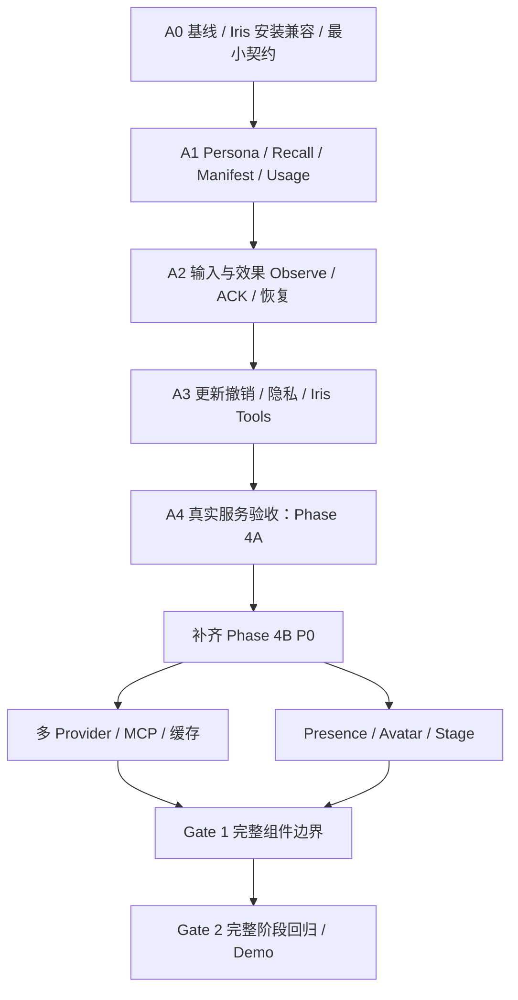

# Phase 4：Runtime 装配与验收

> 原构建计划的主题分册，保留原章节编号；章节目标不等于已交付能力。当前事实见 [实施状态](../../phase-4-implementation-status.md)，恢复 Gate 以 [ADR 0047](../../adr/0047-phase4a-recovery-scope-freeze.md) 为准。
> [返回构建指南](../../phase-4-development-guide.md)。跨分册的 § 引用按构建指南目录定位。

## 11. P6：Runtime 纵向装配、测试与 Demo

### 11.1 Phase 4 Host

Runtime 装配：

```text
authenticated simulated signal
  → Phase3 Signal Pipeline / Trigger
  → Phase4 snapshot barrier
  → ContextBuilder + MemoryGateway + 已预取 PersonaSnapshot
  → DecisionLoop
  ├─→ ToolRuntime + Memory Tools
  └─→ PerformancePort → SceneDirector → Stage Avatar Mixer
Committed facts → Observe Outbox → Memory Providers
World/Avatar state → Presence Engine → Mixer
```

- 一 Session 一 Context/Loop 所有权，Provider 和 Presence 都不推进 Loop；
- Credential 只由 Credential Port 注入 Provider/MCP Adapter，不进入 Prompt、浏览器或 Session 正文；
- 配置更新通过 revision/promptEpoch 生效，不在进行中的 Cycle 或 Scene 中途改写；
- bootstrap 增加显式 Iris 配置与单一实例所有权；禁用配置时保持 Phase 3 路径，无隐藏网络请求。启动失败清理已打开的 Provider/订阅/Lease；业务 appInstanceId 不使用随机进程 instanceId 代替；
- 使用现有 `Phase3DecisionHost`/`DecisionLoop` 的扩展 Port 连接 Context；`request-assembly.ts` 保留兼容入口。持久采用逻辑通过 `DurableCycleAdoption` → `PersistenceClient` → DB Worker 同事务扩展，不在采用成功后补写关键投影；
- 关闭顺序为停止 Ingress → 取消 Context fan-out/Turn → 结算 Scene → 停止 Presence → 停止 Observe Claim → 关闭 Provider/Stage/DB；
- 生产默认不开放模拟输入或任意 MCP Server；只有显式配置和权限目录可装配。

### 11.2 测试矩阵

- **Schema/契约**：Context、Memory、Observe、Avatar State/Lease 的双 dialect 和未知版本；
- **单元**：预算、排序、去重、冲突、隐私、revision、tombstone、行为选择、通道仲裁和恢复；
- **性质**：总 Token 不超限、同输入同 Manifest、隐私不跨域、遗忘不回注、低优先级不覆盖高优先级、取消后无租约；
- **集成**：真实 DB Worker、Context adoption、Tool Runtime、Outbox、MCP stdio/HTTP、Control WS；
- **Iris 公共消费**：独立 SDK 安装物 → 真实 Core API/Worker，验证当前版本、Scope/actor、hash、partial proof、Usage 集合/版本、更新撤销、工具与 Cursor/ACK；Fixture/mock_server 不替代该项；
- **浏览器**：真实 Chromium 中 Idle Presence、Directed 抢占、LipSync 并行、取消和恢复；
- **恢复**：Manifest 预写/adoption 前后、Observe publish 前后、tombstone/cache 竞态、Stage 重连；
- **压力**：Provider 慢/挂/大结果、Observe 积压、World State 洪峰、行为目录大、频繁 Scene 抢占；
- **安全**：记忆 Prompt 注入、跨身份读取、越权写/忘记、MCP 恶意 Schema/路径、Secret Redaction Canary；
- **长时**：缓存、Provider 子进程、Timer、通道租约、WebSocket 和 Worker 无持续增长。

确定性逻辑使用 `VirtualClock`、固定 Seed 和固定 Provider Fixture。MCP 契约测试只连接本地测试进程，不依赖公网、真实账号或商业配额。

### 11.3 Phase 4 Demo

`pnpm demo:phase4` 必须自动启动真实 Runtime 子进程、DB Worker、Control/Media WebSocket、协议 Stage 客户端和本地 Memory/MCP 测试 Provider，执行：

1. 两个 Provider 并行召回，一个按时返回关系记忆，一个超过共享 Deadline；
2. Context Builder 采用按时 Block，记录来源/revision/hash，超时 Provider 明确降级；
3. 模型基于已采用记忆回答，Directed Avatar Scene 抢占正在运行的 Presence；
4. Scene 完成后 Presence 通过中性过渡恢复，Idle 期间模型请求数保持不变；
5. `remember` 经 Tool Runtime/权限/幂等键写入，下一 Cycle/Turn 可召回；
6. 重复 Observe 投递不产生重复记忆；
7. `forget` 生成 tombstone，清除热缓存并拒绝迟到旧 revision 回注；
8. 紧急 Signal 取消慢 Context/Tool/Scene，释放 Avatar 通道；
9. Runtime 重启后 Manifest 仍可审计、Observe 可恢复、过期 Presence 不补播；
10. 关闭后无 Worker、子进程、Socket、Timer、租约、等待者或临时文件残留；
11. Persona 发布版切换翻转 Epoch，瞬时 state 更新不翻转；revoked 立即封锁原人格，不走同身份静态兜底；仅普通断网可按未撤销验证缓存恢复；
12. 输出确认前崩溃不产生虚构 assistant 观察，远端 ACK 前崩溃会由宿主重投，磁盘高水位停止新准入且保留活动场景确认配额。

成功输出至少包含稳定证据行：

```text
phase4-demo: ok
context=ok(blocks=<n>,tokens=<n>,overBudget=0,traceable=true)
memoryFanout=ok(parallel=2,timedOut=1,deadlineMs=<number <= 250>)
memoryRevision=ok(remembered=1,observeDuplicate=0,forgottenReinjected=0)
presence=ok(idleModelRequests=0,behaviors=<n>,repeatViolation=0)
avatarArbitration=ok(preempted=1,recovered=1,leakedLeases=0)
interruptLatencyMs=<number <= 100 + harness tolerance>
recovery=ok(manifestStable=true,observeDuplicate=0,staleBehaviorReplay=0)
```

浏览器 E2E 另证明真实 Stage 的 Directed/Presence/LipSync 通道组合与取消路径；它不复测外部 Provider 网络质量。

### 11.4 阶段完成命令

以下命令在 Phase 4 完成时必须存在并通过：

```bash
pnpm install --frozen-lockfile
pnpm --filter @bellis/stage exec playwright install chromium  # 首次运行/浏览器版本更新时
pnpm check
pnpm build
pnpm contracts:check
pnpm test:browser
pnpm demo:phase1
pnpm demo:phase2
pnpm demo:phase2:crash
pnpm demo:phase3
pnpm demo:phase4
```

真实 Iris 本机集成是 Phase 4A 的**必需**独立 CI/验收 Job，环境未配置时报告未执行，不能将 skip 算作 A4 通过。公网 MCP、商业 Provider 或授权 Cubism 仍为独立可选 Smoke，不作为根离线 `pnpm check` 的依赖。

### 11.5 Phase 4A Iris 专项验收

以下命令从 Bellis 根目录执行。当前 `test:memory:iris` 和 `demo:phase4:iris` 已实现；前者覆盖公共边界与可信输入，后者增加真实 Chromium 输出/取消闭环。新增 `test:memory:iris:continuous` 已通过同一组真实进程的 100 Cycle 及逐轮 Manifest/Persona/Recall/Usage 审计，见 [连续验收](../../phase-4-continuous-validation.md)。`test:memory:iris:recovery` 已接入 Manifest/adoption/Usage 三个窗口、Observation HTTP 三个窗口及 SSE 两个真实进程窗口，完整恢复矩阵仍未完成，当前入口报告 incomplete/退出 2；见 [恢复验收](../../phase-4-recovery-validation.md)。短闭环不代表下表 A4 完成。接入需固定 Core 安装物和公开 API，所有临时服务绑定 loopback 并使用隔离数据目录。

```bash
pnpm test:memory:iris          # Provider 契约/真实 Core 公共消费，包含安装物身份检查
pnpm demo:phase4:iris         # 三轮 Recall/Persona/Usage/确认输出 Observe 闭环
pnpm test:memory:iris:continuous # 100 Cycle 真实连续纵向及逐轮持久记录审计
pnpm test:memory:iris:recovery # Phase 4A：冻结的 8 窗口 × 3 目标 × 20 次 = 480 例
```

| 验收层         | 运行路径                                                            | 通过条件                                                                                                                            |
| -------------- | ------------------------------------------------------------------- | ----------------------------------------------------------------------------------------------------------------------------------- |
| 安装与版本     | 已安装 SDK/Provider → 隔离安装 Core API/Worker                      | 不 alias Core/SDK 源码；清单、迁移与协商解释一致；没有 Console/公网 registry 隐式前置；缺必需能力拒绝                               |
| 连续纵向       | 真实 Runtime/DB Worker + Core/Worker + Stage，固定模型/TTS 测试边界 | ≥100 Cycle，逐次比对 Persona Slot 与 Recall revision、Manifest/预算、Usage 三集合、合法 assistant Observation；调用真实 memory 路径 |
| 输入与输出事实 | 可信模拟观众 → 真实 Stage 确认 → Core 公共读取                      | 输入身份隔离；零输出确认时 assistant 观察=0；partial/cancel/fail 只记已确认增量；字幕/音频不重复，proof 被 Core 接受                |
| 浏览器         | Chromium 实际音频/字幕 Lane、重连与取消                             | receipt 来自实际应用/渲染；绑定代际、内容摘要及 segment；不以协议 Stage mock 代替真实 Lane；不宣称测得物理扬声器发声                |
| 更新与隐私     | Persona 发布/state/revoke、Forget、凭据收紧、SSE 断线               | 同快照稳定；state 不翻 Epoch；撤销失败关闭；旧 Block/缓存/迟到结果/历史重投回注=0                                                   |
| 工具与 Surface | 四类工具的真实 Core 调用                                            | 权限/确认/幂等/修订冲突/取消/未知结果/Legal Hold 正确；每种声称支持的 Surface 模式均有 Proof/Fencing 证据                           |
| Phase 4A 恢复 | 冻结的 8 窗口分别终止 Runtime、Core API、Core Worker，每组合 20 次 | 480/480；原有 Canonical/幂等/Manifest/隐私断言全部通过，聚合返回 covered-windows-passed，命令退出 0 |

根据用户明确决定及 [ADR 0047](../../adr/0047-phase4a-recovery-scope-freeze.md)，Phase 4A 恢复范围在已通过 480/480 时显式冻结：

- Cycle/Usage 三窗口：Manifest 形成/adoption 前、adoption 后/Usage ACK 前、Usage ACK 后/宿主 delivered 前，共 180 例。
- Observe 三窗口：Observe 已持久化/HTTP 发布前、Core 已提交/ACK 未转发、SDK 已确认/宿主 delivered 前，共 180 例。
- SSE 两窗口：pending-persisted-before-host-ack、policy-committed-before-provider-cursor，共 120 例。

每个窗口均覆盖 Runtime、Core API、Core Worker，重复次数保持 20，现有断言和组合不变。顶层按实际用例数、预期用例数和 requiredRepetitions 计算状态；断言失败仍退出 1，缺 Core 安装仍退出 2 并报告 NOT RUN。对每个窗口保留“未发生 / 已持久化 / 结果未知”的不同期望。

原剩余项整体归入 [Phase 4B 待办](../../phase-4b-backlog.md)：采用事务内部中断、Stage 效果耦合和新增组合、效果/Observe 投影事务前后、旧快照与 cursor 扩展、磁盘/WAL 配额与活动 Scene 预留及扩展恢复。既有 Stage 与快照专项证据继续保留；这些扩展不再是 Phase 4A 恢复通过条件，也不能通过自动添加待办扩大这 480 例的验收范围。本文其他章节提及的扩展恢复/容量目标按该归属解释；Phase 4B 未完成不使已通过的 Phase 4A 恢复 Gate 失败。

A4 交付接入配置样例（仅凭据引用）、兼容矩阵、运行/重启/对账/停用说明和原始验收摘要；配置关停 Iris 时停止新查询及投递，但保留 pending/删除账本供恢复。需要回退二进制时先验证 Manifest/Outbox Migration 读兼容，不回改历史 checksum，也不通过恢复旧缓存复活删除内容。

## 12. 后续职责候选与完整阶段验收

以下图表描述当前实施顺序。A0–A4 在宿主功能模块内串起 P0/P1/P2/P3（Iris Tools）/P4/P6；原 P? 编号是职责标签，目录仅为后续拆包候选。



| 工作包 | 主要修改范围                                                                                                               | 禁止越界                                                                      |
| ------ | -------------------------------------------------------------------------------------------------------------------------- | ----------------------------------------------------------------------------- |
| P0     | `packages/contracts/**`、必要 ADR、Migration/Port 设计                                                                     | 不实现 Route、Provider 业务或 Avatar 帧循环                                   |
| P1     | 首先宿主 phase-4 Context 模块与 Decision request assembly Port；后续 `packages/context-builder/**` 候选                    | 纯组装逻辑不连接 MCP/DB，不拥有 Cycle                                         |
| P2     | 首先 `apps/runtime/src/application/phase-4/**` 与 `providers/memory-iris/**`；后续 `memory-runtime`/`persona-runtime` 候选 | Gateway 不写 Prompt；Persona Renderer 只渲染已验证 Persona Slot，不拥有 Cycle |
| P3     | Iris 独立工具适配、宿主 Tool 注册；后续 `packages/memory-runtime/src/adapters/mcp/**` 与 `src/tools/**`                    | 不绕过 Tool Runtime 权限与结果预算                                            |
| P4     | 宿主 effect/Observe/Usage、`packages/persistence/**`；后续 memory-runtime 候选                                             | 不在前台等待远端 ACK；磁盘高水位按 §9 停止新准入                              |
| P5     | `packages/avatar-runtime/**`、`apps/stage/**`                                                                              | 仲裁核心不依赖 React/Cubism/WS，不调用模型                                    |
| P6     | `apps/runtime/**`、必要 Observability、`scripts/demos/phase-4-*`、E2E/恢复 Harness、CI/根脚本                                    | 只通过包根和公开 Runtime/Stage 入口集成                                       |

确有独立工作需要并行时，使用同一已通过的边界基线。跨职责变更先说明接口、兼容影响、最小变更和验证方式。

## 13. Gate 清单

### 13.1 Gate 0：Contracts、隐私与恢复语义

A0 先完成 Iris 必需子集；Avatar/MCP 项在 Phase 4B 开工前冻结，不让整个 P0 成为第一条真实链的前置。

- Phase 3 全量基线通过；
- Iris 当前安装物、SDK 消费、capability/DB Schema 一致性、hash 方案、partial proof、ErrorEnvelope、身份/数字边界已核实；
- Context Block/Manifest、promptEpoch、预算和裁剪顺序无歧义；
- identity/privacy scope 有可信来源，跨域读取默认拒绝；
- Provider Deadline、迟到结果、revision、冲突、纠正与遗忘语义明确；
- Memory Tool 继续服从 Tool Runtime 权限/幂等/确认；
- Observe 与已提交事实、Outbox 和恢复边界明确；
- Avatar 通道、优先级、抢占、淡入淡出、Seed 与取消语义明确；
- 新 Schema 已生成双 dialect 并通过等价 Fixture。

**Phase 4A 单独退出条件**：A0–A4 及 §11.5 全部通过；包括真实 Recall/Persona/Usage/Observe、工具、更新撤销/遗忘、实际 Stage 确认、安装物和恢复证据。不得以离线 Provider 测试通过替代，也不得因此勾选尚未实施的 Presence/MCP Gate。

### 13.2 Gate 1：核心组件公开边界

- Context Builder、Memory Gateway、Persona/Avatar 核心只经明确的模块/包公开 Port 交互；不以拆成四包作为通过条件；
- P2 的 Persona Renderer 同快照字节稳定；瞬时 state 更新不改变 promptEpoch，版本/rendererVersion 变更才翻转；
- Persona 启动就绪、verified-cache/static-fallback、revoked、可选订阅的后台追平策略通过 Harness；
- Context 输出确定性、有界、来源完整且隐私隔离；
- Provider fan-out 并行、独立隔离，取消后无等待者；
- tombstone 能压过缓存命中、迟到响应和重试写入；
- Presence 同输入同 Seed 可重放，不调用模型；
- Directed/Safety/LipSync 优先级和通道租约性质测试通过；
- Phase 3 request assembly、Tool、Performance Port 可通过兼容适配迁移。

### 13.3 Gate 2：Phase 4 完成

- Phase 4A Iris 真实接入 Gate 已通过，所有声明支持的 Core/SDK 组合有安装与运行证据；
- 两 Provider 并行 Context 纵向链路通过，慢 Provider 不拖住回答；
- Persona 启动、更新、撤销、断线和重启缓存通过 Runtime 纵向测试，Cycle 内零网络等待；
- Observe 远端 ACK 前崩溃可重投；片段确认乱序/重复/取消、队列满载与预留配额通过故障测试；
- Manifest 采用、重放和模型可见来源审计完整；
- remember/correct/forget 与 Observe 幂等、恢复、tombstone 不回注通过；
- MCP stdio/HTTP 本地契约、关闭与安全测试通过；
- Idle Presence、Directed 抢占、取消和自然恢复在 Chromium 中通过；
- Context/Scene/Avatar 取消满足时延指标，关闭无资源泄漏；
- Redaction Canary、低基数 Metrics 和 Trace Continuity 通过；
- Phase 1/2/3 Demo 与协议回归全部通过；
- 文档从规划更新为实现事实，并新增 Phase 4 完成态参考。

## 14. Metrics 与 Trace

保留 Phase 1/2/3 指标名称，新增候选目录：

- `bellis_context_build_duration_ms{result}`；
- `bellis_context_blocks_total{source,result}`；
- `bellis_context_tokens_total{section,result}`；
- `bellis_context_cache_total{layer,result}`；
- `bellis_memory_query_duration_ms{provider,result}`；
- `bellis_memory_blocks_total{provider,result}`；
- `bellis_memory_revision_events_total{kind}`；
- `bellis_memory_observe_total{provider,result}`；
- `bellis_memory_observe_backlog{provider}`；
- `bellis_memory_usage_total{provider,result}`；
- `bellis_memory_reconciliation_total{provider,result}`；
- `bellis_persona_readiness{source,state}`、`bellis_persona_refresh_total{source,result}`；
- `bellis_presence_behaviors_total{behavior,result}`；
- `bellis_avatar_preemptions_total{from_layer,to_layer}`；
- `bellis_avatar_channel_conflicts_total{channel,result}`；
- `bellis_avatar_release_latency_ms{reason}`。

标签必须来自启动期有界目录。Block ID、revision、identity、viewer/user ID、Session ID、行为实例 ID、MCP Server URL、错误正文和记忆文本只进入 Trace/结构化审计字段，不进入 Metric label。

Trace 关系：

```text
sessionId / traceId
  → audienceBatchId
  → turnId
  → cycleId / contextManifestId / modelRequestId
  │   ├─→ memoryQueryId / providerId / block refs
  │   ├─→ toolRunId / memory revision
  │   └─→ sceneId / cueId
  → observeOutboxId / provider delivery
  → presenceEpoch / behaviorInstanceId / avatar lease
```

所有跨异步边界必须显式传播 TraceContext。Provider 原始响应、Memory Block 正文、MCP stderr、Viewer 私有数据和逐帧 Avatar 参数默认不写普通日志。

## 15. 故障与恢复矩阵

| 故障点                          | Context/Cycle            | Memory/Observe                                         | Avatar/Scene                         | 恢复行为                               |
| ------------------------------- | ------------------------ | ------------------------------------------------------ | ------------------------------------ | -------------------------------------- |
| Provider 查询中超时             | 候选未采用，其他贡献继续 | 可使用合规短期缓存                                     | 无影响                               | 晚到结果不进当前 Cycle                 |
| Manifest 生成后、模型前崩溃     | 未采用                   | 无该 Cycle Usage/assistant Observe，已受理输入独立交付 | 无 Scene                             | 孤儿 Manifest 可清理，不视为模型已见   |
| 模型后、adoption 前崩溃         | Manifest 未采用          | 无该 Cycle Tool/Usage/assistant Observe                | Prepare 丢弃                         | 不推进水位；保留请求遥测，输入观察独立 |
| adoption 后、Scene 前崩溃       | Manifest 已引用          | Usage pending，无虚构 assistant Observe                | Scene 服从 Phase 2                   | 不重问模型；按记录对账                 |
| Observe publish 后、mark 前崩溃 | Cycle 不回滚             | 至少一次重投，业务幂等                                 | 无影响                               | 不产生重复记忆                         |
| remember 运行中崩溃             | Cycle 已采用             | idempotent 可对账；未知则 uncertain                    | Scene 独立                           | 非幂等绝不自动重试                     |
| forget 后旧查询迟到             | 新 revision 生效         | tombstone 拒绝旧 revision                              | 无影响                               | 缓存失效，不重新注入                   |
| MCP stdio 子进程崩溃            | 该 Provider 降级         | 在途失败/可重试分类                                    | 无影响                               | 后续 Cycle 可重连，当前 Manifest 不变  |
| Directed Scene 取消             | Context 无变化           | Observe 记录真实取消                                   | 释放 Directed 租约                   | 中性过渡后 Presence 重选               |
| Stage 断线                      | Cycle/Scene 按既有规则   | Observe 独立                                           | Safety/Base，丢弃过期 Presence delta | 重连应用权威快照，不补播旧行为         |
| Runtime 重启                    | 读取已采用 Manifest      | Lease 回收/tombstone 先加载                            | 新 Presence epoch/Seed               | 不恢复旧 Timer 或过期动作              |

恢复逻辑必须基于版本化持久化事实、revision/tombstone 和权威快照，不能根据日志顺序、进程内 Map、Provider 猜测或浏览器残留 DOM 推断。

## 16. 风险与禁止捷径

- 不把 MCP SDK、外部 Memory SDK 或 Cubism SDK 类型导出为核心契约；
- 不让 Memory Provider 返回完整 Prompt、system role 或可执行指令；
- 不以 `Promise.all` 串行 fallback 掩盖共享 Deadline 和真正取消；
- 不使用未验证用户名、昵称或模型推断自动合并身份；
- 不为了缓存命中跨 privacy domain 复用 Block；
- 不在 tombstone 之后接受旧 revision 的迟到响应或重试写入；
- 不把 Observe 放入模型请求、Cycle adoption 或 Scene Commit 的前台等待路径；
- 不让 Memory Tool 绕过 Tool Runtime 直接执行写入/遗忘；
- 不用模型判断 Context 冲突、裁剪或权限；这些必须确定性执行；
- 不把 Presence 变成第二个 Agent Loop，也不为眨眼、呼吸、注视调用模型；
- 不通过 Control WS 发送逐帧 Live2D 参数或让 React State 驱动帧循环；
- 不让 Presence/Reactive 输入绕过 Mixer 直接写 Adapter；
- 不以真实公网 MCP、商业记忆账号、私有 Live2D 模型或未授权 SDK 作为 CI 前置；
- 不删除或改写 Phase 1/2/3 Demo 来让新架构看似通过；
- 不在 Phase 4 顺带建设正式平台插件、游戏输入或完整 Plugin SDK。

## 17. 阶段交付格式

每个工作包交付时报告：

```text
任务：Phase 4A / A?（职责 P?）或 Phase 4B / P?
状态：完成 / 部分完成 / 阻塞

基线：
- 起始 Commit
- Gate 检查结果

改动：
- 文件/包
- 公开接口
- Migration/协议/兼容影响

不变量：
- 本包证明了什么
- 哪些由后续包证明

验证：
- 执行命令
- 关键证据

隐私与恢复：
- identity/privacy 影响
- revision/tombstone/Observe 行为

风险：
- 已知限制
- 后续交接
```

Phase 4 完成后删除临时分支、文件所有权和执行提示，只保留完成态参考、稳定协议、测试和必要 ADR。
