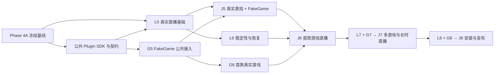

# Phase 5–8 双线路线图

状态：2026-09-07 修订，待实施。当前事实见 [能力状态](../reference/current-status.md)。Phase 4A 冻结结果不变；Phase 4B 的未完成工作有明确承接位置，不视为随阶段编号自动完成。

产品按两条工作线推进：**L 为直播套件，G 为独立游戏平台**；J 为二者的联合验收。Phase 是交付批次，不要求两条线锁步开发；整阶段完成必须同时满足本阶段 L、G 和 J。任何一条线缺条件都单独标记，另一条线可继续独立工作。

## 交付顺序

| 阶段 | 直播套件 L（Bellis） | 游戏平台 G（独立仓库 + Bellis 接缝） | 联合出口 |
| --- | --- | --- | --- |
| **Phase 5：真实直播基础 + 公共接入** | **L5**：真实 LLM/TTS、Cubism、基础 Mixer/Presence、首个直播平台插件、最小 Studio、无游戏 OBS 演示 | **G5**：公共 Plugin SDK、GameProvider/Session Activity、Adapter SDK、FakeGame、HTTP/SSE Client 和单一薄插件，attach 与干净包产物联调 | **J5**：FakeGame 事件经同一人格、Scene、真实声音/角色和 Iris 通道；活动与普通聊天独立，取消及确认去重成立 |
| **Phase 6：稳定直播 + 首款真实游戏** | **L6**：故障降级、可信人工接管、真实负载指标、隐私/历史屏障和本阶段必需恢复；最小运维与 Trace | **G6**：Windows 单桌面/单前台原神，捕获/Broker/看门狗 → 无 LLM 战斗 → 剧情/导航/GUI → 固定任务链与检查点候选更新 | **J6**：真实弹幕 + 原神 + 语音/角色 + Iris + OBS，完成冻结任务链及联合故障/负载验收 |
| **Phase 7：直播扩展 + 多游戏/跨机** | **L7**：多 Provider、MCP、完整角色反应策略、诊断/脱敏回放和长时直播；关闭剩余 Phase 4B 清单 | **G7**：第二款真实游戏短流程、能力发现、切换与包隔离；配对跨机沿用同一协议 | **J7**：切换游戏/Host 后人格、记忆来源、播报和输入归属正确；长时运行和断网恢复通过 |
| **Phase 8：两套应用产品化** | **L8**：完整 Studio、Launcher、凭据与资源配置、Windows 安装、签名更新/回滚 | **G8**：独立游戏应用、受控 managed、运行时/包/模型组合安装与更新 | **J8**：无源码/开发工具安装、独立升级及组合回滚、Windows/OBS 发布矩阵通过 |

**首款真实游戏从 Phase 6 开始，Phase 7 才加入第二款。真实声音、角色和直播平台在 Phase 5 交付，不能推迟到 Phase 8。** L5 是可操作的开发版直播基础；J6 是首款游戏直播闭环；J8 才是可发行产品，不混称“整套完成”。

## 并行与依赖

公共 SDK 的注册、权限、禁用清理和包产物由 Bellis 维护一份，供平台插件与游戏薄插件复用；直播线可以先做现有端口上的 TTS/Avatar，游戏平台可以先做公共模型和 FakeGame，不能各自复制一个插件宿主。G5 的虚拟输入测试不依赖 L5 外部服务；G6 平台/战斗开发可在 G5 通过后推进，但 J6 必须等直播线就绪。Phase 7 的真实联合验收以前一联合出口为前置，通用包的独立开发可提前进行。

## 联合 Gate 的可验证范围

以下均为新增验收要求，当前未运行。准确指标、样本量、机器/软件版本与负载在相应阶段开工时冻结，结果记录到有界摘要；不得在失败后调低阈值并覆盖原结论。

| Gate | 必须同时具备 | 必验场景与完成依据 |
| --- | --- | --- |
| **J5** | L5 全部子项 + G5.0–G5.5 | 真实输出的 FakeGame 演示；普通 Turn 结束不结束 Activity；人工停止活动、部分播报、重复事件/回执、禁用插件、断线重连；未播放片段不写为已说，游戏侧不另开 TTS/Iris 写通道 |
| **J6** | J5 + L6 + G6A–G6D + Windows/游戏/OBS 条件 | 冻结原神完整任务链；弹幕可回应且战斗快循环不等 LLM；输入释放、失焦/撤权/崩溃、TTS/模型/Core 失败；计划至少 2 小时联合负载，另用独立样本验证取消/输入指标 |
| **J7** | J6 + L7 + G7 | 第二游戏真实短流程；先释放旧输入再重绑/Arm，旧事件/记忆/阅读回执隔离；跨机掉线后原操作对账；计划至少 8 小时冻结直播负载，不能仅用空闲计时替代 |
| **J8** | J7 + L8 + G8 | 干净 Windows 安装、签名/哈希与实际组合清单、受控更新失败回滚、数据库兼容、OBS 音画与恢复；每个声明支持的组合都有结果 |

2/8 小时是本计划的新验收目标，不是已有成绩，也不能替代统计延迟、故障注入和长期资源增长检查。外部条件缺失保持“未运行”；确定性夹具仍用于 CI，但不能代替对应真实输出/平台/游戏 Gate。

## Phase 4B 的承接

| 原待办 | 新交付位置 |
| --- | --- |
| Avatar Mixer、Presence、Stage 装配 | L5 的真实角色基础；L6 的抢占/重连与资源验证；L7 的完整策略 |
| 多 Provider、MCP | L7；不阻塞 G5/FakeGame |
| 活动 Stage/Observe 崩溃组合、历史缺口与 cursor 安全解除 | L6/J6 先完成直播实际依赖范围，剩余命名组合在 L7/J7 前关闭 |
| 容量/旧快照/WAL 与完整恢复 | L6 做准入、可控降级及关键收尾验证；L7 关闭其余清单，L8 另验安装升级矩阵 |
| Phase 3 遗留取消 P99 验收 | L6 独立按真实负载采样，不能引用一次 Demo 延迟替代 |

细项来源继续保留在 [Phase 4B 待办](./phase-4/backlog.md)。关闭一项要链接实际新证据；所有原定 Gate 关闭前不得宣布完整 Phase 4 完成，不给冻结 480 例增加新含义。

## 外部支持与最晚到位时间

| 到位点 | 用户/外部必须提供 | 工程可先完成 |
| --- | --- | --- |
| L5 真实声音与角色 | 可用 LLM/TTS 端点、本机凭据配置和测试预算；可用 Cubism SDK/角色、动作/表情与使用范围 | 端口适配、测试夹具、配置与资源校验；不凭空生成所需账号或授权资产 |
| L5 平台与 OBS | 首个平台默认 Bilibili；可访问的测试直播间/账号与人工登录；Windows 11 交互桌面、OBS、可检查音画的操作者 | 平台插件、事件回放、Studio、接线说明；开发过程用模拟流，真实 Gate 用测试房间。公开开播/外部发消息另按实际授权 |
| G5.0 | 游戏仓库最终名称与访问/创建范围；v0.3 原文或补齐其继承语义的明确规格 | 包布局、契约草案、FakeGame；未知精确状态机不假定已确认 |
| G6/J6 | 原神安装与测试账号、游戏版本/语言/分辨率/缩放、冻结场景、人工登录/选窗/Arm；同机 OBS | 捕获/输入端口、Broker、脚本与证据；是否需要独显/重模型按实测确定 |
| L7/G7/J7 | 选定第二款游戏及短流程；第二台机器与可配对网络；选定 MCP/其他 Provider 的真实测试服务 | 多包兼容、协议与隔离夹具、断线恢复；不以购买新服务作为公共包开工前提 |
| J8 正式发行 | 发布身份、签名能力、分发位置和权限、资源分发许可 | 开发签名、打包、安装与回滚自动化；正式发布按授权执行 |

Iris 使用现有独立服务或隔离安装，不新增游戏专用事实源。凭据保存在本机配置/凭据设施，不放进计划、源码、能力清单或报告。

## 执行文档

- [Phase 5 总入口与精简 goal prompt](./phase-5.md)：当前下一批工作。
- [直播线 L5–L8](./live/README.md)：直播交付与各项验收。
- [游戏线 G5–G8](./game/README.md)、[G5 详细指南](./game/phase-5.md)：保持 v0.4 多仓边界。
- [构建与验收](../guides/build-and-validation.md)：只列现有命令。

每个可验证切片形成独立提交；有推送授权时才保存到指定远端。原始报告/录屏归 artifact，摘要同主题替换。工作阻塞时记录具体条件和未通过 Gate，不静默省略直播线，也不无限扩充游戏列表、恢复窗口或阶段编号。
