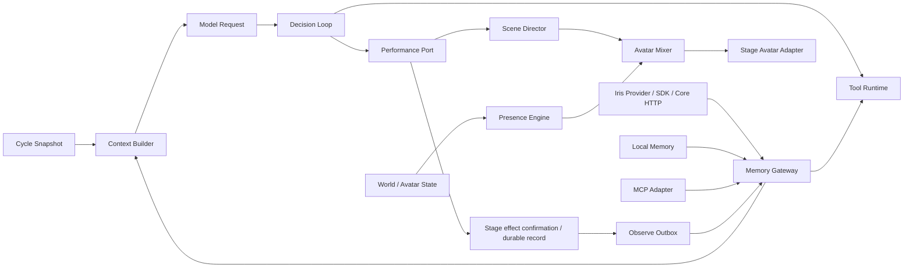

# Phase 4：范围与架构

> 排期以 [双线路线图](../../README.md) 为准；下文保留原始阶段要求，历史性的“尚未交付/先后顺序”以 [当前状态](../../../reference/phase-4-status.md) 和 [待办承接](../backlog.md) 校正。

> 原构建计划的主题分册，保留原章节编号；章节目标不等于已交付能力。当前事实见 [实施状态](../../../reference/phase-4-status.md)，恢复 Gate 以 [ADR 0047](../../../adr/0047-phase4a-recovery-scope-freeze.md) 为准。
> [返回构建指南](../README.md)。跨分册的 § 引用按构建指南目录定位。

## 0. 如何使用本文

本文把技术路线中的“阶段四：记忆和主动表现”拆成可开发、可验收的纵向工作包。实施顺序为：

1. A0 复验 Bellis 基线，并对齐真实 Core/SDK/Provider 安装物、运行协商、身份与跨边界契约。
2. A1 在 Runtime 功能模块内复用 Iris 的 PersonaSource/MemoryProvider，完成有界 Context、身份/隐私校验、来源审计、Usage 与取消。
3. A2 接入实际输出确认和持久 Observe Outbox，完成输入观察、片段回写、远端 ACK、游标对账与重启恢复。
4. A3 补齐人格撤销、外部删除失效和 Iris Memory Tools；A4 通过真实 Core + Bellis + Stage 验收，形成“Phase 4A Iris 接入完成”证据。
5. 再推进 Phase 4B 的多 Provider、MCP、Presence/Avatar；全部阶段 Gate 通过才生成 Phase 4 完成态参考。P0–P6 保留为职责与验收目录，拆包不是前置。

本文中的目录、接口名、Migration、指标和命令是阶段交付目标，不是已经存在的稳定接口。仓库已有 memory 契约及 Iris 独立 Provider 原型，但宿主 Context/Memory/Persona/Avatar 纵向链路尚未交付；原型不构成 P0 或阶段 Gate 已通过的证据。本文受 [ADR 0006](../../../adr/0006-documentation-and-delivery-boundaries.md) 的输出确认、ACK、容量与更新语义约束。任何改变既有 `DecisionPacket`、Cycle adoption、Scene Commit、Control WebSocket 或恢复语义的决定，必须先经过 P0 Gate，并记录 ADR 或兼容说明。

### 0.1 本轮接入范围与外部依赖

首个生产记忆目标明确为 `iris_memory_core`，接入路径为 `providers/memory-iris` → 已安装的 `@iris-memory/sdk` → 独立 Core `/v1` 服务。Bellis 不打开 Core 的 SQLite、FAISS、队列或私有组件。Iris 的 Phase 11 当前 Deferred；本计划承担 Bellis 侧工作，不等待其恢复，也不改变 Core pip 发布范围。

| 归属                    | 本计划要求                                                                         | 不以何种状态代替完成                            |
| ----------------------- | ---------------------------------------------------------------------------------- | ----------------------------------------------- |
| Bellis Phase 4A         | Provider 兼容与映射、宿主 Context/Persona、Observe/Usage、Iris Tools、真实服务集成 | 现有原型/最小 Conformance 测试通过              |
| Iris Core/通用 SDK 收尾 | 可安装 API/Worker、受控初始化、版本协商一致、公共方法/错误/Abort/数字范围契约      | 只修改 SDK 类型、放宽 Schema 上限或使用私有组件 |
| Bellis Phase 4B         | 多 Provider 隔离、MCP、Presence/Avatar 与原完整阶段 Gate                           | 4A 通过不代表 4B 或整个阶段通过                 |

A0 可使用固定版本的本地 registry/候选安装物，不要求公开 npm/PyPI 或完整 Console 先完成。当前 SDK 0.11.2 使用仓库内不可变候选压缩包与冻结锁文件，正式 Provider 已发送协商后的事件检查点，安装与兼容证据见 [ADR 0044](../../../adr/0044-phase4-installed-checkpoint-sdk.md)。服务端所需公共能力或凭据初始化确实缺失时，登记具体上游契约问题，继续可独立完成的宿主工作；相应真实服务 Gate 保持未通过。现有工作树已有 `init` 运维入口，其安装可用性仍需验证。

### 0.2 Phase 4A 执行工作包

以下按顺序集成，每包结束即运行相应纵向检查，不等多个包建完才首次联调。A0 只冻结该链必需语义；MCP/Avatar 的 P0 在 Phase 4B 开工前补齐。

| 工作包                      | 实施内容与主要位置                                                                                                                                                                                                                 | 完成证据                                                                                                                                                                       |
| --------------------------- | ---------------------------------------------------------------------------------------------------------------------------------------------------------------------------------------------------------------------------------- | ------------------------------------------------------------------------------------------------------------------------------------------------------------------------------ |
| A0 兼容与最小契约           | `providers/memory-iris`、`contracts/memory`、Testkit；固定 Core/SDK 安装物，核对运行协商与 Migration、错误/Abort、hash、Scope/actor、效果证明、Usage 血缘和四种水位；确定 Effect/Manifest/Outbox 增量 Migration                    | 当前真实 Core 公共 API 的适配探针；不兼容/非法 hash/partial proof/权限等负例；支持矩阵只列实测组合；Phase 1–3 基线复验                                                         |
| A1 Recall + Persona + Usage | `apps/runtime/src/application/phase-4/`；启动期人格就绪与单一生命周期；给 Decision Loop 注入可取消的 Context 构建 Port；扩展 `DurableCycleAdoption` 和 DB Worker 事务保存 Manifest 与 Usage Outbox；替换 Memory topic 的录制发布器 | 同一请求的 Recall 候选、实际模型输入、Persona Slot、三集合与 Core Usage 一一对应；Recall 超时 ≤250ms；adoption 回滚无 Usage；零 actor/跨域/低预算有明确结果                    |
| A2 输入/效果 Observe 与恢复 | Stage Lane/Control 确认、Runtime effect service、persistence 事务与现有 Outbox；可信输入受理投影、增量已确认片段、每 stream 连续 cursor、ACK 分类和持久对账                                                                        | 重复输入/确认不重复；未播放=0，取消保留已确认前缀；Core ACK 前后崩溃可重投；Worker 停机时仍可持久接收；恢复不重播 Scene                                                        |
| A3 更新与受控工具           | Iris Persona/SSE 生命周期、宿主 invalidation/tombstone；经现有 Tool Runtime 注册 search/remember/correct/forget；SDK 缺少的错误/取消能力由公共边界补齐                                                                             | Persona 刷新失败可追平、revoked 不走旧缓存兜底；Forget/隐私收紧拒绝热缓存及迟到结果；四工具真实调用、幂等/修订冲突/Legal Hold/unknown outcome；只开放通过 Gate 的 Surface 模式 |
| A4 真实服务验收与运行交付   | Runtime bootstrap/config、可重现 SDK/Provider 安装、独立 CI Job、真实 Core API/Worker + Bellis Runtime/DB Worker + Stage、恢复 Harness、接入说明                                                                                   | 连续 ≥100 Cycle；定义的双进程崩溃窗口各 ≥20 次；真实 Chromium partial/cancel/reconnect；安装/启动/停止/失效/凭据隔离/回退记录；完成清单逐项有证据                              |

首个可演示切片为 A0 + A1 + A2 的单次真实往返；A3/A4 未通过时只能标记部分完成。长期记忆事实源为 Iris，确定性本地 Provider/FakeIrisClient 只作对照与故障注入。

## 1. 阶段定义

Phase 4 对应 [技术选型基线 §20](../../../architecture/technology.md) 的“阶段四：记忆和主动表现”，覆盖 [系统架构设计 §20](../../../architecture/overview.md) 中 Milestone 3 的主动角色核心和 Milestone 4 的外部记忆：

- 在每个 Cycle 的快照屏障内并行构建 Base、World、Audience、Tool Result 与 Memory Context；
- 由单一 Context Builder 执行来源标记、隐私过滤、冲突保留、排序、去重和 Token 预算；
- 通过稳定 `MemoryProvider` Port 先接入 Iris HTTP Provider，后续扩展确定性测试 Provider 和 MCP Adapter；
- 将记忆工具注册到既有 Tool Runtime，继续服从权限、调用列表并发、Deadline、取消和幂等约束；
- 在已提交事实之后通过 Outbox 异步 Observe，不把记忆写入放进直播响应关键路径；
- 通过 Avatar Mixer、Presence Engine 和资源仲裁，让角色在没有模型请求时仍自然表现；
- 让 Directed Scene 动作可靠抢占低优先级主动动作，并在结束或取消后自然恢复。

Phase 4 不替换 Decision Loop、Tool Runtime 或 Scene Director。Context 和 Memory 是能力供应者；Presence 是低优先级本地控制器；模型请求仍只有一个最终 `DecisionPacket`，所有 Directed Avatar 行为仍通过既有 Scene 路径生效。

### 1.1 阶段目标

Phase 4A 必须先完成 Iris 的真实纵向链路；下图列出 Phase 4A + 4B 的完整阶段目标：

```text
Simulated Audience / World / previous Tool Results
  → Cycle snapshot barrier
  ├─→ Base + Conversation + Audience + World contributions
  ├─→ Iris Memory Provider → 公共 SDK → Core HTTP API
  └─→ Deterministic Provider / MCP Adapter（Phase 4B）
  → Context Builder（privacy / provenance / conflict / dedupe / budget）
  → adopted Context Manifest + promptEpoch
  → ModelProvider → DecisionPacket
  → Tool Runtime（memory_search / remember / correct / forget）
  → Scene Director → Directed Avatar Cue

Committed Session Facts
  → Memory Observe Outbox
  → idempotent Provider observe
  → revision / tombstone / cache invalidation

Idle / reactive World State
  → Presence Engine（deterministic seed / cooldown / bounded scheduler）
  → Avatar Mixer / Resource Arbiter
  ← Directed Scene / LipSync / Safety priorities
  → Stage Avatar Adapter
```

验收场景必须同时证明：多个 Memory Provider 在共享 Deadline 内真实并行；一个超时 Provider 不拖住模型请求；模型可见的每个 Memory Block 可追溯到来源和 revision；显式遗忘产生 tombstone 并立即阻止旧缓存回注；Idle Presence 不发起模型请求；Directed Scene 抢占冲突通道后，Presence 在 Scene 完成或取消时恢复，且不出现动作跳变、定时器泄漏或过期行为补播。

### 1.2 完成指标

| 指标                              | Phase 4 验收目标 | 说明                                                                 |
| --------------------------------- | ---------------: | -------------------------------------------------------------------- |
| Context 构建本地路径 P95          |          ≤ 50 ms | 不含外部 Provider；固定 Fixture 与虚拟时钟验证                       |
| Memory 前台共享 Deadline          |           250 ms | 默认 200 ms，可配置 150–250 ms；不是每 Provider 依次等待             |
| 单 Memory Provider 超时的额外阻塞 |  ≤ 共享 Deadline | 其他贡献和模型请求继续，不串行叠加                                   |
| 模型可见 Memory Block 可追溯率    |             100% | `providerId`、`blockId`、revision、hash、privacy scope 均有审计      |
| 超预算模型输入                    |                0 | 预算前估算、组装后复核；确定性裁剪并记录原因                         |
| 显式遗忘后旧值重新注入            |                0 | tombstone/revision 优先于 L1/L2/Provider 旧结果                      |
| Observe 重试产生重复写入          |                0 | 至少一次 Outbox + Provider 业务幂等键                                |
| Idle Presence 模型请求数          |                0 | 主动眨眼、呼吸、注视和随机动作不唤醒 LLM                             |
| Directed 抢占冲突通道             |             100% | Safety/LipSync/Directed 优先级不可被 Presence 覆盖                   |
| Avatar 仲裁取消与释放 P99         |         ≤ 100 ms | 从 Scene/Session 取消到通道租约释放                                  |
| 有界资源                          |   全部显式且可测 | Block、Provider、Prompt、Observe、行为、通道、Timer 与状态流均有上限 |
| Phase 1/2/3 回归                  |         0 个失败 | 既有 Demo、浏览器、协议和恢复语义保持兼容                            |

公网时延只记录，不作为离线 CI 硬 Gate。Phase 4A 使用本机隔离部署的真实 Core API/Worker 验收，并单独记录 Core 接收、投影可见和宿主总延迟；离线 Fixture 与脚本化慢/错 Provider 不能替代该 Gate。Phase 4B 补本地 MCP 测试进程和并发测试。

## 2. 明确范围

### 2.1 本阶段实现

- `ContextContribution` / `ContextBlock` / `ContextManifest`、`promptEpoch` 和 Memory Query/Observe 的版本化契约；
- 有界 Context Contribution Pipeline、确定性排序/去重/冲突保留、隐私域检查和 Token 预算；
- Stable Prefix、Append-only Conversation 与 Dynamic Tail 的稳定组装边界；
- Memory Gateway、Iris Provider 的兼容修复与运行时接入、确定性测试 Provider、独立 Deadline/Abort/健康状态；多 Provider bulkhead 在 Phase 4B 扩展；
- Context Manifest 持久化与 tombstone 防回注；Memory 结果 L1/L2 缓存在失效可靠后启用，不是首个真实往返的前置；
- MCP v2 Adapter 的 stdio 与 Streamable HTTP 边界，至少完成一个本地协议纵向测试；
- Memory Tool 到既有 Tool Runtime 的注册适配，包括 search、remember、correct、forget 的权限和幂等策略；
- Scene/Cycle 已提交事实到 Memory Observe Outbox 的版本化投影、重试、死信与对账；
- `packages/avatar-runtime` 中的纯确定性 Avatar Mixer、Presence Engine、行为目录、通道租约和资源仲裁；
- Stage 侧主动表现状态流、Directed Cue 抢占/恢复、Recording/DOM Adapter 测试路径；
- Provider 插件缝：`@bellis/contracts` 的 `memory` 子路径导出、配置驱动的
  `MemoryProviderRegistry`、`@bellis/testkit` 的 Provider Conformance Harness；
- `PersonaSource` Port、人格确定性渲染器、Persona Slot 与启动期人格就绪门禁；
- Cycle adoption 事务内的 `memory.usage.v1` Outbox 投影与 Provider fan-out；
- `pnpm demo:phase4`、浏览器专项用例、恢复/隐私 Harness 和新增指标。

### 2.2 本阶段不实现

- 正式 Bilibili 或其他直播平台插件；Phase 4 继续使用已鉴权的模拟 Signal；
- Core 的内部认知引擎、存储/索引重构、Console 和发行工程；所需公共契约缺口按 A0 登记到 Core 收尾，不由 Bellis 访问私有组件绕过；
- 完整 Plugin SDK、Marketplace、第三方 UI、插件热更新或不可信插件通用隔离；
- 云端托管记忆产品、embedding 服务选型、向量数据库或跨设备同步；本地 Provider 可以使用确定性文本索引验证边界；
- 允许 Memory Provider 直接编辑 system prompt、旧对话、World State、DecisionPacket 或共享可变状态；
- 多模型路由、模型竞速、自动人格改写或基于记忆的隐式权限提升；本阶段**只消费**
  外部记忆系统已发布的人格，不注册任何人格写工具，不实现提案生成、评审 UI
  或自动发布（[ADR 0005](../../../adr/0005-memory-provider-seam-and-persona-ownership.md) 决策 3.6）；
- 正式 Cubism SDK/模型资产打包；CI 继续使用 Recording/DOM Adapter，授权资源只做显式手工 Smoke；
- TTS viseme 产品化、逐帧 Cubism 参数协议或通过 Runtime 发送每帧 Avatar 参数；
- 游戏输入、Rust Sidecar、OBS 产品化 Overlay 或 Studio 完整记忆管理 UI；
- 跨 Provider 自动合并身份；未经可信映射的相同用户名必须保持隔离；
- 在未确认 Provider 支持前承诺物理删除；不支持时必须返回明确状态并保留本地 tombstone。

## 3. 不可破坏的不变量

1. **单一 Context 所有权**：只有 Context Builder 决定模型最终看到哪些 Block；Provider 只能贡献候选内容。
2. **快照不可变**：一个模型请求采用的 Context Manifest 在该 Cycle 内不可修改；晚到结果只进入缓存或后续 Cycle。
3. **来源不可丢失**：所有外部内容必须携带 Provider、revision、hash、privacy scope 和 source refs；裁剪后仍可审计。
4. **不可信边界**：Memory、Audience 和 Tool Result 永远作为带来源的数据块进入 Dynamic Tail，不能成为 system 指令。人格是被显式授信的独立通道，但排在安全与直播规则之后，且不得声明工具权限、改写输出协议或放宽安全规则。
5. **共享前台 Deadline**：Provider fan-out 并行且共用总预算；慢 Provider 不能串行放大关键路径。
6. **身份与隐私隔离**：缓存、查询、记录与遗忘都包含可信 identity scope 和 privacy domain；禁止跨 Session/Profile/Viewer 泄漏。
7. **遗忘优先**：纠正、遗忘和隐私收紧的 revision/tombstone 优先于任何旧缓存、迟到响应和重试消息。
8. **Observe 不阻塞演出**：只有已提交事实进入 Observe Outbox；Provider 写入失败不得回滚 Cycle 或 Scene。
9. **副作用继续受控**：Memory Tool 继续经过 Tool Runtime 的权限、确认、幂等、资源锁、结果预算和审计。
10. **Presence 不拥有决策**：Presence 不调用模型、不生成 Speech、不提交 Directed Scene，也不能修改 Signal 水位。
11. **语义意图而非帧参数**：模型、Memory 和 Runtime 只传递语义 `AvatarIntent`/状态；帧级混合只在 Stage Adapter 内完成。
12. **确定性仲裁**：相同 Clock、World Snapshot、行为目录、Seed 和输入事件必须产生相同高层选择与抢占结果。
13. **高优先级绝不被覆盖**：Safety > LipSync > Directed > Reactive > Proactive > Base；低层不得写入未持有的通道。
14. **取消即释放**：Scene/Session 取消必须停止过期行为、释放租约和 Timer；恢复后不得补播已过期动作。
15. **测试与生产同路径**：Fake Provider/Clock/Adapter 只替换外部边界，不绕过 Builder、Gateway、Outbox、Mixer 或 Scene/Stage 协议。

## 4. 目标架构与依赖方向



后续独立使用需求得到验证后的拆包候选（不作为首条链路前置）：

```text
packages/
  context-builder/
    src/budget/
    src/assembly/
    src/privacy/
    src/cache/
    test/
  memory-runtime/
    src/gateway/
    src/registry/
    src/providers/local/
    src/adapters/mcp/
    src/observe/
    src/usage/
    test/
  persona-runtime/
    src/source/
    src/renderer/
    src/readiness/
    test/
  avatar-runtime/
    src/mixer/
    src/presence/
    src/behaviors/
    src/resources/
    test/
providers/                 # 独立插件过渡目录，不属于根 workspace
  memory-iris/              # Phase 4A 接入目标；当前独立安装，迁入 CI 后再调整 workspace
apps/
  runtime/src/application/phase-4/
  stage/src/avatar/
scripts/
  phase-4-demo.mjs
  phase-4-demo-child.mjs
```

依赖方向：

```text
contracts ← context-builder
contracts ← memory-runtime → tool-runtime
contracts ← avatar-runtime
       ↑           ↑
decision-loop ─────┘
       ↑
runtime application → persistence / observability
       ↓
performance port → scene-runtime / transport → stage → avatar-runtime
```

约束：

- `context-builder` 不依赖 Model SDK、Fastify、SQLite、MCP SDK、Stage 或具体 Provider；
- `memory-runtime` 不拥有 Turn/Cycle，不提交 Scene，不直接写 Prompt；
- `avatar-runtime` 的仲裁核心不依赖 React、DOM、Cubism SDK、WebSocket 或 Node Runtime；
- MCP Adapter 只做协议映射和能力收窄，不成为 Tool Runtime 或 Context Builder 的替代；
- Runtime Route 只做鉴权、边界校验和应用服务调用，不直接查询 Provider 或修改记忆；
- Directed Avatar Cue 继续走 Phase 2 Scene/Stage 协议；Presence 只通过受限低优先级入口进入 Mixer；
- `@bellis/testkit` 继续只出现在 devDependencies。
- `providers/*` 下的 Provider 与仓库外实现受同一约束：只依赖 `@bellis/contracts` 的
  `memory` 子路径，经 `MemoryProviderRegistry` 配置注册，必须通过 Conformance Harness；
  过渡期不入 workspace，本仓库 CI 保持离线可跑（[ADR 0005](../../../adr/0005-memory-provider-seam-and-persona-ownership.md) 决策 6）。

## 交付顺序与解释优先级（ADR 0007/0008）

首个工作包按 §0 的 A0–A2 在 Runtime 功能模块内复用 Iris PersonaSource/MemoryProvider 与实际效果后的 Observe，随后以 A3/A4 关闭更新、工具和真实服务验收。ADR 0008 修订来源 hash、Iris 交付归属与验收范围；ADR 0007 的单一任务所有者与先纵向后拆包继续有效。

ContextContribution 的路由、映射、人格关联元数据为可选字段；本地简单检索器不需要这些字段。Gateway 仅在 Provider 声明并返回对应能力时解释扩展；缺失不伪造为 0 或默认人格。Persona 必须从独立 PersonaSource 获取，召回只能提示失效。Iris 独立包的契约变更必须与宿主同时验证。
