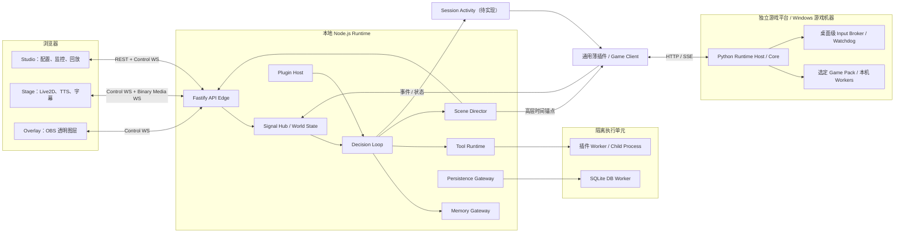

# Bellis Autonomous Live：技术选型基线

> 2026-09-06 架构审查修订：任务所有权、工具恢复事实、调用列表范围、场景终态、Seq 分段预留及 Provider 接缝以 [ADR 0007](./adr/0007-task-ownership-and-runtime-scope.md) 为准。

> 文档状态：实现技术基线 v1
>
> 产品形态：本地 Runtime + 浏览器 Studio + OBS Stage
>
> 首发平台：Windows 11 x64
>
> 更新日期：2026-09-07
>
> 关联文档：[系统架构设计](./architecture-plan.md)

> 2026-09-07 游戏规划修订：[ADR 0048](./adr/0048-external-game-runtime-and-session-activity.md) 采用独立游戏平台、Session Activity、HTTP/SSE 和桌面级输入权威；[Phase 5–8 路线图](./phase-5-and-beyond-roadmap.md) 替代旧后续排期。新边界均待实现与验收。

## 1. 选型结论

Bellis Autonomous Live 采用 Windows-first 的本地实时产品形态：Node.js/TypeScript Runtime 负责核心决策、插件编排和场景调度；浏览器提供 Studio、Stage 和 Overlay；React 负责操作界面，Web Audio 与 Live2D Web SDK 负责实时表现；SQLite 保存宿主本地状态。独立游戏平台使用 Python Runtime 管理游戏任务、控制器和恢复，原生 Input Broker/看门狗靠近 Windows 交互桌面；Rust 继续适用于 Broker、Launcher、密钥访问等系统能力。

该方案优先满足以下目标：

- 让 Context、Memory、Tool、TTS 和动作资源尽可能并行准备。
- Scene Director 统一直播表现和约定的游戏时间锚点；游戏任务由独立 Runtime 核验与提交，真实输入由桌面级 Broker 仲裁。
- 保证每次 LLM 请求对应一个 ActionFrame，同时允许静默行动。
- 让 Live2D Presence Engine 在没有 LLM 请求时仍能主动表现。
- 通过稳定插件协议替换模型、记忆、TTS、平台、Avatar 和游戏能力。
- Bellis 与游戏平台分别形成应用安装包，组合发行固定兼容版本，不要求普通用户手工安装 Node.js、Python 或编译 Broker。

## 2. 技术栈总表

| 层级 | 最终选择 | 用途与边界 |
| --- | --- | --- |
| 首发平台 | Windows 11 x64 | 游戏、OBS 和虚拟主播生态的正式支持平台 |
| 次级平台 | macOS arm64 | 开发、调试和非游戏使用场景 |
| Bellis Runtime | Node.js 26，最低 26.5（ADR 0002） | 直播决策、插件、Session Activity 和媒体协调 |
| 游戏 Runtime | Python，具体版本/锁文件在游戏仓库冻结 | 独立 Host/Core、任务图、控制器、Game Pack 与恢复 |
| 主语言 | TypeScript 7.x、ESM | Runtime、协议、Studio 和插件 SDK |
| 包管理 | pnpm Workspace | Monorepo、依赖锁定和任务编排 |
| Lint / Format | Oxlint + Oxfmt | 与 TypeScript 7 原生工具链对齐；`tsc -b` 仍是类型检查真相源 |
| Runtime API | Fastify 5.x（精确版本见 apps/runtime/package.json） | REST、WebSocket、OpenAPI 和静态资源 |
| Studio | React 19.2 + Vite 8.x | 操作台、配置、调试、监控和回放 |
| UI | Tailwind CSS 4 + Radix UI | 设计系统和基础无障碍组件 |
| 前端状态 | TanStack Query + Zustand | REST 服务端状态和高频实时状态分离 |
| 状态机 | XState 5 | Session、Scene、Plugin 和连接生命周期 |
| Schema | Zod 4 + JSON Schema 2020-12 / Draft 7 | OpenAPI 3.1 与运行期/LLM 兼容目标分别生成 |
| LLM 接入 | 自有 `ModelProvider` + AI SDK Core Adapter | Provider 统一和流式结果标准化 |
| Live2D | 官方 Cubism SDK for Web | 模型加载、动作、参数和口型 |
| 浏览器媒体 | Web Audio + AudioWorklet | TTS 播放、媒体时钟和口型同步 |
| 本地通信 | REST + WebSocket | 配置查询、状态订阅和实时媒体 |
| 游戏服务通信 | HTTP JSON/OpenAPI + 带游标 SSE | 同机 attach 与后续配对跨机共用语义；不流式派发逐帧按键 |
| 游戏本机 IPC | 受认证、有 deadline 的 Broker/Worker 协议 | 编码在契约 Gate 冻结；捕获与重计算使用有界本机缓冲 |
| 本地存储 | SQLite WAL + `node:sqlite` | 状态、事件、缓存、配置和 Outbox |
| 外部记忆 | `MemoryProvider` + MCP v2 Adapter | Context、Tool 和 Observe 接入 |
| 可观测性 | OpenTelemetry + Pino | Trace、Metrics 和结构化日志 |
| 测试 | Vitest + Playwright + fast-check | 单元、浏览器、回放和性质测试 |
| 系统能力 | Bellis Launcher；游戏平台原生 Broker | 分别负责宿主启动/密钥/更新与主机级输入安全 |
| 交付 | Bellis 应用 + 游戏平台应用 + 独立 Game Pack | 组合清单锁定 SDK、插件、Runtime、Broker、游戏包和模型哈希 |

核心依赖使用 lockfile 精确锁定。Node.js 固定在 26（开发与 CI 基线 26.5.0，见 [ADR 0002](./adr/0002-node-26-baseline.md)），开发、CI 和发布清单记录完整补丁版本；基线不得低于 26.5.0，补丁升级通过双平台 CI 后再更新。核心协议、Runtime 和媒体依赖不使用无界版本范围。

## 3. 运行与部署架构



浏览器暴露三个入口：

- `/studio`：主播操作台，不承担正式音频输出。
- `/stage/:profile`：正式演出端，运行 Live2D、字幕、TTS 和口型，可直接加入 OBS Browser Source。
- `/overlay/:profile`：输出透明字幕、状态或互动组件。

Runtime 为每场直播授予一个 `render-leader lease`。只有 Stage Leader 播放正式音频；Studio 预览默认静音，避免多个页面同时播放 TTS。

## 4. Bellis 工作区与外部游戏仓库

```text
apps/
  runtime/                 # Node.js Runtime 入口
  studio/                  # React 操作台
  stage/                   # Live2D、音频、字幕演出端
  launcher/                # Rust 启动器
packages/
  contracts/               # Signal、Decision、Scene、Cue Schema
  decision-loop/           # LLM 循环与请求调度
  context-builder/         # Context Contribution Pipeline
  tool-runtime/            # Tool 注册、权限、缓存和执行
  scene-runtime/           # Action Compiler、Scene Director、Timeline
  avatar-runtime/          # Avatar Mixer、Presence Engine
  transport/               # REST、WS、时钟同步和媒体协议
  persistence/             # Repository、Migration、Outbox
  plugin-sdk/              # 插件 Manifest 和 Capability API
  observability/           # Trace、Metrics、日志字段
plugins/
  platform-*/              # 弹幕与直播平台插件
  model-*/                 # LLM Provider 插件
  tts-*/                   # TTS Provider 插件
  avatar-*/                # Avatar Provider 插件
providers/
  memory-*/                # 独立 Provider 过渡目录（ADR 0005/0006）
```

上图是 Bellis 目标职责目录，不表示所有包已存在。游戏平台位于独立仓库：`runtime-sdk`、`runtime-core`、`runtime-host`、`games/fake`、`games/genshin`、TS `game-client` 与 `bellis-plugin-game`、Windows 平台实现和 `input-broker`。薄插件在游戏仓库开发/发布，Bellis 安装其产物；新增游戏不新增 Bellis 核心路由或复制插件。详细目录见 [v0.4 §3](./design/game-runtime-multigame-v0.4.md)。

Bellis 包通过自己的公共 contracts/SDK 通信；游戏包只依赖 Adapter SDK，游戏 Core 不 import 原神。游戏公共 Python 模型生成 OpenAPI/JSON Schema/TS 类型，薄插件映射到 Bellis 宿主契约。各仓独立 workspace/锁文件，发布验收不允许依赖相邻源码路径。

## 5. Runtime 后端选型

### 5.1 Node.js 与 TypeScript

Runtime 使用 Node.js 26（最低 26.5.0，[ADR 0002](./adr/0002-node-26-baseline.md)）和 TypeScript 7.x。验证基线为 Node.js 26.5.0；实际开工以仓库版本文件（`.node-version`）和发布清单固定的完整补丁版本为准：

- 全项目使用 ESM，不新增 CommonJS 包。
- Runtime 通过 `tsc -b` 编译，不对后端做单文件 Bundle，保留动态插件加载能力。
- 开发模式使用轻量 watch runner；生产环境只运行编译后的 JavaScript。
- TypeScript 开启 `strict`、`noUncheckedIndexedAccess` 和 `exactOptionalPropertyTypes`。
- 不依赖 TypeScript 编译器内部 API，避免编译器升级影响业务代码。
- 使用 Oxlint 和 Oxfmt，不使用当前官方支持范围仍小于 TypeScript 6.1 的 `typescript-eslint` 作为 Phase 1 基线。
- `tsc -b` 是类型正确性的唯一最终判定；Oxlint 负责 lint，可在 P0 验证通过后启用经过选择的 type-aware 规则，但不启用其仍属实验性的完整 type-check 模式。
- P0 必须在 Windows 11 和 macOS 上验证固定版本的 `build`、`typecheck`、`lint`、`format:check` 和 declaration emit，并将版本与结论写入 Gate 1 交付记录。

### 5.2 Fastify API Edge

Fastify 只负责协议边缘：

- `/api/v1/*`：配置、插件、模型、记忆、会话和回放。
- `/ws/v1/control`：Scene、Cue、World State 和运行状态。
- `/ws/v1/media`：PCM 音频、viseme 和其他二进制媒体数据。
- Studio、Stage 和 Overlay 静态资源托管。
- OpenAPI 3.1 文档生成。

领域逻辑不能写在 Route Handler 中。Handler 仅完成鉴权、Schema 校验、调用 Application Service 和序列化响应。

WebSocket Envelope 固定包含序列和追踪信息：

```ts
interface ControlEnvelopeBase<T> {
  version: 1;
  type: string;
  messageId: string;
  sessionId: string;
  trace: {
    traceId: string;
    spanId?: string;
  };
  sentAtUs: string;
  deadlineUs?: string;
  payload: T;
}

interface ServerControlEnvelope<T> extends ControlEnvelopeBase<T> {
  direction: "server";
  seq: string;
}

interface ClientControlEnvelope<T> extends ControlEnvelopeBase<T> {
  direction: "client";
  ack?: string;
  idempotencyKey?: string;
}

type ControlEnvelope<T> =
  | ServerControlEnvelope<T>
  | ClientControlEnvelope<T>;
```

这是 Wire 类型：微秒时间、序号和水位使用非负十进制字符串，进入 Runtime 后再无损转换为 `bigint`。裸 `bigint` 不能 JSON 序列化，因此不得出现在 REST 或 WebSocket JSON 中。`messageId` 负责去重；只有服务端 Envelope 产生 `seq`，只有客户端 Envelope 回传累计 `ack`，状态变更请求另带 `idempotencyKey`。规范化决定见 [ADR 0001](./adr/0001-canonical-core-and-wire-contracts.md)。

可靠性语义有意不对称：服务端到客户端使用 Seq/ACK/有界 Replay；客户端到服务端依赖单连接有序传输、`messageId` 短期去重和状态变更请求的持久化 `idempotencyKey`。断线后的不确定请求先读取 Snapshot，再用相同幂等键重试；不为客户端方向建立第二套累计 ACK 日志。

每个连接使用有界发送队列。发生背压时依次丢弃调试遥测、World Snapshot 增量和非关键视觉 Cue；音频、Scene Commit、游戏取消和安全消息不得静默丢弃。

### 5.3 Schema 策略

Zod 4 是 Bellis 宿主契约的唯一 Schema 源，限制为可无损转换到两种目标 dialect 的 JSON-safe 子集；独立游戏服务的 Python 公共模型是另一协议面的源，其生成的 TS 类型不在 Bellis 手写复制：

- 生成 JSON Schema 2020-12，供 OpenAPI 3.1 文档和对外契约使用。
- 另行生成 JSON Schema Draft 7，供 Fastify/Ajv 运行期验证和 LLM Tool 使用。
- 两套生成物来自同一个 Zod Schema，使用相同成功/失败 Fixture 做语义等价测试和独立漂移检查。
- WebSocket 消息进入系统边界时执行 Zod 校验。
- 游戏服务 OpenAPI/JSON Schema/TS 类型从 runtime-sdk/contracts 生成；Broker/Worker 的本机 IPC 编码在对应契约 Gate 冻结，高频帧使用有界本机缓冲而非普通 JSON 总线。

## 6. Decision Loop 与模型接入

### 6.1 循环所有权

Decision Loop 由项目自行实现，不使用 LangChain、LangGraph 或第三方 Agent Runtime 作为循环所有者。AI SDK Core 仅作为 Provider Adapter，负责模型传输、流式解析、工具调用格式和 Provider 差异标准化。

```text
收集信号
  → 并行构建基础上下文、记忆上下文和 Tool 列表
  → 发起一次模型请求
  → 生成一个 DecisionPacket / ActionFrame
  → Tool、TTS 和动作资源并行准备
  → Action Compiler 校验
  → Scene Director 统一 Commit
  → 异步记录和 Memory Observe
```

模型适配层统一为：

```ts
interface ModelProvider {
  streamDecision(
    request: ModelRequest,
    signal: AbortSignal
  ): AsyncIterable<ModelStreamEvent>;
}
```

首批模型插件提供通用 OpenAI-compatible Adapter，并为 DeepSeek 等需要特殊缓存参数或推理字段的 Provider 提供薄适配层。

### 6.2 每次请求对应一个行动

```ts
interface DecisionPacket {
  schemaVersion: 1;
  cycleId: string;
  toolCalls: ToolCall[];
  action: ActionFrame;
  next: "finish" | "after_tools" | "continue";
}
```

发言只存在于 `DecisionPacket.action.speech`，不再设置顶层 `speech` 或 `message`。模型适配层必须先完成规范化，再把 DecisionPacket 交给核心；参见 [ADR 0001](./adr/0001-canonical-core-and-wire-contracts.md)。

每次模型请求必须最终产生一个 ActionFrame：

- 有发言且有 Tool：TTS、视觉反馈和 Tool 并行启动准备。
- 有发言无 Tool：直接编译为 Scene。
- 无发言有行动：只执行 Live2D、Overlay 或游戏行为。
- 明确静默：维持当前场景和 Presence Engine。

如果模型没有返回合法 ActionFrame，Runtime 不发起第二次格式修复请求，而是产生确定性安全帧，例如静默加思考动作，避免格式故障放大延迟。

### 6.3 并行调度

核心异步调度使用原生 Promise、`AbortController`、Deadline、优先级队列和 Capability Semaphore：

- Base Context、World Snapshot、Audience Batch、Memory Context 并行构建。
- Phase 4 首先验证单个 Memory Provider；多 Provider 有界并发属于后续扩展。
- 当前 Tool 只接受最多 8 个无显式依赖的调用；按资源与并发上限调度，需要前一步结果时进入下一 Cycle。通用 DAG 待真实需求证明。
- Tool 调用和本次短句的 TTS/Live2D 准备可以并行。
- 每项任务携带 Deadline 和 Cancellation Token。
- 未影响当前决策的工作移出关键路径。

XState 只管理 Session、Plugin、Scene 和连接生命周期，不承载整个 Decision Loop。

## 7. Studio 前端选型

### 7.1 React 应用

Studio 使用 React 19.2 和 Vite 8.x：

- TanStack Query 管理配置、插件列表、历史会话等 REST 状态。
- Zustand 管理 World State、连接延迟、Scene 进度等高频实时状态。
- Tailwind CSS 4 与 Radix UI 构建设计系统，不锁定完整商业组件库。
- ECharts 展示延迟、Token、缓存命中、Tool 和 Scene 时间线。
- Monaco Editor 编辑 Prompt、插件配置和 Schema。
- TypeScript 类型检查与 Vite 构建分离，CI 显式执行 `tsc --noEmit`。

### 7.2 插件 UI

第三方插件 UI 不使用 Module Federation，而是运行在 sandboxed iframe 中：

- iframe 不能读取 Studio Token 和模型密钥。
- iframe 不直接访问 Runtime API。
- 宿主通过类型化 `postMessage` Bridge 暴露有限能力。
- 插件 Manifest 决定可读取的数据和可调用的命令。
- 插件 CSS 和依赖不会污染主 React 应用。

第一方内置面板可以直接作为 React 包编译进入 Studio。

## 8. Stage、Live2D 与主动表现

Stage 使用 React 作为页面外壳，但 Live2D 帧循环完全脱离 React State：

- `requestAnimationFrame` 驱动 Cubism 参数更新。
- 官方 Cubism SDK for Web 通过自有 `CubismAdapter` 封装。
- 不将核心绑定到非官方 Pixi Live2D Runtime。
- React 只管理页面结构、模型选择和调试面板。

Avatar Mixer 按以下优先级混合行为：

```text
安全/系统动作
  > Scene Director Cue
  > 弹幕/礼物即时反应
  > Presence Engine 主动行为
  > 基础呼吸和眨眼
```

Presence Engine 独立负责：

- 眨眼、呼吸和轻微姿态变化。
- 根据 World State 看向游戏、弹幕或镜头。
- 在冷却时间和情绪约束下生成随机动作。
- 对礼物、加载、胜利和失败产生轻量主动反应。
- 在高优先级 Scene 到来时让出冲突参数或动作资源。

LLM 只产生高层 AvatarIntent，不参与帧级参数控制。

## 9. TTS、字幕和媒体时钟

### 9.1 统一音频格式

内部实时音频统一为：

```text
PCM S16LE
48 kHz
Mono
20 ms/chunk
```

TTS Provider 在边界完成一次重采样。媒体数据通过独立 Binary Media WebSocket 传输，避免 Base64 和大型 JSON 消息。

### 9.2 Stage 播放

Stage 使用 AudioWorklet 环形缓冲区播放音频：

- `AudioContext.currentTime` 作为浏览器演出时钟。
- AudioWorklet 负责音频预缓冲、播放和音量包络。
- TTS 提供音素时间时生成 viseme Cue。
- 没有音素时间时，使用音频包络驱动基础口型。
- 字幕使用句段或词级时间戳显示，不跟随消息到达时间直接显示。

### 9.3 时钟同步与 Scene Commit

Bellis Runtime、Stage 使用单调时钟校准；独立 Game Runtime 的时间锚点、状态核验和可接受偏差在 Phase 5 契约 Gate 冻结。只有声明并通过能力协商的游戏操作才参与跨服务同步。目标 Scene 执行流程为：

1. Scene Director 发出 `prepare(sceneId)`。
2. TTS、字幕、Live2D Motion、Overlay 并行准备；相关游戏候选经薄插件请求 Runtime 核验，不能由宿主伪造 ready。
3. Stage 达到至少 120–200ms 音频预缓冲后返回 Ready。
4. Scene Director 确定 `commitAtRuntimeUs`。
5. 每个执行端将 Runtime 时间映射为本地单调时钟。
6. Bellis Cue 按该时间线执行；外部游戏操作由游戏 Runtime 在约定锚点及有效授权下应用，完成结果须单独确认。

准备失败时由 Scene Policy 决定等待、降级或取消，插件不能自行决定开始时间。

## 10. 本地存储与恢复

### 10.1 SQLite

Runtime 使用 Node.js 内置 `node:sqlite`，但所有数据库操作放入独立 DB Worker。主事件循环禁止执行同步 SQL。

`node:sqlite` 在 Node.js 24.15.0 起为 Stability 1.2（Release Candidate），Node 26 内嵌 SQLite 3.53.3（≥ 本选型要求的 3.51.3，实测见 `pnpm runtime:check`）。`node:sqlite` 必须隐藏在 `PersistenceAdapter` 后面，避免领域层绑定尚未完全冻结的 Driver API。发布包固定使用通过 CI 的完整 Node.js 补丁版本。

不得通过 `NODE_NO_WARNINGS` 或全局关闭 `ExperimentalWarning` 掩盖问题。P0/CI 必须在固定 Node 版本上记录 `process.versions.node` 和内嵌 SQLite 版本，并在 Windows/macOS 验证：Worker 导入、WAL、事务、BigInt 读取、Worker 终止和数据库重开。若固定版本产生新的实验警告或行为差异，CI 失败并评估补丁升级或 Adapter 兼容修复。

采用两个数据库：

- `state.db`：配置、Signal 水位、DecisionCycle、Scene Commit、Tool Run、Memory Observation 和 Outbox，使用 `synchronous=FULL`。
- `telemetry.db`：Trace 索引、Metrics 和调试事件，使用 `synchronous=NORMAL`，允许按容量清理。

基础配置：

```sql
PRAGMA journal_mode = WAL;
PRAGMA foreign_keys = ON;
PRAGMA busy_timeout = 3000;
```

项目不引入 ORM，使用版本化 SQL Migration、Prepared Statement 和类型化 Repository。

`state.db` 中的提交时间使用 Unix epoch milliseconds，只承担审计和展示；恢复顺序由追加记录序号与事务事实确定。`commitAtRuntimeUs` 等单调时间只服务于当前 Runtime 的 Timeline，不进入跨重启状态。Outbox 的跨重启时间使用 epoch ms 是明确妥协：DB Worker 在单次生命周期内使用“启动 epoch 锚点 + 单调增量”比较 Lease，重启时回收旧 Runtime Instance 的 `in_flight` 项，并依靠消费者幂等承受可能的重复交付。

### 10.2 提交与恢复

Phase 3 的消费边界是独立 `Cycle adoption` 事务（[ADR 0004](./adr/0004-phase-3-decision-boundaries.md)）：

```text
最终 DecisionPacket 校验
  → adoption：Cycle/Packet 摘要 + 消费水位 + Tool planned + 审计
  → Scene 准备/提交 与 Tool 执行并行
  → 各自持久化真实结果
```

`noOp`、仅 Tool 或 Scene 编译拒绝同样可以消费 Cycle；不得依赖 Scene Commit 推进所有决策水位。
Phase 1/2 兼容入口仍使用其 Scene 提交事务。重启后未采用决策不推进水位；已采用决策不重新问模型，Scene 不自动补播，非幂等 Tool 不自动重试。Scene 调度提交并不是输出已经播放的证明；Phase 4 的输出确认/Observe 方案见 ADR 0006。

## 11. 缓存设计

缓存分为四层：

| 层级 | 存储 | 用途 |
| --- | --- | --- |
| L0 | DecisionCycle 局部 Map | 单次请求内去重 |
| L1 | Runtime 内存 LRU | 高频短期 Context、Schema 和 Tool 元数据 |
| L2 | SQLite | 可恢复的 Context、Tool 和索引缓存 |
| L3 | 内容寻址文件目录 | TTS、动作资源和模型衍生文件 |

统一缓存键：

```text
hash(
  capability +
  provider +
  modelVersion +
  normalizedInput +
  configRevision +
  relevantContextRevision
)
```

分类策略：

- LLM：保持系统指令、角色设定、Tool Schema 顺序稳定，利用 Provider Prompt Prefix Cache；不默认缓存完整决策结果。
- TTS：按文本、音色、语速、情绪、模型和音频格式进行内容寻址缓存。
- Tool：只有声明为 `pure` 或 `idempotent` 的 Tool 允许 TTL 缓存。
- Memory Context：优先使用外部 Provider 返回的 `revision`、`etag` 或 `cacheUntil`；否则只使用短 TTL。
- Scene/Cue：通过 `sceneId` 和 `cueId` 保证幂等，不依赖结果缓存防重。

缓存命中率不能以牺牲角色状态和世界状态正确性为代价。所有影响决策的缓存必须包含对应的 Context Revision。

## 12. 外部记忆接入

Memory 插件和 Persona 的当前代码入口为 [`@bellis/contracts/memory`](../packages/contracts/src/memory/index.ts)。这里不复制第二份 Port 或 ContextContribution 定义。

当前仓库有契约与独立 Iris Provider 原型，Memory Gateway、Context Builder、Persona Runtime 和宿主 Observe Outbox 尚待 Phase 4 实施；没有已交付的宿主纵向链路。当前 Port 含 capabilities/provideContext 与可选 observe/reportUsage/start/stop；Memory Tool 接口需要 P0 单独冻结，不能把规划示例当成已导出类型。

Phase 4A 复用 `providers/memory-iris`，通过独立安装的 TypeScript SDK/公共 HTTP API 接入 Iris；Core API/Worker 与存储独立部署，Bellis 不依赖其内部模块。Builder 拥有排序、预算、来源和公开输出隐私过滤。前台总 Deadline 默认 200ms、上限 250ms；Observe/Usage 由后台宿主 Outbox 调用，成功仅代表对端持久接收，失败由宿主重试。Phase 4B 再扩展多 Provider 与 MCP；真实 Iris 本机验收为独立必需 Gate。完整计划及来源 hash/兼容差异见 [Phase 4 指南](./phase-4-development-guide.md)、[调研记录](./phase-4-iris-integration-research.md) 和 [ADR 0008](./adr/0008-iris-phase4-integration.md)。

## 13. 插件模型与隔离

插件分为三级：

| 插件类型 | 执行方式 | 适用范围 |
| --- | --- | --- |
| First-party trusted | Runtime 进程内 | 低耗时平台适配和基础 Provider |
| CPU-heavy trusted | Worker Thread | 编码、分析和较重计算 |
| External/untrusted | Child Process | 第三方工具、外部程序和记忆服务 |

Worker Thread 不是安全边界，只用于 CPU 和故障隔离。第三方或不可信插件涉及文件、网络、系统输入或原生依赖时必须进入 Child Process；第一方可信 Provider 可通过受控 Credential/网络/文件 Port 在进程内执行。Phase 4 只建立可信 Provider 接缝，完整第三方沙箱属于后续插件产品化阶段。

插件 Manifest 至少包含：

```ts
interface PluginManifest {
  id: string;
  version: string;
  protocolVersion: string;
  capabilities: string[];
  permissions: {
    network?: string[];
    filesystem?: string[];
    gameInput?: boolean;
    secrets?: string[];
  };
  entry: string;
  ui?: string;
}
```

插件生命周期固定为：

```text
installed
  → initializing
  → ready
  → degraded / failed
  → stopping
  → stopped
```

生产环境不允许运行中任意安装 npm 包。插件安装必须经过签名检查、权限确认和冷启动健康检查；热重载只用于开发模式。

## 14. 独立游戏平台与游戏控制

Bellis 负责直播人格、Session Activity 和高层意图；Python 游戏 Runtime 负责候选计划、任务图、尝试、控制器快循环、执行合法性和检查点恢复。战斗不等待普通 LLM 回复，游戏知识放在 Game Pack；控制器不能直接争抢键鼠。详细边界见 [ADR 0048](./adr/0048-external-game-runtime-and-session-activity.md)。

- Bellis Plugin SDK、Game Client SDK、Game Adapter SDK 分别由对应仓库维护；一个通用薄插件连接不同已配对 Host/Session。
- 薄插件↔Runtime 为 HTTP JSON/OpenAPI + 游标 SSE；命令与阅读回执经 HTTP，事件经 SSE。超时查询原 operation_id，accepted/applied/completed 分别记录。
- Runtime↔原生 Input Broker 使用本地认证 IPC；协议编码待冻结。帧捕获、视觉和路径 Worker 靠近游戏，重模型可独立环境，不把按键或全量帧送到远端 Bellis 控制。
- Broker 对 host/desktop/foreground-input 提供父级独占，下面才分配 Session/控制器资源。首版一个桌面最多一个可控游戏会话，多进程不能各自绕开该权威。
- 本地 Arm、输入租约、最大持续时间、撤权和独立急停为必需；网络失联的有限继续策略与本地 Broker 心跳分开定义。释放输入 ≤100ms 的目标须区分检测阈值和释放耗时并真机验证。
- 首个真实游戏为独立 Genshin Game Pack，采用已验证的 Windows 画面/键鼠路径，不假定存在可用官方 API。未来其他平台/API/手柄通过公共端口扩展，不绕过授权、归属和结果确认。
- 同游戏任务图仅在检查点局部更新；切换游戏新建 Session、重新选窗/profile/授权；代码和模型在受控停用后升级。

首版 attach 到操作员已启动并配对的服务。managed 由后续 ProcessManager 仅启动已安装、清单固定、哈希/签名验证的程序，不执行模型生成的 Shell。Iris 保持独立；集成模式统一由 Bellis 播报与写入，独立 CLI 使用相同服务与单 owner 规则。

## 15. 安全基线

Runtime 默认只绑定 `127.0.0.1:17890`，不监听局域网地址。

- 验证 `Host` 和 `Origin`，防止 DNS Rebinding。
- Studio 使用一次性启动 Token 换取 HttpOnly、SameSite=Strict Session。
- OBS Stage 使用只具备渲染权限的 Scoped Token。
- 模型、直播平台和 TTS API Key 存入 Windows Credential Manager 或 macOS Keychain。
- 浏览器前端不能读取 Provider 密钥。
- 插件权限在安装时确认，运行时按 Capability 再次检查。
- 文件访问使用明确目录白名单，不允许插件获得整个用户目录权限。
- 局域网远程控制默认关闭，未来通过 TLS 和配对协议单独实现。

## 16. 可观测性

OpenTelemetry 负责 Trace 和 Metrics，Pino 输出结构化 JSON 日志。所有关键记录必须贯穿以下标识：

```text
traceId
  → turnId
  → cycleId
  → sceneId
  → cueId / toolRunId
```

核心指标包括：

- Signal 进入 Audience Batch 的延迟。
- Context/Memory 各 Provider 延迟和超时率。
- LLM TTFT、总耗时、Token 和 Provider 缓存命中。
- TTS 首块延迟、预缓冲时长和欠载次数。
- Scene Prepare、Ready、Commit 和完成耗时。
- 语音、字幕、Live2D 和游戏 Cue 起始偏差。
- Tool 执行耗时、缓存命中和取消率。
- WebSocket 队列长度、丢弃量和重连次数。
- 插件故障、降级和重启次数。

Studio 提供本地 Trace Timeline，用同一时间轴展示 LLM、Memory、Tool、TTS、Scene 和 Cue，不要求用户部署外部可观测平台。OTLP Exporter 作为可选配置提供。

## 17. 测试策略

### 17.1 测试工具

- Oxlint + Oxfmt：TypeScript 7 语法、lint、格式与双平台工具链基线。
- Vitest：领域逻辑、Context Builder、Tool Runtime 和 Action Compiler。
- fast-check：调度、幂等、资源租约和取消不变量。
- Playwright：Studio、Stage、多窗口、断线和浏览器音频授权。
- Fake Model/TTS/Memory/Game：核心 E2E 不依赖外部 API。
- Virtual Clock：确定性测试 Scene 和 Cue 时间线。
- Session Replay：用历史 Signal 重放并对比 Decision 和 Scene。

### 17.2 必须验证的不变量

- 每个 DecisionCycle 最多只有一个最终 DecisionPacket。
- 每个有效 DecisionPacket 恰好对应一个 ActionFrame。
- Bellis 表现未经 Scene Director Commit 不生效；游戏副作用须由 Runtime 通过授权/合法性检查与提交，再经受控动作后端执行。
- 同一资源在同一时刻只有一个高优先级租约持有者。
- Cue 重放不会产生重复不可逆动作。
- 本地游戏执行器/输入链失联或被撤权时，Broker 独立释放输入；≤100ms 目标按冻结的检测/释放口径实测。Bellis 网络失联另执行预先授权、有界的继续/停止策略，不借此绕开 Broker 租约。
- Memory、TTS 或单个插件失败不会终止整场直播。

Windows 正式发布必须增加 OBS Browser Source 实机测试，验证透明背景、音频捕获、WebGL、AudioWorklet 和长时间运行稳定性。

## 18. 打包与发布

目标是两个独立应用加受管 Game Pack；不是让普通用户手工组装多个语言环境。以下目录属于 Phase 8 目标，尚未建立：

```text
Bellis/
  launcher.exe
  runtime/node.exe
  runtime/app/
  installed-plugins/          # 已校验的通用游戏薄插件等
  studio/
  stage/
  live2d-runtime/
GameRuntime/
  runtime-host/              # 已锁定 Python 环境与 Host/Core
  input-broker.exe
  game-packs/                # 仅安装选定且兼容的包
  resource-manifests/        # 模型/资产哈希与许可索引
```

Bellis Launcher 拥有单实例锁、Node 生命周期、浏览器打开、系统密钥存储、安全模式及自身签名更新/回滚。游戏平台应用拥有 Host、Broker、Game Pack 和 Worker 生命周期。attach 是首版默认；后续 managed 只通过受控 ProcessManager 启动固定清单程序，进程归 Activity/宿主策略而非每个聊天 Turn。

发行组合锁定 Runtime、Broker、Adapter SDK、Game Pack、模型、Client、Bellis SDK 与插件的版本/哈希。只改游戏识别资源且线协议不变时可独立更新 Game Pack；协议变化显式升级兼容面。大型模型和长录屏不进 Git，受管资源须有来源、许可、哈希和适用范围。

开发可临时 link/editable，正式 consumer 测试只用包产物，不依赖相邻源码或未发布私有路径。公共仓库发布不是初期 Gate，CI tarball/wheel 可完成联调。运行 Session 固定代码与模型组合，停用后才升级；原子目录回滚仍需满足数据库兼容。Windows 安装、签名、升级失败恢复与 OBS 完整直播负载在 Phase 8 验收。

各自应用携带通过 CI 的语言运行时；Bellis 继续分发官方 Node 二进制，不使用 Node SEA。更细的交付矩阵见 [路线图](./phase-5-and-beyond-roadmap.md)。

## 19. 明确不采用的方案

首版不采用：

- Electron 或 Tauri WebView：产品已经确定使用浏览器 Studio。
- Next.js：不需要 SSR、边缘函数或服务端 React。
- NestJS：装饰器和容器抽象对实时核心收益不足。
- LangChain 或 LangGraph：不能拥有 Decision Loop 和工具执行权。
- Redis、Kafka、NATS 或 PostgreSQL：单机产品没有必要。
- WebRTC 或 WebTransport：本地控制和媒体流阶段收益不足。
- Module Federation：第三方 UI 使用 iframe 隔离。
- 用 Python 替换 Bellis 主 Runtime：宿主仍为 Node/TypeScript；独立游戏平台的 Python 执行引擎属于另一职责边界。
- Rust 全量核心：会降低模型、平台和插件迭代速度。
- 让 LLM 进入帧级游戏或 Live2D 控制循环。
- 让插件绕过 Scene Director 播放直播语音/动作，或绕过游戏 Runtime 授权、检查点与 Broker 直接生成游戏输入。

## 20. 实现顺序

### 阶段一：基础协议

- 建立 Monorepo 和 TypeScript 基线。
- 完成 contracts、Schema Version 和 Trace ID。
- 实现 Virtual Clock、Control WS 和 Binary Media WS。
- 实现 SQLite Worker、Migration、Outbox 和 Session Record。

### 阶段二：演出纵向链路

当前实施拆分、协议 Gate 与验收标准见 [Phase 2 开发指南](./phase-2-development-guide.md)。

- 用 Fake Signal 和 Fake Model 产生 ActionFrame。
- 打通 Action Compiler、Scene Director 和 Cue Timeline。
- 实现 Stage、AudioWorklet、字幕和 Live2D Adapter。
- 验证语音、字幕和 Live2D 起始偏差。

### 阶段三：Decision Loop

当前实施拆分、契约 Gate 与验收标准见 [Phase 3 开发指南](./phase-3-development-guide.md)。

- 实现 Audience Batcher 和 Decision Trigger。
- 接入 ModelProvider、流式解析和错误降级。
- 实现 Tool Runtime、独立调用列表并发、权限、取消、可等待执行事实和缓存。
- 实现每次请求对应一个 ActionFrame 的不变量。

### 阶段四：记忆和主动表现

当前实施拆分、契约 Gate 与验收标准见 [Phase 4 构建指南](./phase-4-development-guide.md)。

- 实现 Context Contribution Pipeline。
- Phase 4A 接入 Iris MemoryProvider/PersonaSource、Context Manifest、Usage 与实际确认后的 Observe Outbox，完成受控 Memory Tools 和真实服务恢复验收。
- Phase 4B 扩展多 Provider 和 MCP Adapter。
- 实现 Avatar Mixer、Presence Engine 和资源仲裁。

### 阶段五：公共游戏 SDK 与 FakeGame 联调

以 [Phase 5 构建指南](./phase-5-development-guide.md) 为唯一实施入口。交付 Bellis Plugin SDK、GameProvider/Session Activity、可信连接；独立游戏仓库的 Adapter SDK、最小 Runtime/FakeGame、HTTP/SSE Client 和单一薄插件。先冻结 v0.3 未展开的继承语义，再以干净 consumer 中的实际 tarball/wheel 验证活动、单 owner、桌面父资源、操作和事件对账。无需先运行原神。

### 阶段六：Windows 原神闭环

单 Host、单前台会话；真实平台捕获与原生 Broker，原神独立 Game Pack。先无 LLM 战斗，再剧情/导航/GUI、固定完整任务链及检查点局部更新。Windows 真机验证输入释放、实际效果、集成模式单一播报/记忆写入。

### 阶段七：多游戏与跨机

加入第二款真实游戏的短流程，验证无需修改 Bellis 核心路由或复制 Runtime/插件。验证会话切换、包不兼容隔离、桌面父独占和旧结果隔离；配对跨机仍走同一 HTTP/SSE 语义，快循环保持本机，不先建设集群。

### 阶段八：产品化与受控部署

完善 Studio 插件/连接/Activity/权限/Trace/回放，交付独立 Bellis 与游戏平台应用、受控 managed、签名更新、回滚和 Windows 安装包。以无源码安装、组合兼容矩阵及 Windows/OBS 直播负载验收。游戏包迁往独立 Git 仓库仅按团队/权限/许可需求决定，不强制新增阶段。

完整进入条件、Gate、跨仓职责与用户支持见 [Phase 5–8 路线图](./phase-5-and-beyond-roadmap.md)。Phase 4A 冻结不变，Phase 4B 的实际依赖按对应 Gate 补齐，不能扩大旧恢复矩阵或将未验收能力标记通过。

## 21. 立项冻结项

以下内容应在实现开始前冻结，变更必须经过架构决策记录：

1. Runtime 使用 Node.js 26（最低 26.5，ADR 0002）+ TypeScript 7，不更换主语言；完整补丁版本由 CI/发布清单固定。
2. Studio 和 Stage 使用浏览器，不引入 Electron/Tauri。
3. Decision Loop、Tool Runtime 和 Scene Director 的所有权保留在项目核心。
4. 一次 LLM 请求只产生一个最终 DecisionPacket 和 ActionFrame。
5. Bellis 直播表现须经过 Scene Director Commit；独立游戏任务须经过 Runtime 合法性、授权和检查点提交，再由 Broker 管理真实输入。
6. 外部记忆只能贡献 Context、Tool 和 Observe，不能任意修改 Prompt 或共享状态。
7. Live2D Presence Engine 独立于 LLM Loop，但接受资源仲裁。
8. 游戏输入必须通过独立游戏平台的主机/桌面级 Broker、租约、本地心跳与用户 Arm；Bellis 不拥有物理输入出口。
9. 本地状态使用 SQLite，首版不引入分布式基础设施。
10. 第三方插件 UI 使用 sandboxed iframe，第三方系统插件使用独立进程。

## 22. 参考资料

- [Node.js Release Schedule](https://nodejs.org/en/about/previous-releases)
- [Node.js 24 SQLite](https://nodejs.org/download/release/latest-v24.x/docs/api/sqlite.html)
- [TypeScript Documentation](https://www.typescriptlang.org/docs/)
- [Oxlint](https://oxc.rs/docs/guide/usage/linter.html)
- [Oxlint Type-Aware Linting](https://oxc.rs/docs/guide/usage/linter/type-aware.html)
- [Oxfmt](https://oxc.rs/docs/guide/usage/formatter)
- [typescript-eslint Dependency Versions](https://typescript-eslint.io/users/dependency-versions/)
- [React Versions](https://react.dev/versions)
- [Vite 8 Announcement](https://vite.dev/blog/announcing-vite8)
- [Fastify LTS](https://fastify.dev/docs/latest/Reference/LTS/)
- [Fastify Validation and Serialization](https://fastify.dev/docs/latest/Reference/Validation-and-Serialization/)
- [Zod JSON Schema](https://zod.dev/json-schema)
- [XState Actors](https://stately.ai/docs/actors)
- [WebSocket API](https://developer.mozilla.org/en-US/docs/Web/API/WebSockets_API)
- [AudioWorklet](https://developer.mozilla.org/en-US/docs/Web/API/AudioWorklet)
- [AudioContext](https://developer.mozilla.org/en-US/docs/Web/API/BaseAudioContext)
- [Cubism SDK for Web](https://docs.live2d.com/en/cubism-sdk-manual/cubism-sdk-for-web/)
- [Node.js SQLite](https://nodejs.org/api/sqlite.html)
- [SQLite Write-Ahead Logging](https://sqlite.org/wal.html)
- [MCP TypeScript SDK v2](https://ts.sdk.modelcontextprotocol.io/v2/)
- [OpenTelemetry Signals](https://opentelemetry.io/docs/concepts/signals/)
- [Vitest](https://vitest.dev/)
- [Playwright](https://playwright.dev/docs/intro)
